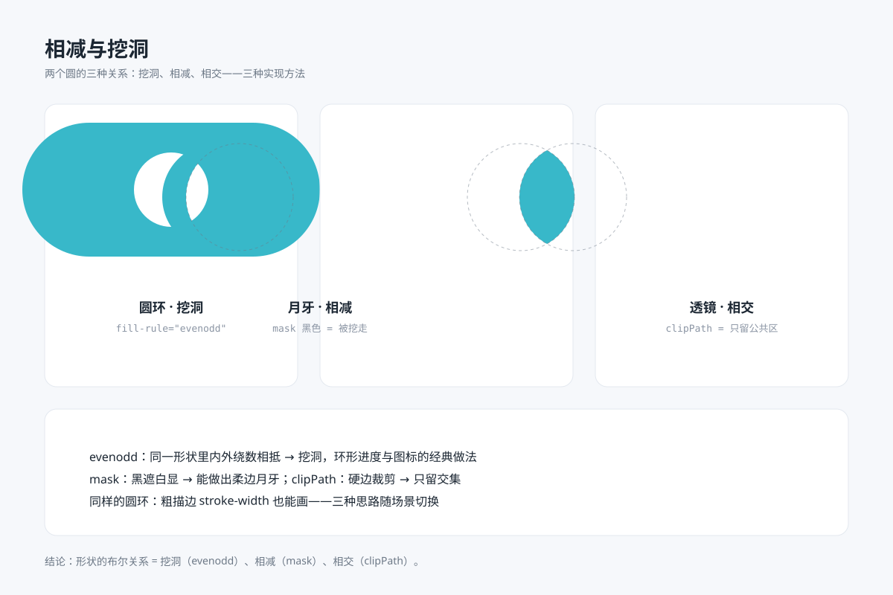
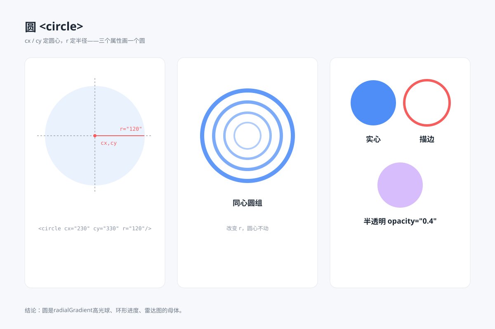
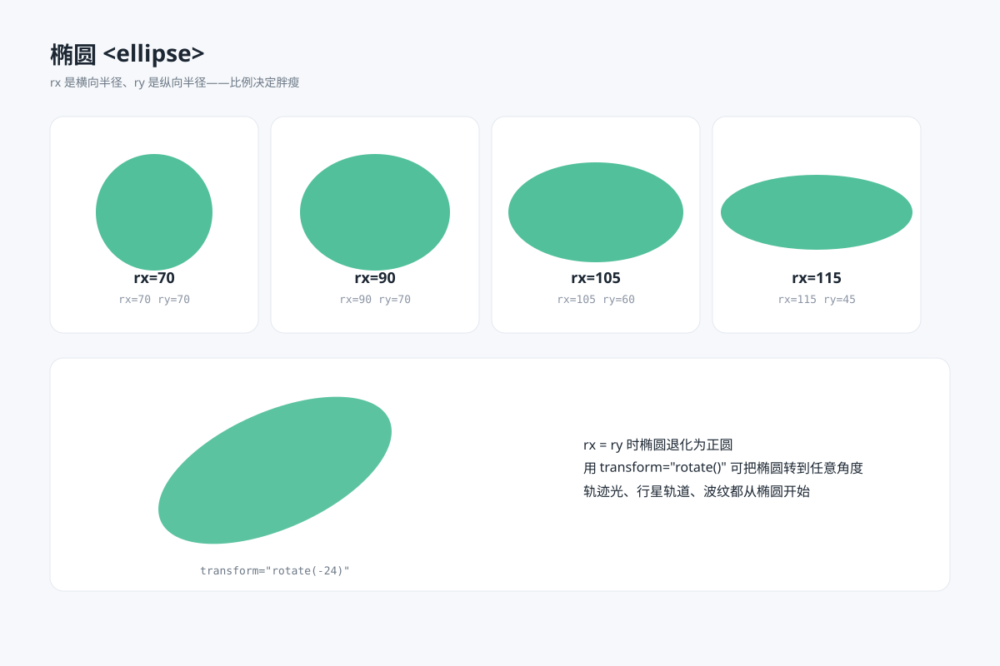
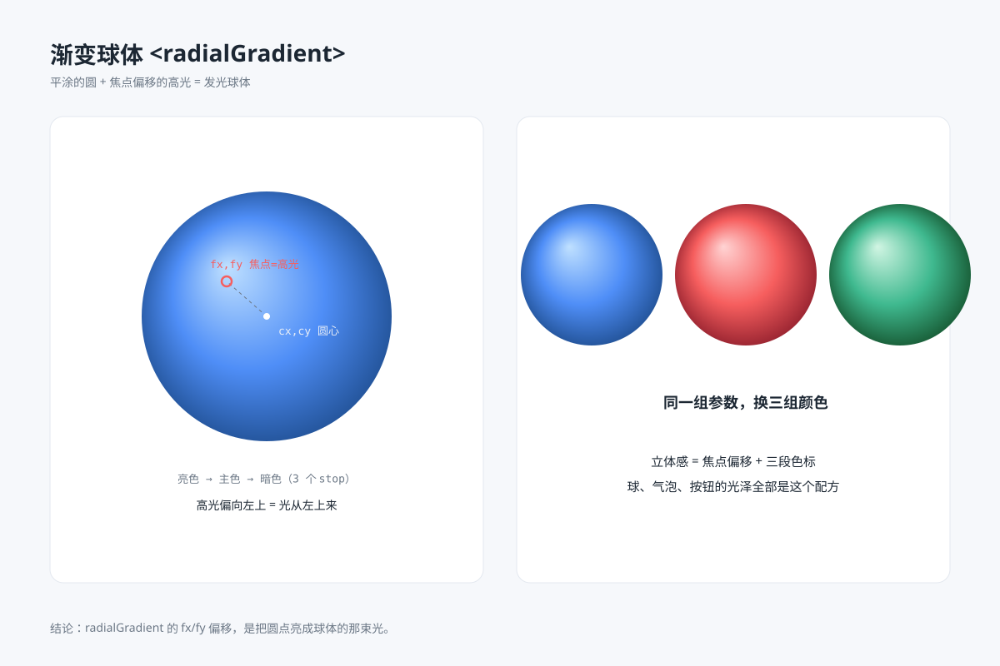
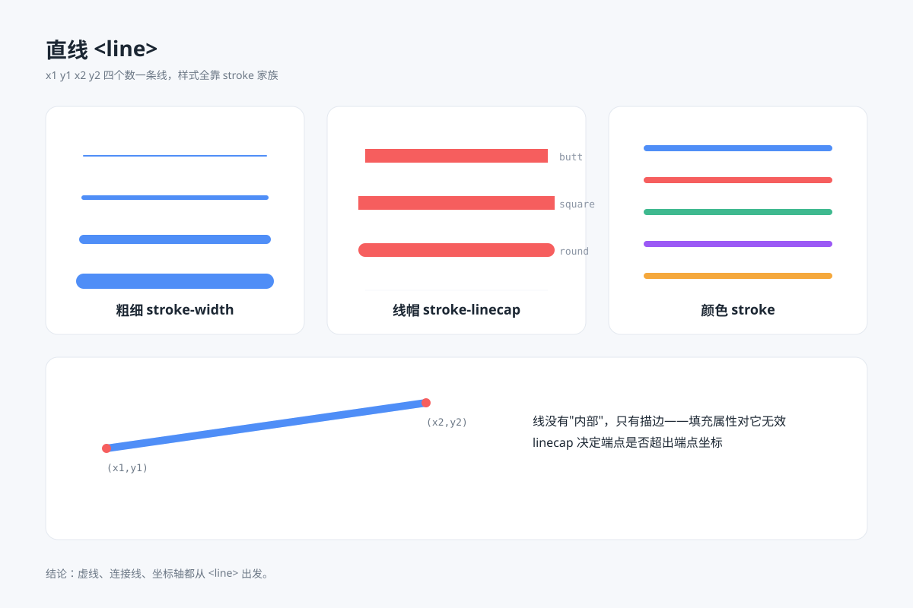
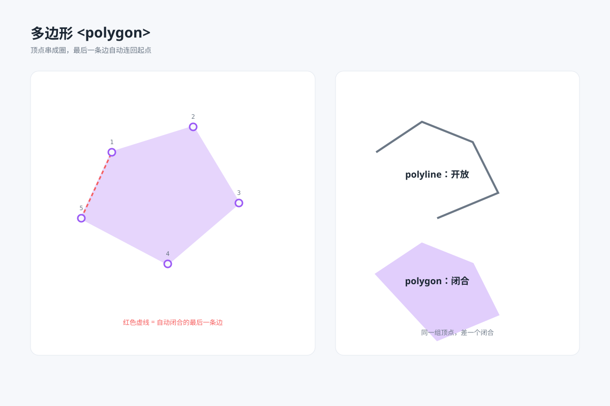
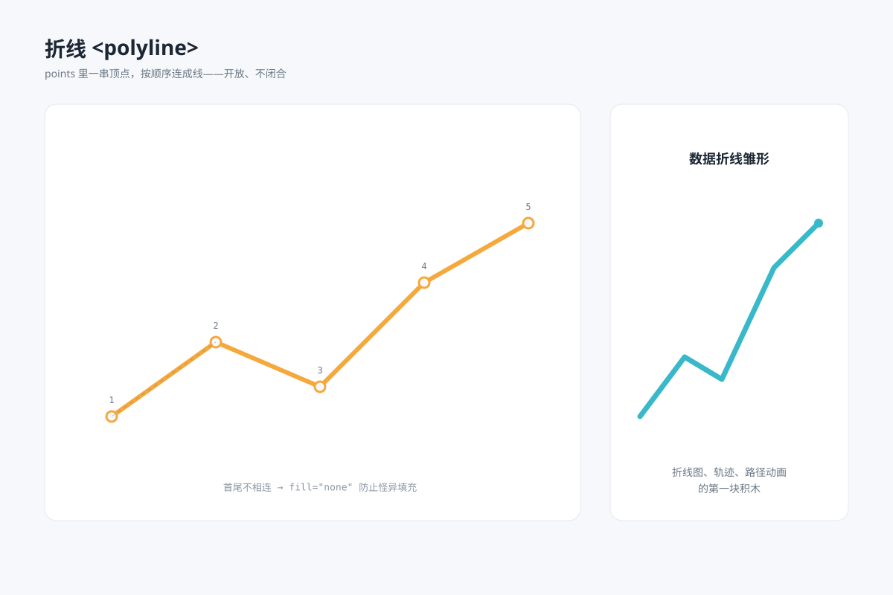
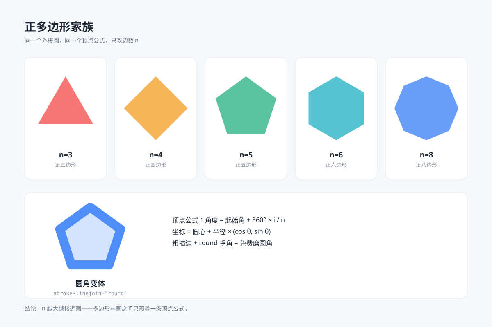
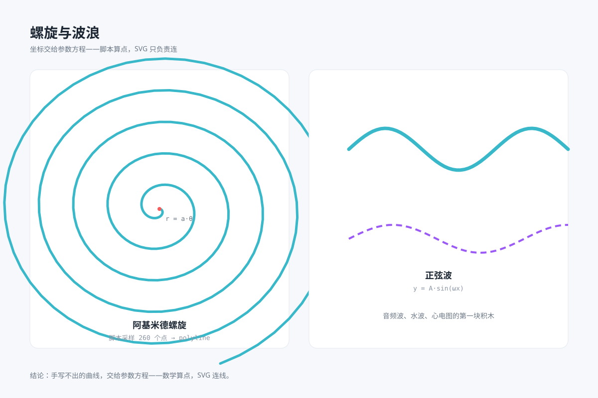
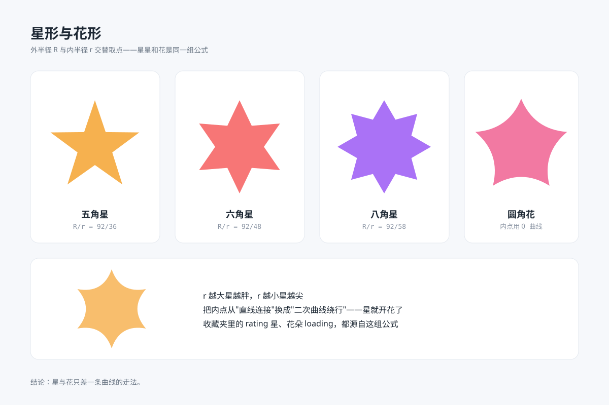

# svg-prompt

> **AI 生成 SVG 的图形图鉴** —— 每个作品都带可复制的提示词咒语。
> GitHub 上"看得见作品、拿不到提示词"的 SVG 画廊千千万，把两者耦合在一起的图鉴，此前不存在。

**用法**：看中哪张图 → 点卡片进入它的详情页 → 提示词框右上角点复制按钮 → 粘贴给任意模型复现。

## 目录

<!-- GALLERY:START -->
- **[基础图形](#%E5%9F%BA%E7%A1%80%E5%9B%BE%E5%BD%A2)** basics · 15 条
- **[UI 组件](#ui-%E7%BB%84%E4%BB%B6)** ui · 1 条
- **[品牌排版](#%E5%93%81%E7%89%8C%E6%8E%92%E7%89%88)** branding · 1 条
- **[图表报表](#%E5%9B%BE%E8%A1%A8%E6%8A%A5%E8%A1%A8)** charts · 3 条
- **[信息可视化](#%E4%BF%A1%E6%81%AF%E5%8F%AF%E8%A7%86%E5%8C%96)** infographics · 0 条
- **[实物模拟](#%E5%AE%9E%E7%89%A9%E6%A8%A1%E6%8B%9F)** materials · 1 条
- **[动效艺术](#%E5%8A%A8%E6%95%88%E8%89%BA%E6%9C%AF)** motion · 5 条
- **[高级数学](#%E9%AB%98%E7%BA%A7%E6%95%B0%E5%AD%A6)** math · 2 条

## 基础图形

<table>
<tr><td width="320" valign="top"> <a href="gallery/basics/arrows/prompt.md"><strong>箭头家族</strong></a> <code>静态</code> <code>2D</code></td><td width="320" valign="top"> <a href="gallery/basics/boolean-shapes/prompt.md"><strong>相减与挖洞</strong></a> <code>静态</code> <code>2D</code></td><td width="320" valign="top"> <a href="gallery/basics/circle/prompt.md"><strong>圆 circle</strong></a> <code>静态</code> <code>2D</code></td></tr>
<tr><td width="320" valign="top"> <a href="gallery/basics/ellipse/prompt.md"><strong>椭圆 ellipse</strong></a> <code>静态</code> <code>2D</code></td><td width="320" valign="top"> <a href="gallery/basics/gradient-spheres/prompt.md"><strong>渐变球体</strong></a> <code>静态</code> <code>2D</code></td><td width="320" valign="top"> <a href="gallery/basics/line/prompt.md"><strong>直线 line</strong></a> <code>静态</code> <code>2D</code></td></tr>
<tr><td width="320" valign="top"> <a href="gallery/basics/path/prompt.md"><strong>路径 path</strong></a> <code>静态</code> <code>2D</code></td><td width="320" valign="top"> <a href="gallery/basics/polygon/prompt.md"><strong>多边形 polygon</strong></a> <code>静态</code> <code>2D</code></td><td width="320" valign="top"> <a href="gallery/basics/polyline/prompt.md"><strong>折线 polyline</strong></a> <code>静态</code> <code>2D</code></td></tr>
<tr><td width="320" valign="top"> <a href="gallery/basics/rectangle/prompt.md"><strong>矩形 rect</strong></a> <code>静态</code> <code>2D</code></td><td width="320" valign="top"> <a href="gallery/basics/regular-polygons/prompt.md"><strong>正多边形家族</strong></a> <code>静态</code> <code>2D</code></td><td width="320" valign="top"> <a href="gallery/basics/rotational-patterns/prompt.md"><strong>旋转复制组合</strong></a> <code>静态</code> <code>2D</code></td></tr>
<tr><td width="320" valign="top"> <a href="gallery/basics/spirals-and-waves/prompt.md"><strong>螺旋与波浪</strong></a> <code>静态</code> <code>2D</code></td><td width="320" valign="top"> <a href="gallery/basics/stars-and-flowers/prompt.md"><strong>星形与花形</strong></a> <code>静态</code> <code>2D</code></td><td width="320" valign="top"> <a href="gallery/basics/transparency-blend/prompt.md"><strong>透明叠色</strong></a> <code>静态</code> <code>2D</code></td></tr>
</table>

## UI 组件

<table>
<tr><td width="320" valign="top"> <a href="gallery/ui/glassmorphism/prompt.md"><strong>渐变与玻璃质感</strong></a> <code>静态</code> <code>2D</code></td></tr>
</table>

## 品牌排版

<table>
<tr><td width="320" valign="top"> <a href="gallery/branding/procedural-textures/prompt.md"><strong>程序化纹理与图案</strong></a> <code>静态</code> <code>2D</code></td></tr>
</table>

## 图表报表

<table>
<tr><td width="320" valign="top"> <a href="gallery/charts/system-architecture/prompt.md"><strong>复杂系统架构图</strong></a> <code>静态</code> <code>2D</code></td><td width="320" valign="top"> <a href="gallery/charts/animated-architecture/prompt.md"><strong>动态架构图</strong></a> <code>SMIL 动效</code> <code>2D</code></td><td width="320" valign="top"> <a href="gallery/charts/dashboard/prompt.md"><strong>数据可视化仪表盘</strong></a> <code>SMIL 动效</code> <code>2D</code></td></tr>
</table>

## 信息可视化

*暂无条目，欢迎按 `templates/entry/` 投稿。*

## 实物模拟

<table>
<tr><td width="320" valign="top"> <a href="gallery/materials/filter-materials/prompt.md"><strong>滤镜材质特效</strong></a> <code>SMIL 动效</code> <code>2D</code></td></tr>
</table>

## 动效艺术

<table>
<tr><td width="320" valign="top"> <a href="gallery/motion/morph-ii/prompt.md"><strong>变形记 II</strong></a> <code>SMIL 动效</code> <code>2D</code></td><td width="320" valign="top"> <a href="gallery/motion/path-morph/prompt.md"><strong>变形记 Morph</strong></a> <code>SMIL 动效</code> <code>2D</code></td><td width="320" valign="top"> <a href="gallery/motion/smil-panel/prompt.md"><strong>SMIL 动效面板</strong></a> <code>SMIL 动效</code> <code>2D</code></td></tr>
<tr><td width="320" valign="top"> <a href="gallery/motion/svg-mechanics/prompt.md"><strong>SVG 黑科技四连</strong></a> <code>SMIL 动效</code> <code>2D</code></td><td width="320" valign="top"> <a href="gallery/motion/line-drawing/prompt.md"><strong>线稿描边动画</strong></a> <code>CSS 动效</code> <code>2D</code></td></tr>
</table>

## 高级数学

<table>
<tr><td width="320" valign="top"> <a href="gallery/math/three-d/prompt.md"><strong>三维投影</strong></a> <code>SMIL 动效</code> <code>3D</code></td><td width="320" valign="top"> <a href="gallery/math/topology-deform/prompt.md"><strong>拓扑形变</strong></a> <code>SMIL 动效</code> <code>3D</code></td></tr>
</table>
<!-- GALLERY:END -->

## 贡献

复制 `templates/entry/` 到对应分类目录，填好三件套（`index.svg` 作品 / `prompt.md` 咒语 / `meta.json` 标签），跑 `node scripts/build-readme.mjs` 重新生成本页。收录标准见各分类目录的 `_about.md`，完整指南见 [CONTRIBUTING.md](CONTRIBUTING.md)。

## 许可

代码 [MIT](LICENSE) · 图鉴内容 CC BY 4.0（注明出处即可自由使用）
