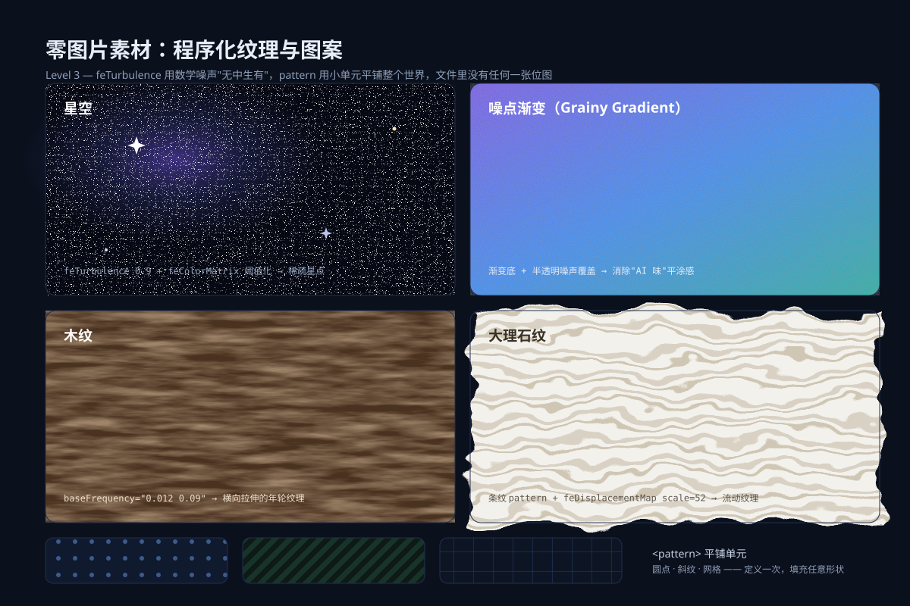
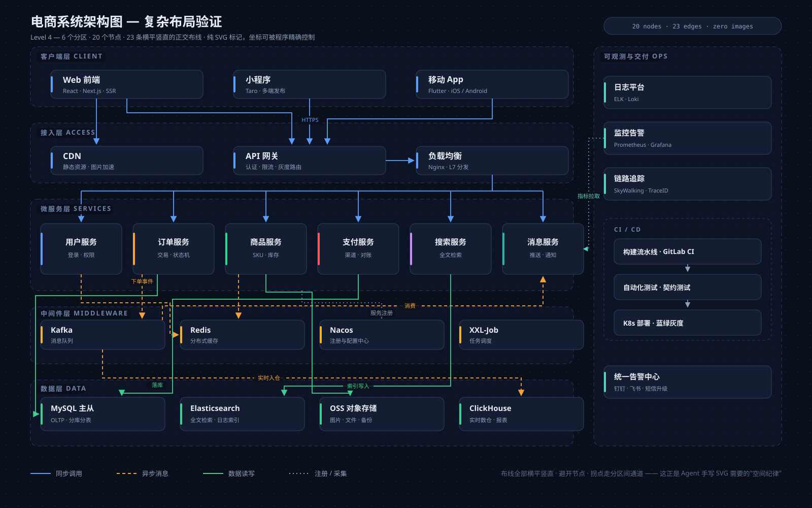
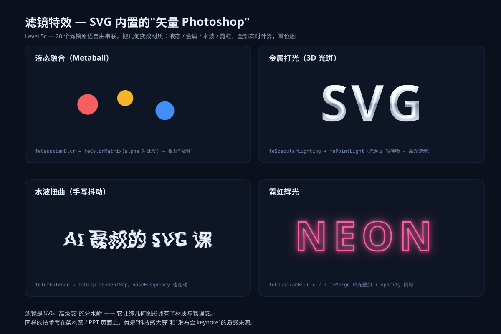
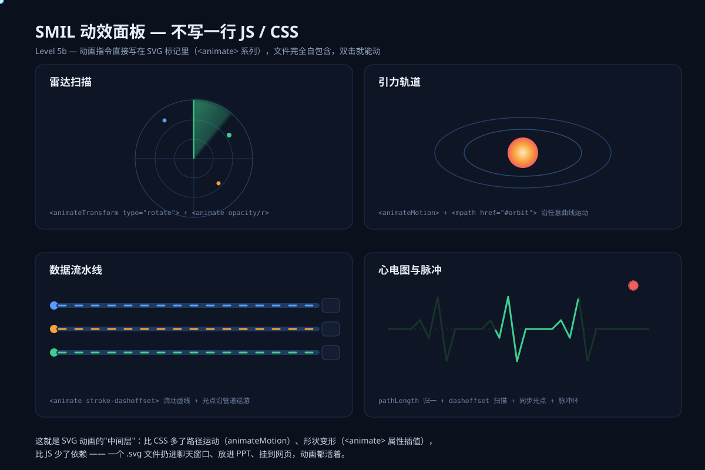
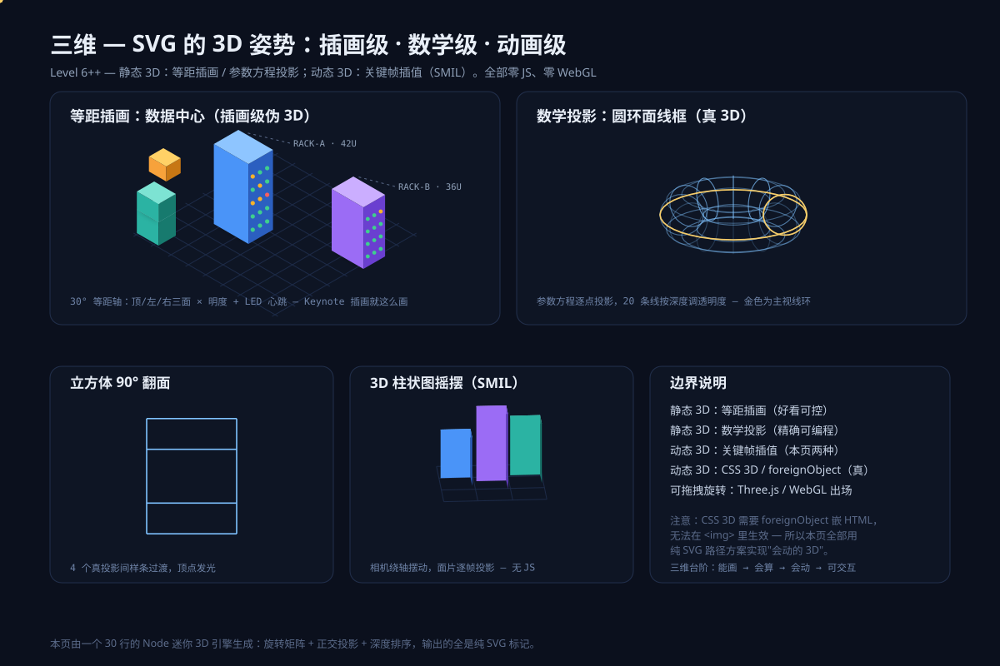
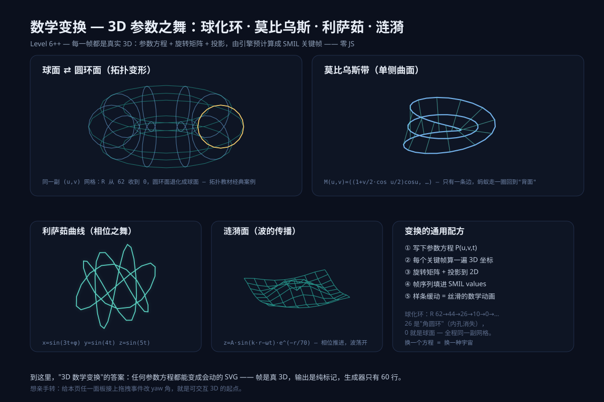

# svg-prompt

> **AI 生成 SVG 的图形图鉴** —— 每个作品都带可复制的提示词咒语。
> GitHub 上"看得见作品、拿不到提示词"的 SVG 画廊千千万，把两者耦合在一起的图鉴，此前不存在。

**用法**：看中哪张图 → 点标题行的复制图标，提示词在卡片内原地展开 → 选中复制 → 粘贴给任意模型复现。

**咒语等级**：`L1` 一句话直出 · `L2` 结构化模板 · `L3` 系统化流水线（语义 JSON → 布局引擎 → 渲染）

## 目录

<!-- GALLERY:START -->
- **[教学基础](#%E6%95%99%E5%AD%A6%E5%9F%BA%E7%A1%80)** basics · 1 条
- **[UI 组件](#ui-%E7%BB%84%E4%BB%B6)** ui · 1 条
- **[品牌排版](#%E5%93%81%E7%89%8C%E6%8E%92%E7%89%88)** branding · 1 条
- **[图表报表](#%E5%9B%BE%E8%A1%A8%E6%8A%A5%E8%A1%A8)** charts · 3 条
- **[信息可视化](#%E4%BF%A1%E6%81%AF%E5%8F%AF%E8%A7%86%E5%8C%96)** infographics · 0 条
- **[实物模拟](#%E5%AE%9E%E7%89%A9%E6%A8%A1%E6%8B%9F)** materials · 1 条
- **[动效艺术](#%E5%8A%A8%E6%95%88%E8%89%BA%E6%9C%AF)** motion · 5 条
- **[高级数学](#%E9%AB%98%E7%BA%A7%E6%95%B0%E5%AD%A6)** math · 2 条

## 教学基础

<table>
<tr><td width="320" valign="top"> <strong>七大基础图形</strong>

用 SVG 画一张基础图形教学图：并排展示 rect、circle、ellipse、line、polyline、polygon、path 七种基本形状，每种形状下方标注英文名。统一风格：深灰描边 2px、半透明蓝色填充…
<pre>用 SVG 画一张基础图形教学图：并排展示 rect、
circle、ellipse、line、polyline、polygon、
path 七种基本形状，每种形状下方用小字标注英
文名。统一风格：深灰描边 2px、半透明蓝色填
充、浅米色背景，画布 1200×800，构图整齐留
白均匀。</pre>
</td></tr>
</table>

## UI 组件

<table>
<tr><td width="320" valign="top"> 

<strong>渐变与玻璃质感</strong>
<pre>用 SVG 画一张&quot;渐变与玻璃质感&quot;设计展示图，四
个区块：
- 极光横幅：linearGradient 蓝→紫→粉多色过
渡，叠加两团 radialGradient 光晕，圆角大横条
- 品牌图标：圆角方形渐变底座 + 中心四角星 pa
th + feDropShadow 彩色光晕
- 渐变文字：大标题文字 fill=&quot;url(#textGrad)&quot;
 直接引用线性渐变
- 毛玻璃卡片：半透明白色圆角矩形叠在彩色背景
上，feGaussianBlur 打底 + 1px 白描边（opacit
y 0.4）
画布 1200×800，深色背景衬托，全部零位图。</pre>
</td></tr>
</table>

## 品牌排版

<table>
<tr><td width="320" valign="top"> 

<strong>程序化纹理与图案</strong>
<pre>用 SVG 画&quot;程序化纹理&quot;四联图，全部用滤镜生成
、零图片素材：
- 星空：feTurbulence fractalNoise 高频 + feC
olorMatrix 阈值化 → 深蓝底上稀疏白色星点
- 噪点渐变：线性渐变底 + 半透明 feTurbulence
 噪声覆盖，消除&quot;AI 味&quot;平涂感
- 木纹：feTurbulence baseFrequency=&quot;0.012 0.
09&quot; 横向拉伸噪声 + 棕色系 feColorMatrix 映射
- 平铺图案：&lt;pattern&gt; 定义小单元（圆点/网格
）平铺整块
每块纹理下方标注名称，画布 1200×800。</pre>
</td></tr>
</table>

## 图表报表

<table>
<tr><td width="320" valign="top"> 

<strong>动态架构图</strong>
<pre>用 SVG 画一张&quot;会呼吸&quot;的系统架构图（单文件、
零 JS，动效全部 SMIL）：
- 四层结构：Web 前端/小程序（客户端）→ API 
网关 → 微服务 ×4 → 数据库主从，圆角矩形节
点 + 正交折线布线
- 数据包流动：每条连接线上放小圆 &lt;animateMot
ion&gt; 沿真实布线 path 移动，各链路 begin 错开
- 心跳灯：每个服务节点角落小圆 opacity 0.3↔
1 循环，dur 2s、begin 各不相同
- 标题流光：渐变 x1/x2 循环平移制造扫光
画布 1400×1000 深色底。</pre>
</td><td width="320" valign="top"> 

<strong>数据可视化仪表盘</strong>
<pre>用 SVG 画一张数据可视化仪表盘：
- KPI 卡片行：4 张圆角卡片（指标名 + 大数字 
+ 涨跌幅箭头），如&quot;销售额 GMV ¥1,284,590 +1
2.4%↑&quot;
- 主区左侧：面积折线图（网格线 + 坐标轴刻度 
+ 渐变面积填充）
- 主区右侧：两枚环形进度图（stroke-dasharray
 控制弧长，中心百分比数字）
- 底部：横向条形图 5 条，右端数值标签
- SMIL 入场动画：条形从 0 生长、环形描一圈、
KPI 数字渐显，打开文件自动播放一次
画布 1200×900，蓝色系配色，留白均匀。</pre>
</td><td width="320" valign="top"> 

<strong>复杂系统架构图</strong>
<pre>用 SVG 画一张六层系统架构图（约 20 个节点）
：
- 分区自上而下：客户端层 / 接入层 / 服务层 /
 中间件层 / 数据层 / 观测层，每层一块浅色圆
角底板 + 层名
- 每层 2–5 个节点（140×44 圆角矩形，写服务
名），同层水平等距
- 连线全部正交折线（只走水平/垂直段），marke
r 箭头指向目标；从源节点底边中点出、目标节点
顶边中点入
- 画布 1400×1000，分区留白均匀
动笔前先输出完整的节点坐标清单，再按清单绘制
。</pre>
</td></tr>
</table>

## 信息可视化

*暂无条目，欢迎按 `templates/entry/` 投稿。*

## 实物模拟

<table>
<tr><td width="320" valign="top"> 

<strong>滤镜材质特效</strong>
<pre>用 SVG 展示三种滤镜材质特效，全部零位图实时
计算：
- 液态融合：两个相邻色块 + feGaussianBlur(st
dDeviation 10) + feColorMatrix 把 alpha 通道
对比度拉陡
  （&quot;20 0 0 0 0 / 0 0 0 20 -7&quot; 型矩阵）→ 色
块相互吸附成 metaball
- 金属打光：灰色凸起文字 + feSpecularLightin
g + fePointLight，光源 z 坐标加 &lt;animate&gt; 让
高光游走
- 水波扭曲：一行文字 + feTurbulence + feDisp
lacementMap，baseFrequency 加缓慢 &lt;animate&gt; 
像在水中晃动
画布 1200×800 深色底，每块标注名称。</pre>
</td></tr>
</table>

## 动效艺术

<table>
<tr><td width="320" valign="top"> 

<strong>线稿描边动画</strong>
<pre>用 SVG 做一个描边动画：一个 {城市天际线} 的
线稿被逐渐&quot;画出来&quot;。
要求：
- 单文件自包含，零 JS，动画用 CSS keyframes 
实现
- 所有轮廓只用 stroke 绘制，fill:none，统一 
stroke-width:{2}、stroke-linecap:round
- 每条 path 的 stroke-dasharray 等于自身长度
，dashoffset 从满值补间到 0
- 各条 path 依次延迟 {0.3s} 开始描边，总时长
 {6s}，动画结束后停留在线稿完成状态（forward
s）
- 画布 {1000×700}，{深蓝夜色} 背景衬托 {浅
金色} 线条</pre>
</td><td width="320" valign="top"> 

<strong>变形记 II</strong>
<pre>用 SVG 做进阶路径形变：
- 单词变形 CAT ⇄ DOG：C/A/T 与 D/O/G 六个字
母各设计一副 6 段贝塞尔骨架，
  两词都是 3 子路径 × 6 段 = 18 段，逐字母
插值成&quot;液态书法&quot;
- 字母 B ⇄ X：B = 竖笔 + 双碗，X = 回描四臂
，锚点结构对齐
- 图标互变：播放 ▶ ⇄ 暂停 ⏸ 两个&quot;画出来&quot;
的图标平滑过渡
铁律写进要求：任何两条 path 的命令数与锚点数
完全相同。
画布 1200×800 深色底。</pre>
</td><td width="320" valign="top"> 

<strong>变形记 Morph</strong>
<pre>用 SVG 做路径形变动画，两组：
- 几何三态：圆角方形 ⇄ 圆 ⇄ 菱形，同一副 8
 锚点骨架（直线态 = 控制点全部落在边上的共线
退化贝塞尔）
- 图形开花：圆 → 五角星 → 爱心，同一副 10 
锚点骨架（星 = 内锚点收到 r=38，心 = 锚点按
心形重排）
全部用 &lt;animate attributeName=&quot;d&quot; values=&quot;…
&quot;&gt; 循环，dur 6s，画布 1000×700 居中。</pre>
</td></tr>
<tr><td width="320" valign="top"> 

<strong>SMIL 动效面板</strong>
<pre>用 SVG 做一块自包含动效面板（零 JS、零 CSS，
动画全部用 SMIL &lt;animate&gt;/&lt;animateTransform&gt;
/&lt;animateMotion&gt;）：
- 雷达扫描：扇形 &lt;animateTransform type=&quot;rot
ate&quot;&gt; 绕中心匀速旋转，底下三圈同心圆网格 + 
扫过余辉
- 引力轨道：小圆 &lt;animateMotion&gt; + &lt;mpath hr
ef=&quot;#orbit&quot;&gt; 沿椭圆轨道转，中心放行星体
- 状态灯：三个圆 opacity 依次呼吸，begin 依
次错开 0.3s
全部 repeatCount=&quot;indefinite&quot;，画布 900×600
 深色面板底。</pre>
</td><td width="320" valign="top"> 

<strong>SVG 黑科技四连</strong>
<pre>用 SVG 做&quot;机制级技法&quot;四联演示：
- 聚光灯：深色底 + 一段隐藏文字，用径向渐变
亮斑作为 mask，&lt;animateMotion&gt; 让光斑水平扫
过——只有光斑扫到处文字可见
- 路径形变：两条锚点数完全相同的 path，&lt;anim
ate attributeName=&quot;d&quot; values=&quot;A;B;A&quot;&gt; 平滑变
形
- 文字骑路径：一行文字 &lt;textPath href=&quot;#curv
e&quot;&gt; 沿贝塞尔曲线排布
- 等距伪 3D：立方体与台阶用 30° 等距变换拼
出一个小场景，三个面三种明度
画布 1200×900，深色底霓虹配色。</pre>
</td></tr>
</table>

## 高级数学

<table>
<tr><td width="320" valign="top"> 

<strong>三维投影</strong>
<pre>用 SVG 表现 3D（零 JS、零 WebGL），三块：
- 等距插画：数据中心机柜，30° 等距轴，顶/左
/右三个面不同明度 + LED 心跳 SMIL
- 参数投影：线框球与环面，顶点经旋转矩阵 + 
透视投影落到 2D，近棱亮、远棱暗
- 动态 3D：一个旋转立方体，把预计算的若干关
键帧 pose 写成 &lt;animateTransform&gt; 的 values 
序列
复杂坐标必须用脚本生成后填入 SVG。画布 1200
×900 深色底。</pre>
</td><td width="320" valign="top"> 

<strong>拓扑形变</strong>
<pre>用 SVG 展示 3D 参数之舞（每一帧都是真实 3D：
参数方程 + 旋转矩阵 + 投影，SMIL 关键帧由脚
本预计算）：
- 球面 ⇄ 圆环面：同一副 (u,v) 网格，环面主
半径 R 从 62 收到 0，圆环面连续退化成球面
- 莫比乌斯带：M(u,v) 参数方程生成单侧曲面，
点阵渲染，标注&quot;只有一条边&quot;
- 利萨茹曲线与水面涟漪各一块，同样参数方程驱
动
点阵量大必须用脚本（Node/Python）生成坐标再
固化进 SVG。画布 1200×800 深底彩点。</pre>
</td></tr>
</table>
<!-- GALLERY:END -->

## 贡献

复制 `templates/entry/` 到对应分类目录，填好三件套（`index.svg` 作品 / `prompt.md` 咒语 / `meta.json` 标签），跑 `node scripts/build-readme.mjs` 重新生成本页。收录标准见各分类目录的 `_about.md`，完整指南见 [CONTRIBUTING.md](CONTRIBUTING.md)。

## 许可

代码 [MIT](LICENSE) · 图鉴内容 CC BY 4.0（注明出处即可自由使用）
