# svg-prompt

> **AI 生成 SVG 的图形图鉴** —— 每个作品都带可复制的提示词咒语。
> GitHub 上"看得见作品、拿不到提示词"的 SVG 画廊千千万，把两者耦合在一起的图鉴，此前不存在。

**用法**：看中哪张图 → 点卡片进入它的详情页 → 提示词框右上角点复制按钮 → 粘贴给任意模型复现。

## 目录

<!-- GALLERY:START -->
- **[精选与专题](#精选与专题)** 跨分类策展入口
- **[数据图表](#%E6%95%B0%E6%8D%AE%E5%9B%BE%E8%A1%A8)** charts · 31 条
- **[流程与架构](#%E6%B5%81%E7%A8%8B%E4%B8%8E%E6%9E%B6%E6%9E%84)** diagrams · 21 条
- **[地图与空间](#%E5%9C%B0%E5%9B%BE%E4%B8%8E%E7%A9%BA%E9%97%B4)** maps · 12 条
- **[科学与原理](#%E7%A7%91%E5%AD%A6%E4%B8%8E%E5%8E%9F%E7%90%86)** science · 16 条
- **[界面与组件](#%E7%95%8C%E9%9D%A2%E4%B8%8E%E7%BB%84%E4%BB%B6)** ui · 60 条
- **[品牌与排版](#%E5%93%81%E7%89%8C%E4%B8%8E%E6%8E%92%E7%89%88)** branding · 24 条
- **[图标与符号](#%E5%9B%BE%E6%A0%87%E4%B8%8E%E7%AC%A6%E5%8F%B7)** icons · 4 条
- **[插画与场景](#%E6%8F%92%E7%94%BB%E4%B8%8E%E5%9C%BA%E6%99%AF)** illustrations · 9 条
- **[几何与生成艺术](#%E5%87%A0%E4%BD%95%E4%B8%8E%E7%94%9F%E6%88%90%E8%89%BA%E6%9C%AF)** geometry · 20 条
- **[背景与材质](#%E8%83%8C%E6%99%AF%E4%B8%8E%E6%9D%90%E8%B4%A8)** backgrounds · 24 条

## 精选与专题

按用途浏览下方分类；卡片显示中英文名称。专题中的作品同时保留在各自主分类中。

### 精选作品

<table>
<tr><td width="350" align="center" valign="top"><a href="gallery/diagrams/system-architecture/prompt.md">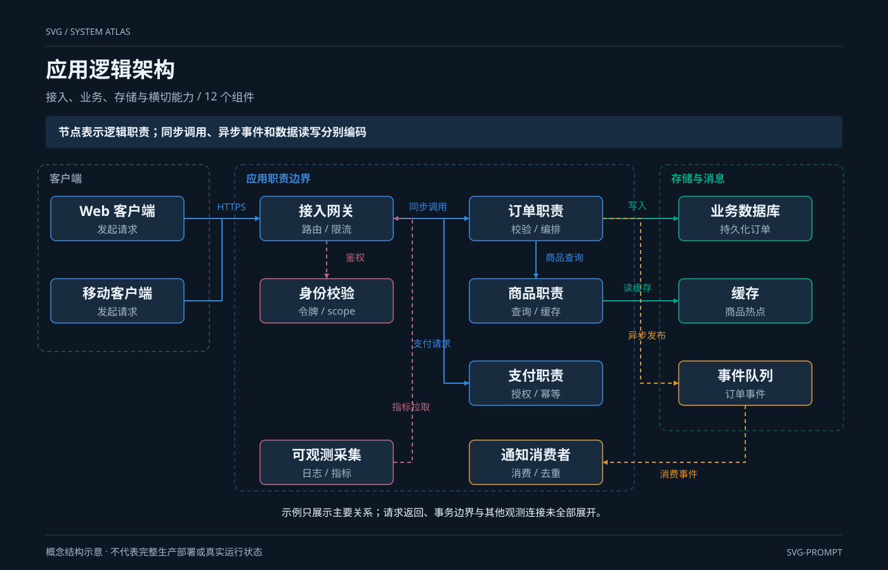</a> <a href="gallery/diagrams/system-architecture/prompt.md"><strong>应用逻辑架构</strong> Application Architecture</a></td><td width="350" align="center" valign="top"><a href="gallery/science/bezier-de-casteljau/prompt.md">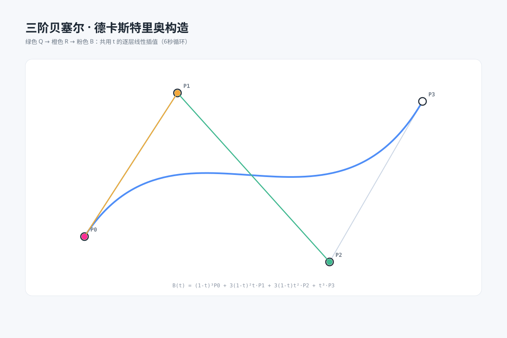</a> <a href="gallery/science/bezier-de-casteljau/prompt.md"><strong>贝塞尔曲线 · 逐层构造</strong> Bézier Construction</a></td><td width="350" align="center" valign="top"> <a href="gallery/illustrations/cyber-city/prompt.md"><strong>赛博城市</strong> Cyber City</a></td></tr>
</table>

### 数据分析

<table>
<tr><td width="350" align="center" valign="top"> <a href="gallery/charts/sankey/prompt.md"><strong>预算流量桑基图</strong> Sankey Diagram</a></td><td width="350" align="center" valign="top"><a href="gallery/charts/matrix-heatmap/prompt.md">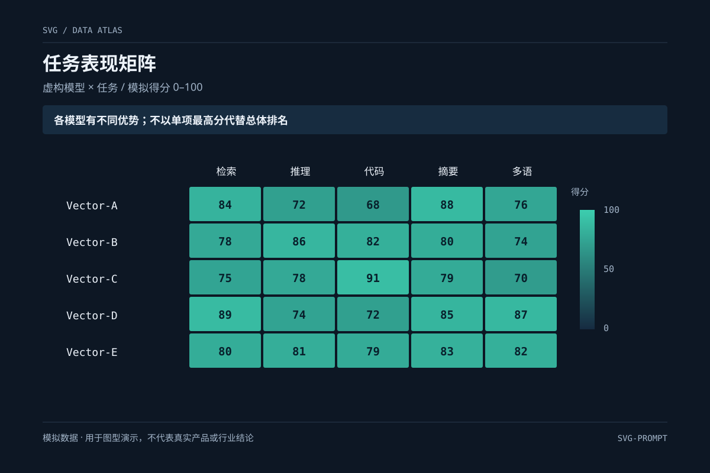</a> <a href="gallery/charts/matrix-heatmap/prompt.md"><strong>任务表现矩阵</strong> Matrix Heatmap</a></td><td width="350" align="center" valign="top"><a href="gallery/charts/interval/prompt.md">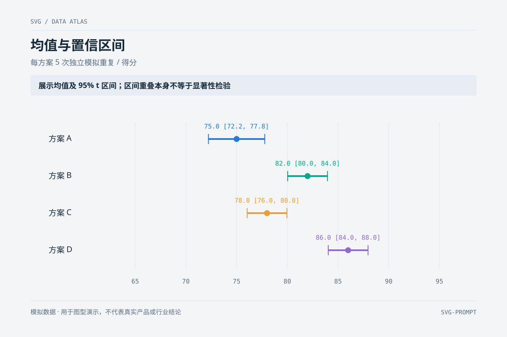</a> <a href="gallery/charts/interval/prompt.md"><strong>均值与置信区间</strong> Interval Plot</a></td></tr>
</table>

### 系统图解

<table>
<tr><td width="350" align="center" valign="top"> <a href="gallery/diagrams/sequence-diagram/prompt.md"><strong>流式请求时序图</strong> Sequence Diagram</a></td><td width="350" align="center" valign="top"><a href="gallery/diagrams/rag-pipeline/prompt.md">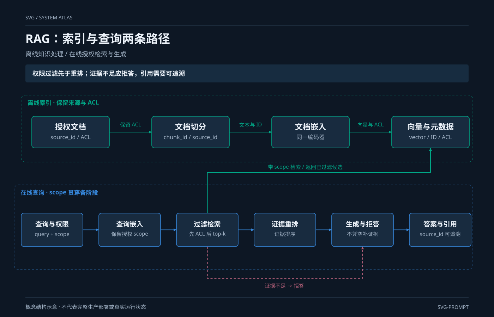</a> <a href="gallery/diagrams/rag-pipeline/prompt.md"><strong>RAG：索引与查询两条路径</strong> RAG Pipeline</a></td><td width="350" align="center" valign="top"><a href="gallery/diagrams/agent-loop/prompt.md">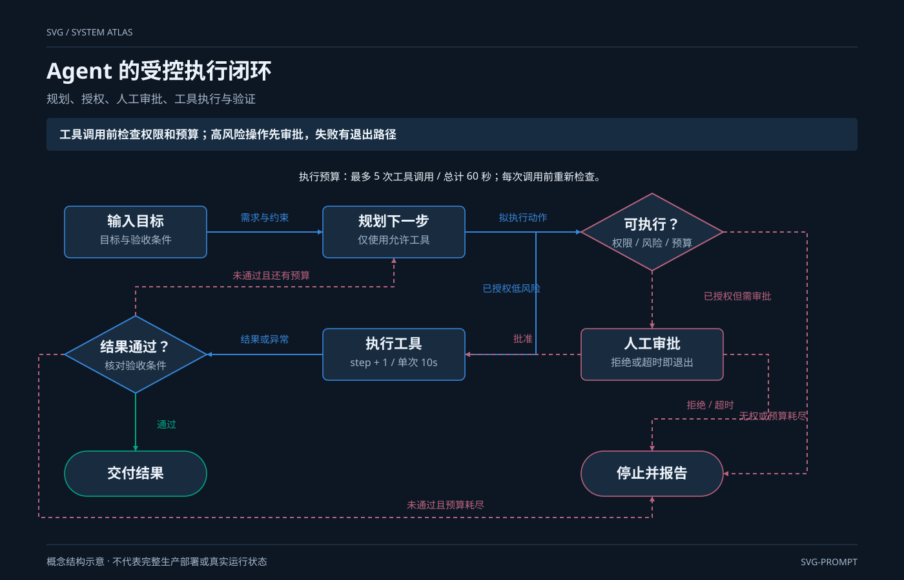</a> <a href="gallery/diagrams/agent-loop/prompt.md"><strong>Agent 的受控执行闭环</strong> Agent Loop</a></td></tr>
</table>

### 空间分析

<table>
<tr><td width="350" align="center" valign="top"><a href="gallery/maps/origin-destination/prompt.md">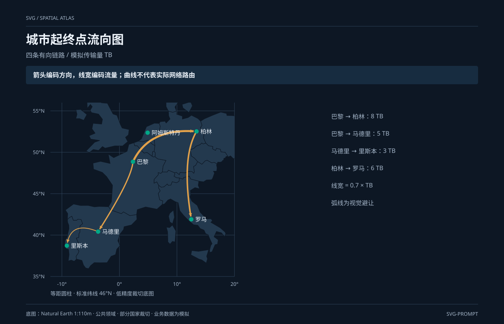</a> <a href="gallery/maps/origin-destination/prompt.md"><strong>城市起终点流向图</strong> Origin–Destination Flows</a></td><td width="350" align="center" valign="top"><a href="gallery/maps/service-coverage/prompt.md">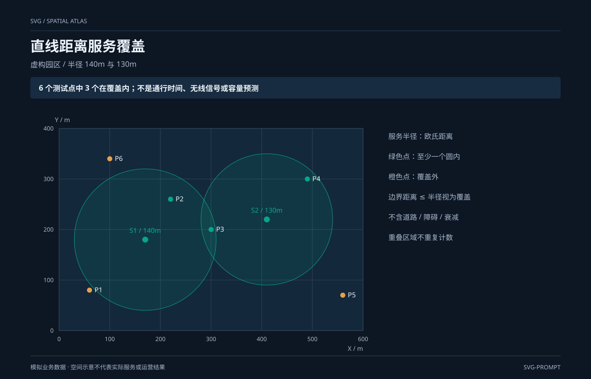</a> <a href="gallery/maps/service-coverage/prompt.md"><strong>直线距离服务覆盖</strong> Distance-Based Service Coverage</a></td><td width="350" align="center" valign="top"> <a href="gallery/maps/campus-floorplan/prompt.md"><strong>楼层空间与设备分区</strong> Floor Plan and Devices</a></td></tr>
</table>

### 科学机制

<table>
<tr><td width="350" align="center" valign="top"> <a href="gallery/science/fourier-build/prompt.md"><strong>傅里叶级数 · 谐波构建</strong> Fourier Harmonic Construction</a></td><td width="350" align="center" valign="top"><a href="gallery/science/catenary/prompt.md">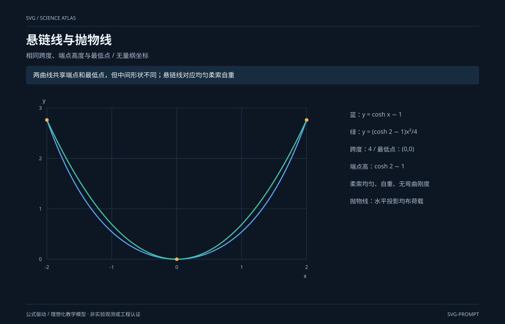</a> <a href="gallery/science/catenary/prompt.md"><strong>悬链线与抛物线</strong> Catenary vs. Parabola</a></td><td width="350" align="center" valign="top"><a href="gallery/science/koch-snowflake/prompt.md">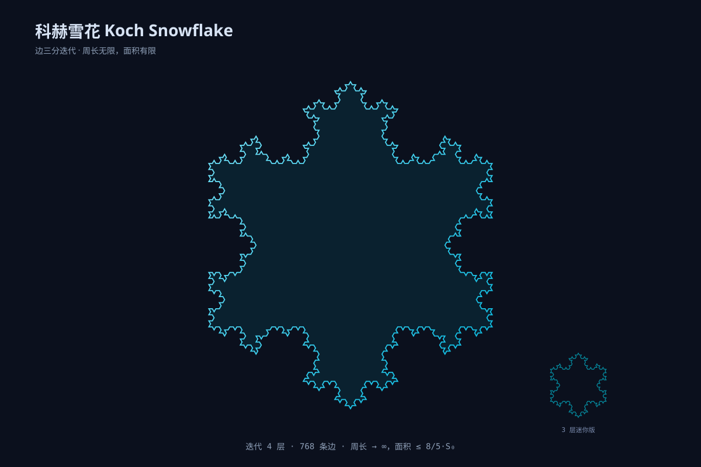</a> <a href="gallery/science/koch-snowflake/prompt.md"><strong>科赫雪花 · 边长与面积</strong> Koch Snowflake</a></td></tr>
</table>

### AI 产品

<table>
<tr><td width="350" align="center" valign="top"><a href="gallery/ui/ai-chat-workbench/prompt.md">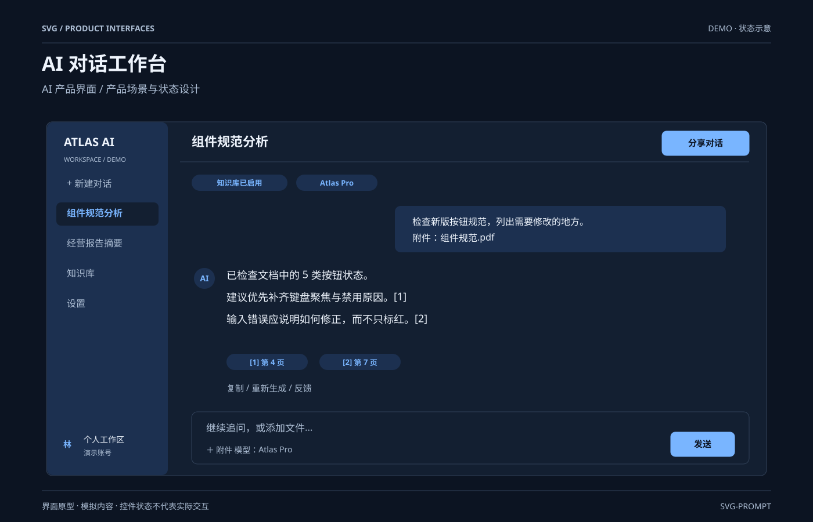</a> <a href="gallery/ui/ai-chat-workbench/prompt.md"><strong>AI 对话工作台</strong> AI Chat Workspace</a></td><td width="350" align="center" valign="top"><a href="gallery/ui/agent-execution/prompt.md">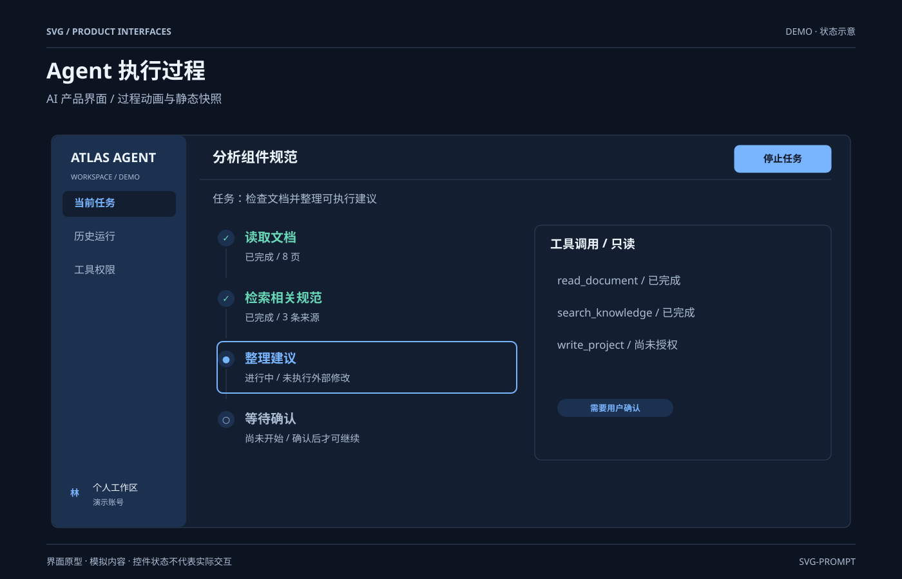</a> <a href="gallery/ui/agent-execution/prompt.md"><strong>Agent 执行过程</strong> Agent Execution</a></td><td width="350" align="center" valign="top"> <a href="gallery/ui/knowledge-citations/prompt.md"><strong>知识库检索与引用</strong> Knowledge Search and Citations</a></td></tr>
</table>

### 产品设计

<table>
<tr><td width="350" align="center" valign="top"><a href="gallery/ui/data-table/prompt.md">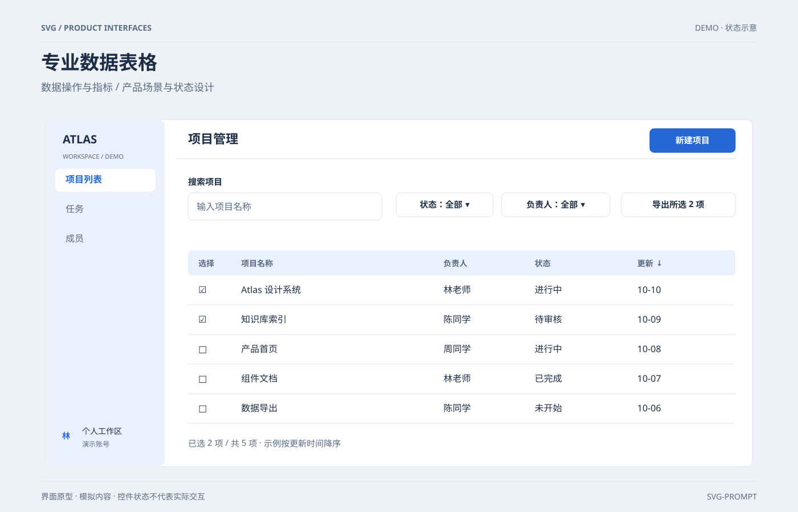</a> <a href="gallery/ui/data-table/prompt.md"><strong>专业数据表格</strong> Data Table</a></td><td width="350" align="center" valign="top"><a href="gallery/ui/pricing-usage/prompt.md">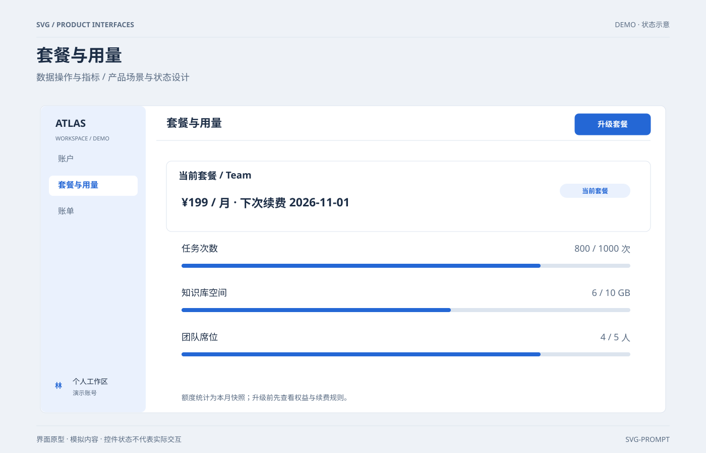</a> <a href="gallery/ui/pricing-usage/prompt.md"><strong>套餐与用量</strong> Plans and Usage</a></td><td width="350" align="center" valign="top"><a href="gallery/ui/kanban-board/prompt.md">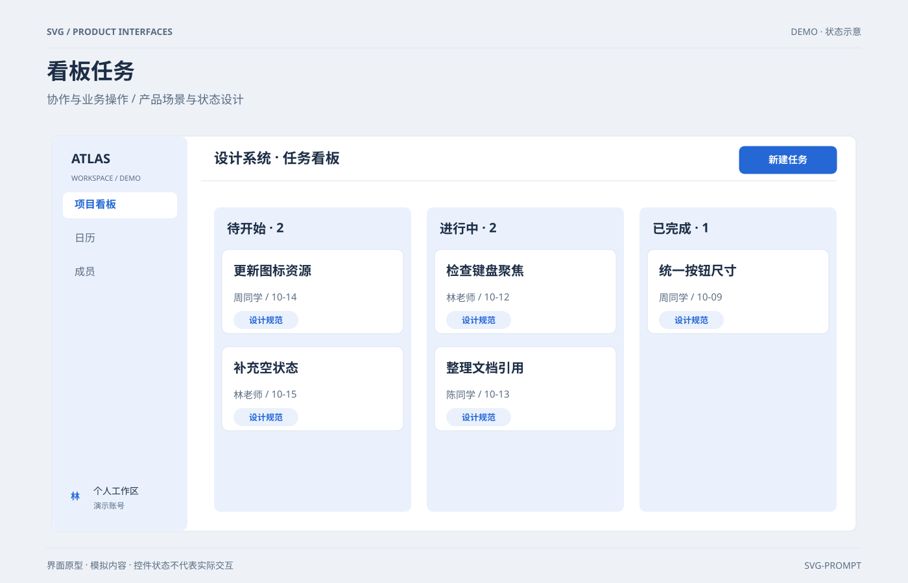</a> <a href="gallery/ui/kanban-board/prompt.md"><strong>看板任务</strong> Task Kanban</a></td></tr>
</table>

### 品牌设计

<table>
<tr><td width="350" align="center" valign="top"><a href="gallery/branding/wordmark/prompt.md">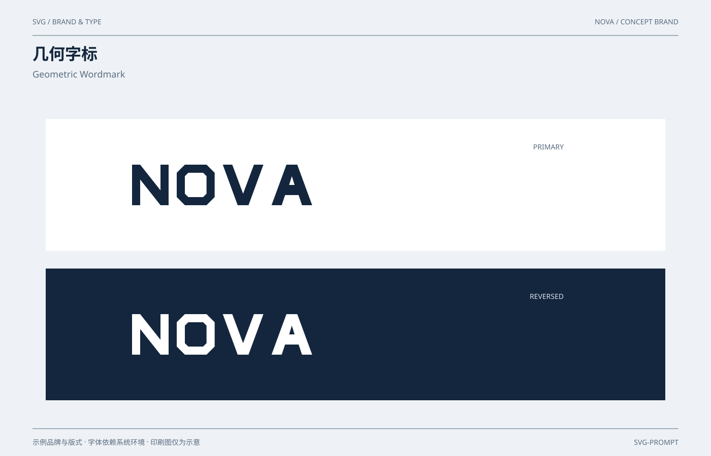</a> <a href="gallery/branding/wordmark/prompt.md"><strong>几何字标</strong> Geometric Wordmark</a></td><td width="350" align="center" valign="top"><a href="gallery/branding/magazine-cover/prompt.md">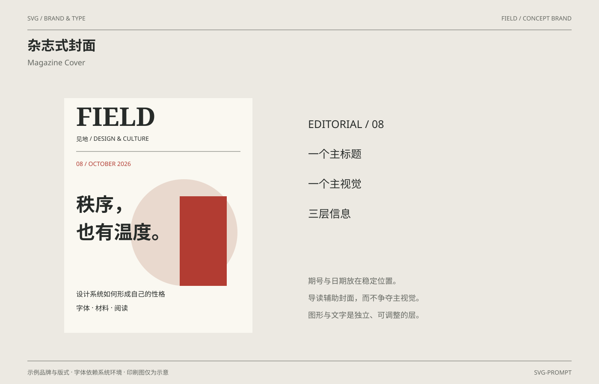</a> <a href="gallery/branding/magazine-cover/prompt.md"><strong>杂志式封面</strong> Magazine Cover</a></td><td width="350" align="center" valign="top"><a href="gallery/branding/product-launch/prompt.md">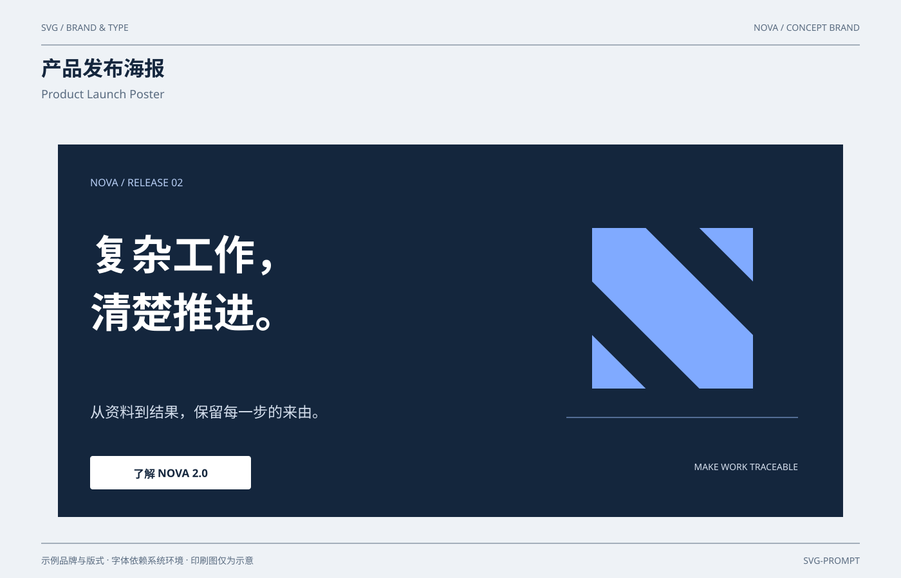</a> <a href="gallery/branding/product-launch/prompt.md"><strong>产品发布海报</strong> Product Launch Poster</a></td></tr>
</table>

### 未来界面

<table>
<tr><td width="350" align="center" valign="top"><a href="gallery/ui/hud-interface/prompt.md">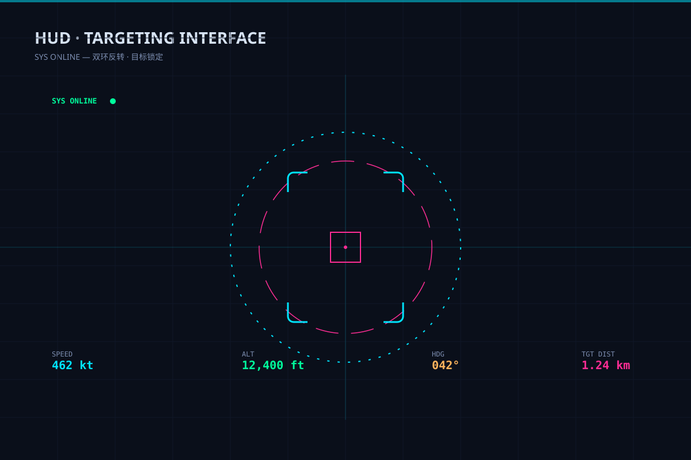</a> <a href="gallery/ui/hud-interface/prompt.md"><strong>HUD 导航概念</strong> HUD Navigation Concept</a></td><td width="350" align="center" valign="top"><a href="gallery/ui/dark-ops-dashboard/prompt.md">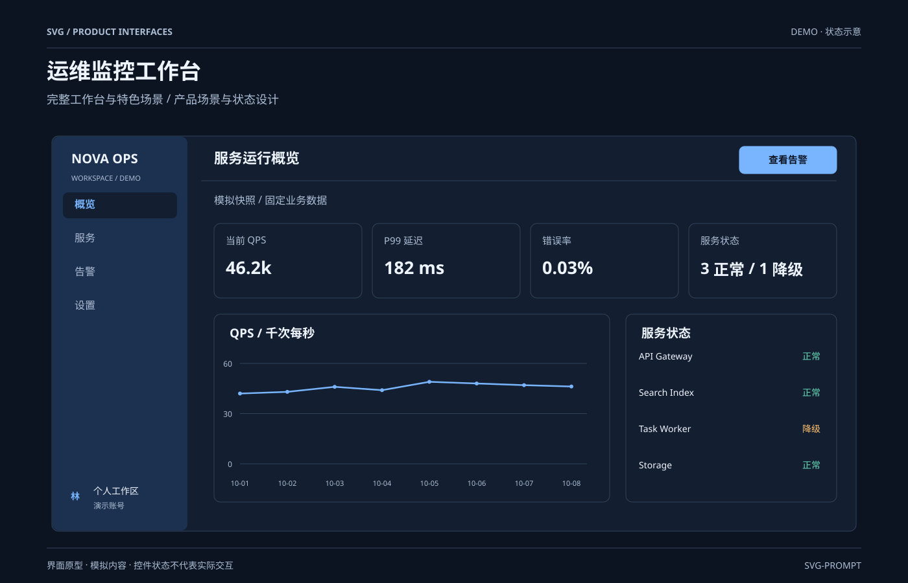</a> <a href="gallery/ui/dark-ops-dashboard/prompt.md"><strong>运维监控工作台</strong> Operations Monitoring Workspace</a></td><td width="350" align="center" valign="top"><a href="gallery/ui/wave-analyzer/prompt.md">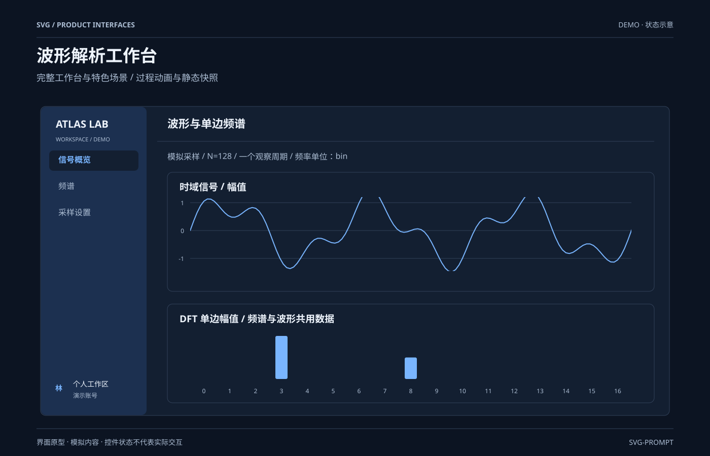</a> <a href="gallery/ui/wave-analyzer/prompt.md"><strong>波形解析工作台</strong> Waveform Analyzer</a></td></tr>
</table>

### 动效实验室

<table>
<tr><td width="350" align="center" valign="top"><a href="gallery/geometry/shape-morph/prompt.md">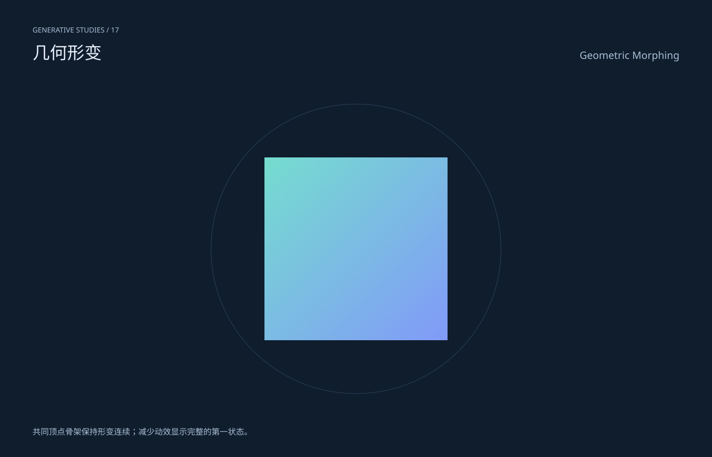</a> <a href="gallery/geometry/shape-morph/prompt.md"><strong>形状变换</strong> Shape Morph</a></td><td width="350" align="center" valign="top"><a href="gallery/branding/brand-intro/prompt.md"></a> <a href="gallery/branding/brand-intro/prompt.md"><strong>品牌动效片头</strong> Brand Intro Animation</a></td><td width="350" align="center" valign="top"><a href="gallery/backgrounds/rain-ripples/prompt.md">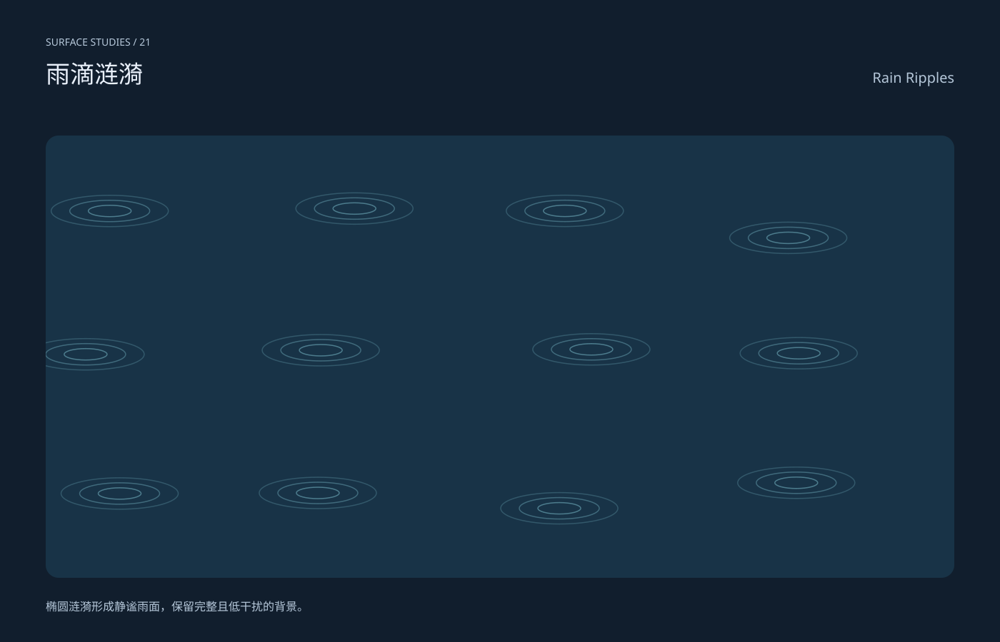</a> <a href="gallery/backgrounds/rain-ripples/prompt.md"><strong>雨滴涟漪</strong> Rain Ripples</a></td></tr>
</table>

## 数据图表

用数据表达比较、趋势、分布、相关、占比和数量流动。按分析任务浏览，动画变体紧随对应静态图。

<table>
<tr><td width="350" align="center" valign="top"><a href="gallery/charts/bar/prompt.md">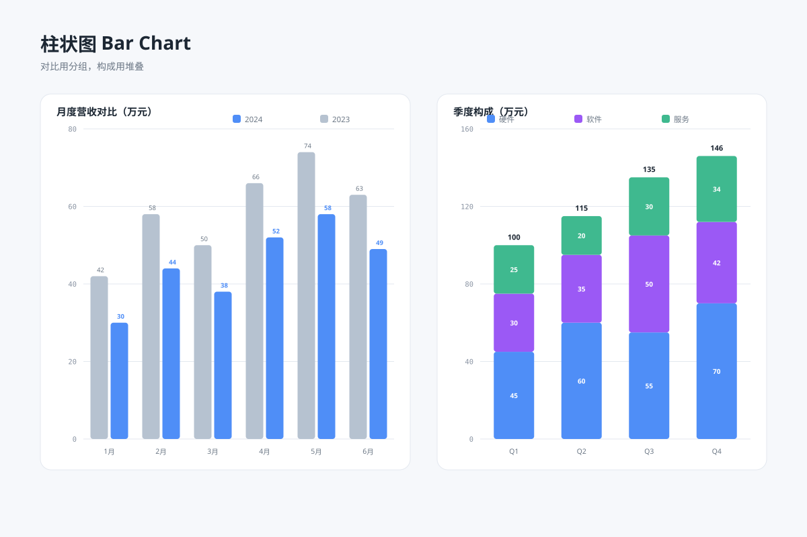</a> <a href="gallery/charts/bar/prompt.md"><strong>分组柱状图</strong> Bar Chart</a></td><td width="350" align="center" valign="top"> <a href="gallery/charts/bar-growth/prompt.md"><strong>柱状图 · 动态揭示</strong> Bar Chart Animation</a></td><td width="350" align="center" valign="top"><a href="gallery/charts/ranking-lollipop/prompt.md">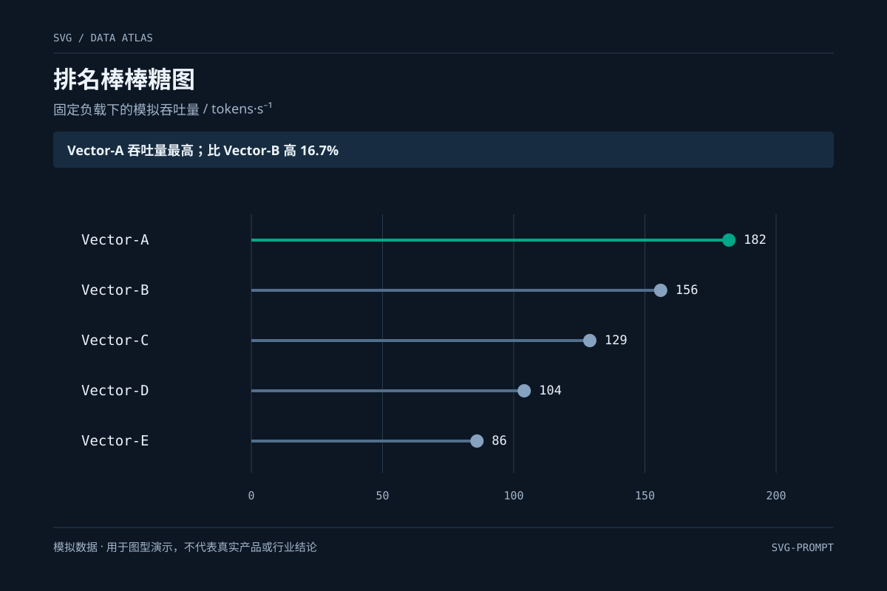</a> <a href="gallery/charts/ranking-lollipop/prompt.md"><strong>排名棒棒糖图</strong> Lollipop Ranking</a></td></tr>
<tr><td width="350" align="center" valign="top"><a href="gallery/charts/bullet-chart/prompt.md">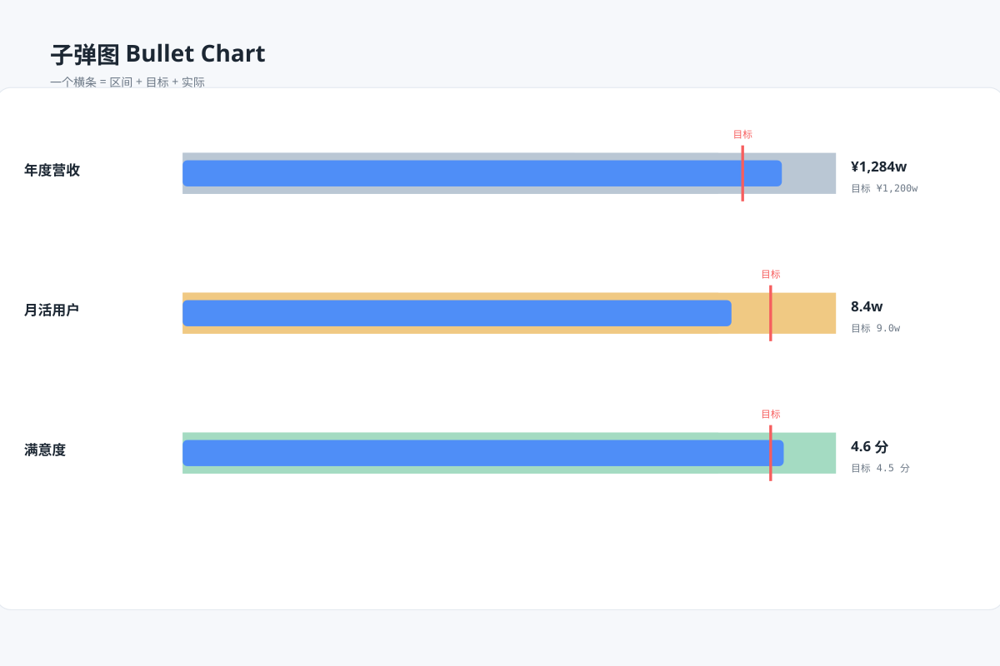</a> <a href="gallery/charts/bullet-chart/prompt.md"><strong>子弹图</strong> Bullet Chart</a></td><td width="350" align="center" valign="top"><a href="gallery/charts/dumbbell/prompt.md">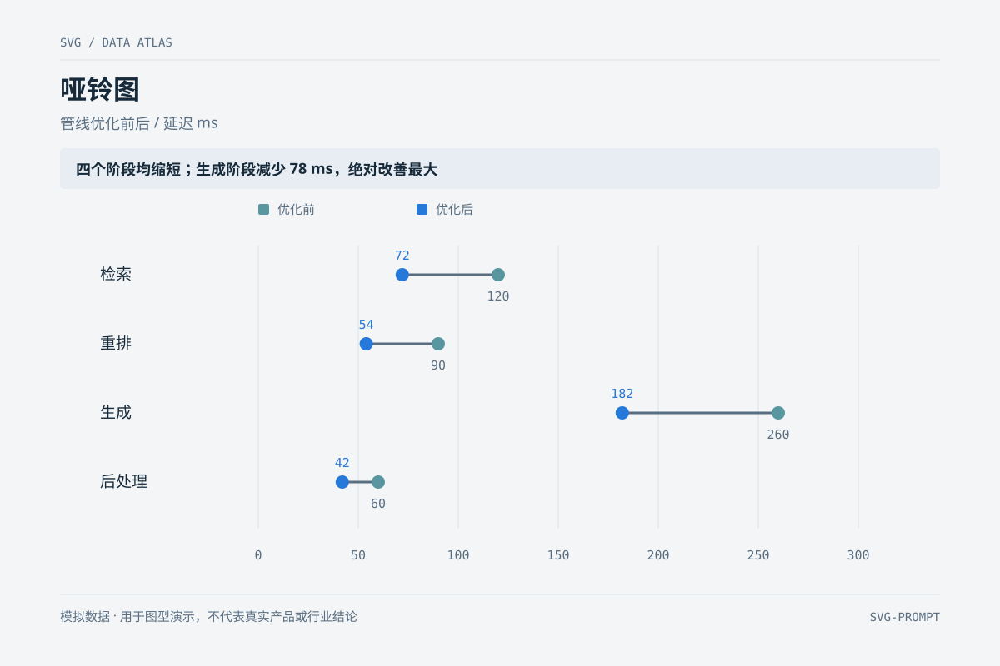</a> <a href="gallery/charts/dumbbell/prompt.md"><strong>哑铃图</strong> Dumbbell Chart</a></td><td width="350" align="center" valign="top"><a href="gallery/charts/line/prompt.md">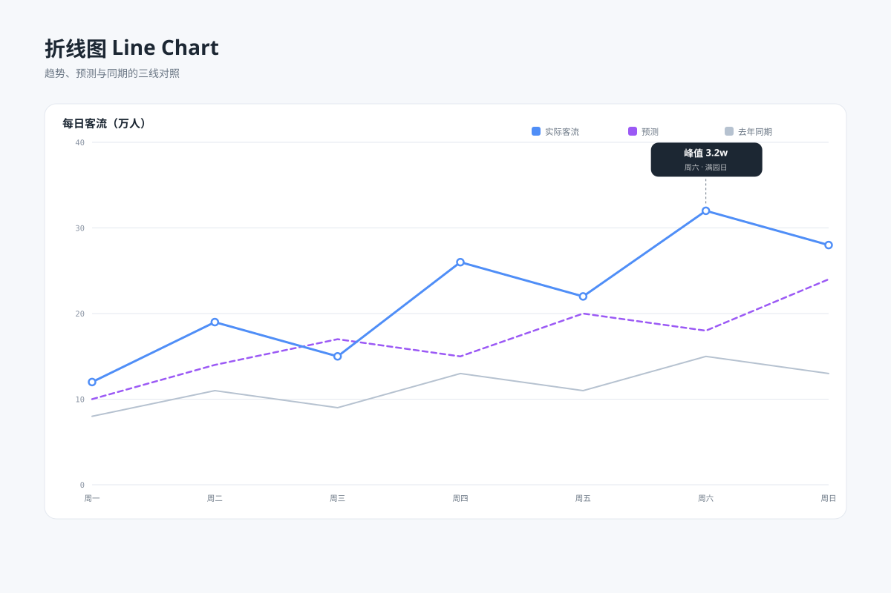</a> <a href="gallery/charts/line/prompt.md"><strong>趋势与预测区间</strong> Line Chart</a></td></tr>
<tr><td width="350" align="center" valign="top"><a href="gallery/charts/line-draw/prompt.md">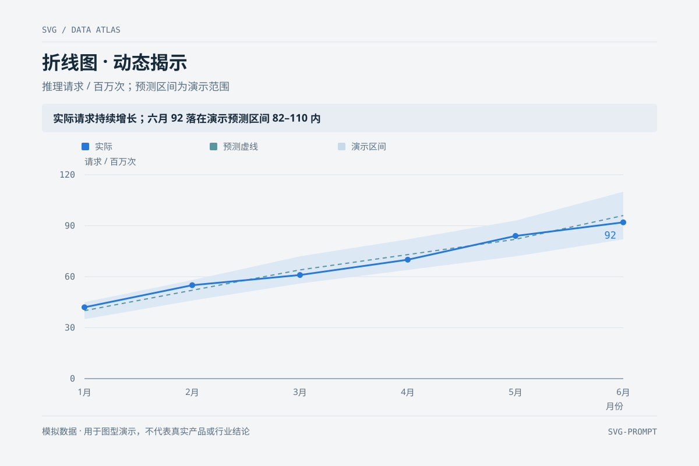</a> <a href="gallery/charts/line-draw/prompt.md"><strong>折线图 · 动态揭示</strong> Line Chart Animation</a></td><td width="350" align="center" valign="top"> <a href="gallery/charts/area/prompt.md"><strong>堆叠面积图</strong> Area Chart</a></td><td width="350" align="center" valign="top"> <a href="gallery/charts/area-expand/prompt.md"><strong>面积图 · 动态揭示</strong> Area Chart Animation</a></td></tr>
<tr><td width="350" align="center" valign="top"><a href="gallery/charts/waterfall/prompt.md">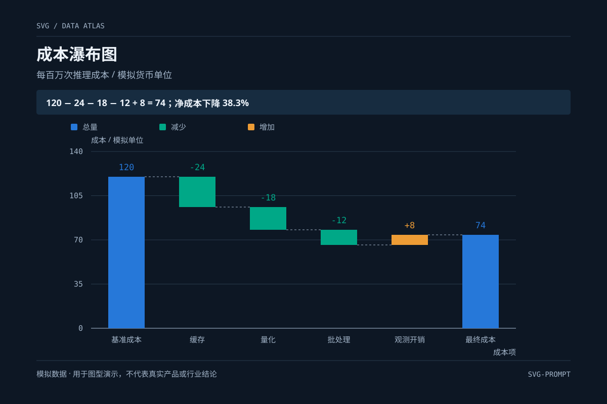</a> <a href="gallery/charts/waterfall/prompt.md"><strong>成本瀑布图</strong> Waterfall Chart</a></td><td width="350" align="center" valign="top"><a href="gallery/charts/small-multiples/prompt.md">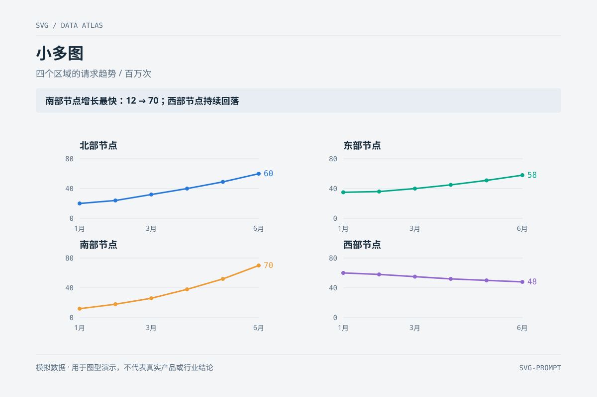</a> <a href="gallery/charts/small-multiples/prompt.md"><strong>小多图</strong> Small Multiples</a></td><td width="350" align="center" valign="top"><a href="gallery/charts/histogram-boxplot/prompt.md">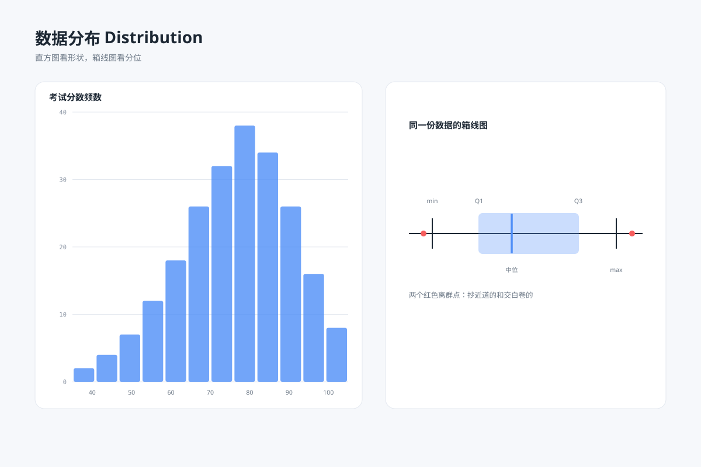</a> <a href="gallery/charts/histogram-boxplot/prompt.md"><strong>延迟直方图</strong> Histogram and Box Plot</a></td></tr>
<tr><td width="350" align="center" valign="top"><a href="gallery/charts/boxplot/prompt.md">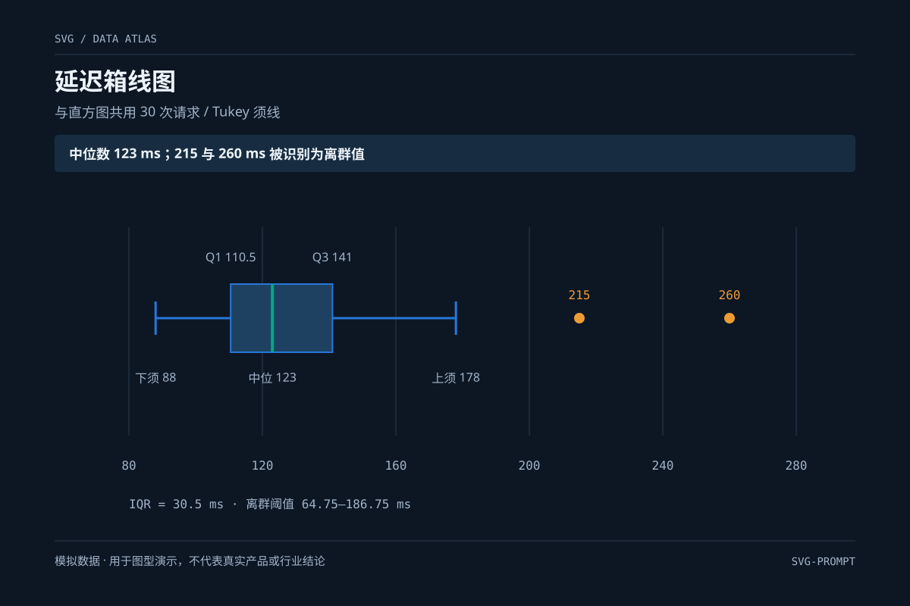</a> <a href="gallery/charts/boxplot/prompt.md"><strong>延迟箱线图</strong> Box Plot</a></td><td width="350" align="center" valign="top"><a href="gallery/charts/violin/prompt.md">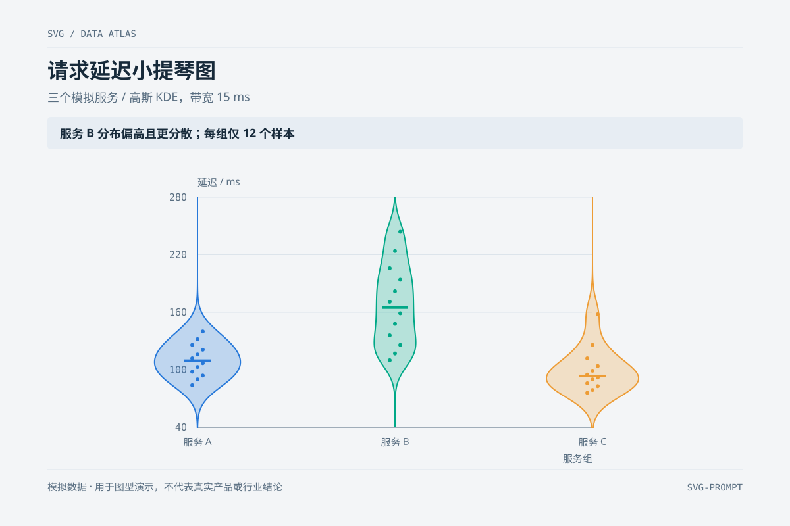</a> <a href="gallery/charts/violin/prompt.md"><strong>请求延迟小提琴图</strong> Violin Plot</a></td><td width="350" align="center" valign="top"> <a href="gallery/charts/interval/prompt.md"><strong>均值与置信区间</strong> Interval Plot</a></td></tr>
<tr><td width="350" align="center" valign="top"> <a href="gallery/charts/scatter/prompt.md"><strong>散点与回归</strong> Scatter Plot</a></td><td width="350" align="center" valign="top"><a href="gallery/charts/bubble/prompt.md">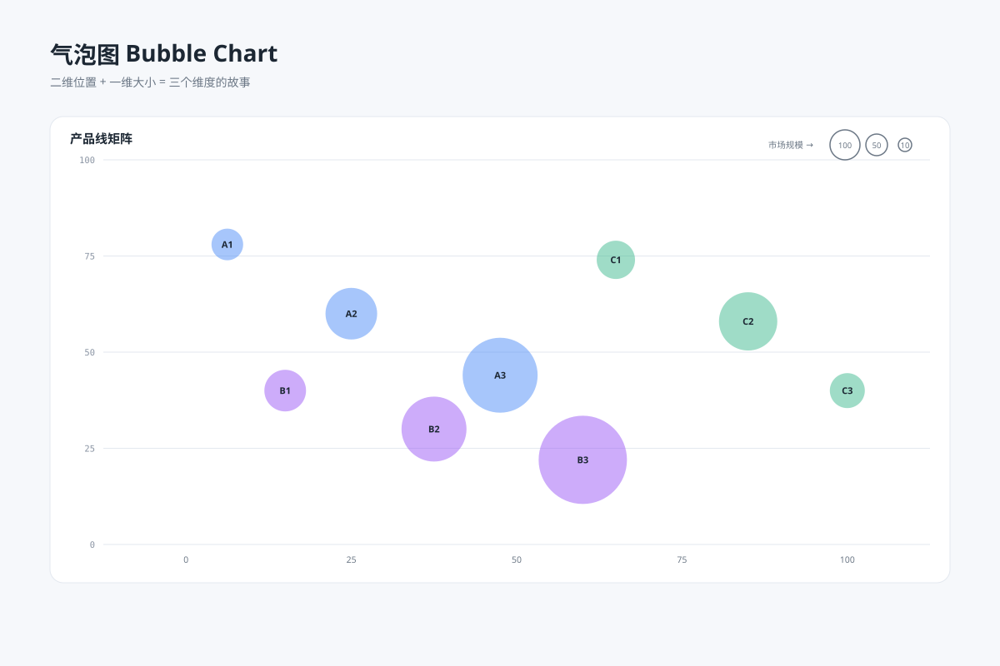</a> <a href="gallery/charts/bubble/prompt.md"><strong>三变量气泡图</strong> Bubble Chart</a></td><td width="350" align="center" valign="top"> <a href="gallery/charts/matrix-heatmap/prompt.md"><strong>任务表现矩阵</strong> Matrix Heatmap</a></td></tr>
<tr><td width="350" align="center" valign="top"><a href="gallery/charts/heatmap/prompt.md">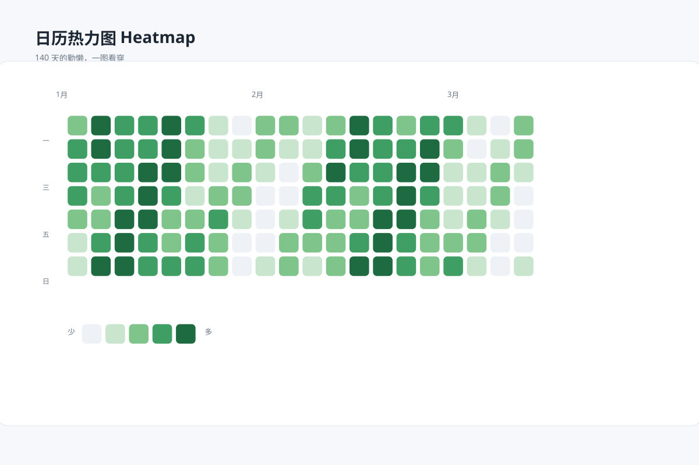</a> <a href="gallery/charts/heatmap/prompt.md"><strong>日历热力图</strong> Heatmap</a></td><td width="350" align="center" valign="top"> <a href="gallery/charts/radar/prompt.md"><strong>雷达图</strong> Radar Chart</a></td><td width="350" align="center" valign="top"> <a href="gallery/charts/combo-dual-axis/prompt.md"><strong>双轴组合图</strong> Dual-Axis Combo Chart</a></td></tr>
<tr><td width="350" align="center" valign="top"><a href="gallery/charts/pie-donut/prompt.md">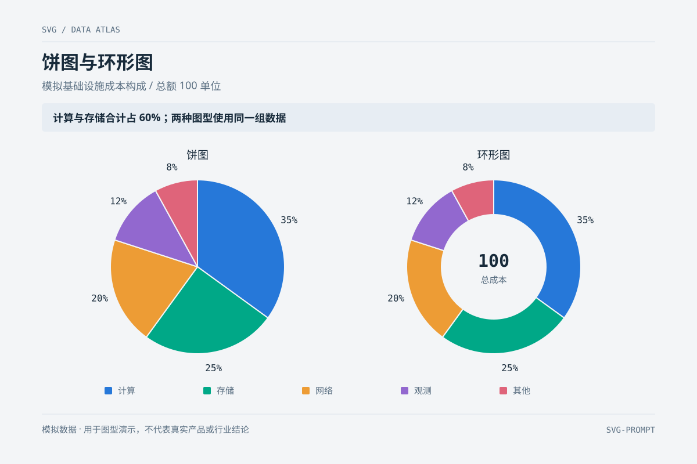</a> <a href="gallery/charts/pie-donut/prompt.md"><strong>饼图与环形图</strong> Pie and Donut Charts</a></td><td width="350" align="center" valign="top"><a href="gallery/charts/treemap/prompt.md">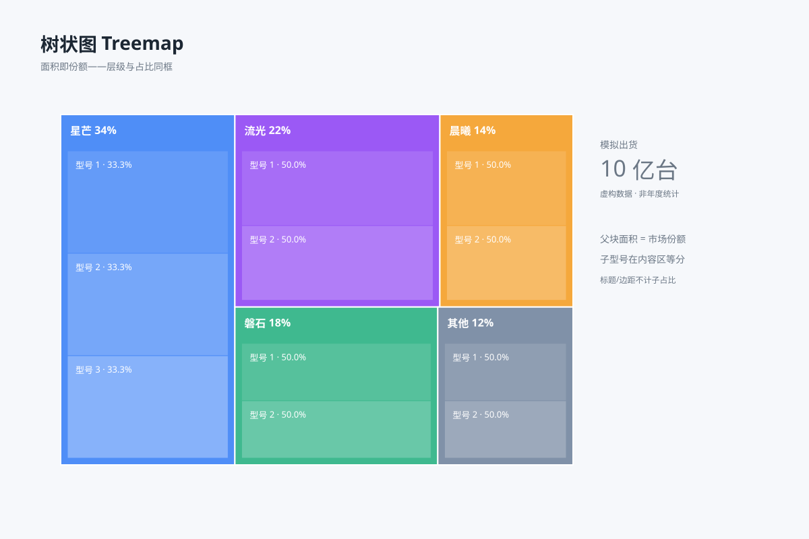</a> <a href="gallery/charts/treemap/prompt.md"><strong>矩形树图</strong> Treemap</a></td><td width="350" align="center" valign="top"><a href="gallery/charts/sunburst/prompt.md">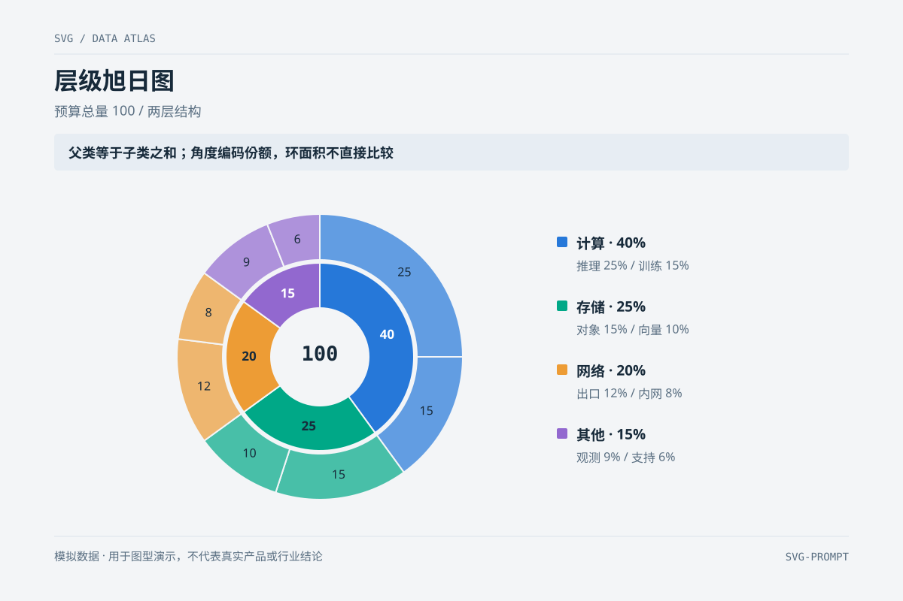</a> <a href="gallery/charts/sunburst/prompt.md"><strong>层级旭日图</strong> Sunburst Chart</a></td></tr>
<tr><td width="350" align="center" valign="top"><a href="gallery/charts/funnel/prompt.md">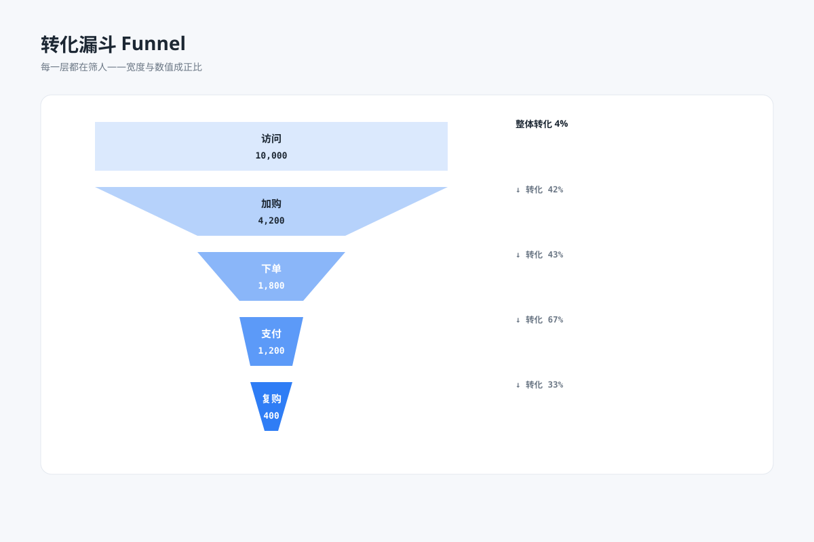</a> <a href="gallery/charts/funnel/prompt.md"><strong>转化漏斗图</strong> Funnel Chart</a></td><td width="350" align="center" valign="top"> <a href="gallery/charts/funnel-steps/prompt.md"><strong>漏斗图 · 动态揭示</strong> Funnel Animation</a></td><td width="350" align="center" valign="top"> <a href="gallery/charts/sankey/prompt.md"><strong>预算流量桑基图</strong> Sankey Diagram</a></td></tr>
<tr><td width="350" align="center" valign="top"> <a href="gallery/charts/sankey-flow/prompt.md"><strong>桑基图 · 动态揭示</strong> Sankey Flow Animation</a></td><td width="350" align="center" valign="top"><a href="gallery/charts/chord-diagram/prompt.md">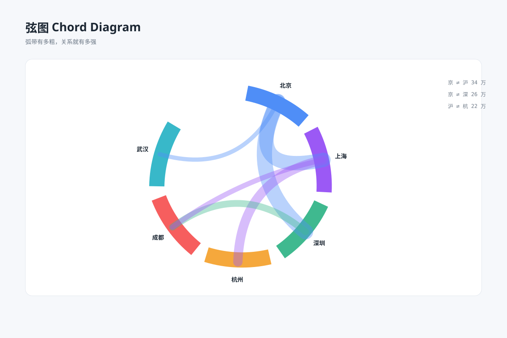</a> <a href="gallery/charts/chord-diagram/prompt.md"><strong>跨区域流量弦图</strong> Chord Diagram</a></td><td width="350" align="center" valign="top"><a href="gallery/charts/gantt/prompt.md">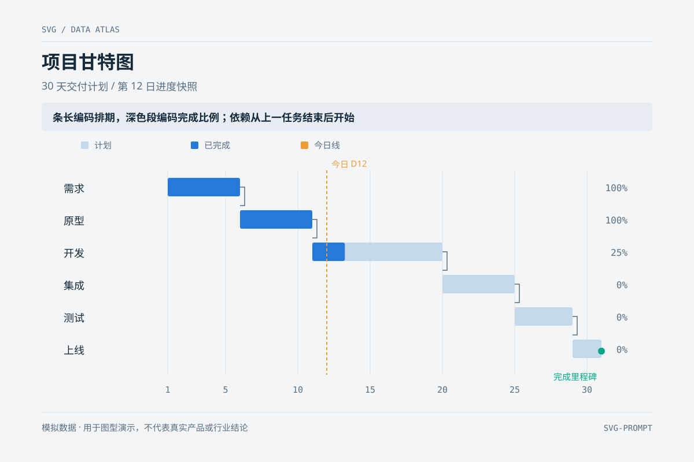</a> <a href="gallery/charts/gantt/prompt.md"><strong>项目甘特图</strong> Gantt Chart</a></td></tr>
<tr><td width="350" align="center" valign="top"><a href="gallery/charts/gantt-progress/prompt.md">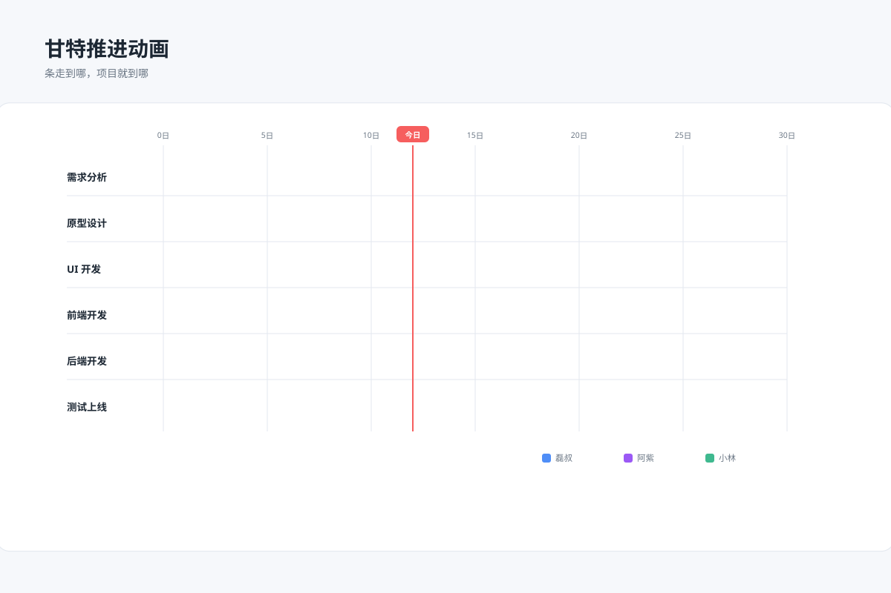</a> <a href="gallery/charts/gantt-progress/prompt.md"><strong>甘特图 · 动态揭示</strong> Gantt Progress Animation</a></td></tr>
</table>

## 流程与架构

解释工作流程、交互时序、系统边界、数据关系和事件顺序。按理解任务排列，动画变体紧随静态骨架。

<table>
<tr><td width="350" align="center" valign="top"> <a href="gallery/diagrams/process-steps/prompt.md"><strong>输入与输出流程</strong> Process Flow</a></td><td width="350" align="center" valign="top"> <a href="gallery/diagrams/process-walk/prompt.md"><strong>交付流程 · 动态路径</strong> Process Flow Animation</a></td><td width="350" align="center" valign="top"><a href="gallery/diagrams/decision-flowchart/prompt.md">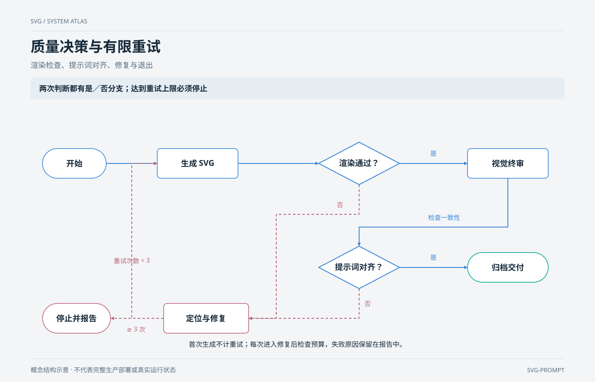</a> <a href="gallery/diagrams/decision-flowchart/prompt.md"><strong>质量决策与有限重试</strong> Decision Flowchart</a></td></tr>
<tr><td width="350" align="center" valign="top"><a href="gallery/diagrams/swimlane/prompt.md">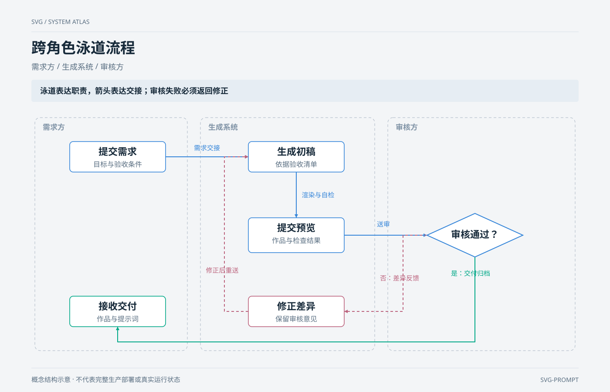</a> <a href="gallery/diagrams/swimlane/prompt.md"><strong>跨角色泳道流程</strong> Swimlane</a></td><td width="350" align="center" valign="top"> <a href="gallery/diagrams/sequence-diagram/prompt.md"><strong>流式请求时序图</strong> Sequence Diagram</a></td><td width="350" align="center" valign="top"><a href="gallery/diagrams/state-machine/prompt.md">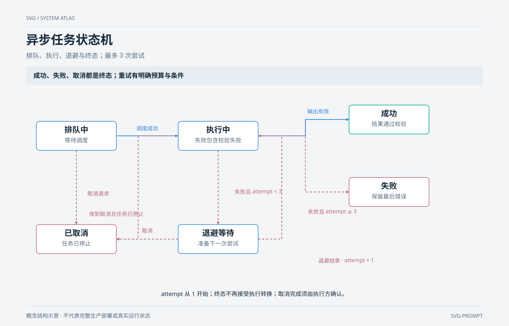</a> <a href="gallery/diagrams/state-machine/prompt.md"><strong>异步任务状态机</strong> State Machine</a></td></tr>
<tr><td width="350" align="center" valign="top"><a href="gallery/diagrams/system-context/prompt.md">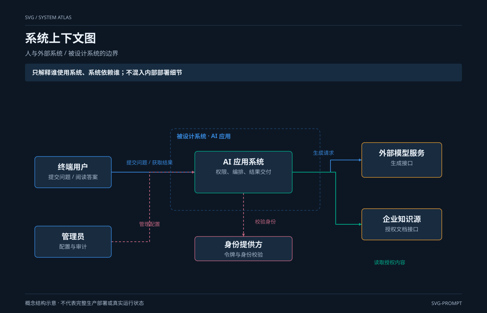</a> <a href="gallery/diagrams/system-context/prompt.md"><strong>系统上下文图</strong> System Context</a></td><td width="350" align="center" valign="top"> <a href="gallery/diagrams/system-architecture/prompt.md"><strong>应用逻辑架构</strong> Application Architecture</a></td><td width="350" align="center" valign="top"><a href="gallery/diagrams/animated-architecture/prompt.md">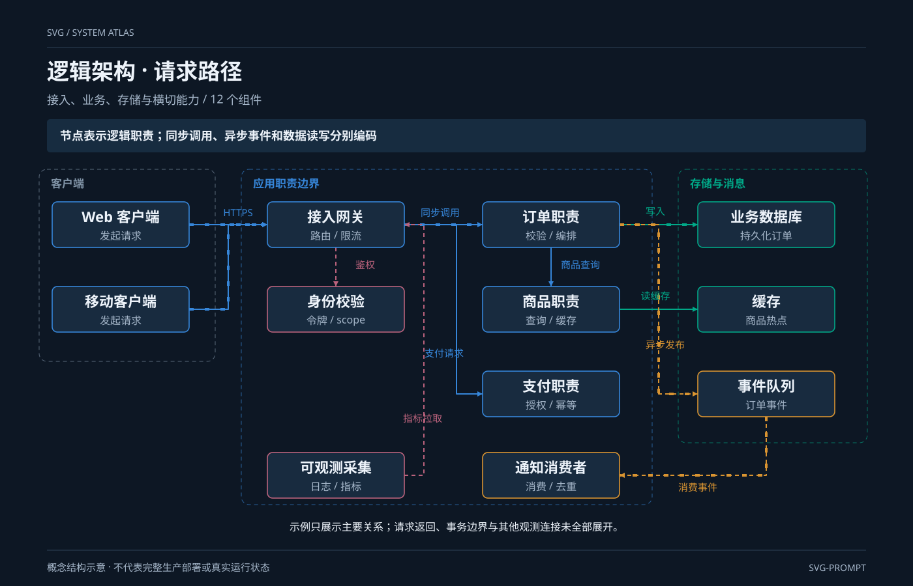</a> <a href="gallery/diagrams/animated-architecture/prompt.md"><strong>逻辑架构 · 请求路径</strong> Architecture Flow Animation</a></td></tr>
<tr><td width="350" align="center" valign="top"><a href="gallery/diagrams/deployment/prompt.md">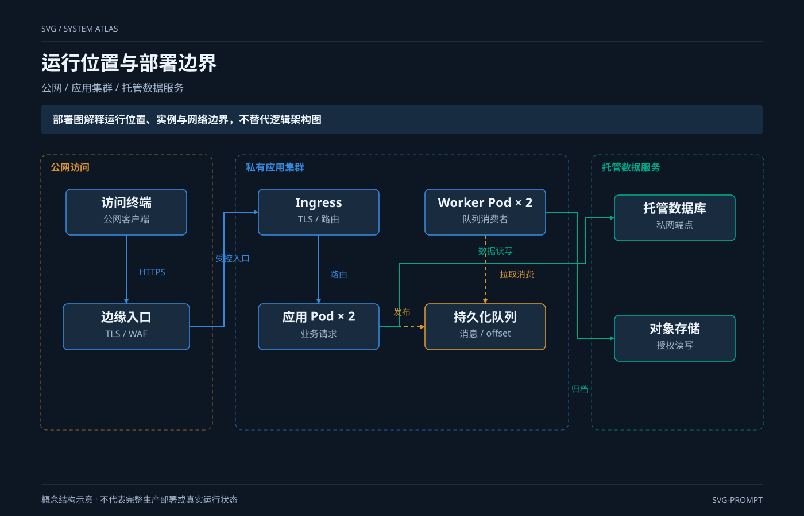</a> <a href="gallery/diagrams/deployment/prompt.md"><strong>运行位置与部署边界</strong> Deployment Diagram</a></td><td width="350" align="center" valign="top"> <a href="gallery/diagrams/data-pipeline/prompt.md"><strong>有校验与失败出口的数据管线</strong> Data Pipeline</a></td><td width="350" align="center" valign="top"> <a href="gallery/diagrams/rag-pipeline/prompt.md"><strong>RAG：索引与查询两条路径</strong> RAG Pipeline</a></td></tr>
<tr><td width="350" align="center" valign="top"> <a href="gallery/diagrams/agent-loop/prompt.md"><strong>Agent 的受控执行闭环</strong> Agent Loop</a></td><td width="350" align="center" valign="top"><a href="gallery/diagrams/entity-relationship/prompt.md"></a> <a href="gallery/diagrams/entity-relationship/prompt.md"><strong>会话数据实体关系</strong> Entity Relationship Diagram</a></td><td width="350" align="center" valign="top"><a href="gallery/diagrams/service-dependencies/prompt.md"></a> <a href="gallery/diagrams/service-dependencies/prompt.md"><strong>有方向的服务依赖</strong> Service Dependencies</a></td></tr>
<tr><td width="350" align="center" valign="top"> <a href="gallery/diagrams/network-pulse/prompt.md"><strong>服务依赖 · 动态路径</strong> Network Flow Animation</a></td><td width="350" align="center" valign="top"><a href="gallery/diagrams/org-chart/prompt.md"></a> <a href="gallery/diagrams/org-chart/prompt.md"><strong>组织与汇报层级</strong> Org Chart</a></td><td width="350" align="center" valign="top"><a href="gallery/diagrams/mind-map/prompt.md"></a> <a href="gallery/diagrams/mind-map/prompt.md"><strong>SVG 知识层级图</strong> Mind Map</a></td></tr>
<tr><td width="350" align="center" valign="top"><a href="gallery/diagrams/venn-diagram/prompt.md"></a> <a href="gallery/diagrams/venn-diagram/prompt.md"><strong>权限、相关性与安全的交集</strong> Venn Diagram</a></td><td width="350" align="center" valign="top"><a href="gallery/diagrams/timeline-svg/prompt.md"></a> <a href="gallery/diagrams/timeline-svg/prompt.md"><strong>SVG 标准里程碑</strong> Timeline</a></td><td width="350" align="center" valign="top"> <a href="gallery/diagrams/timeline-reveal/prompt.md"><strong>标准里程碑 · 动态强调</strong> Timeline Animation</a></td></tr>
</table>

## 地图与空间

表达位置、地理分布、流向、覆盖与空间关系，共 12 张，按区域概览 → 点位与密度 → 事件 → 流向与拓扑 → 距离覆盖与楼层 → 多时刻对照排序。

<table>
<tr><td width="350" align="center" valign="top"> <a href="gallery/maps/china-grid-map/prompt.md"><strong>区域格网图</strong> Regional Tile Grid</a></td><td width="350" align="center" valign="top"><a href="gallery/maps/choropleth/prompt.md"></a> <a href="gallery/maps/choropleth/prompt.md"><strong>区域指标分级设色</strong> Choropleth Map</a></td><td width="350" align="center" valign="top"><a href="gallery/maps/proportional-symbols/prompt.md"></a> <a href="gallery/maps/proportional-symbols/prompt.md"><strong>城市比例符号地图</strong> Proportional Symbol Map</a></td></tr>
<tr><td width="350" align="center" valign="top"><a href="gallery/maps/point-distribution/prompt.md"></a> <a href="gallery/maps/point-distribution/prompt.md"><strong>园区点位分布</strong> Campus Point Distribution</a></td><td width="350" align="center" valign="top"><a href="gallery/maps/spatial-density/prompt.md"></a> <a href="gallery/maps/spatial-density/prompt.md"><strong>点位空间密度</strong> Spatial Density Map</a></td><td width="350" align="center" valign="top"><a href="gallery/maps/regional-events/prompt.md"></a> <a href="gallery/maps/regional-events/prompt.md"><strong>区域事件分布</strong> Regional Event Map</a></td></tr>
<tr><td width="350" align="center" valign="top"> <a href="gallery/maps/map-ripple/prompt.md"><strong>区域事件 · 动态强调</strong> Regional Event Animation</a></td><td width="350" align="center" valign="top"> <a href="gallery/maps/origin-destination/prompt.md"><strong>城市起终点流向图</strong> Origin–Destination Flows</a></td><td width="350" align="center" valign="top"><a href="gallery/maps/route-stations/prompt.md"></a> <a href="gallery/maps/route-stations/prompt.md"><strong>路线与换乘拓扑图</strong> Routes and Transfers</a></td></tr>
<tr><td width="350" align="center" valign="top"> <a href="gallery/maps/service-coverage/prompt.md"><strong>直线距离服务覆盖</strong> Distance-Based Service Coverage</a></td><td width="350" align="center" valign="top"> <a href="gallery/maps/campus-floorplan/prompt.md"><strong>楼层空间与设备分区</strong> Floor Plan and Devices</a></td><td width="350" align="center" valign="top"><a href="gallery/maps/spatial-comparison/prompt.md"></a> <a href="gallery/maps/spatial-comparison/prompt.md"><strong>多时刻空间对照</strong> Spatial Snapshots</a></td></tr>
</table>

## 科学与原理

用图形解释数学构造、科学模型和计算过程，共 16 张。按曲线与构造 → 迭代与逼近 → 波动与光学 → 轨道与投影 → 曲面与优化排列，静态与对应动画相邻。

<table>
<tr><td width="350" align="center" valign="top"><a href="gallery/science/lissajous/prompt.md"></a> <a href="gallery/science/lissajous/prompt.md"><strong>利萨茹曲线 · 频率与相位</strong> Lissajous Curves</a></td><td width="350" align="center" valign="top"> <a href="gallery/science/golden-spiral/prompt.md"><strong>斐波那契螺旋近似</strong> Fibonacci Spiral Approximation</a></td><td width="350" align="center" valign="top"> <a href="gallery/science/catenary/prompt.md"><strong>悬链线与抛物线</strong> Catenary vs. Parabola</a></td></tr>
<tr><td width="350" align="center" valign="top"> <a href="gallery/science/bezier-de-casteljau/prompt.md"><strong>贝塞尔曲线 · 逐层构造</strong> Bézier Construction</a></td><td width="350" align="center" valign="top"><a href="gallery/science/sierpinski/prompt.md"></a> <a href="gallery/science/sierpinski/prompt.md"><strong>谢尔宾斯基三角形</strong> Sierpiński Triangle</a></td><td width="350" align="center" valign="top"> <a href="gallery/science/koch-snowflake/prompt.md"><strong>科赫雪花 · 边长与面积</strong> Koch Snowflake</a></td></tr>
<tr><td width="350" align="center" valign="top"><a href="gallery/science/fourier-square/prompt.md"></a> <a href="gallery/science/fourier-square/prompt.md"><strong>傅里叶级数 · 方波逼近</strong> Fourier Square-Wave Approximation</a></td><td width="350" align="center" valign="top"> <a href="gallery/science/fourier-build/prompt.md"><strong>傅里叶级数 · 谐波构建</strong> Fourier Harmonic Construction</a></td><td width="350" align="center" valign="top"><a href="gallery/science/wave-interference/prompt.md"></a> <a href="gallery/science/wave-interference/prompt.md"><strong>波的叠加与干涉</strong> Wave Superposition and Interference</a></td></tr>
<tr><td width="350" align="center" valign="top"><a href="gallery/science/standing-wave/prompt.md"></a> <a href="gallery/science/standing-wave/prompt.md"><strong>驻波 · 节点与腹点</strong> Standing Waves</a></td><td width="350" align="center" valign="top"><a href="gallery/science/thin-lens/prompt.md"></a> <a href="gallery/science/thin-lens/prompt.md"><strong>薄透镜成像 · 三条主光线</strong> Thin-Lens Imaging</a></td><td width="350" align="center" valign="top"> <a href="gallery/science/orbit-gravity/prompt.md"><strong>开普勒轨道 · 等时扫等面积</strong> Keplerian Orbit</a></td></tr>
<tr><td width="350" align="center" valign="top"><a href="gallery/science/solar-system/prompt.md"></a> <a href="gallery/science/solar-system/prompt.md"><strong>太阳系 · 轨道周期对照</strong> Orbital Period Comparison</a></td><td width="350" align="center" valign="top"><a href="gallery/science/three-d/prompt.md"></a> <a href="gallery/science/three-d/prompt.md"><strong>三维投影 · 同物体对照</strong> 3D Projection Comparison</a></td><td width="350" align="center" valign="top"><a href="gallery/science/topology-deform/prompt.md"></a> <a href="gallery/science/topology-deform/prompt.md"><strong>莫比乌斯带 · 半扭转构造</strong> Möbius Strip Construction</a></td></tr>
<tr><td width="350" align="center" valign="top"><a href="gallery/science/gradient-descent/prompt.md"></a> <a href="gallery/science/gradient-descent/prompt.md"><strong>梯度下降 · 步长与收敛</strong> Gradient Descent</a></td></tr>
</table>

## 界面与组件

面向产品设计的控件、状态反馈、数据操作、AI 工作台和完整页面，共 60 张。按输入与基础组件12张 → 导航与检索10张 → 状态与过程反馈13张 → 数据操作与指标6张 → AI产品界面5张 → 协作与业务操作6张 → 完整工作台与特色场景8张排序。

<table>
<tr><td width="350" align="center" valign="top"><a href="gallery/ui/buttons/prompt.md"></a> <a href="gallery/ui/buttons/prompt.md"><strong>按钮状态</strong> Button States</a></td><td width="350" align="center" valign="top"><a href="gallery/ui/toggle/prompt.md"></a> <a href="gallery/ui/toggle/prompt.md"><strong>开关状态</strong> Toggle States</a></td><td width="350" align="center" valign="top"> <a href="gallery/ui/toggle-animated/prompt.md"><strong>开关状态转换</strong> Toggle Transitions</a></td></tr>
<tr><td width="350" align="center" valign="top"> <a href="gallery/ui/checkbox-radio/prompt.md"><strong>复选与单选</strong> Checkboxes and Radio Buttons</a></td><td width="350" align="center" valign="top"><a href="gallery/ui/input-states/prompt.md"></a> <a href="gallery/ui/input-states/prompt.md"><strong>输入与校验</strong> Input and Validation</a></td><td width="350" align="center" valign="top"> <a href="gallery/ui/dropdown/prompt.md"><strong>下拉选择</strong> Dropdown Selection</a></td></tr>
<tr><td width="350" align="center" valign="top"><a href="gallery/ui/chips/prompt.md"></a> <a href="gallery/ui/chips/prompt.md"><strong>标签与筛选项</strong> Tags and Filter Chips</a></td><td width="350" align="center" valign="top"> <a href="gallery/ui/avatar-badge/prompt.md"><strong>头像与徽章</strong> Avatars and Badges</a></td><td width="350" align="center" valign="top"><a href="gallery/ui/elevation/prompt.md"></a> <a href="gallery/ui/elevation/prompt.md"><strong>卡片与层级</strong> Cards and Elevation</a></td></tr>
<tr><td width="350" align="center" valign="top"><a href="gallery/ui/date-range/prompt.md"></a> <a href="gallery/ui/date-range/prompt.md"><strong>日期范围选择</strong> Date Range Picker</a></td><td width="350" align="center" valign="top"><a href="gallery/ui/file-upload/prompt.md"></a> <a href="gallery/ui/file-upload/prompt.md"><strong>文件上传过程</strong> File Upload States</a></td><td width="350" align="center" valign="top"><a href="gallery/ui/login-verification/prompt.md"></a> <a href="gallery/ui/login-verification/prompt.md"><strong>登录与验证</strong> Login and Verification</a></td></tr>
<tr><td width="350" align="center" valign="top"><a href="gallery/ui/tabs/prompt.md"></a> <a href="gallery/ui/tabs/prompt.md"><strong>标签页与分段导航</strong> Tabs and Segmented Navigation</a></td><td width="350" align="center" valign="top"><a href="gallery/ui/pagination/prompt.md"></a> <a href="gallery/ui/pagination/prompt.md"><strong>分页与结果范围</strong> Pagination</a></td><td width="350" align="center" valign="top"><a href="gallery/ui/tooltip/prompt.md"></a> <a href="gallery/ui/tooltip/prompt.md"><strong>工具提示</strong> Tooltips</a></td></tr>
<tr><td width="350" align="center" valign="top"><a href="gallery/ui/breadcrumb/prompt.md"></a> <a href="gallery/ui/breadcrumb/prompt.md"><strong>面包屑导航</strong> Breadcrumb Navigation</a></td><td width="350" align="center" valign="top"> <a href="gallery/ui/global-search/prompt.md"><strong>全局搜索</strong> Global Search</a></td><td width="350" align="center" valign="top"><a href="gallery/ui/command-palette/prompt.md"></a> <a href="gallery/ui/command-palette/prompt.md"><strong>命令面板</strong> Command Palette</a></td></tr>
<tr><td width="350" align="center" valign="top"><a href="gallery/ui/filter-sort/prompt.md"></a> <a href="gallery/ui/filter-sort/prompt.md"><strong>筛选与排序</strong> Filtering and Sorting</a></td><td width="350" align="center" valign="top"><a href="gallery/ui/notification-center/prompt.md"></a> <a href="gallery/ui/notification-center/prompt.md"><strong>通知中心</strong> Notification Center</a></td><td width="350" align="center" valign="top"><a href="gallery/ui/settings-preferences/prompt.md"></a> <a href="gallery/ui/settings-preferences/prompt.md"><strong>设置与偏好</strong> Settings and Preferences</a></td></tr>
<tr><td width="350" align="center" valign="top"><a href="gallery/ui/help-feedback/prompt.md"></a> <a href="gallery/ui/help-feedback/prompt.md"><strong>帮助与反馈</strong> Help and Feedback</a></td><td width="350" align="center" valign="top"><a href="gallery/ui/alerts/prompt.md"></a> <a href="gallery/ui/alerts/prompt.md"><strong>消息提示条</strong> Status Alerts</a></td><td width="350" align="center" valign="top"><a href="gallery/ui/alert-blink/prompt.md"></a> <a href="gallery/ui/alert-blink/prompt.md"><strong>告警强调</strong> Alert Emphasis</a></td></tr>
<tr><td width="350" align="center" valign="top"><a href="gallery/ui/spinners/prompt.md"></a> <a href="gallery/ui/spinners/prompt.md"><strong>加载状态</strong> Loading Indicators</a></td><td width="350" align="center" valign="top"><a href="gallery/ui/indeterminate-progress/prompt.md"></a> <a href="gallery/ui/indeterminate-progress/prompt.md"><strong>不确定进度</strong> Indeterminate Progress</a></td><td width="350" align="center" valign="top"><a href="gallery/ui/skeleton-shimmer/prompt.md"></a> <a href="gallery/ui/skeleton-shimmer/prompt.md"><strong>骨架屏加载</strong> Skeleton Loading</a></td></tr>
<tr><td width="350" align="center" valign="top"> <a href="gallery/ui/typing-indicator/prompt.md"><strong>正在输入</strong> Typing Indicator</a></td><td width="350" align="center" valign="top"> <a href="gallery/ui/audio-wave/prompt.md"><strong>音频输入状态</strong> Voice Input States</a></td><td width="350" align="center" valign="top"><a href="gallery/ui/status-patrol/prompt.md"></a> <a href="gallery/ui/status-patrol/prompt.md"><strong>服务状态巡检</strong> Service Status Inspection</a></td></tr>
<tr><td width="350" align="center" valign="top"><a href="gallery/ui/task-stepper/prompt.md"></a> <a href="gallery/ui/task-stepper/prompt.md"><strong>多步骤任务进度</strong> Task Progress Steps</a></td><td width="350" align="center" valign="top"><a href="gallery/ui/request-retry/prompt.md"></a> <a href="gallery/ui/request-retry/prompt.md"><strong>请求状态与重试</strong> Request and Retry States</a></td><td width="350" align="center" valign="top"><a href="gallery/ui/empty-error/prompt.md"></a> <a href="gallery/ui/empty-error/prompt.md"><strong>空状态与异常</strong> Empty and Error States</a></td></tr>
<tr><td width="350" align="center" valign="top"><a href="gallery/ui/modal-confirm/prompt.md"></a> <a href="gallery/ui/modal-confirm/prompt.md"><strong>弹窗与确认</strong> Confirmation Dialog</a></td><td width="350" align="center" valign="top"><a href="gallery/ui/product-onboarding/prompt.md"></a> <a href="gallery/ui/product-onboarding/prompt.md"><strong>产品引导</strong> Product Onboarding</a></td><td width="350" align="center" valign="top"> <a href="gallery/ui/progress-slider/prompt.md"><strong>进度与滑块</strong> Progress Bars and Sliders</a></td></tr>
<tr><td width="350" align="center" valign="top"><a href="gallery/ui/kpi-cards/prompt.md"></a> <a href="gallery/ui/kpi-cards/prompt.md"><strong>KPI 指标卡</strong> KPI Cards</a></td><td width="350" align="center" valign="top"> <a href="gallery/ui/number-roll/prompt.md"><strong>指标数值变化</strong> Metric Value Transitions</a></td><td width="350" align="center" valign="top"> <a href="gallery/ui/data-table/prompt.md"><strong>专业数据表格</strong> Data Table</a></td></tr>
<tr><td width="350" align="center" valign="top"><a href="gallery/ui/detail-drawer/prompt.md"></a> <a href="gallery/ui/detail-drawer/prompt.md"><strong>详情抽屉</strong> Detail Drawer</a></td><td width="350" align="center" valign="top"> <a href="gallery/ui/pricing-usage/prompt.md"><strong>套餐与用量</strong> Plans and Usage</a></td><td width="350" align="center" valign="top"> <a href="gallery/ui/ai-chat-workbench/prompt.md"><strong>AI 对话工作台</strong> AI Chat Workspace</a></td></tr>
<tr><td width="350" align="center" valign="top"><a href="gallery/ui/model-parameters/prompt.md"></a> <a href="gallery/ui/model-parameters/prompt.md"><strong>模型与参数选择</strong> Model and Parameter Selection</a></td><td width="350" align="center" valign="top"> <a href="gallery/ui/agent-execution/prompt.md"><strong>Agent 执行过程</strong> Agent Execution</a></td><td width="350" align="center" valign="top"> <a href="gallery/ui/knowledge-citations/prompt.md"><strong>知识库检索与引用</strong> Knowledge Search and Citations</a></td></tr>
<tr><td width="350" align="center" valign="top"><a href="gallery/ui/generation-compare/prompt.md"></a> <a href="gallery/ui/generation-compare/prompt.md"><strong>生成结果对比</strong> Generation Comparison</a></td><td width="350" align="center" valign="top"> <a href="gallery/ui/todo-today/prompt.md"><strong>待办清单</strong> Daily Tasks</a></td><td width="350" align="center" valign="top"> <a href="gallery/ui/chat-messenger/prompt.md"><strong>团队聊天</strong> Team Chat</a></td></tr>
<tr><td width="350" align="center" valign="top"> <a href="gallery/ui/ecommerce-home/prompt.md"><strong>电商商品目录</strong> Product Catalog</a></td><td width="350" align="center" valign="top"> <a href="gallery/ui/kanban-board/prompt.md"><strong>看板任务</strong> Task Kanban</a></td><td width="350" align="center" valign="top"><a href="gallery/ui/members-permissions/prompt.md"></a> <a href="gallery/ui/members-permissions/prompt.md"><strong>成员与权限</strong> Members and Permissions</a></td></tr>
<tr><td width="350" align="center" valign="top"><a href="gallery/ui/checkout-payment/prompt.md"></a> <a href="gallery/ui/checkout-payment/prompt.md"><strong>结算与支付状态</strong> Checkout and Payment</a></td><td width="350" align="center" valign="top"><a href="gallery/ui/bi-dashboard/prompt.md"></a> <a href="gallery/ui/bi-dashboard/prompt.md"><strong>经营分析工作台</strong> Business Analytics Workspace</a></td><td width="350" align="center" valign="top"><a href="gallery/ui/dashboard/prompt.md"></a> <a href="gallery/ui/dashboard/prompt.md"><strong>经营分析 · 入场演示</strong> Business Analytics Entrance</a></td></tr>
<tr><td width="350" align="center" valign="top"> <a href="gallery/ui/dark-ops-dashboard/prompt.md"><strong>运维监控工作台</strong> Operations Monitoring Workspace</a></td><td width="350" align="center" valign="top"> <a href="gallery/ui/live-ops-dashboard/prompt.md"><strong>运维监控 · 巡检演示</strong> Operations Inspection Animation</a></td><td width="350" align="center" valign="top"><a href="gallery/ui/fitness-dashboard/prompt.md"></a> <a href="gallery/ui/fitness-dashboard/prompt.md"><strong>活动与训练</strong> Activity and Training</a></td></tr>
<tr><td width="350" align="center" valign="top"><a href="gallery/ui/music-player/prompt.md"></a> <a href="gallery/ui/music-player/prompt.md"><strong>音乐播放工作台</strong> Music Workspace</a></td><td width="350" align="center" valign="top"> <a href="gallery/ui/hud-interface/prompt.md"><strong>HUD 导航概念</strong> HUD Navigation Concept</a></td><td width="350" align="center" valign="top"> <a href="gallery/ui/wave-analyzer/prompt.md"><strong>波形解析工作台</strong> Waveform Analyzer</a></td></tr>
</table>

## 品牌与排版

品牌识别、字标、文字构成与传播版式，共24张。按品牌识别5张 → 字体与排版5张 → 编辑与传播8张 → 应用物料4张 → 品牌动效2张排列。

<table>
<tr><td width="350" align="center" valign="top"><a href="gallery/branding/logo-grid/prompt.md"></a> <a href="gallery/branding/logo-grid/prompt.md"><strong>Logo 构形与网格</strong> Logo Construction Grid</a></td><td width="350" align="center" valign="top"> <a href="gallery/branding/wordmark/prompt.md"><strong>几何字标</strong> Geometric Wordmark</a></td><td width="350" align="center" valign="top"><a href="gallery/branding/brand-lockup/prompt.md"></a> <a href="gallery/branding/brand-lockup/prompt.md"><strong>品牌组合标识</strong> Brand Lockups</a></td></tr>
<tr><td width="350" align="center" valign="top"><a href="gallery/branding/brand-palette/prompt.md"></a> <a href="gallery/branding/brand-palette/prompt.md"><strong>品牌色彩系统</strong> Brand Color System</a></td><td width="350" align="center" valign="top"><a href="gallery/branding/brand-guidelines/prompt.md"></a> <a href="gallery/branding/brand-guidelines/prompt.md"><strong>品牌使用规范</strong> Brand Guidelines</a></td><td width="350" align="center" valign="top"><a href="gallery/branding/type-scale/prompt.md"></a> <a href="gallery/branding/type-scale/prompt.md"><strong>字阶与阅读层级</strong> Type Scale and Hierarchy</a></td></tr>
<tr><td width="350" align="center" valign="top"><a href="gallery/branding/bilingual-type/prompt.md"></a> <a href="gallery/branding/bilingual-type/prompt.md"><strong>中英文字体搭配</strong> Bilingual Typography</a></td><td width="350" align="center" valign="top"><a href="gallery/branding/editorial-grid/prompt.md"></a> <a href="gallery/branding/editorial-grid/prompt.md"><strong>编辑网格与版式</strong> Editorial Grid Systems</a></td><td width="350" align="center" valign="top"><a href="gallery/branding/type-effects/prompt.md"></a> <a href="gallery/branding/type-effects/prompt.md"><strong>品牌文字表达</strong> Expressive Typography</a></td></tr>
<tr><td width="350" align="center" valign="top"><a href="gallery/branding/text-on-path/prompt.md"></a> <a href="gallery/branding/text-on-path/prompt.md"><strong>文字沿路径排布</strong> Type on a Path</a></td><td width="350" align="center" valign="top"> <a href="gallery/branding/magazine-cover/prompt.md"><strong>杂志式封面</strong> Magazine Cover</a></td><td width="350" align="center" valign="top"><a href="gallery/branding/report-cover/prompt.md"></a> <a href="gallery/branding/report-cover/prompt.md"><strong>技术报告封面</strong> Technical Report Cover</a></td></tr>
<tr><td width="350" align="center" valign="top"> <a href="gallery/branding/product-launch/prompt.md"><strong>产品发布海报</strong> Product Launch Poster</a></td><td width="350" align="center" valign="top"> <a href="gallery/branding/article-header/prompt.md"><strong>文章头图与裁切</strong> Article Header and Cropping</a></td><td width="350" align="center" valign="top"><a href="gallery/branding/presentation-title/prompt.md"></a> <a href="gallery/branding/presentation-title/prompt.md"><strong>演讲标题页</strong> Presentation Title Slide</a></td></tr>
<tr><td width="350" align="center" valign="top"> <a href="gallery/branding/poster/prompt.md"><strong>编辑式品牌海报</strong> Editorial Brand Poster</a></td><td width="350" align="center" valign="top"><a href="gallery/branding/comparison-vs/prompt.md"></a> <a href="gallery/branding/comparison-vs/prompt.md"><strong>对比信息版式</strong> Comparison Layout</a></td><td width="350" align="center" valign="top"><a href="gallery/branding/stat-numbers/prompt.md"></a> <a href="gallery/branding/stat-numbers/prompt.md"><strong>图鉴统计卡</strong> Gallery Statistics</a></td></tr>
<tr><td width="350" align="center" valign="top"> <a href="gallery/branding/business-card/prompt.md"><strong>名片正反面</strong> Business Card Front and Back</a></td><td width="350" align="center" valign="top"> <a href="gallery/branding/social-kit/prompt.md"><strong>社媒品牌套件</strong> Social Brand Kit</a></td><td width="350" align="center" valign="top"><a href="gallery/branding/packaging-dieline/prompt.md"></a> <a href="gallery/branding/packaging-dieline/prompt.md"><strong>包装结构与品牌应用</strong> Packaging Structure and Branding</a></td></tr>
<tr><td width="350" align="center" valign="top"><a href="gallery/branding/circular-badge/prompt.md"></a> <a href="gallery/branding/circular-badge/prompt.md"><strong>品牌圆形徽章</strong> Circular Brand Badge</a></td><td width="350" align="center" valign="top"> <a href="gallery/branding/typewriter/prompt.md"><strong>品牌文案揭示</strong> Brand Copy Reveal</a></td><td width="350" align="center" valign="top"> <a href="gallery/branding/brand-intro/prompt.md"><strong>品牌动效片头</strong> Brand Intro Animation</a></td></tr>
</table>

## 图标与符号

简洁、可识别、可复用的功能图标与状态符号。

<table>
<tr><td width="350" align="center" valign="top"><a href="gallery/icons/app-icon/prompt.md"></a> <a href="gallery/icons/app-icon/prompt.md"><strong>App 图标</strong> App Icon</a></td><td width="350" align="center" valign="top"> <a href="gallery/icons/icon-set/prompt.md"><strong>单色图标系统</strong> Icon Set</a></td><td width="350" align="center" valign="top"> <a href="gallery/icons/symbol-morph/prompt.md"><strong>符号变换</strong> Symbol Morph</a></td></tr>
<tr><td width="350" align="center" valign="top"><a href="gallery/icons/arrows/prompt.md"></a> <a href="gallery/icons/arrows/prompt.md"><strong>箭头家族</strong> Arrows</a></td></tr>
</table>

## 插画与场景

通过形象、设备、环境和概念场景表达内容。

<table>
<tr><td width="350" align="center" valign="top"><a href="gallery/illustrations/line-drawing/prompt.md"></a> <a href="gallery/illustrations/line-drawing/prompt.md"><strong>线稿描边动画</strong> Line Drawing</a></td><td width="350" align="center" valign="top"><a href="gallery/illustrations/sticker-pack/prompt.md"></a> <a href="gallery/illustrations/sticker-pack/prompt.md"><strong>贴纸包</strong> Sticker Pack</a></td><td width="350" align="center" valign="top"> <a href="gallery/illustrations/snow-globe/prompt.md"><strong>雪景球</strong> Snow Globe</a></td></tr>
<tr><td width="350" align="center" valign="top"><a href="gallery/illustrations/campfire/prompt.md"></a> <a href="gallery/illustrations/campfire/prompt.md"><strong>篝火</strong> Campfire</a></td><td width="350" align="center" valign="top"><a href="gallery/illustrations/sunrise-scene/prompt.md"></a> <a href="gallery/illustrations/sunrise-scene/prompt.md"><strong>日出场景</strong> Sunrise Scene</a></td><td width="350" align="center" valign="top"><a href="gallery/illustrations/hologram/prompt.md"></a> <a href="gallery/illustrations/hologram/prompt.md"><strong>全息投影</strong> Hologram</a></td></tr>
<tr><td width="350" align="center" valign="top"><a href="gallery/illustrations/energy-core/prompt.md"></a> <a href="gallery/illustrations/energy-core/prompt.md"><strong>能量核心</strong> Energy Core</a></td><td width="350" align="center" valign="top"> <a href="gallery/illustrations/cyber-city/prompt.md"><strong>赛博城市</strong> Cyber City</a></td><td width="350" align="center" valign="top"><a href="gallery/illustrations/particle-collider/prompt.md"></a> <a href="gallery/illustrations/particle-collider/prompt.md"><strong>粒子对撞机</strong> Particle Collider</a></td></tr>
</table>

## 几何与生成艺术

几何构成、参数化图形、递归图案与抽象形变。

<table>
<tr><td width="350" align="center" valign="top"><a href="gallery/geometry/polar-rose/prompt.md"></a> <a href="gallery/geometry/polar-rose/prompt.md"><strong>极坐标玫瑰</strong> Polar Rose</a></td><td width="350" align="center" valign="top"><a href="gallery/geometry/walking-square/prompt.md"></a> <a href="gallery/geometry/walking-square/prompt.md"><strong>步行方块</strong> Walking Square</a></td><td width="350" align="center" valign="top"> <a href="gallery/geometry/sunflower/prompt.md"><strong>向日葵种子图</strong> Sunflower</a></td></tr>
<tr><td width="350" align="center" valign="top"> <a href="gallery/geometry/shape-morph/prompt.md"><strong>形状变换</strong> Shape Morph</a></td><td width="350" align="center" valign="top"><a href="gallery/geometry/blob-morph/prompt.md"></a> <a href="gallery/geometry/blob-morph/prompt.md"><strong>液态形变</strong> Blob Morph</a></td><td width="350" align="center" valign="top"> <a href="gallery/geometry/fractal-tree/prompt.md"><strong>分形树</strong> Fractal Tree</a></td></tr>
<tr><td width="350" align="center" valign="top"> <a href="gallery/geometry/fractal-tree-grow/prompt.md"><strong>分形树生长动画</strong> Fractal Tree Growth</a></td><td width="350" align="center" valign="top"> <a href="gallery/geometry/iso-cubes/prompt.md"><strong>等距立方</strong> Isometric Cubes</a></td><td width="350" align="center" valign="top"><a href="gallery/geometry/boolean-shapes/prompt.md"></a> <a href="gallery/geometry/boolean-shapes/prompt.md"><strong>相减与挖洞</strong> Boolean Shapes</a></td></tr>
<tr><td width="350" align="center" valign="top"><a href="gallery/geometry/circle/prompt.md"></a> <a href="gallery/geometry/circle/prompt.md"><strong>圆 circle</strong> Circle</a></td><td width="350" align="center" valign="top"><a href="gallery/geometry/ellipse/prompt.md"></a> <a href="gallery/geometry/ellipse/prompt.md"><strong>椭圆 ellipse</strong> Ellipse</a></td><td width="350" align="center" valign="top"><a href="gallery/geometry/line/prompt.md"></a> <a href="gallery/geometry/line/prompt.md"><strong>直线 line</strong> Line</a></td></tr>
<tr><td width="350" align="center" valign="top"><a href="gallery/geometry/path/prompt.md"></a> <a href="gallery/geometry/path/prompt.md"><strong>路径 path</strong> SVG Paths</a></td><td width="350" align="center" valign="top"><a href="gallery/geometry/polygon/prompt.md"></a> <a href="gallery/geometry/polygon/prompt.md"><strong>多边形 polygon</strong> Polygon</a></td><td width="350" align="center" valign="top"> <a href="gallery/geometry/polyline/prompt.md"><strong>折线 polyline</strong> Polylines</a></td></tr>
<tr><td width="350" align="center" valign="top"><a href="gallery/geometry/rectangle/prompt.md"></a> <a href="gallery/geometry/rectangle/prompt.md"><strong>矩形 rect</strong> Rectangle</a></td><td width="350" align="center" valign="top"> <a href="gallery/geometry/regular-polygons/prompt.md"><strong>正多边形家族</strong> Regular Polygons</a></td><td width="350" align="center" valign="top"><a href="gallery/geometry/rotational-patterns/prompt.md"></a> <a href="gallery/geometry/rotational-patterns/prompt.md"><strong>旋转复制组合</strong> Rotational Patterns</a></td></tr>
<tr><td width="350" align="center" valign="top"><a href="gallery/geometry/spirals-and-waves/prompt.md"></a> <a href="gallery/geometry/spirals-and-waves/prompt.md"><strong>螺旋与波浪</strong> Spirals And Waves</a></td><td width="350" align="center" valign="top"><a href="gallery/geometry/stars-and-flowers/prompt.md"></a> <a href="gallery/geometry/stars-and-flowers/prompt.md"><strong>星形与花形</strong> Stars And Flowers</a></td></tr>
</table>

## 背景与材质

服务页面、海报和视觉构图的纹理、图案、渐变与光影。

<table>
<tr><td width="350" align="center" valign="top"><a href="gallery/backgrounds/filter-materials/prompt.md"></a> <a href="gallery/backgrounds/filter-materials/prompt.md"><strong>滤镜材质特效</strong> Filter Materials</a></td><td width="350" align="center" valign="top"><a href="gallery/backgrounds/starry-sky/prompt.md"></a> <a href="gallery/backgrounds/starry-sky/prompt.md"><strong>程序化星空</strong> Starry Sky</a></td><td width="350" align="center" valign="top"><a href="gallery/backgrounds/grainy-gradient/prompt.md"></a> <a href="gallery/backgrounds/grainy-gradient/prompt.md"><strong>噪点渐变</strong> Grainy Gradient</a></td></tr>
<tr><td width="350" align="center" valign="top"><a href="gallery/backgrounds/wood-grain/prompt.md"></a> <a href="gallery/backgrounds/wood-grain/prompt.md"><strong>木纹</strong> Wood Grain</a></td><td width="350" align="center" valign="top"> <a href="gallery/backgrounds/pattern-fill/prompt.md"><strong>平铺图案</strong> Pattern Fill</a></td><td width="350" align="center" valign="top"> <a href="gallery/backgrounds/pattern-tile/prompt.md"><strong>图案平铺</strong> Pattern Tile</a></td></tr>
<tr><td width="350" align="center" valign="top"><a href="gallery/backgrounds/carbon-fiber/prompt.md"></a> <a href="gallery/backgrounds/carbon-fiber/prompt.md"><strong>碳纤维</strong> Carbon Fiber</a></td><td width="350" align="center" valign="top"><a href="gallery/backgrounds/concrete/prompt.md"></a> <a href="gallery/backgrounds/concrete/prompt.md"><strong>混凝土</strong> Concrete</a></td><td width="350" align="center" valign="top"><a href="gallery/backgrounds/kraft-paper/prompt.md"></a> <a href="gallery/backgrounds/kraft-paper/prompt.md"><strong>牛皮纸</strong> Kraft Paper</a></td></tr>
<tr><td width="350" align="center" valign="top"><a href="gallery/backgrounds/fabric/prompt.md"></a> <a href="gallery/backgrounds/fabric/prompt.md"><strong>织物</strong> Fabric</a></td><td width="350" align="center" valign="top"> <a href="gallery/backgrounds/brushed-metal/prompt.md"><strong>金属拉丝</strong> Brushed Metal</a></td><td width="350" align="center" valign="top"><a href="gallery/backgrounds/rusted-iron/prompt.md"></a> <a href="gallery/backgrounds/rusted-iron/prompt.md"><strong>铁锈</strong> Rusted Iron</a></td></tr>
<tr><td width="350" align="center" valign="top"><a href="gallery/backgrounds/gold/prompt.md"></a> <a href="gallery/backgrounds/gold/prompt.md"><strong>黄金质感</strong> Gold</a></td><td width="350" align="center" valign="top"> <a href="gallery/backgrounds/frosted-glass/prompt.md"><strong>磨砂玻璃</strong> Frosted Glass</a></td><td width="350" align="center" valign="top"><a href="gallery/backgrounds/marble/prompt.md"></a> <a href="gallery/backgrounds/marble/prompt.md"><strong>大理石</strong> Marble</a></td></tr>
<tr><td width="350" align="center" valign="top"> <a href="gallery/backgrounds/water-drop/prompt.md"><strong>水滴特写</strong> Water Drop</a></td><td width="350" align="center" valign="top"><a href="gallery/backgrounds/lava/prompt.md"></a> <a href="gallery/backgrounds/lava/prompt.md"><strong>熔岩</strong> Lava</a></td><td width="350" align="center" valign="top"> <a href="gallery/backgrounds/spotlight-scan/prompt.md"><strong>聚光灯</strong> Spotlight Scan</a></td></tr>
<tr><td width="350" align="center" valign="top"><a href="gallery/backgrounds/water-shimmer/prompt.md"></a> <a href="gallery/backgrounds/water-shimmer/prompt.md"><strong>水面波光</strong> Water Shimmer</a></td><td width="350" align="center" valign="top"> <a href="gallery/backgrounds/confetti/prompt.md"><strong>粒子礼花</strong> Confetti</a></td><td width="350" align="center" valign="top"> <a href="gallery/backgrounds/rain-ripples/prompt.md"><strong>雨滴涟漪</strong> Rain Ripples</a></td></tr>
<tr><td width="350" align="center" valign="top"><a href="gallery/backgrounds/digital-rain/prompt.md"></a> <a href="gallery/backgrounds/digital-rain/prompt.md"><strong>数据雨</strong> Digital Rain</a></td><td width="350" align="center" valign="top"><a href="gallery/backgrounds/gradient-spheres/prompt.md"></a> <a href="gallery/backgrounds/gradient-spheres/prompt.md"><strong>渐变球体</strong> Gradient Spheres</a></td><td width="350" align="center" valign="top"><a href="gallery/backgrounds/transparency-blend/prompt.md"></a> <a href="gallery/backgrounds/transparency-blend/prompt.md"><strong>透明叠色</strong> Transparency Blend</a></td></tr>
</table>
<!-- GALLERY:END -->

## 贡献

复制 `templates/entry/` 到对应分类目录，填好三件套（`index.svg` 作品 / `prompt.md` 咒语 / `meta.json` 标签），跑 `node scripts/build-readme.mjs` 重新生成本页。收录标准见各分类目录的 `_about.md`，完整指南见 [CONTRIBUTING.md](CONTRIBUTING.md)。

## 许可

代码 [MIT](LICENSE) · 图鉴内容 CC BY 4.0（注明出处即可自由使用）
