# svg-prompt

> **AI 生成 SVG 的图形图鉴** —— 每个作品都带可复制的提示词咒语。
> GitHub 上"看得见作品、拿不到提示词"的 SVG 画廊千千万，把两者耦合在一起的图鉴，此前不存在。

**用法**：看中哪张图 → 点卡片进入它的详情页 → 提示词框右上角点复制按钮 → 粘贴给任意模型复现。

## 目录

<!-- GALLERY:START -->
- **[基础图形](#%E5%9F%BA%E7%A1%80%E5%9B%BE%E5%BD%A2)** basics · 15 条
- **[UI 组件](#ui-%E7%BB%84%E4%BB%B6)** ui · 25 条
- **[品牌排版](#%E5%93%81%E7%89%8C%E6%8E%92%E7%89%88)** branding · 15 条
- **[图表报表](#%E5%9B%BE%E8%A1%A8%E6%8A%A5%E8%A1%A8)** charts · 26 条
- **[信息可视化](#%E4%BF%A1%E6%81%AF%E5%8F%AF%E8%A7%86%E5%8C%96)** infographics · 23 条
- **[实物模拟](#%E5%AE%9E%E7%89%A9%E6%A8%A1%E6%8B%9F)** materials · 17 条
- **[动效艺术](#%E5%8A%A8%E6%95%88%E8%89%BA%E6%9C%AF)** motion · 33 条
- **[高级数学](#%E9%AB%98%E7%BA%A7%E6%95%B0%E5%AD%A6)** math · 14 条

## 基础图形

<table>
<tr><td width="350" align="center" valign="top"> <a href="gallery/basics/arrows/prompt.md"><strong>箭头家族</strong></a> <code>静态</code> <code>2D</code></td><td width="350" align="center" valign="top"> <a href="gallery/basics/boolean-shapes/prompt.md"><strong>相减与挖洞</strong></a> <code>静态</code> <code>2D</code></td><td width="350" align="center" valign="top"> <a href="gallery/basics/circle/prompt.md"><strong>圆 circle</strong></a> <code>静态</code> <code>2D</code></td></tr>
<tr><td width="350" align="center" valign="top"> <a href="gallery/basics/ellipse/prompt.md"><strong>椭圆 ellipse</strong></a> <code>静态</code> <code>2D</code></td><td width="350" align="center" valign="top"> <a href="gallery/basics/gradient-spheres/prompt.md"><strong>渐变球体</strong></a> <code>静态</code> <code>2D</code></td><td width="350" align="center" valign="top"> <a href="gallery/basics/line/prompt.md"><strong>直线 line</strong></a> <code>静态</code> <code>2D</code></td></tr>
<tr><td width="350" align="center" valign="top"> <a href="gallery/basics/path/prompt.md"><strong>路径 path</strong></a> <code>静态</code> <code>2D</code></td><td width="350" align="center" valign="top"> <a href="gallery/basics/polygon/prompt.md"><strong>多边形 polygon</strong></a> <code>静态</code> <code>2D</code></td><td width="350" align="center" valign="top"> <a href="gallery/basics/polyline/prompt.md"><strong>折线 polyline</strong></a> <code>静态</code> <code>2D</code></td></tr>
<tr><td width="350" align="center" valign="top"> <a href="gallery/basics/rectangle/prompt.md"><strong>矩形 rect</strong></a> <code>静态</code> <code>2D</code></td><td width="350" align="center" valign="top"> <a href="gallery/basics/regular-polygons/prompt.md"><strong>正多边形家族</strong></a> <code>静态</code> <code>2D</code></td><td width="350" align="center" valign="top"> <a href="gallery/basics/rotational-patterns/prompt.md"><strong>旋转复制组合</strong></a> <code>静态</code> <code>2D</code></td></tr>
<tr><td width="350" align="center" valign="top"> <a href="gallery/basics/spirals-and-waves/prompt.md"><strong>螺旋与波浪</strong></a> <code>静态</code> <code>2D</code></td><td width="350" align="center" valign="top"> <a href="gallery/basics/stars-and-flowers/prompt.md"><strong>星形与花形</strong></a> <code>静态</code> <code>2D</code></td><td width="350" align="center" valign="top"> <a href="gallery/basics/transparency-blend/prompt.md"><strong>透明叠色</strong></a> <code>静态</code> <code>2D</code></td></tr>
</table>

## UI 组件

<table>
<tr><td width="350" align="center" valign="top"> <a href="gallery/ui/buttons/prompt.md"><strong>按钮四态</strong></a> <code>静态</code> <code>2D</code></td><td width="350" align="center" valign="top"> <a href="gallery/ui/toggle/prompt.md"><strong>开关 Toggle</strong></a> <code>静态</code> <code>2D</code></td><td width="350" align="center" valign="top"> <a href="gallery/ui/checkbox-radio/prompt.md"><strong>复选与单选</strong></a> <code>静态</code> <code>2D</code></td></tr>
<tr><td width="350" align="center" valign="top"> <a href="gallery/ui/chips/prompt.md"><strong>标签 Chips</strong></a> <code>静态</code> <code>2D</code></td><td width="350" align="center" valign="top"> <a href="gallery/ui/avatar-badge/prompt.md"><strong>头像与徽章</strong></a> <code>静态</code> <code>2D</code></td><td width="350" align="center" valign="top"> <a href="gallery/ui/input-states/prompt.md"><strong>输入框状态</strong></a> <code>静态</code> <code>2D</code></td></tr>
<tr><td width="350" align="center" valign="top"> <a href="gallery/ui/tabs/prompt.md"><strong>标签页与分段控件</strong></a> <code>静态</code> <code>2D</code></td><td width="350" align="center" valign="top"> <a href="gallery/ui/pagination/prompt.md"><strong>分页器</strong></a> <code>静态</code> <code>2D</code></td><td width="350" align="center" valign="top"> <a href="gallery/ui/tooltip/prompt.md"><strong>工具提示 Tooltip</strong></a> <code>静态</code> <code>2D</code></td></tr>
<tr><td width="350" align="center" valign="top"> <a href="gallery/ui/alerts/prompt.md"><strong>消息提示条</strong></a> <code>静态</code> <code>2D</code></td><td width="350" align="center" valign="top"> <a href="gallery/ui/progress-slider/prompt.md"><strong>进度条与滑块</strong></a> <code>静态</code> <code>2D</code></td><td width="350" align="center" valign="top"> <a href="gallery/ui/glassmorphism/prompt.md"><strong>渐变与玻璃质感</strong></a> <code>静态</code> <code>2D</code></td></tr>
<tr><td width="350" align="center" valign="top"> <a href="gallery/ui/elevation/prompt.md"><strong>卡片与阴影层级</strong></a> <code>静态</code> <code>2D</code></td><td width="350" align="center" valign="top"> <a href="gallery/ui/dropdown/prompt.md"><strong>下拉菜单</strong></a> <code>静态</code> <code>2D</code></td><td width="350" align="center" valign="top"> <a href="gallery/ui/spinners/prompt.md"><strong>加载器三连</strong></a> <code>SMIL 动效</code> <code>2D</code></td></tr>
<tr><td width="350" align="center" valign="top"> <a href="gallery/ui/typing-indicator/prompt.md"><strong>打字指示器</strong></a> <code>SMIL 动效</code> <code>2D</code></td><td width="350" align="center" valign="top"> <a href="gallery/ui/audio-wave/prompt.md"><strong>音频波形</strong></a> <code>SMIL 动效</code> <code>2D</code></td><td width="350" align="center" valign="top"> <a href="gallery/ui/indeterminate-progress/prompt.md"><strong>不确定进度条</strong></a> <code>SMIL 动效</code> <code>2D</code></td></tr>
<tr><td width="350" align="center" valign="top"> <a href="gallery/ui/toggle-animated/prompt.md"><strong>开关拨动动画</strong></a> <code>SMIL 动效</code> <code>2D</code></td><td width="350" align="center" valign="top"> <a href="gallery/ui/skeleton-shimmer/prompt.md"><strong>骨架屏微光</strong></a> <code>SMIL 动效</code> <code>2D</code></td><td width="350" align="center" valign="top"> <a href="gallery/ui/todo-today/prompt.md"><strong>待办清单</strong></a> <code>静态</code> <code>2D</code></td></tr>
<tr><td width="350" align="center" valign="top"> <a href="gallery/ui/fitness-dashboard/prompt.md"><strong>健身数据</strong></a> <code>静态</code> <code>2D</code></td><td width="350" align="center" valign="top"> <a href="gallery/ui/ecommerce-home/prompt.md"><strong>电商首页</strong></a> <code>静态</code> <code>2D</code></td><td width="350" align="center" valign="top"> <a href="gallery/ui/chat-messenger/prompt.md"><strong>聊天 IM</strong></a> <code>静态</code> <code>2D</code></td></tr>
<tr><td width="350" align="center" valign="top"> <a href="gallery/ui/music-player/prompt.md"><strong>音乐播放器</strong></a> <code>SMIL 动效</code> <code>2D</code></td></tr>
</table>

## 品牌排版

<table>
<tr><td width="350" align="center" valign="top"> <a href="gallery/branding/logo-grid/prompt.md"><strong>Logo 网格构图</strong></a> <code>静态</code> <code>2D</code></td><td width="350" align="center" valign="top"> <a href="gallery/branding/wordmark/prompt.md"><strong>字标 Wordmark</strong></a> <code>静态</code> <code>2D</code></td><td width="350" align="center" valign="top"> <a href="gallery/branding/app-icon/prompt.md"><strong>App 图标</strong></a> <code>静态</code> <code>2D</code></td></tr>
<tr><td width="350" align="center" valign="top"><a href="gallery/branding/icon-set/prompt.md">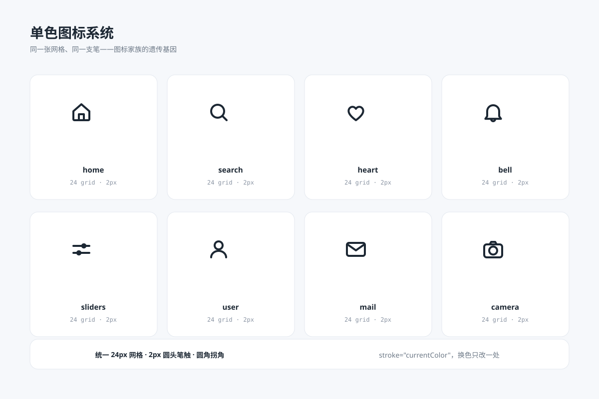</a> <a href="gallery/branding/icon-set/prompt.md"><strong>单色图标系统</strong></a> <code>静态</code> <code>2D</code></td><td width="350" align="center" valign="top"> <a href="gallery/branding/brand-palette/prompt.md"><strong>品牌色板</strong></a> <code>静态</code> <code>2D</code></td><td width="350" align="center" valign="top"> <a href="gallery/branding/pattern-tile/prompt.md"><strong>图案平铺</strong></a> <code>静态</code> <code>2D</code></td></tr>
<tr><td width="350" align="center" valign="top"> <a href="gallery/branding/type-scale/prompt.md"><strong>字阶系统</strong></a> <code>静态</code> <code>2D</code></td><td width="350" align="center" valign="top"><a href="gallery/branding/sticker-pack/prompt.md">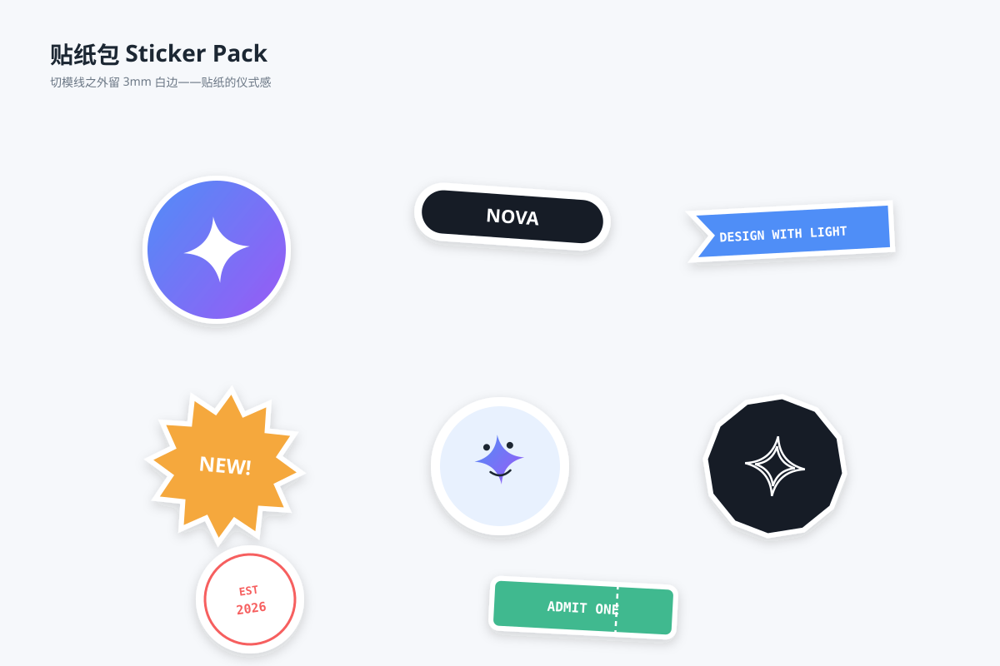</a> <a href="gallery/branding/sticker-pack/prompt.md"><strong>贴纸包</strong></a> <code>静态</code> <code>2D</code></td><td width="350" align="center" valign="top"> <a href="gallery/branding/circular-badge/prompt.md"><strong>圆形徽章</strong></a> <code>静态</code> <code>2D</code></td></tr>
<tr><td width="350" align="center" valign="top"> <a href="gallery/branding/social-kit/prompt.md"><strong>社媒套件</strong></a> <code>静态</code> <code>2D</code></td><td width="350" align="center" valign="top"> <a href="gallery/branding/poster/prompt.md"><strong>品牌海报</strong></a> <code>静态</code> <code>2D</code></td><td width="350" align="center" valign="top"> <a href="gallery/branding/type-effects/prompt.md"><strong>文字特效四连</strong></a> <code>静态</code> <code>2D</code></td></tr>
<tr><td width="350" align="center" valign="top"> <a href="gallery/branding/business-card/prompt.md"><strong>名片正反面</strong></a> <code>静态</code> <code>2D</code></td><td width="350" align="center" valign="top"> <a href="gallery/branding/brand-guidelines/prompt.md"><strong>品牌规范页</strong></a> <code>静态</code> <code>2D</code></td><td width="350" align="center" valign="top"> <a href="gallery/branding/packaging-dieline/prompt.md"><strong>包装展开图</strong></a> <code>静态</code> <code>2D</code></td></tr>
</table>

## 图表报表

<table>
<tr><td width="350" align="center" valign="top"> <a href="gallery/charts/bar/prompt.md"><strong>柱状图</strong></a> <code>静态</code> <code>2D</code></td><td width="350" align="center" valign="top"> <a href="gallery/charts/line/prompt.md"><strong>折线图</strong></a> <code>静态</code> <code>2D</code></td><td width="350" align="center" valign="top"> <a href="gallery/charts/pie-donut/prompt.md"><strong>饼图与环形图</strong></a> <code>静态</code> <code>2D</code></td></tr>
<tr><td width="350" align="center" valign="top"> <a href="gallery/charts/area/prompt.md"><strong>面积图</strong></a> <code>静态</code> <code>2D</code></td><td width="350" align="center" valign="top"> <a href="gallery/charts/scatter/prompt.md"><strong>散点图</strong></a> <code>静态</code> <code>2D</code></td><td width="350" align="center" valign="top"> <a href="gallery/charts/bubble/prompt.md"><strong>气泡图</strong></a> <code>静态</code> <code>2D</code></td></tr>
<tr><td width="350" align="center" valign="top"> <a href="gallery/charts/combo-dual-axis/prompt.md"><strong>双轴组合图</strong></a> <code>静态</code> <code>2D</code></td><td width="350" align="center" valign="top"> <a href="gallery/charts/radar/prompt.md"><strong>雷达图</strong></a> <code>静态</code> <code>2D</code></td><td width="350" align="center" valign="top"> <a href="gallery/charts/heatmap/prompt.md"><strong>日历热力图</strong></a> <code>静态</code> <code>2D</code></td></tr>
<tr><td width="350" align="center" valign="top"> <a href="gallery/charts/funnel/prompt.md"><strong>漏斗图</strong></a> <code>静态</code> <code>2D</code></td><td width="350" align="center" valign="top"> <a href="gallery/charts/gantt/prompt.md"><strong>甘特图</strong></a> <code>静态</code> <code>2D</code></td><td width="350" align="center" valign="top"> <a href="gallery/charts/bullet-chart/prompt.md"><strong>子弹图</strong></a> <code>静态</code> <code>2D</code></td></tr>
<tr><td width="350" align="center" valign="top"> <a href="gallery/charts/histogram-boxplot/prompt.md"><strong>直方图与箱线图</strong></a> <code>静态</code> <code>2D</code></td><td width="350" align="center" valign="top"><a href="gallery/charts/kpi-cards/prompt.md">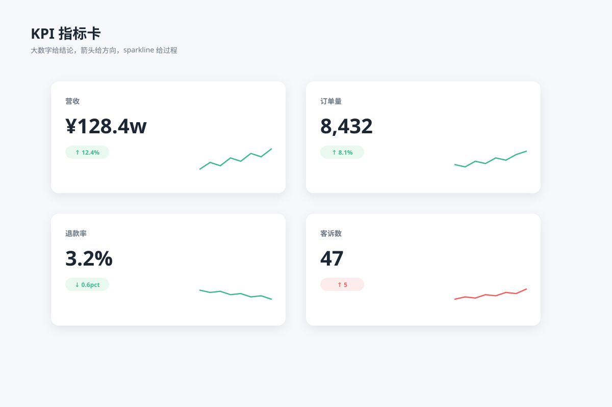</a> <a href="gallery/charts/kpi-cards/prompt.md"><strong>KPI 指标卡</strong></a> <code>静态</code> <code>2D</code></td><td width="350" align="center" valign="top"> <a href="gallery/charts/bar-growth/prompt.md"><strong>柱状生长动画</strong></a> <code>SMIL 动效</code> <code>2D</code></td></tr>
<tr><td width="350" align="center" valign="top"> <a href="gallery/charts/line-draw/prompt.md"><strong>折线描线动画</strong></a> <code>SMIL 动效</code> <code>2D</code></td><td width="350" align="center" valign="top"> <a href="gallery/charts/donut-sweep/prompt.md"><strong>环形扫描动画</strong></a> <code>SMIL 动效</code> <code>2D</code></td><td width="350" align="center" valign="top"> <a href="gallery/charts/area-expand/prompt.md"><strong>面积展开动画</strong></a> <code>SMIL 动效</code> <code>2D</code></td></tr>
<tr><td width="350" align="center" valign="top"> <a href="gallery/charts/funnel-steps/prompt.md"><strong>漏斗逐层动画</strong></a> <code>SMIL 动效</code> <code>2D</code></td><td width="350" align="center" valign="top"> <a href="gallery/charts/gauge-swing/prompt.md"><strong>仪表指针动画</strong></a> <code>SMIL 动效</code> <code>2D</code></td><td width="350" align="center" valign="top"> <a href="gallery/charts/gantt-progress/prompt.md"><strong>甘特推进动画</strong></a> <code>SMIL 动效</code> <code>2D</code></td></tr>
<tr><td width="350" align="center" valign="top"><a href="gallery/charts/live-stream/prompt.md"></a> <a href="gallery/charts/live-stream/prompt.md"><strong>实时数据流</strong></a> <code>SMIL 动效</code> <code>2D</code></td><td width="350" align="center" valign="top"><a href="gallery/charts/number-roll/prompt.md"></a> <a href="gallery/charts/number-roll/prompt.md"><strong>数字滚动动画</strong></a> <code>SMIL 动效</code> <code>2D</code></td><td width="350" align="center" valign="top"> <a href="gallery/charts/status-patrol/prompt.md"><strong>状态灯巡检</strong></a> <code>SMIL 动效</code> <code>2D</code></td></tr>
<tr><td width="350" align="center" valign="top"> <a href="gallery/charts/alert-blink/prompt.md"><strong>告警闪烁</strong></a> <code>SMIL 动效</code> <code>2D</code></td><td width="350" align="center" valign="top"> <a href="gallery/charts/dashboard/prompt.md"><strong>数据可视化仪表盘</strong></a> <code>SMIL 动效</code> <code>2D</code></td></tr>
</table>

## 信息可视化

<table>
<tr><td width="350" align="center" valign="top"> <a href="gallery/infographics/system-architecture/prompt.md"><strong>复杂系统架构图</strong></a> <code>静态</code> <code>2D</code></td><td width="350" align="center" valign="top"><a href="gallery/infographics/animated-architecture/prompt.md">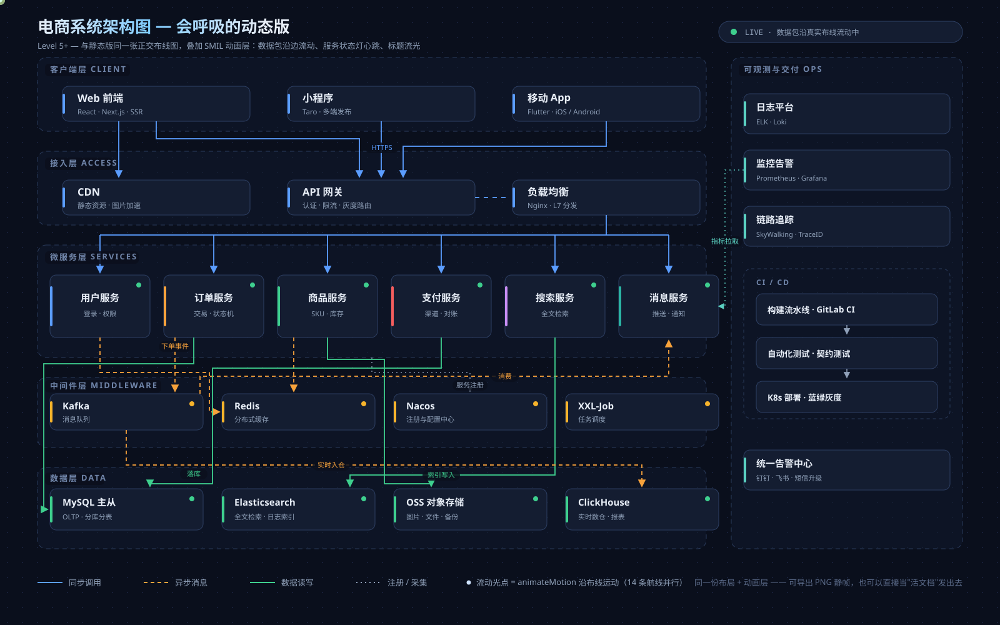</a> <a href="gallery/infographics/animated-architecture/prompt.md"><strong>动态架构图</strong></a> <code>SMIL 动效</code> <code>2D</code></td><td width="350" align="center" valign="top"><a href="gallery/infographics/sankey/prompt.md">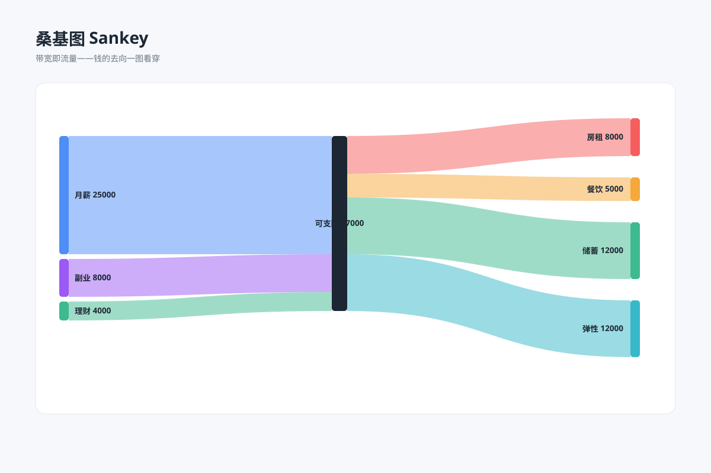</a> <a href="gallery/infographics/sankey/prompt.md"><strong>桑基图</strong></a> <code>静态</code> <code>2D</code></td></tr>
<tr><td width="350" align="center" valign="top"> <a href="gallery/infographics/chord-diagram/prompt.md"><strong>弦图</strong></a> <code>静态</code> <code>2D</code></td><td width="350" align="center" valign="top"> <a href="gallery/infographics/treemap/prompt.md"><strong>树状图 Treemap</strong></a> <code>静态</code> <code>2D</code></td><td width="350" align="center" valign="top"><a href="gallery/infographics/sunburst/prompt.md">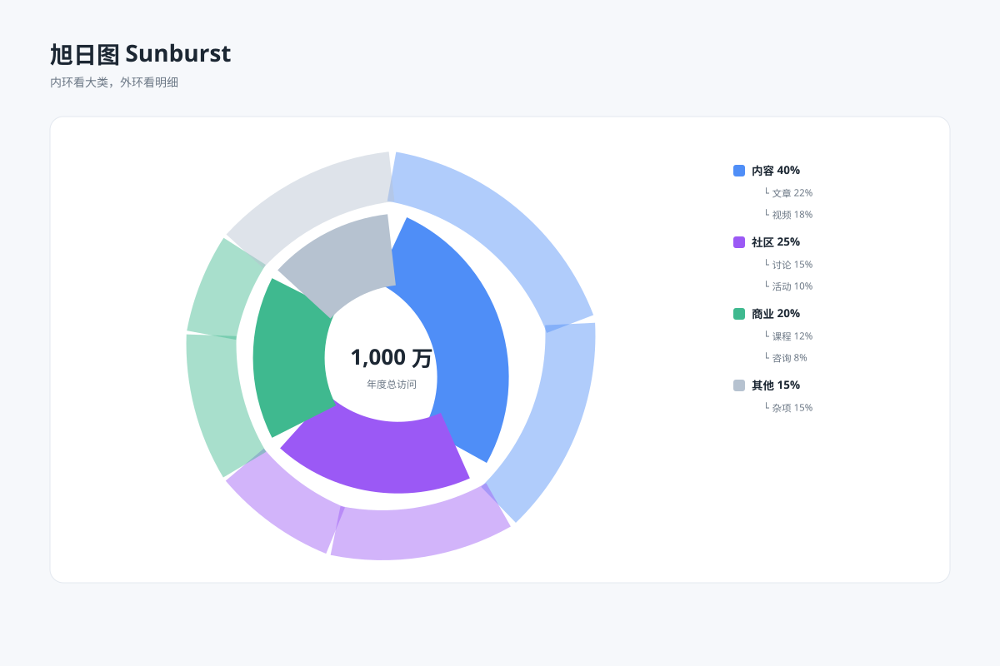</a> <a href="gallery/infographics/sunburst/prompt.md"><strong>旭日图</strong></a> <code>静态</code> <code>2D</code></td></tr>
<tr><td width="350" align="center" valign="top"> <a href="gallery/infographics/mind-map/prompt.md"><strong>思维导图</strong></a> <code>静态</code> <code>2D</code></td><td width="350" align="center" valign="top"><a href="gallery/infographics/org-chart/prompt.md">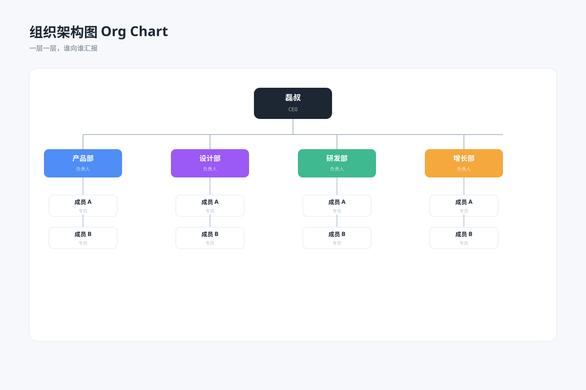</a> <a href="gallery/infographics/org-chart/prompt.md"><strong>组织架构图</strong></a> <code>静态</code> <code>2D</code></td><td width="350" align="center" valign="top"><a href="gallery/infographics/venn-diagram/prompt.md">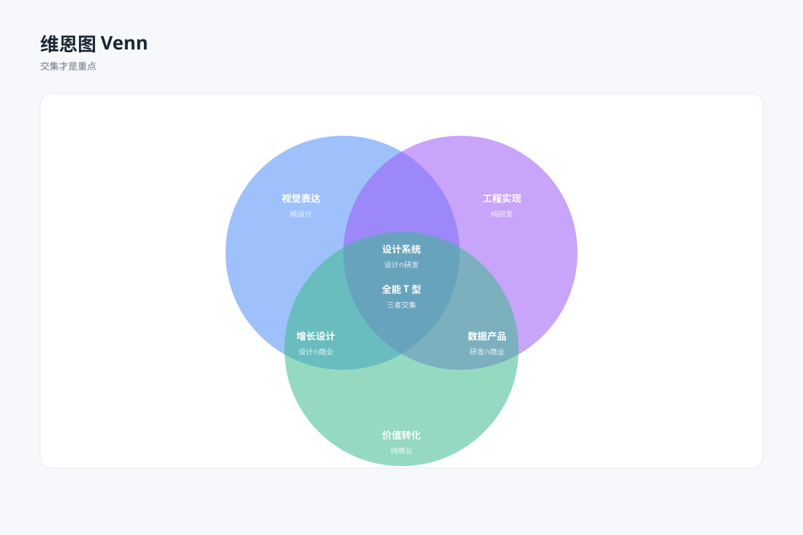</a> <a href="gallery/infographics/venn-diagram/prompt.md"><strong>维恩图</strong></a> <code>静态</code> <code>2D</code></td></tr>
<tr><td width="350" align="center" valign="top"><a href="gallery/infographics/decision-flowchart/prompt.md">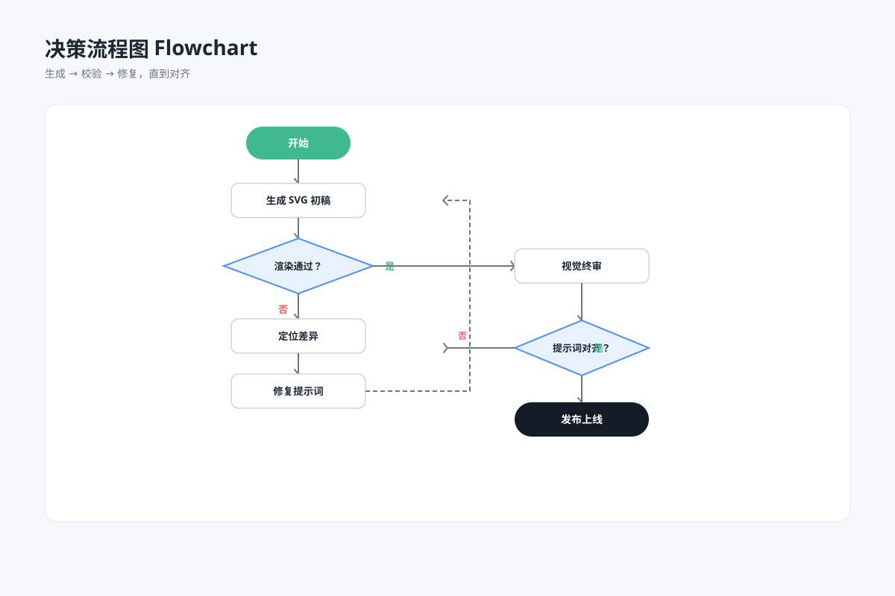</a> <a href="gallery/infographics/decision-flowchart/prompt.md"><strong>决策流程图</strong></a> <code>静态</code> <code>2D</code></td><td width="350" align="center" valign="top"><a href="gallery/infographics/timeline-svg/prompt.md">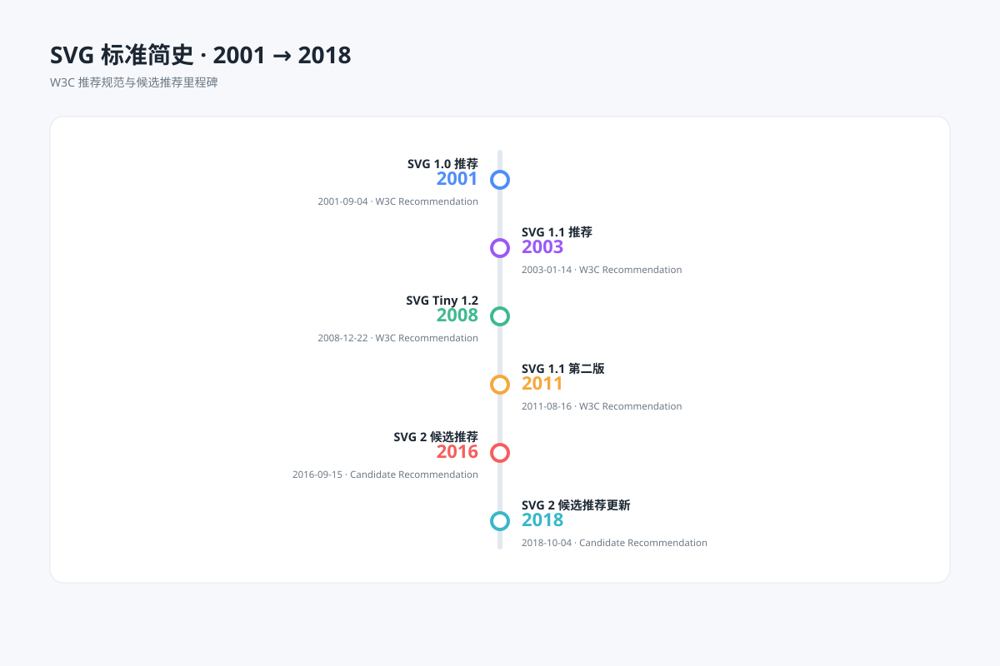</a> <a href="gallery/infographics/timeline-svg/prompt.md"><strong>SVG 简史时间轴</strong></a> <code>静态</code> <code>2D</code></td><td width="350" align="center" valign="top"><a href="gallery/infographics/comparison-vs/prompt.md">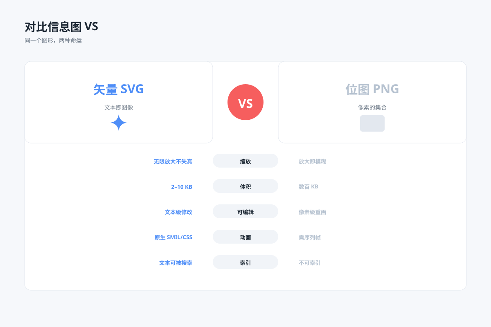</a> <a href="gallery/infographics/comparison-vs/prompt.md"><strong>对比信息图</strong></a> <code>静态</code> <code>2D</code></td></tr>
<tr><td width="350" align="center" valign="top"> <a href="gallery/infographics/stat-numbers/prompt.md"><strong>数字统计图</strong></a> <code>静态</code> <code>2D</code></td><td width="350" align="center" valign="top"><a href="gallery/infographics/process-steps/prompt.md">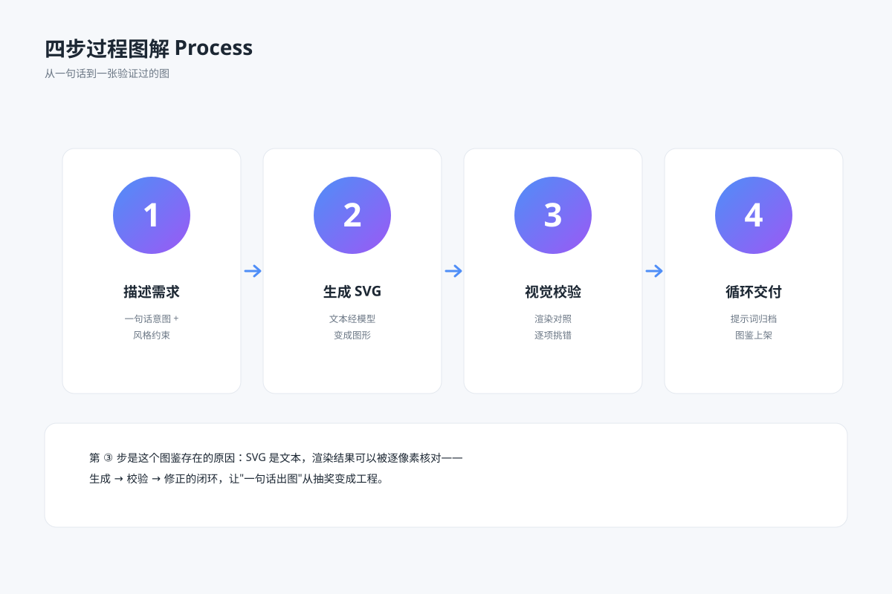</a> <a href="gallery/infographics/process-steps/prompt.md"><strong>过程图解</strong></a> <code>静态</code> <code>2D</code></td><td width="350" align="center" valign="top"><a href="gallery/infographics/china-grid-map/prompt.md">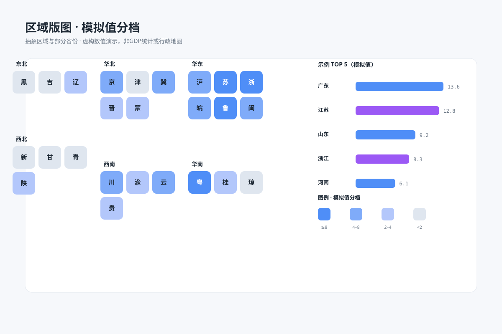</a> <a href="gallery/infographics/china-grid-map/prompt.md"><strong>地理填色图</strong></a> <code>静态</code> <code>2D</code></td></tr>
<tr><td width="350" align="center" valign="top"><a href="gallery/infographics/dark-ops-dashboard/prompt.md">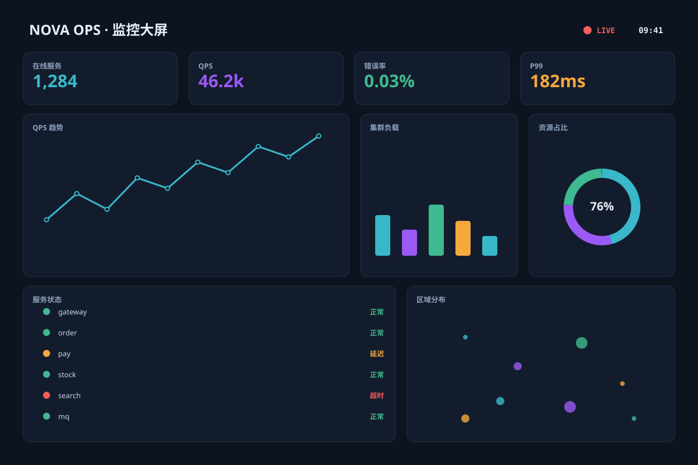</a> <a href="gallery/infographics/dark-ops-dashboard/prompt.md"><strong>深色监控大屏</strong></a> <code>SMIL 动效</code> <code>2D</code></td><td width="350" align="center" valign="top"> <a href="gallery/infographics/bi-dashboard/prompt.md"><strong>浅色 BI 经营盘</strong></a> <code>静态</code> <code>2D</code></td><td width="350" align="center" valign="top"><a href="gallery/infographics/network-pulse/prompt.md">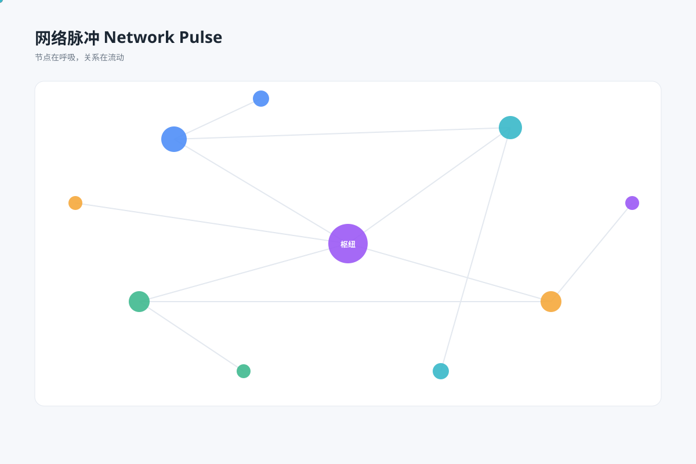</a> <a href="gallery/infographics/network-pulse/prompt.md"><strong>网络脉冲</strong></a> <code>SMIL 动效</code> <code>2D</code></td></tr>
<tr><td width="350" align="center" valign="top"><a href="gallery/infographics/sankey-flow/prompt.md">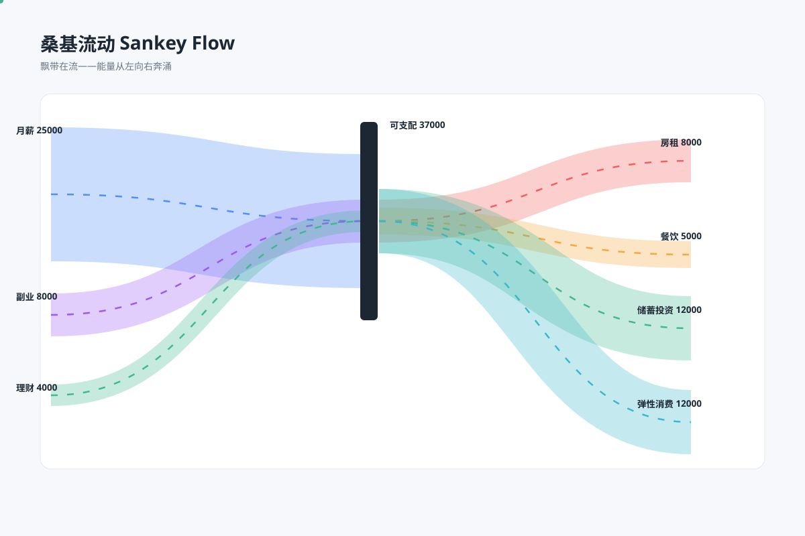</a> <a href="gallery/infographics/sankey-flow/prompt.md"><strong>桑基流动</strong></a> <code>SMIL 动效</code> <code>2D</code></td><td width="350" align="center" valign="top"> <a href="gallery/infographics/map-ripple/prompt.md"><strong>地图涟漪</strong></a> <code>SMIL 动效</code> <code>2D</code></td><td width="350" align="center" valign="top"><a href="gallery/infographics/live-ops-dashboard/prompt.md"></a> <a href="gallery/infographics/live-ops-dashboard/prompt.md"><strong>动态大屏</strong></a> <code>SMIL 动效</code> <code>2D</code></td></tr>
<tr><td width="350" align="center" valign="top"><a href="gallery/infographics/timeline-reveal/prompt.md"></a> <a href="gallery/infographics/timeline-reveal/prompt.md"><strong>时间轴点亮</strong></a> <code>SMIL 动效</code> <code>2D</code></td><td width="350" align="center" valign="top"> <a href="gallery/infographics/process-walk/prompt.md"><strong>流程行进</strong></a> <code>SMIL 动效</code> <code>2D</code></td></tr>
</table>

## 实物模拟

<table>
<tr><td width="350" align="center" valign="top"> <a href="gallery/materials/filter-materials/prompt.md"><strong>滤镜材质特效</strong></a> <code>SMIL 动效</code> <code>2D</code></td><td width="350" align="center" valign="top"><a href="gallery/materials/starry-sky/prompt.md">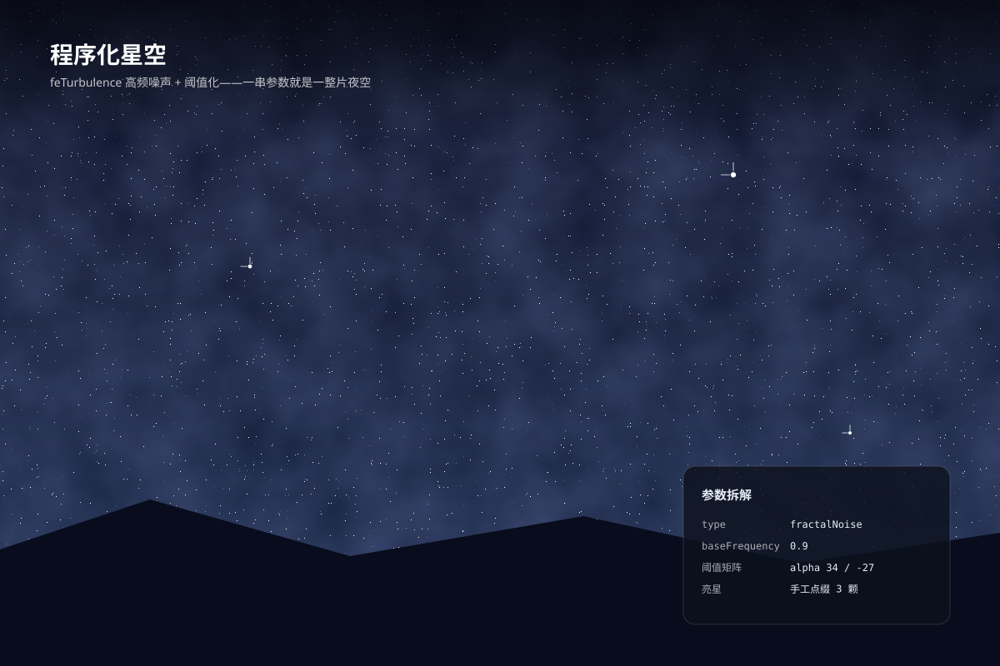</a> <a href="gallery/materials/starry-sky/prompt.md"><strong>程序化星空</strong></a> <code>静态</code> <code>2D</code></td><td width="350" align="center" valign="top"><a href="gallery/materials/grainy-gradient/prompt.md">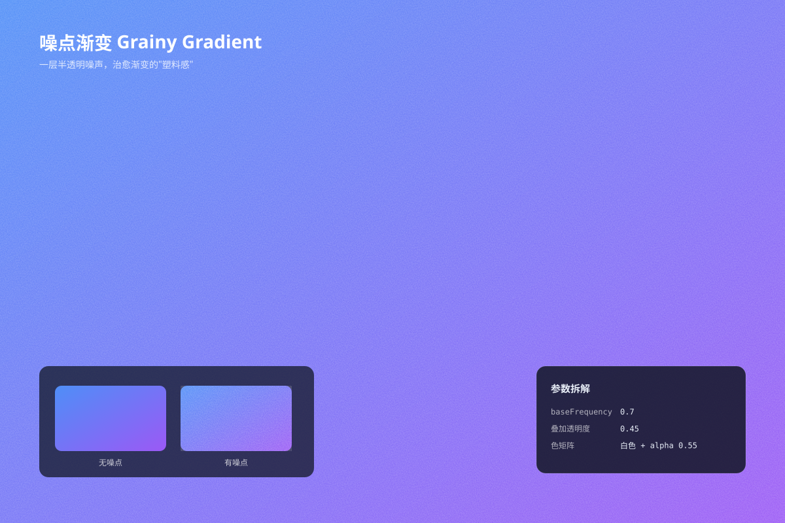</a> <a href="gallery/materials/grainy-gradient/prompt.md"><strong>噪点渐变</strong></a> <code>静态</code> <code>2D</code></td></tr>
<tr><td width="350" align="center" valign="top"><a href="gallery/materials/wood-grain/prompt.md">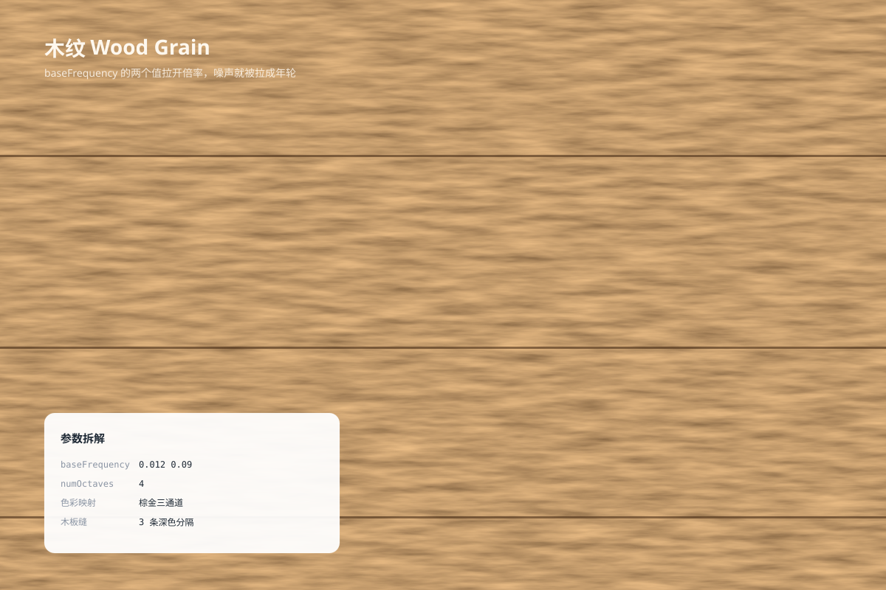</a> <a href="gallery/materials/wood-grain/prompt.md"><strong>木纹</strong></a> <code>静态</code> <code>2D</code></td><td width="350" align="center" valign="top"> <a href="gallery/materials/pattern-fill/prompt.md"><strong>平铺图案</strong></a> <code>静态</code> <code>2D</code></td><td width="350" align="center" valign="top"> <a href="gallery/materials/carbon-fiber/prompt.md"><strong>碳纤维</strong></a> <code>静态</code> <code>2D</code></td></tr>
<tr><td width="350" align="center" valign="top"><a href="gallery/materials/concrete/prompt.md">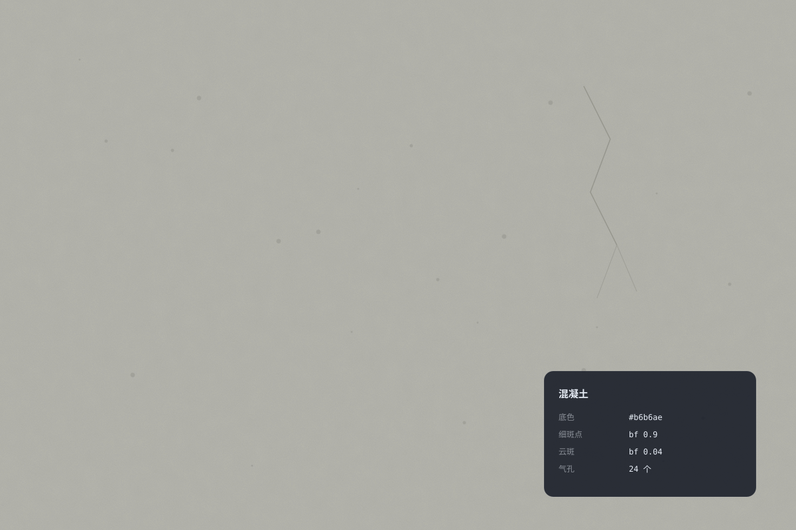</a> <a href="gallery/materials/concrete/prompt.md"><strong>混凝土</strong></a> <code>静态</code> <code>2D</code></td><td width="350" align="center" valign="top"><a href="gallery/materials/kraft-paper/prompt.md">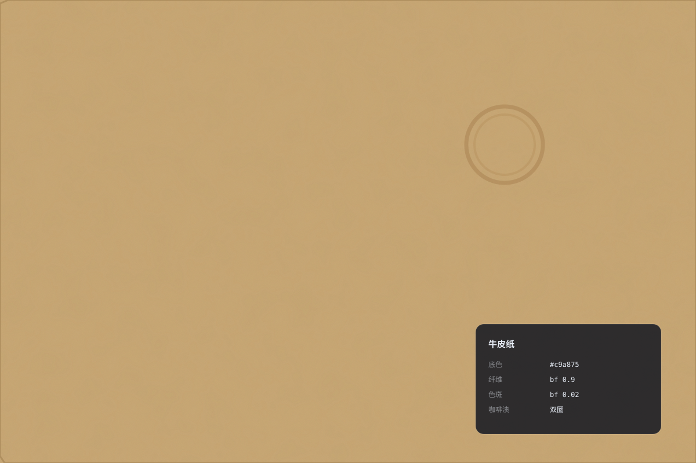</a> <a href="gallery/materials/kraft-paper/prompt.md"><strong>牛皮纸</strong></a> <code>静态</code> <code>2D</code></td><td width="350" align="center" valign="top"> <a href="gallery/materials/fabric/prompt.md"><strong>织物</strong></a> <code>静态</code> <code>2D</code></td></tr>
<tr><td width="350" align="center" valign="top"><a href="gallery/materials/brushed-metal/prompt.md">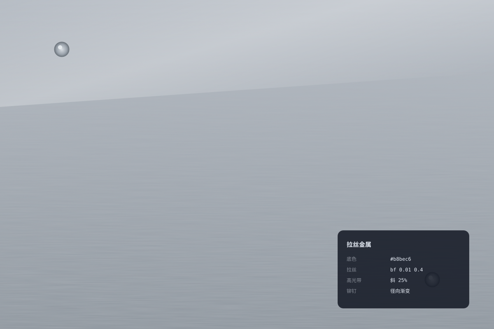</a> <a href="gallery/materials/brushed-metal/prompt.md"><strong>金属拉丝</strong></a> <code>静态</code> <code>2D</code></td><td width="350" align="center" valign="top"> <a href="gallery/materials/rusted-iron/prompt.md"><strong>铁锈</strong></a> <code>静态</code> <code>2D</code></td><td width="350" align="center" valign="top"> <a href="gallery/materials/gold/prompt.md"><strong>黄金质感</strong></a> <code>静态</code> <code>2D</code></td></tr>
<tr><td width="350" align="center" valign="top"> <a href="gallery/materials/frosted-glass/prompt.md"><strong>磨砂玻璃</strong></a> <code>静态</code> <code>2D</code></td><td width="350" align="center" valign="top"> <a href="gallery/materials/marble/prompt.md"><strong>大理石</strong></a> <code>静态</code> <code>2D</code></td><td width="350" align="center" valign="top"> <a href="gallery/materials/water-drop/prompt.md"><strong>水滴特写</strong></a> <code>静态</code> <code>2D</code></td></tr>
<tr><td width="350" align="center" valign="top"><a href="gallery/materials/lava/prompt.md">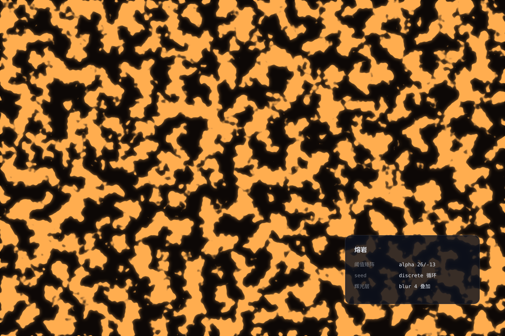</a> <a href="gallery/materials/lava/prompt.md"><strong>熔岩</strong></a> <code>SMIL 动效</code> <code>2D</code></td><td width="350" align="center" valign="top"><a href="gallery/materials/water-shimmer/prompt.md"></a> <a href="gallery/materials/water-shimmer/prompt.md"><strong>水面波光</strong></a> <code>SMIL 动效</code> <code>2D</code></td></tr>
</table>

## 动效艺术

<table>
<tr><td width="350" align="center" valign="top"> <a href="gallery/motion/line-drawing/prompt.md"><strong>线稿描边动画</strong></a> <code>CSS 动效</code> <code>2D</code></td><td width="350" align="center" valign="top"><a href="gallery/motion/typewriter/prompt.md">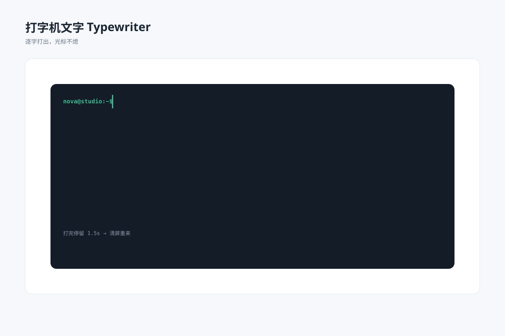</a> <a href="gallery/motion/typewriter/prompt.md"><strong>打字机文字</strong></a> <code>SMIL 动效</code> <code>2D</code></td><td width="350" align="center" valign="top"><a href="gallery/motion/clock/prompt.md">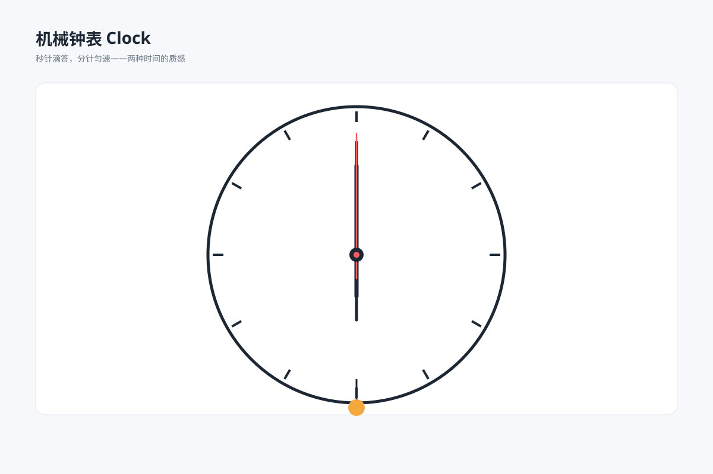</a> <a href="gallery/motion/clock/prompt.md"><strong>钟表</strong></a> <code>SMIL 动效</code> <code>2D</code></td></tr>
<tr><td width="350" align="center" valign="top"><a href="gallery/motion/coffee-loader/prompt.md">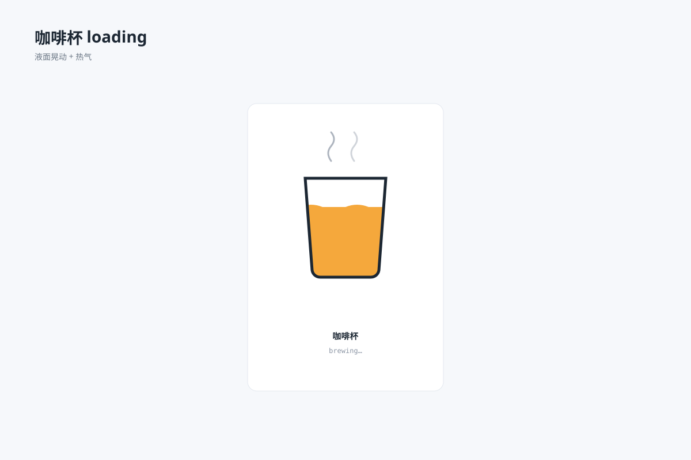</a> <a href="gallery/motion/coffee-loader/prompt.md"><strong>咖啡杯 loading</strong></a> <code>SMIL 动效</code> <code>2D</code></td><td width="350" align="center" valign="top"><a href="gallery/motion/battery-charger/prompt.md">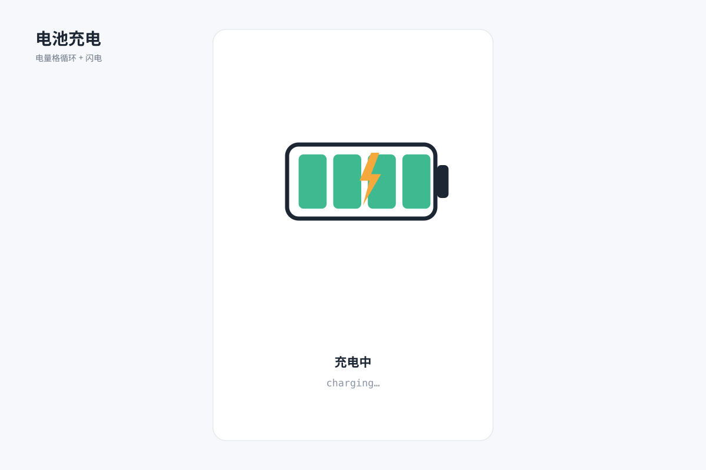</a> <a href="gallery/motion/battery-charger/prompt.md"><strong>电池充电</strong></a> <code>SMIL 动效</code> <code>2D</code></td><td width="350" align="center" valign="top"><a href="gallery/motion/walking-square/prompt.md">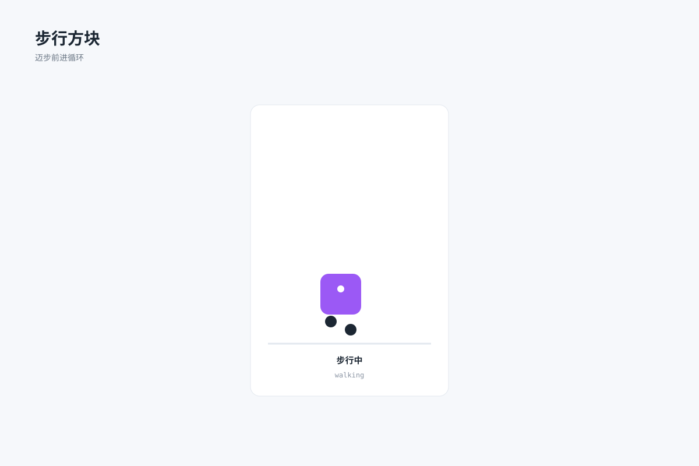</a> <a href="gallery/motion/walking-square/prompt.md"><strong>步行方块</strong></a> <code>SMIL 动效</code> <code>2D</code></td></tr>
<tr><td width="350" align="center" valign="top"><a href="gallery/motion/shape-morph/prompt.md">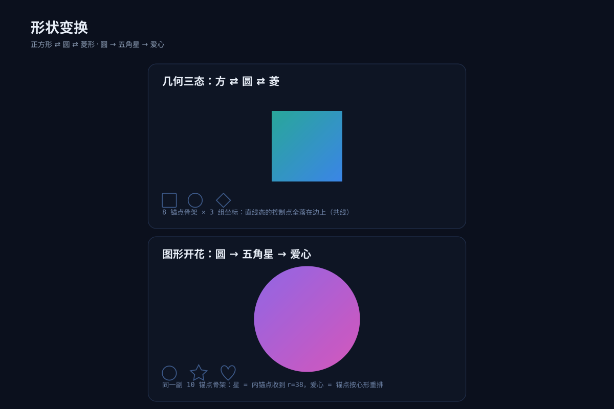</a> <a href="gallery/motion/shape-morph/prompt.md"><strong>形状变换</strong></a> <code>SMIL 动效</code> <code>2D</code></td><td width="350" align="center" valign="top"> <a href="gallery/motion/blob-morph/prompt.md"><strong>液态形变</strong></a> <code>SMIL 动效</code> <code>2D</code></td><td width="350" align="center" valign="top"><a href="gallery/motion/letter-morph/prompt.md">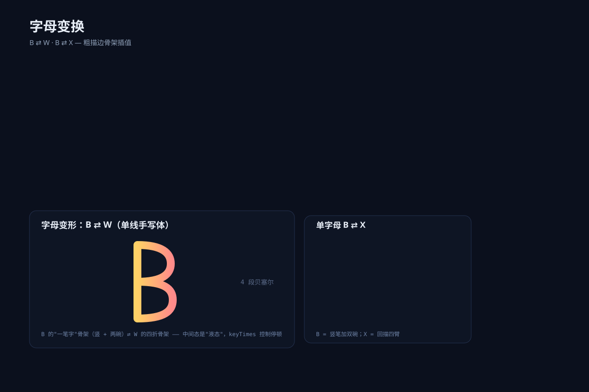</a> <a href="gallery/motion/letter-morph/prompt.md"><strong>字母变换</strong></a> <code>SMIL 动效</code> <code>2D</code></td></tr>
<tr><td width="350" align="center" valign="top"><a href="gallery/motion/neon-sign/prompt.md"></a> <a href="gallery/motion/neon-sign/prompt.md"><strong>霓虹灯牌</strong></a> <code>SMIL 动效</code> <code>2D</code></td><td width="350" align="center" valign="top"><a href="gallery/motion/word-morph/prompt.md">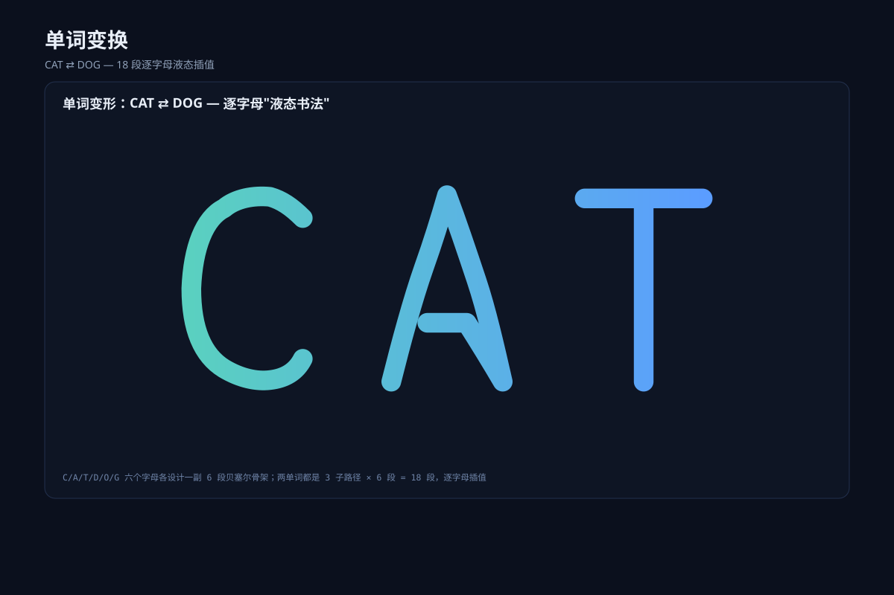</a> <a href="gallery/motion/word-morph/prompt.md"><strong>单词变换</strong></a> <code>SMIL 动效</code> <code>2D</code></td><td width="350" align="center" valign="top"> <a href="gallery/motion/symbol-morph/prompt.md"><strong>符号变换</strong></a> <code>SMIL 动效</code> <code>2D</code></td></tr>
<tr><td width="350" align="center" valign="top"> <a href="gallery/motion/radar-sweep/prompt.md"><strong>雷达扫描</strong></a> <code>SMIL 动效</code> <code>2D</code></td><td width="350" align="center" valign="top"> <a href="gallery/motion/ecg-pulse/prompt.md"><strong>心电脉冲</strong></a> <code>SMIL 动效</code> <code>2D</code></td><td width="350" align="center" valign="top"><a href="gallery/motion/data-pipeline/prompt.md">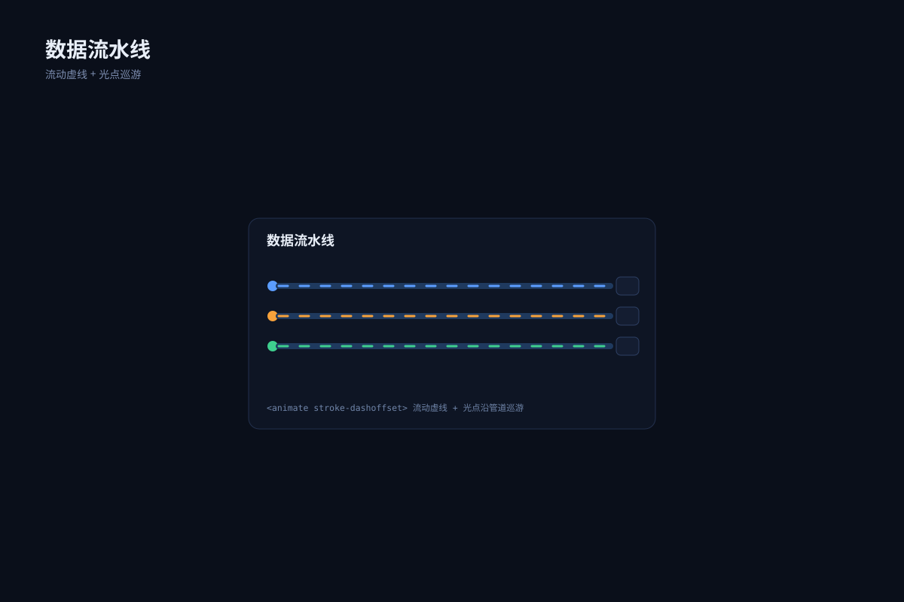</a> <a href="gallery/motion/data-pipeline/prompt.md"><strong>数据流水线</strong></a> <code>SMIL 动效</code> <code>2D</code></td></tr>
<tr><td width="350" align="center" valign="top"><a href="gallery/motion/orbit-gravity/prompt.md">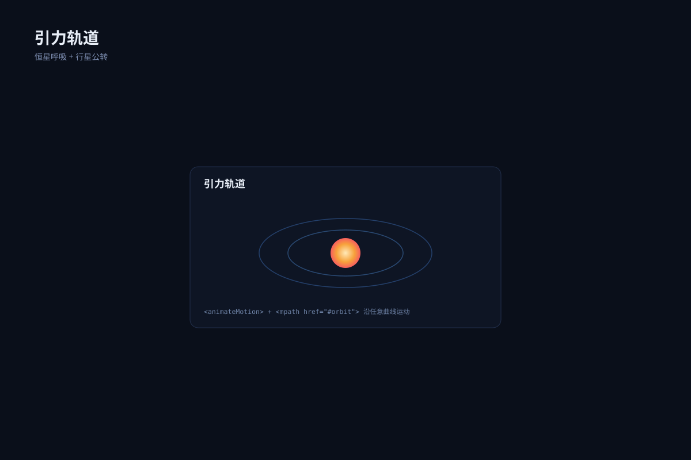</a> <a href="gallery/motion/orbit-gravity/prompt.md"><strong>引力轨道</strong></a> <code>SMIL 动效</code> <code>2D</code></td><td width="350" align="center" valign="top"> <a href="gallery/motion/spotlight-scan/prompt.md"><strong>聚光灯</strong></a> <code>SMIL 动效</code> <code>2D</code></td><td width="350" align="center" valign="top"><a href="gallery/motion/text-on-path/prompt.md">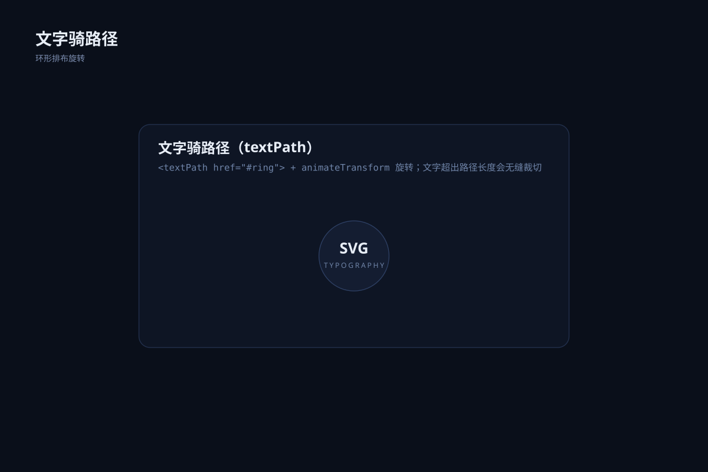</a> <a href="gallery/motion/text-on-path/prompt.md"><strong>文字骑路径</strong></a> <code>SMIL 动效</code> <code>2D</code></td></tr>
<tr><td width="350" align="center" valign="top"><a href="gallery/motion/iso-cubes/prompt.md">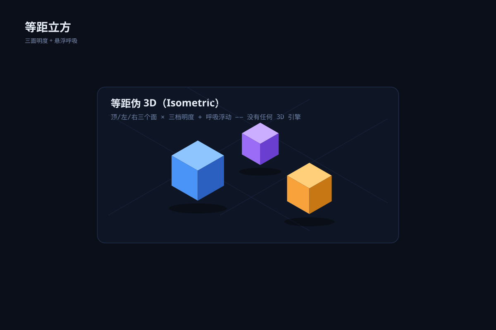</a> <a href="gallery/motion/iso-cubes/prompt.md"><strong>等距立方</strong></a> <code>SMIL 动效</code> <code>2D</code></td><td width="350" align="center" valign="top"> <a href="gallery/motion/confetti/prompt.md"><strong>粒子礼花</strong></a> <code>SMIL 动效</code> <code>2D</code></td><td width="350" align="center" valign="top"><a href="gallery/motion/snow-globe/prompt.md">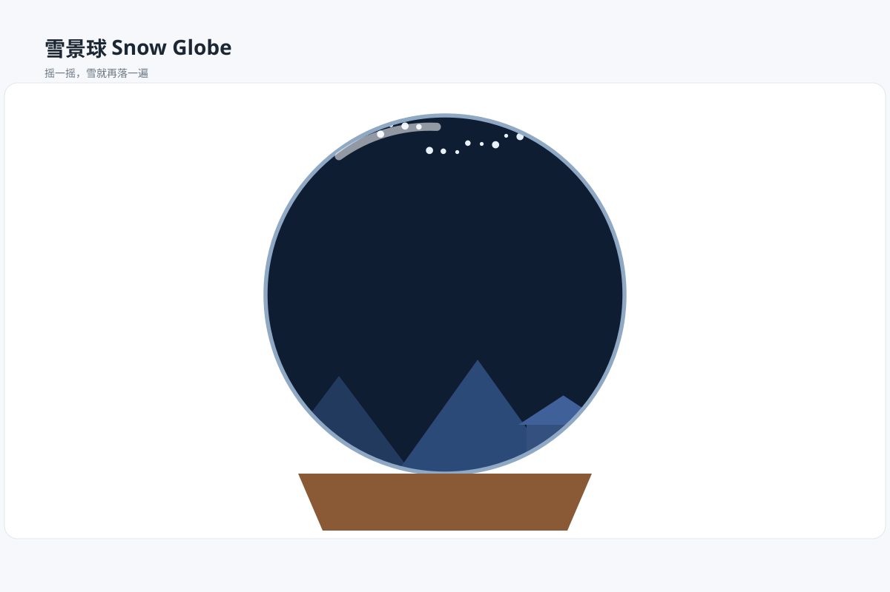</a> <a href="gallery/motion/snow-globe/prompt.md"><strong>雪景球</strong></a> <code>SMIL 动效</code> <code>2D</code></td></tr>
<tr><td width="350" align="center" valign="top"><a href="gallery/motion/rain-ripples/prompt.md">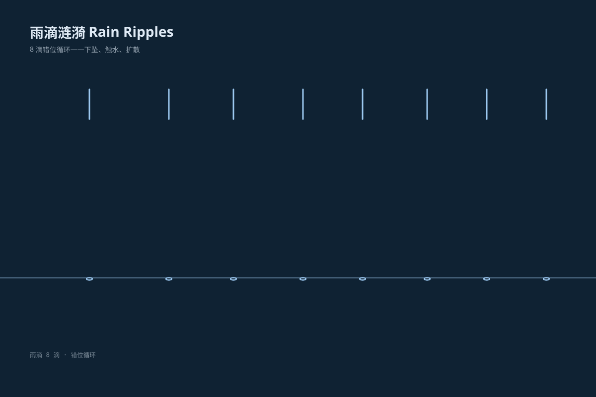</a> <a href="gallery/motion/rain-ripples/prompt.md"><strong>雨滴涟漪</strong></a> <code>SMIL 动效</code> <code>2D</code></td><td width="350" align="center" valign="top"> <a href="gallery/motion/campfire/prompt.md"><strong>篝火</strong></a> <code>SMIL 动效</code> <code>2D</code></td><td width="350" align="center" valign="top"><a href="gallery/motion/sunrise-scene/prompt.md">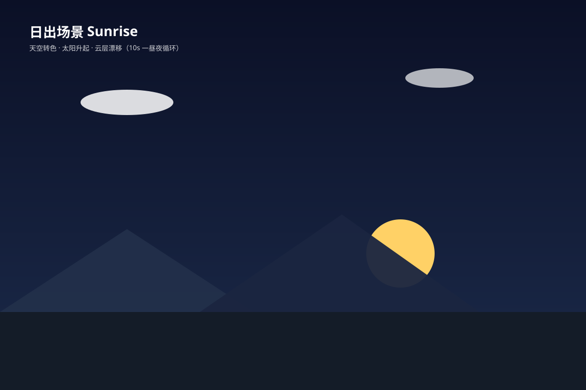</a> <a href="gallery/motion/sunrise-scene/prompt.md"><strong>日出场景</strong></a> <code>SMIL 动效</code> <code>2D</code></td></tr>
<tr><td width="350" align="center" valign="top"> <a href="gallery/motion/solar-system/prompt.md"><strong>太阳系轨道</strong></a> <code>SMIL 动效</code> <code>2D</code></td><td width="350" align="center" valign="top"> <a href="gallery/motion/hud-interface/prompt.md"><strong>HUD 瞬准界面</strong></a> <code>SMIL 动效</code> <code>2D</code></td><td width="350" align="center" valign="top"><a href="gallery/motion/glitch-text/prompt.md">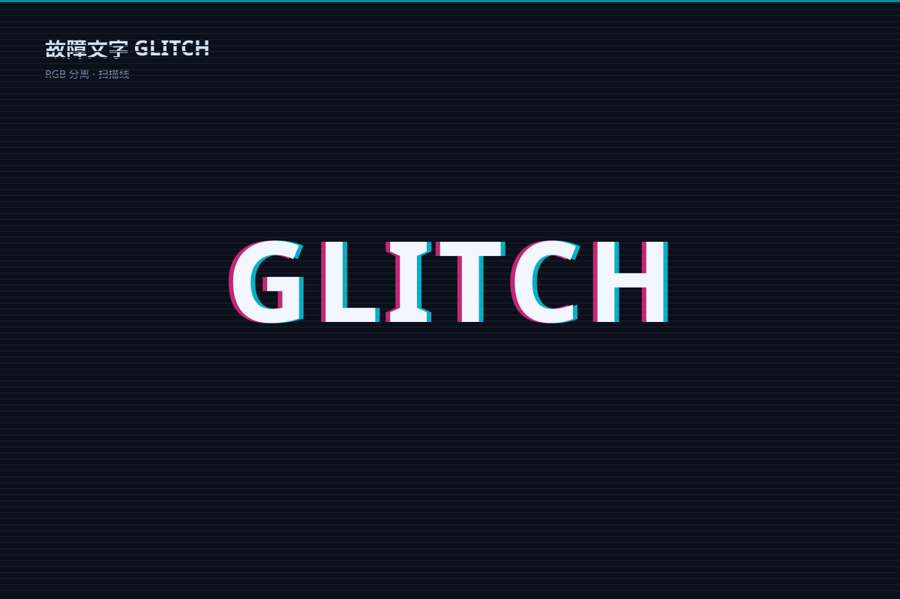</a> <a href="gallery/motion/glitch-text/prompt.md"><strong>故障文字 Glitch</strong></a> <code>SMIL 动效</code> <code>2D</code></td></tr>
<tr><td width="350" align="center" valign="top"> <a href="gallery/motion/hologram/prompt.md"><strong>全息投影</strong></a> <code>SMIL 动效</code> <code>2D</code></td><td width="350" align="center" valign="top"> <a href="gallery/motion/digital-rain/prompt.md"><strong>数据雨</strong></a> <code>SMIL 动效</code> <code>2D</code></td><td width="350" align="center" valign="top"><a href="gallery/motion/energy-core/prompt.md"></a> <a href="gallery/motion/energy-core/prompt.md"><strong>能量核心</strong></a> <code>SMIL 动效</code> <code>2D</code></td></tr>
<tr><td width="350" align="center" valign="top"> <a href="gallery/motion/cyber-city/prompt.md"><strong>赛博城市</strong></a> <code>SMIL 动效</code> <code>2D</code></td><td width="350" align="center" valign="top"><a href="gallery/motion/wave-analyzer/prompt.md">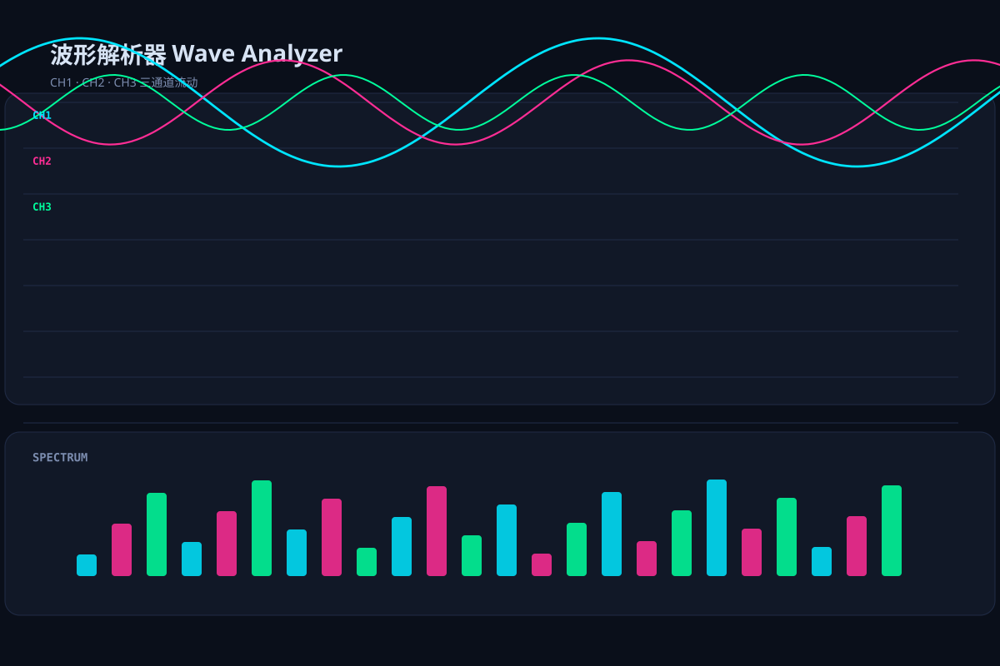</a> <a href="gallery/motion/wave-analyzer/prompt.md"><strong>波形解析器</strong></a> <code>SMIL 动效</code> <code>2D</code></td><td width="350" align="center" valign="top"> <a href="gallery/motion/particle-collider/prompt.md"><strong>粒子对撞机</strong></a> <code>SMIL 动效</code> <code>2D</code></td></tr>
</table>

## 高级数学

<table>
<tr><td width="350" align="center" valign="top"><a href="gallery/math/lissajous/prompt.md">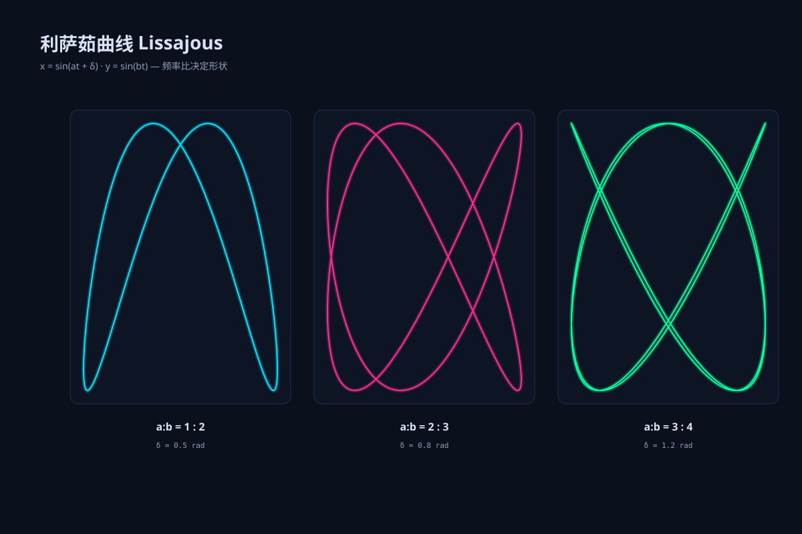</a> <a href="gallery/math/lissajous/prompt.md"><strong>利萨茹曲线</strong></a> <code>静态</code> <code>2D</code></td><td width="350" align="center" valign="top"> <a href="gallery/math/polar-rose/prompt.md"><strong>极坐标玫瑰</strong></a> <code>静态</code> <code>2D</code></td><td width="350" align="center" valign="top"><a href="gallery/math/golden-spiral/prompt.md">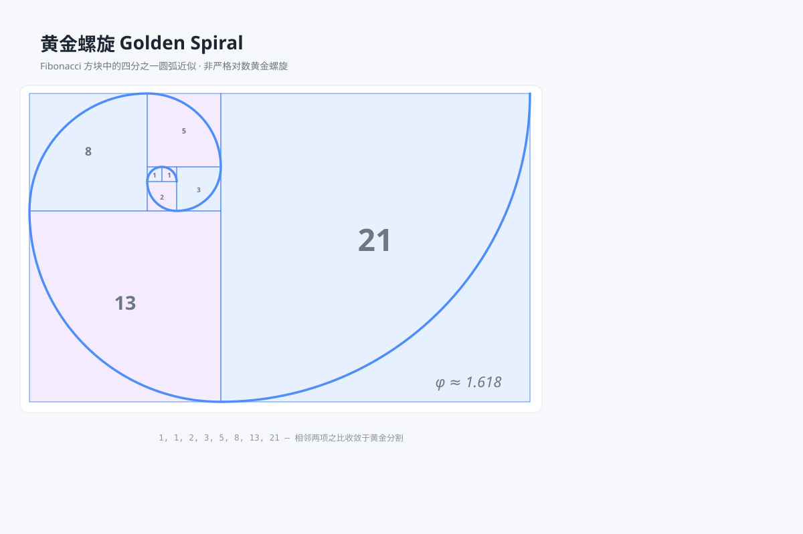</a> <a href="gallery/math/golden-spiral/prompt.md"><strong>黄金螺旋</strong></a> <code>静态</code> <code>2D</code></td></tr>
<tr><td width="350" align="center" valign="top"><a href="gallery/math/sunflower/prompt.md">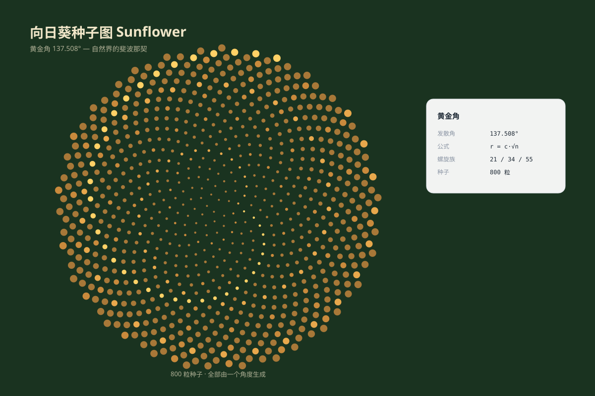</a> <a href="gallery/math/sunflower/prompt.md"><strong>向日葵种子图</strong></a> <code>静态</code> <code>2D</code></td><td width="350" align="center" valign="top"><a href="gallery/math/catenary/prompt.md">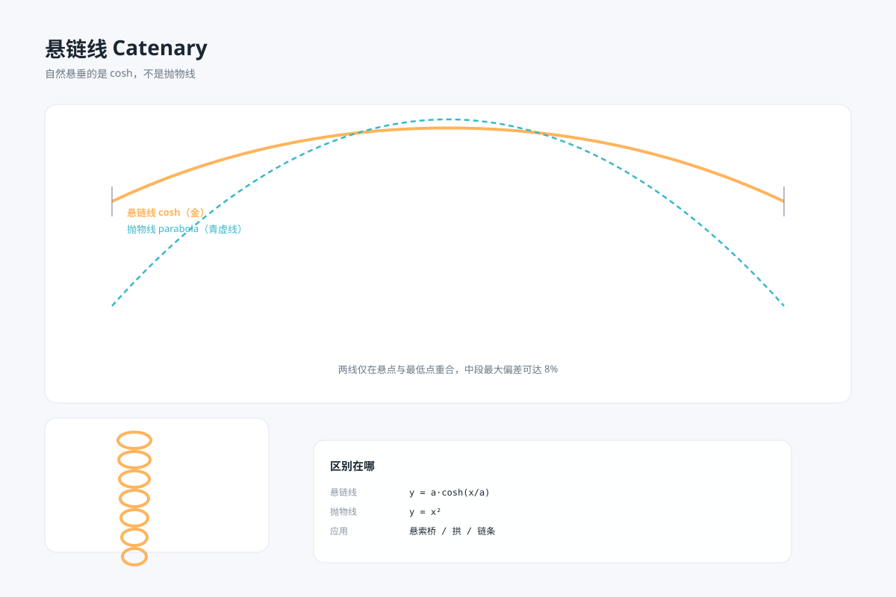</a> <a href="gallery/math/catenary/prompt.md"><strong>悬链线</strong></a> <code>静态</code> <code>2D</code></td><td width="350" align="center" valign="top"><a href="gallery/math/sierpinski/prompt.md">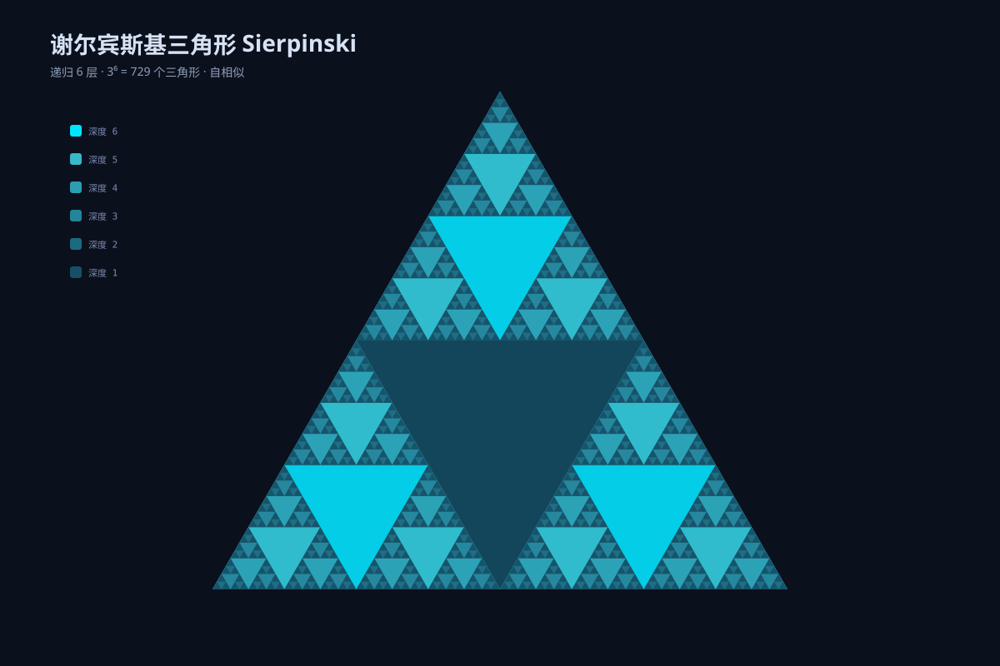</a> <a href="gallery/math/sierpinski/prompt.md"><strong>谢尔宾斯基三角形</strong></a> <code>静态</code> <code>2D</code></td></tr>
<tr><td width="350" align="center" valign="top"> <a href="gallery/math/koch-snowflake/prompt.md"><strong>科赫雪花</strong></a> <code>静态</code> <code>2D</code></td><td width="350" align="center" valign="top"> <a href="gallery/math/fractal-tree/prompt.md"><strong>分形树</strong></a> <code>静态</code> <code>2D</code></td><td width="350" align="center" valign="top"><a href="gallery/math/fourier-square/prompt.md">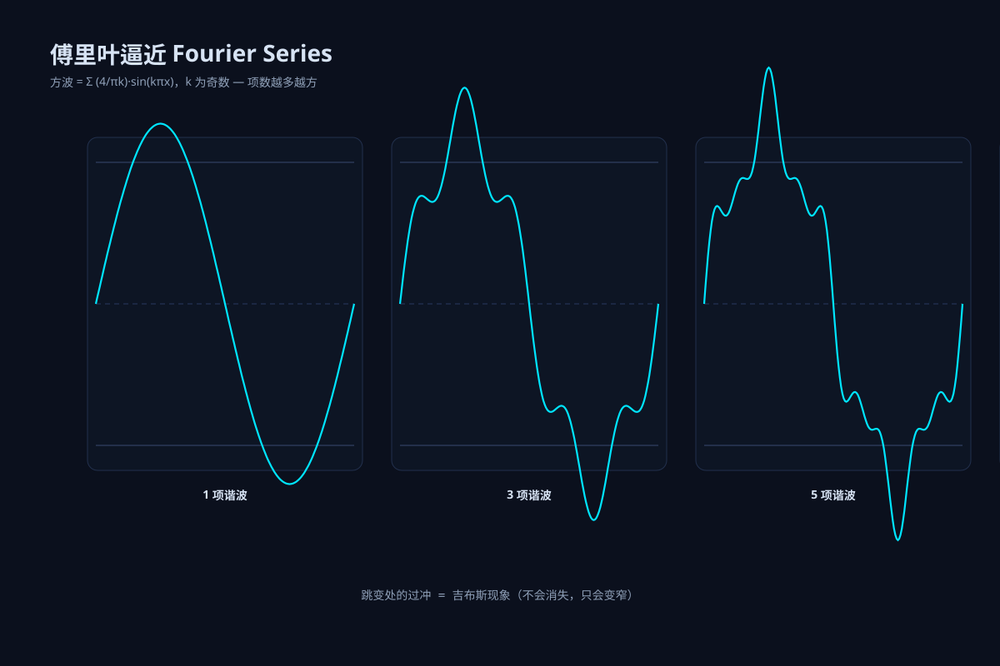</a> <a href="gallery/math/fourier-square/prompt.md"><strong>傅里叶逼近</strong></a> <code>静态</code> <code>2D</code></td></tr>
<tr><td width="350" align="center" valign="top"><a href="gallery/math/fourier-build/prompt.md"></a> <a href="gallery/math/fourier-build/prompt.md"><strong>傅里叶构建动画</strong></a> <code>SMIL 动效</code> <code>2D</code></td><td width="350" align="center" valign="top"> <a href="gallery/math/bezier-de-casteljau/prompt.md"><strong>贝塞尔构造动画</strong></a> <code>SMIL 动效</code> <code>2D</code></td><td width="350" align="center" valign="top"> <a href="gallery/math/fractal-tree-grow/prompt.md"><strong>分形树生长动画</strong></a> <code>SMIL 动效</code> <code>2D</code></td></tr>
<tr><td width="350" align="center" valign="top"> <a href="gallery/math/three-d/prompt.md"><strong>三维投影</strong></a> <code>SMIL 动效</code> <code>3D</code></td><td width="350" align="center" valign="top"> <a href="gallery/math/topology-deform/prompt.md"><strong>拓扑形变</strong></a> <code>SMIL 动效</code> <code>3D</code></td></tr>
</table>
<!-- GALLERY:END -->

## 贡献

复制 `templates/entry/` 到对应分类目录，填好三件套（`index.svg` 作品 / `prompt.md` 咒语 / `meta.json` 标签），跑 `node scripts/build-readme.mjs` 重新生成本页。收录标准见各分类目录的 `_about.md`，完整指南见 [CONTRIBUTING.md](CONTRIBUTING.md)。

## 许可

代码 [MIT](LICENSE) · 图鉴内容 CC BY 4.0（注明出处即可自由使用）
