# 跃迁前夜 / Before the Jump



```text
用独立SVG画一张极其细致、具有叙事的科幻封面，2100×900，7:3。
构图：左上保留标题与暗色留白，中下方巨大楔形探索舰指向右上；右上缓慢自转的星球，空间环、卫星、运输艇建立空间尺度。星线沿同一消失点向外拉长，暗蓝背景中穿插星点与稀薄星云。
风格：深蓝黑、冷白、青色，少量琥珀色引擎与警示。复杂度来自可放大的装甲接缝、机库、窗口、能源走线和维护设备，不是把已有图表拼成九宫格。
融合：导航航线/星图承接地图，能源读数与波形承接图表，舰体线路承接架构，导航投影承接界面，轨道与场线承接科学概念，舰名舷号承接排版，状态/舱段符号承接图标，舰与运输艇承接插画，阵列与几何装甲承接生成艺术，拉丝/玻璃/辉光承接材质。
坐标：舰体顶面A(345,535)、B(610,773)、舰首C(1370,356)。装甲面片使用p(t,u)=(1-t)((1-u)A+uB)+tC，15×11共165面。侧面增厚并加入24窗口、4机库、3层抬高舰桥、吊机与天线；装甲有迎光斜边和背光接缝、整面低透明度拉丝噪声，舰桥投影偏移(24,32)并模糊5px形成接触与遮挡阴影，不依赖字体画舰体。
星球：中心(1655,285)、半径224；地图宽900高440，在圆形裁切内放两个相隔900px的同图副本；地表120秒、云层156秒各自平移−900px，视觉模拟自转并非真实3D球面投影。地形用feTurbulence频率0.008/0.012、5层、seed11，阈值alpha映射后DiffuseLighting形成微地形；云层频率0.013/0.025、4层、seed23，alpha=4r−2.1，均stitchTiles。城市灯点用固定种子7301，之后覆盖静态球形明暗与大气层。
轨道：rx350/ry119椭圆旋转−0.36弧度，72刻度；三台空间设备和5个不同尺度的运输艇，遮挡关系体现远近；5艘运输艇分别沿局部向量向右上航行，18+s×12秒周期，首尾淡入淡出，减少动效时停在完整基础位置。
跃迁：星点与光线由seed7301确定，所有星线共用消失点(1300,340)，沿径向向外移动190px，周期1.8..3.8秒，起止透明度0.04、主体0.5，负延迟错开，移动区只在背景；静态星线也保持可见。
引擎：3个喷口，径向辉光4.8秒opacity1→0.72→1，不闪烁、不遮挡舰体。
投影：左下导航窗345×154，右下驱动状态窗478×163。CORE82%、FIELD68%、SYNC94%与条长对应；波形为双正弦示意。读数、星域名称、舰名均虚构，不是实时遥测或物理仿真。
文字：SVG–PROMPT / THE VECTOR ATLAS、BEFORE THE JUMP、跃迁前夜、ONE SCENE. TEN VISUAL LANGUAGES.；舰身NOVA / ATLAS–07，远景KEPLER / SECTOR 09。
兼容：仅内联矢量、渐变、滤镜、pattern与CSS，没有外部图片/字体/脚本；引用必须都在本文件defs内。prefers-reduced-motion禁用地表、云层、星线、运输艇、引擎和波形动画，保留同一完整静态场景；CSS失效也可完整查看。外部平台是否保留动效需实际页面验证。
```

完整构造可见 [生成脚本](../scripts/build-hero.py)，独立文件可见 [hero.svg](hero.svg)。
