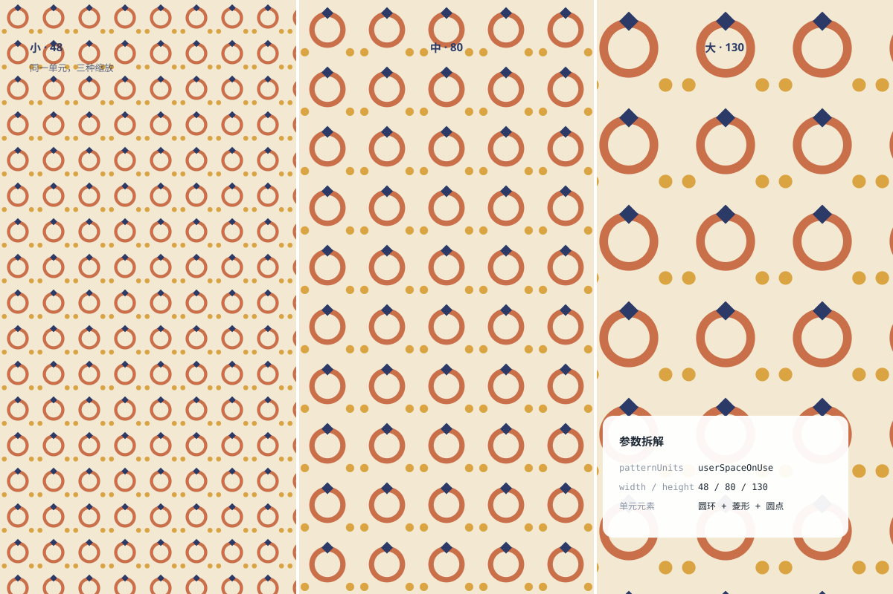

# 平铺图案 `静态` `2D`

分类：[背景与材质](../_about.md)



```
用 SVG 画一张"平铺图案"材质样张（复古包装纸风格）：
- 同一复古单元（奶油底 #f3e9d2 + 赭红圆环 #c96f4a + 藏青小菱形 #2b3a67 + 芥末圆点 #d9a441）定义为三个独立 <pattern>（48/80/130 三种尺寸）
- 三块满版平铺并排（4px 白缝分隔），各配一枚深藏青比例标签（小·48 / 中·80 / 大·130）与副标题"同一单元，三种缩放"
- 右下参数卡标注三行：patternUnits / width-height 三种值 / 单元元素（圆环+菱形+圆点）
- 画布 1200×800 满版图案
```
