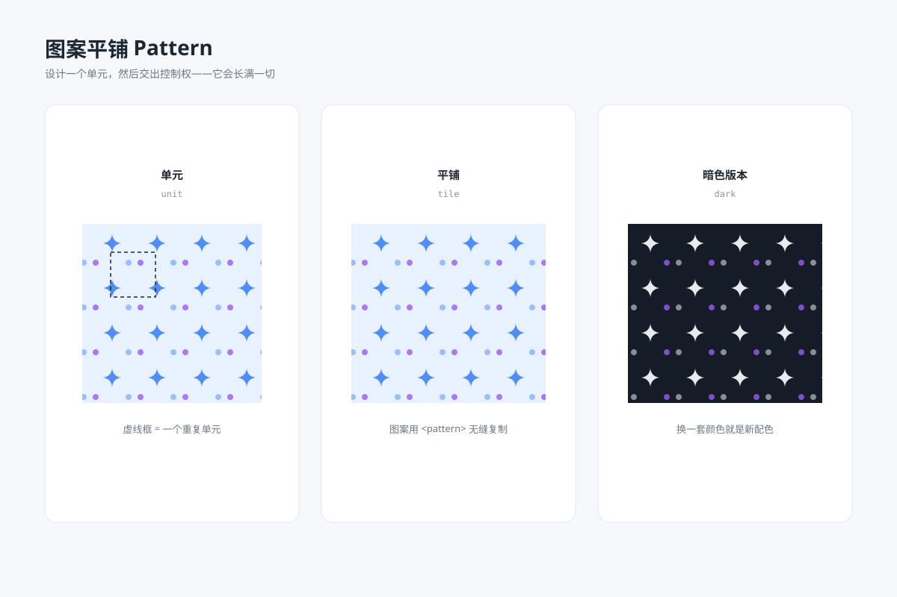

# 图案平铺 `静态` `2D`

分类：[背景与材质](../_about.md)



```
用 SVG 画一张"四方连续图案"展示图：
- 左卡图案单元：浅蓝底小方块内一个星芒 + 两个错位圆点，虚线框出单元边界
- 中卡平铺效果：用 pattern 把单元无缝平铺成一大块面料
- 右卡暗色版本：同单元反白（深底白星芒）
- 各卡下方标注 单元 / 平铺 tile / 暗色 dark
- 画布 1200×800 浅蓝灰背景，白色圆角卡片，单元主色 #4f8ef7
```
