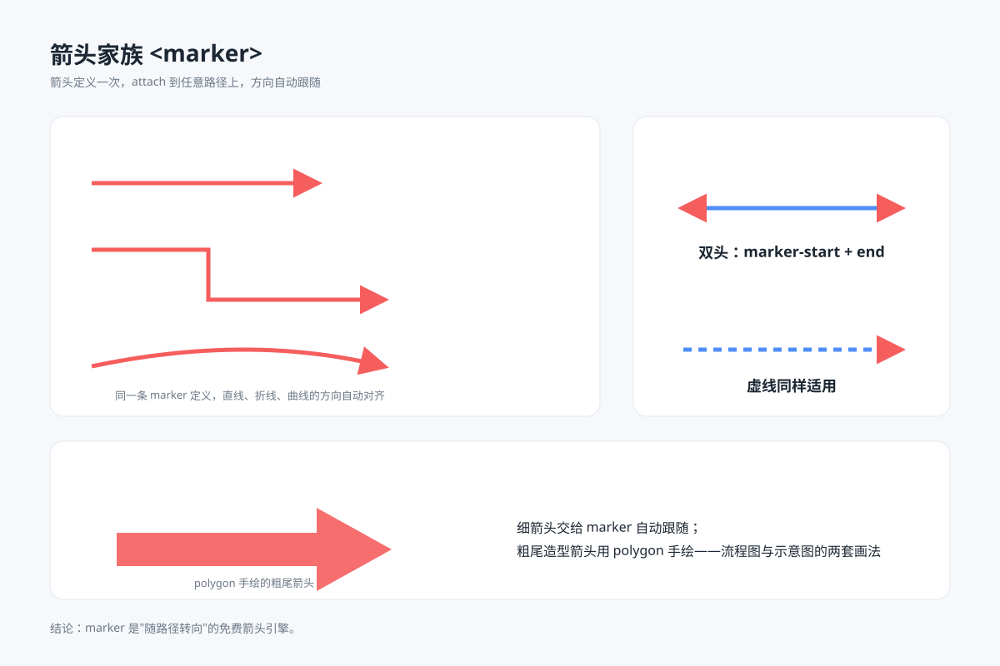

# 箭头家族 `静态` `2D`



```
用 SVG 画一张"箭头家族"教学图：
- 左卡三条路径（水平直线、折线、曲线）共用同一个 marker 箭头，展示箭头自动跟随路径方向旋转
- 右卡上下两个（线条用蓝 #4f8ef7、箭头仍为红）：双头箭头（marker-start + marker-end）、虚线上的箭头
- 下方宽卡片：一个 polygon 手绘的粗尾实心箭头，右侧说明"细箭头交给 marker，造型箭头手绘"两套画法
- 画布 1200×800，浅蓝灰背景 #f6f8fb，白色圆角卡片分格，主题色红 #f65e5e
```
