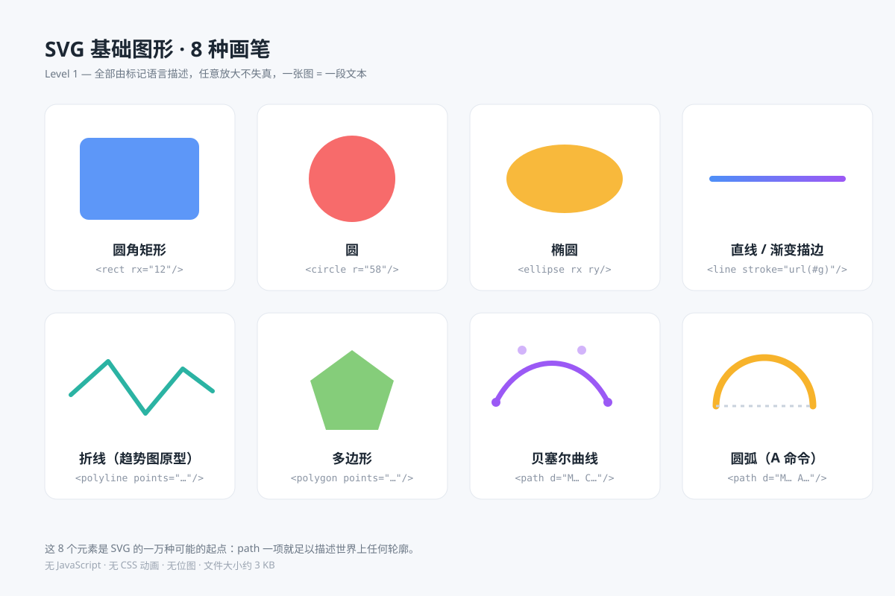

# 七大基础图形



> 难度 L1 · 咒语等级 L1 · 静态 2d

## 提示词

```
用 SVG 画一张基础图形教学图：并排展示 rect、circle、ellipse、line、polyline、polygon、path 七种基本形状，每种形状下方用小字标注英文名。统一风格：深灰描边 2px、半透明蓝色填充、浅米色背景，画布 1200×800，构图整齐留白均匀。
```

## 复现要点

- 咒语里"构图整齐留白均匀"是防止模型把图形挤在一边的关键约束
- line / polyline / polygon 三兄弟模型最容易混，可追加一句"line 是两点直线，polyline 是多点折线不闭合，polygon 是多点闭合多边形"
