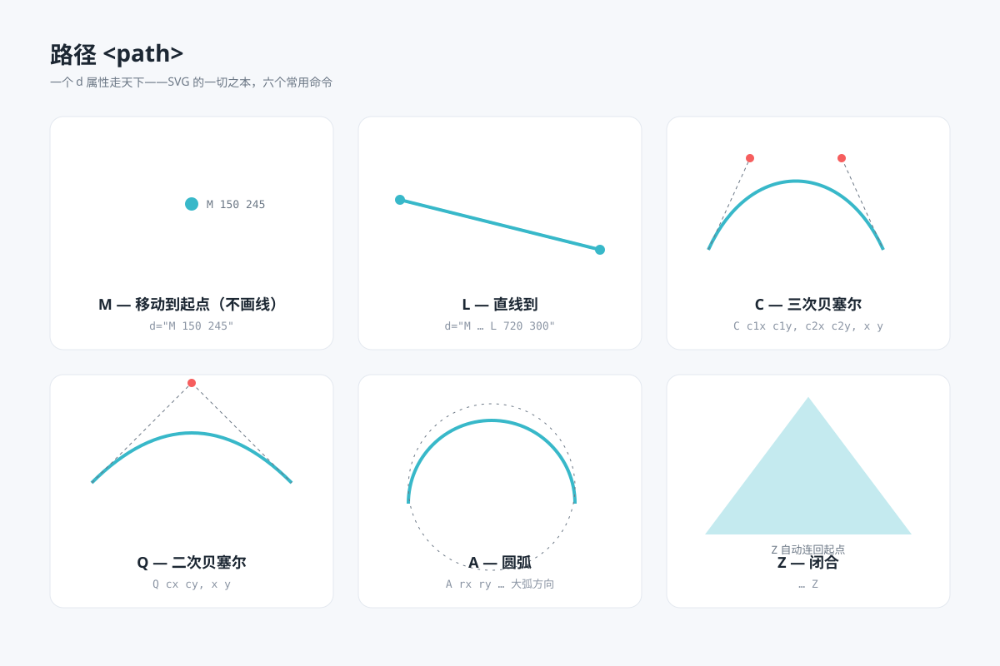

# 路径 path `静态` `2D`



## 提示词

```
用 SVG 画一张"路径命令"教学图，六张卡片各演示一个命令：
- M：移动到起点（只画一个起笔圆点）
- L：直线到（两点连线）
- C：三次贝塞尔（画出两个红色控制点与虚线引导线）
- Q：二次贝塞尔（一个控制点与虚线引导线）
- A：圆弧（一段弧线，底下衬虚线参考圆）
- Z：闭合（三角形封口，标注"自动连回起点"）
- 每张卡片配命令字母与语法片段标注
- 结论行：复杂图形全部是 d 属性的字符串艺术
- 画布 1200×800，浅蓝灰背景 #f6f8fb，白色圆角卡片分格，主题色青 #38b8c9
```
