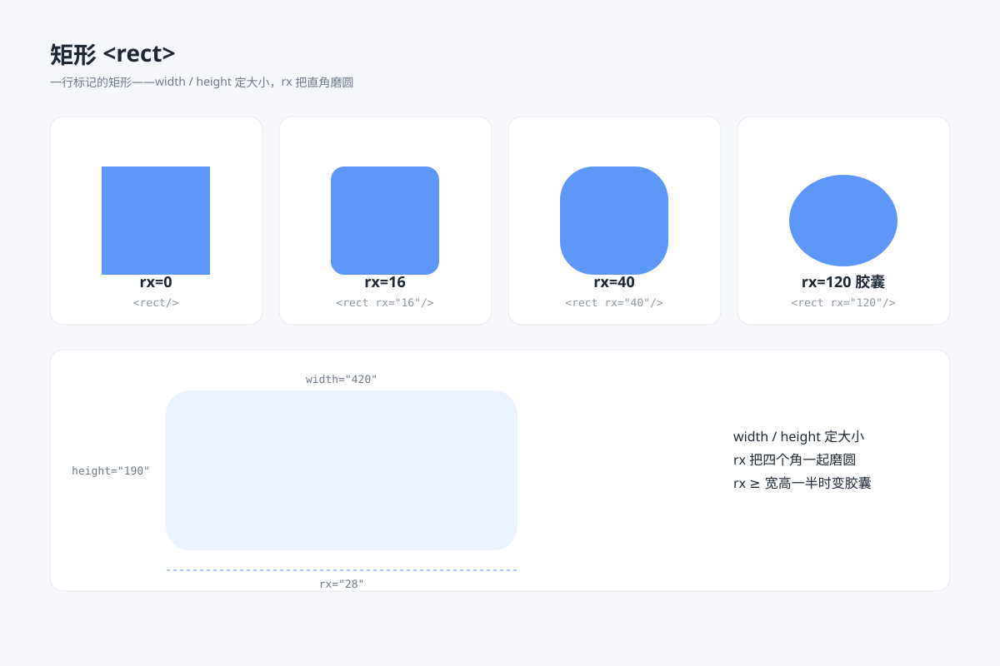

# 矩形 rect `静态` `2D`



## 提示词

```
用 SVG 画一张"矩形"教学图：
- 上排 4 张卡片展示圆角谱系：rx=0 直角、rx=16 圆角、rx=40 大圆角、rx=120 胶囊形，每张卡片放一个蓝色矩形并在下方标注对应代码
- 下方一张宽卡片画一个大矩形，用引出线标注 width、height、rx 三个属性
- 结论行：矩形是一切界面元素的毛坯——按钮、卡片、输入框都从 rect 开始
- 画布 1200×800，浅蓝灰背景 #f6f8fb，白色圆角卡片分格，主题色 #4f8ef7
```
