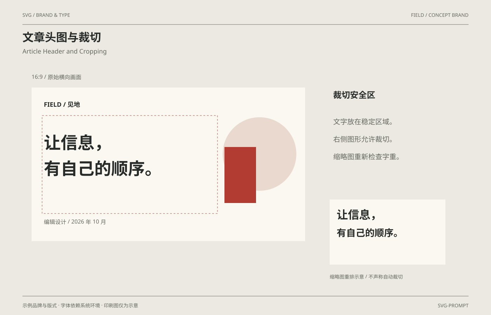

# 文章头图与裁切 / Article Header and Cropping

分类：[品牌与排版](../_about.md)



```
用 SVG 制作“文章头图与裁切 / Article Header and Cropping”，采用FIELD示例品牌。
- 画布1400×900；背景#ece9e2、纸面#faf8f1、正文#272b29、辅助文字#656862、强调色#b23c32；顶部中英文标题，作品区域x64..1336、y200..820，页脚说明示例与印刷边界。
- 原画780×438.75为16:9；标题安全区x120..620/y330..610，副图在右可裁切；右下为缩略重排而非同画面自动裁切。
- NOVA共用标准矢量标识：6×6单位视图，路径 M0 0 L2 0 L6 4 L6 6 L4 6 L0 2 Z M4 0 L6 0 L6 2 Z M0 4 L0 6 L2 6 Z；字标N/O/V/A共用固定矢量轮廓，宽高266:60；不依赖字体重建字标。
- 其他标题采用系统无衬线或Georgia衬线回退；中英文字体由环境决定，不声称嵌入商业字体。
- 文字和样例值：["SVG / BRAND & TYPE", "FIELD / CONCEPT BRAND", "文章头图与裁切", "Article Header and Cropping", "示例品牌与版式 · 字体依赖系统环境 · 印刷图仅为示意", "SVG-PROMPT", "16:9 / 原始横向画面", "FIELD / 见地", "让信息，", "有自己的顺序。", "编辑设计 / 2026 年 10 月", "裁切安全区", "文字放在稳定区域。", "右侧图形允许裁切。", "缩略图重新检查字重。", "缩略图重排示意 / 不声称自动裁切"]。
```
