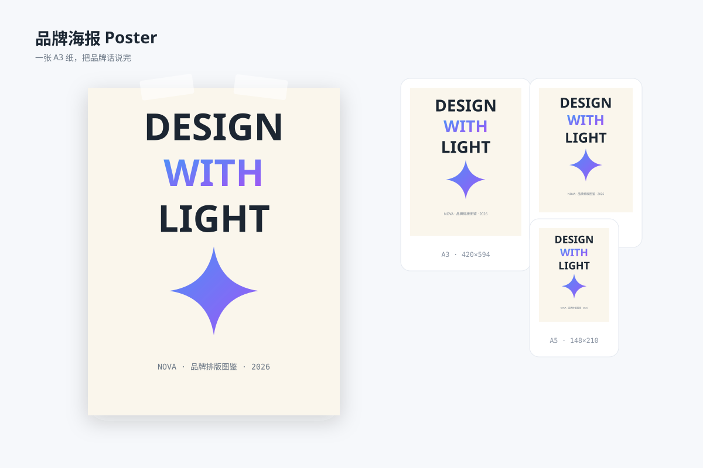

# 品牌海报 `静态` `2D`



```
用 SVG 画一张"品牌海报"展示图：
- 左侧一张 A3 竖版海报（顶部两枚胶带固定）：米白底，上半三行超大字"DESIGN / WITH / LIGHT"（第二行用渐变色），中央一枚大星芒，底部小字"NOVA · 品牌排版图鉴 · 2026"
- 右侧纵向三个缩略：A3 / A4 / A5 三种尺寸的同款海报微缩，标注尺寸
- 海报带轻投影
- 画布 1200×800 浅蓝灰背景
```
