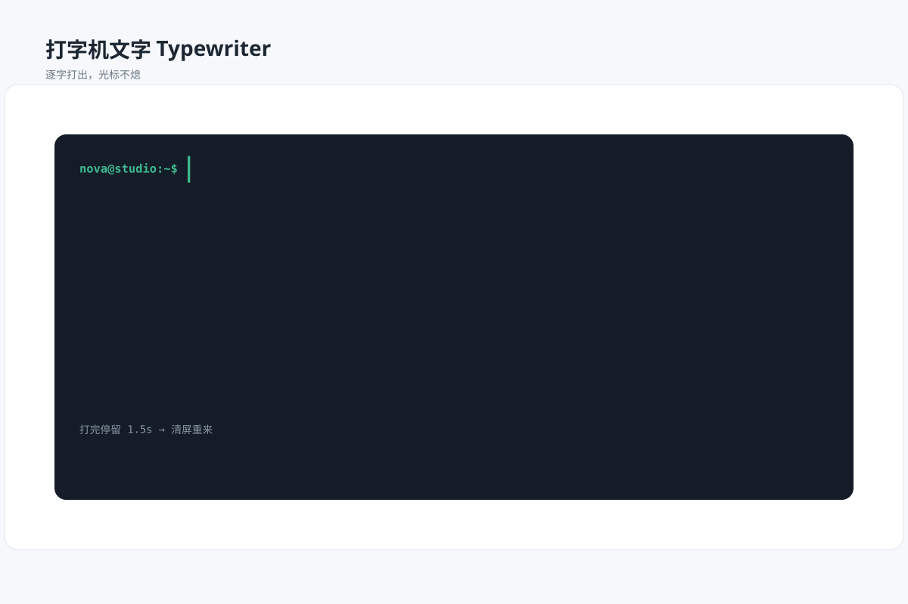

# 打字机文字 `SMIL 动效` `2D`

分类：[品牌与排版](../_about.md)



```
用 SVG 做"打字机文字动画"：
- 深色终端卡片（等宽字体），一句话用裁剪矩形宽度阶梯式逐字打出（calcMode discrete，17字符DESIGN WITH LIGHT；textLength=248、起点x=280、等宽步长248/17，裁剪和光标共用时间，4秒打完）
- 一根光标竖线在最新字符后闪烁（opacity 步进）
- 全部打完停留 1.5 秒后清屏重来，无限循环
- 画布 1200×800 浅蓝灰背景，白色圆角卡片，深色终端内卡
```
