# 告警闪烁 `SMIL 动效` `2D`



```
用 SVG 做"告警动效"（SMIL、零 JS）：
- 一条橙红色告警横幅（图标 + "支付网关延迟 210ms"），横幅 opacity 快速闪两下后保持常亮（fill freeze）
- 左侧图标右侧两道声波弧持续向外扩散循环（r 变大 + opacity 渐隐）
- 标注 SMIL · 闪两下定格 / 声波循环；画布 1200×800 浅蓝灰背景，白色圆角卡片
```
