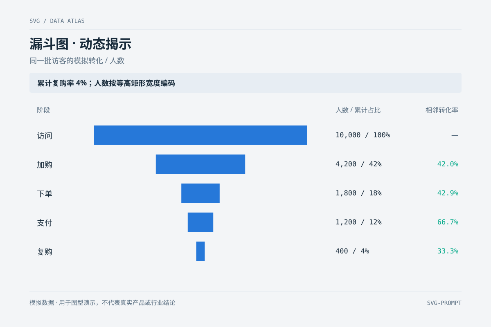

# 漏斗图 · 动态揭示 `CSS 动效` `2D`

分类：[数据图表](../_about.md)



```
用 SVG 制作“漏斗图 · 动态揭示”，主题为同一批访客的模拟转化 / 人数。
- 画布 1200×800，背景 #f3f5f7；标题 32px、正文 17–18px、轴标签不小于 15px；主图区留白，不使用装饰性发光。
- 图中重点结论：“累计复购率 4%；人数按等高矩形宽度编码”。
- 同一批访客依次访问10000、加购4200、下单1800、支付1200、复购400。
- 用居中等高矩形而非装饰梯形，最大宽520px，其余宽=人数/10000×520；因此宽度与面积都正比人数。
- 累计占比100/42/18/12/4%；相邻转化率42.0/42.9/66.7/33.3%，两种分母明确区分。
- 底部注明“模拟数据 · 用于图型演示，不代表真实产品或行业结论”；所有量纲、刻度、图例与数据对应。
- 固定数据几何，只用 CSS clip-path 做 8 秒循环揭示：0–5%隐藏、35–92%显示完整终态、末段重置；不修改数据坐标、数值或任务日期。prefers-reduced-motion: reduce 时显示完整静态图；不支持动画时也显示终态。
```
