# 进度环组 `SMIL 动效` `2D`



```
用 SVG 做"三环进度组"（SMIL、零 JS）：
- 三枚并排进度环（订单 76% 蓝 / 库存 48% 橙 / 客服 92% 绿），弧线同时从 0 扫到各自目标值（1.4s，freeze）
- 每环中心百分比数字在扫完后淡入，环下标注指标名
- 标注 SMIL · 打开即播；画布 1200×800 浅蓝灰背景，白色圆角图表卡
```
