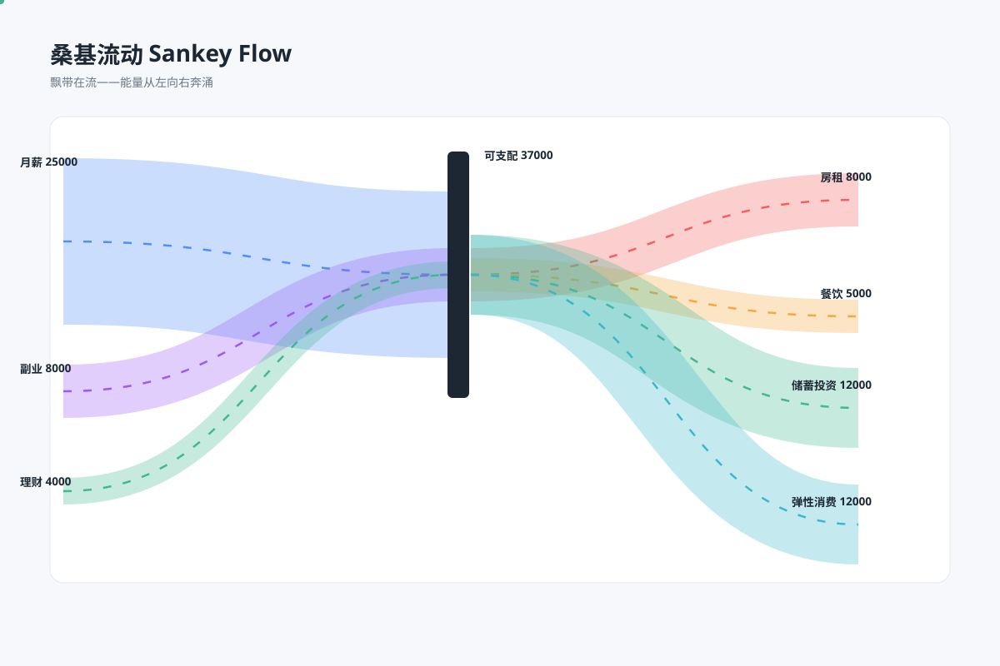

# 桑基图 · 动态揭示 `CSS 动效` `2D`

分类：[数据图表](../_about.md)



```
用 SVG 制作“桑基图 · 动态揭示”，主题为算力预算 / 模拟单位；带宽与金额成正比。
- 画布 1200×800，背景 #0d1724；标题 32px、正文 17–18px、轴标签不小于 15px；主图区留白，不使用装饰性发光。
- 图中重点结论：“总预算 100 = 三个来源之和 = 四个去向之和”。
- 来源核心60、项目25、弹性15；去向推理45、训练25、存储18、网络12；两侧均合计100。
- 每单位2.5px，汇总节点高250px；来源与去向沿汇总节点连续分配对应端口，贝塞尔闭合飘带两端厚度均为v×2.5。
- 仅表达汇总流量，不推断某一来源与某一去向的对应分配；动画只揭示，不增加未经定义的流速或粒子密度编码。
- 底部注明“模拟数据 · 用于图型演示，不代表真实产品或行业结论”；所有量纲、刻度、图例与数据对应。
- 固定数据几何，只用 CSS clip-path 做 8 秒循环揭示：0–5%隐藏、35–92%显示完整终态、末段重置；不修改数据坐标、数值或任务日期。prefers-reduced-motion: reduce 时显示完整静态图；不支持动画时也显示终态。
```
