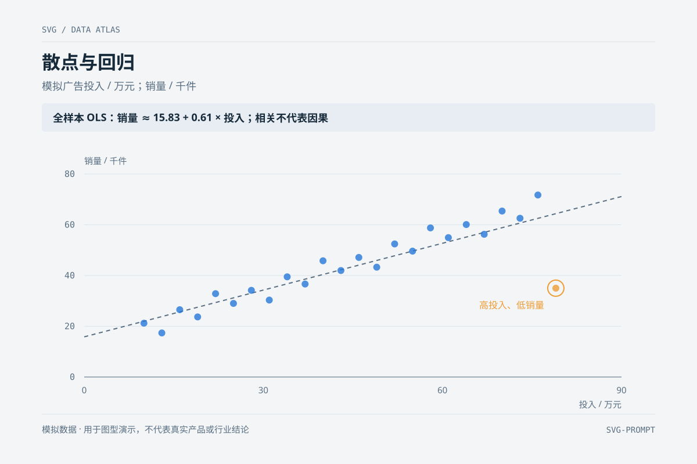

# 散点图 `静态` `2D`

分类：[数据图表](../_about.md)



```
用 SVG 画一张"散点图"：
- X 轴广告投入（万）、Y 轴销量（千件），约 24 个蓝色半透明圆点呈正相关分布
- 一条灰色回归趋势虚线穿过点云
- 右下一个异常点：红色圆点 + 虚线圈注 + 标注"高投入低转化"
- 四角留白、网格线完整
- 画布 1200×800 浅蓝灰背景，白色圆角图表卡
```
