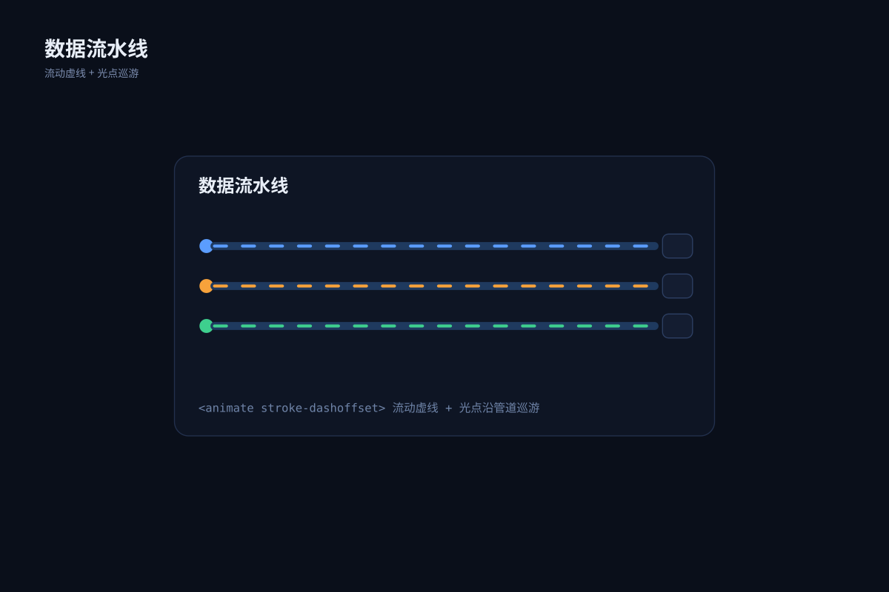

# 有校验与失败出口的数据管线 `CSS 动效` `2D`

分类：[流程与架构](../_about.md)



```
用 SVG 制作“有校验与失败出口的数据管线”：输入 → Schema 校验 → 转换 → 存储 → 消费。
- 画布1400×900，背景#0d1724；标题34px、组件名17–22px、说明15–16px；语义配色：调用蓝、事件橙、数据绿、控制红、关联灰。
- 重点表达：“无效输入进入隔离区；消费失败有限重试，耗尽后进入死信队列”。
- 五个有名称的处理节点，加隔离/退避/死信三个失败节点；每个节点有输入输出职责。
- 校验或转换失败进入隔离区；消费失败退避，retry<3返回消费并加1，retry>=3进入死信队列。
- 正常路径的虚线叠加动画只表达方向，不编码吞吐量；不要掩盖失败或承诺恰好一次。
- 先列节点坐标与端口；端口l/r/t/b分别为矩形左/右/上/下中点，菱形为对应顶点。按下列坐标绘制：
  - ingest: 采集输入；说明["来源 / 事件 ID"]；(x,y,w,h)=(80,400,200,100)；形状box。
  - schema: Schema 校验；说明["字段与类型"]；(x,y,w,h)=(330,400,200,100)；形状box。
  - transform: 转换规范；说明["格式 / 单位"]；(x,y,w,h)=(580,400,200,100)；形状box。
  - store: 幂等存储；说明["事件 ID 去重"]；(x,y,w,h)=(830,400,200,100)；形状box。
  - consumer: 下游消费；说明["确认 / checkpoint"]；(x,y,w,h)=(1080,400,200,100)；形状box。
  - quarantine: 隔离区；说明["原始输入与原因"]；(x,y,w,h)=(330,650,200,80)；形状box。
  - retry: 退避重试；说明["最多 3 次"]；(x,y,w,h)=(820,650,200,80)；形状box。
  - dead: 死信队列；说明["保留最后错误"]；(x,y,w,h)=(1080,650,200,80)；形状box。
- 连线先画、节点后画，线不穿过无关节点。下列方向、条件与折点必须一致：
  - ingest → schema；call；标签“”；条件“”；折点[[280, 450.0], [330, 450.0]]；有箭头。
  - schema → transform；call；标签“”；条件“通过”；折点[[530, 450.0], [580, 450.0]]；有箭头。
  - transform → store；call；标签“”；条件“通过”；折点[[780, 450.0], [830, 450.0]]；有箭头。
  - store → consumer；call；标签“”；条件“”；折点[[1030, 450.0], [1080, 450.0]]；有箭头。
  - schema → quarantine；control；标签“校验失败”；条件“schema invalid”；折点[[430.0, 500], [430.0, 650]]；有箭头。
  - transform → quarantine；control；标签“转换失败”；条件“transform failed”；折点[[680.0, 500], [680, 690], [530, 690.0]]；有箭头。
  - consumer → retry；control；标签“消费失败”；条件“consumer failed”；折点[[1180.0, 500], [1180, 580], [920, 580], [920.0, 650]]；有箭头。
  - retry → consumer；control；标签“重试 < 3”；条件“retry<3”；折点[[1020, 690.0], [1050, 690], [1050, 450], [1080, 450.0]]；有箭头。
  - retry → dead；control；标签“≥ 3”；条件“retry>=3”；折点[[1020, 690.0], [1080, 690.0]]；有箭头。
- 完整文字和节点从首帧起可见；CSS只改变路径叠加层的stroke-dashoffset或事件圈stroke-width，不改变节点、端点、条件或顺序。动效是演示、不编码吞吐量或真实在线状态。prefers-reduced-motion: reduce时去掉动态叠加层，保留完整静态结构。
- 页脚注明：“概念结构示意 · 不代表完整生产部署或真实运行状态”。
```
