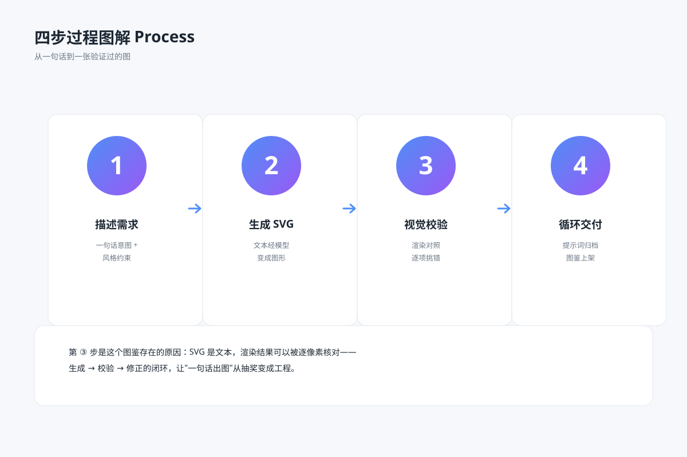

# 输入与输出流程 `静态` `2D`

分类：[流程与架构](../_about.md)



```
用 SVG 制作“输入与输出流程”：需求 → 生成 → 验证 → 归档。
- 画布1400×900，背景#f3f5f7；标题34px、组件名17–22px、说明15–16px；语义配色：调用蓝、事件橙、数据绿、控制红、关联灰。
- 重点表达：“每一步有明确输入与输出；验证不通过时返回生成”。
- 按四个阶段展示输入与输出，不把“生成”当成已经验证成功。
- 验证→归档条件为通过，验证→生成条件为未通过；重试策略由具体实施流程决定。
- 先列节点坐标与端口；端口l/r/t/b分别为矩形左/右/上/下中点，菱形为对应顶点。按下列坐标绘制：
  - request: 01 需求定义；说明["输入：目标与约束", "输出：验收清单"]；(x,y,w,h)=(100,365,230,170)；形状box。
  - generate: 02 生成作品；说明["输入：清单与提示词", "输出：SVG 初稿"]；(x,y,w,h)=(400,365,230,170)；形状box。
  - validate: 03 验证结果；说明["输入：初稿与清单", "输出：差异或通过"]；(x,y,w,h)=(700,365,230,170)；形状box。
  - archive: 04 归档交付；说明["输入：已通过作品", "输出：三件套与版本"]；(x,y,w,h)=(1000,365,230,170)；形状box。
- 连线先画、节点后画，线不穿过无关节点。下列方向、条件与折点必须一致：
  - request → generate；call；标签“”；条件“”；折点[[330, 450.0], [400, 450.0]]；有箭头。
  - generate → validate；call；标签“”；条件“”；折点[[630, 450.0], [700, 450.0]]；有箭头。
  - validate → archive；call；标签“通过”；条件“验收通过”；折点[[930, 450.0], [1000, 450.0]]；有箭头。
  - validate → generate；control；标签“未通过：携带差异清单返回”；条件“验收不通过”；折点[[815.0, 535], [815, 675], [515, 675], [515.0, 535]]；有箭头。
- 页脚注明：“概念结构示意 · 不代表完整生产部署或真实运行状态”。
```
