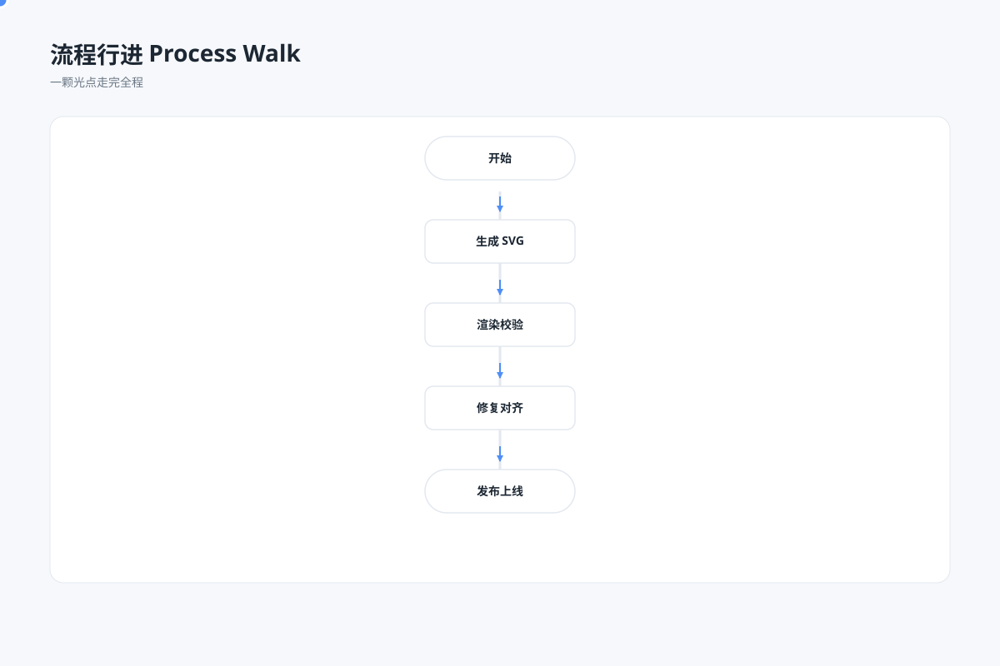

# 流程行进 `SMIL 动效` `2D`

分类：[流程与架构](../_about.md)



```
用 SVG 做"流程行进动画"：
- 线性流程示意（开始→生成→校验→修复→发布），展示一个成功路径，不表示含决策分支
- 一颗光点沿主流程路径走完全程（animateMotion 循环）
- 走过的节点依次点亮（opacity 按 keyTimes 与光点同步）
- 动画无限循环
- 画布 1200×800 浅蓝灰背景，白色圆角图表卡
```
