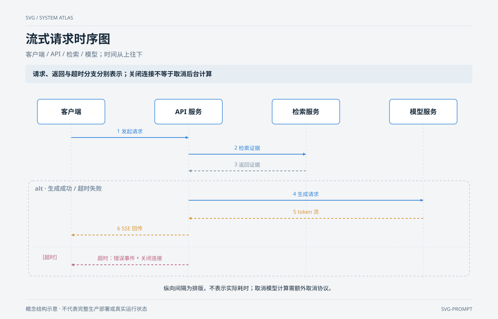

# 流式请求时序图 `静态` `2D`

分类：[流程与架构](../_about.md)



```
用 SVG 制作“流式请求时序图”：客户端 / API / 检索 / 模型；时间从上往下。
- 画布1400×900，背景#f3f5f7；标题34px、组件名17–22px、说明15–16px；语义配色：调用蓝、事件橙、数据绿、控制红、关联灰。
- 重点表达：“请求、返回与超时分支分别表示；关闭连接不等于取消后台计算”。
- 四个参与者的生命线垂直；消息方向遵循请求/返回的实际发送者，按编号由上向下。
- 生成阶段使用alt分支：成功时token流转发为SSE；超时发送错误事件并关闭客户端连接，两分支不在同一次请求中同时执行。
- 时间间隔不编码耗时，服务端计算取消与连接关闭分别处理。
- 先列节点坐标与端口；端口l/r/t/b分别为矩形左/右/上/下中点，菱形为对应顶点。按下列坐标绘制：
  - client: 客户端；说明[]；(x,y,w,h)=(105,280,190,70)；形状box。
  - api: API 服务；说明[]；(x,y,w,h)=(435,280,190,70)；形状box。
  - retrieval: 检索服务；说明[]；(x,y,w,h)=(765,280,190,70)；形状box。
  - model: 模型服务；说明[]；(x,y,w,h)=(1095,280,190,70)；形状box。
- 连线先画、节点后画，线不穿过无关节点。下列方向、条件与折点必须一致：
  - client → api；call；标签“1 发起请求”；条件“”；折点[[200.0, 388], [530.0, 388]]；有箭头。
  - api → retrieval；call；标签“2 检索证据”；条件“”；折点[[530.0, 435], [860.0, 435]]；有箭头。
  - retrieval → api；neutral；标签“3 返回证据”；条件“”；折点[[860.0, 482], [530.0, 482]]；有箭头。
  - api → model；call；标签“4 生成请求”；条件“成功”；折点[[530.0, 565], [1190.0, 565]]；有箭头。
  - model → api；event；标签“5 token 流”；条件“成功”；折点[[1190.0, 616], [530.0, 616]]；有箭头。
  - api → client；event；标签“6 SSE 回传”；条件“成功”；折点[[530.0, 663], [200.0, 663]]；有箭头。
  - api → client；control；标签“超时：错误事件 + 关闭连接”；条件“超时”；折点[[530.0, 747], [200.0, 747]]；有箭头。
- 页脚注明：“概念结构示意 · 不代表完整生产部署或真实运行状态”。
```
