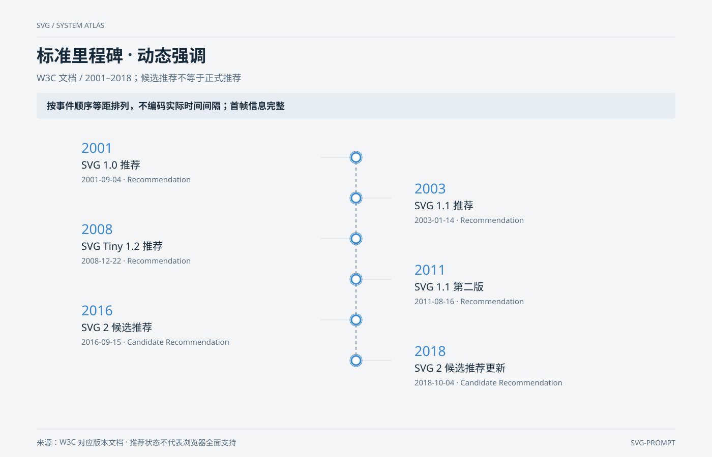

# 标准里程碑 · 动态强调 `CSS 动效` `2D`

分类：[流程与架构](../_about.md)



```
用 SVG 制作“标准里程碑 · 动态强调”：W3C 文档 / 2001–2018；候选推荐不等于正式推荐。
- 画布1400×900，背景#f3f5f7；标题34px、组件名17–22px、说明15–16px；语义配色：调用蓝、事件橙、数据绿、控制红、关联灰。
- 重点表达：“按事件顺序等距排列，不编码实际时间间隔；首帧信息完整”。
- 六事件以对应W3C版本文档为来源：
- 2001-09-04 SVG 1.0 推荐；https://www.w3.org/TR/2001/REC-SVG-20010904/
- 2003-01-14 SVG 1.1 推荐；https://www.w3.org/TR/2003/REC-SVG11-20030114/
- 2008-12-22 SVG Tiny 1.2 推荐；https://www.w3.org/TR/2008/REC-SVGTiny12-20081222/
- 2011-08-16 SVG 1.1 第二版；https://www.w3.org/TR/2011/REC-SVG11-20110816/
- 2016-09-15 SVG 2 候选推荐；https://www.w3.org/TR/2016/CR-SVG2-20160915/
- 2018-10-04 SVG 2 候选推荐更新；https://www.w3.org/TR/2018/CR-SVG2-20181004/
- 只展示2001–2018的选定里程碑，不能写成1996–2026完整历史；Candidate Recommendation不等于Recommendation。
- 节点顺序等距排版；首帧所有日期和事件可见，动态版仅逐个强调外圈。
- 先列节点坐标与端口；端口l/r/t/b分别为矩形左/右/上/下中点，菱形为对应顶点。按下列坐标绘制：
  - event-0: ；说明[]；(x,y,w,h)=(691,301,18,18)；形状event。
  - event-1: ；说明[]；(x,y,w,h)=(691,381,18,18)；形状event。
  - event-2: ；说明[]；(x,y,w,h)=(691,461,18,18)；形状event。
  - event-3: ；说明[]；(x,y,w,h)=(691,541,18,18)；形状event。
  - event-4: ；说明[]；(x,y,w,h)=(691,621,18,18)；形状event。
  - event-5: ；说明[]；(x,y,w,h)=(691,701,18,18)；形状event。
- 连线先画、节点后画，线不穿过无关节点。下列方向、条件与折点必须一致：
  - event-0 → event-1；neutral；标签“”；条件“”；折点[[700.0, 319], [700.0, 381]]；无箭头，仅表示关联或层级。
  - event-1 → event-2；neutral；标签“”；条件“”；折点[[700.0, 399], [700.0, 461]]；无箭头，仅表示关联或层级。
  - event-2 → event-3；neutral；标签“”；条件“”；折点[[700.0, 479], [700.0, 541]]；无箭头，仅表示关联或层级。
  - event-3 → event-4；neutral；标签“”；条件“”；折点[[700.0, 559], [700.0, 621]]；无箭头，仅表示关联或层级。
  - event-4 → event-5；neutral；标签“”；条件“”；折点[[700.0, 639], [700.0, 701]]；无箭头，仅表示关联或层级。
- 完整文字和节点从首帧起可见；CSS只改变路径叠加层的stroke-dashoffset或事件圈stroke-width，不改变节点、端点、条件或顺序。动效是演示、不编码吞吐量或真实在线状态。prefers-reduced-motion: reduce时去掉动态叠加层，保留完整静态结构。
- 页脚注明：“来源：W3C 对应版本文档 · 推荐状态不代表浏览器全面支持”。
```
