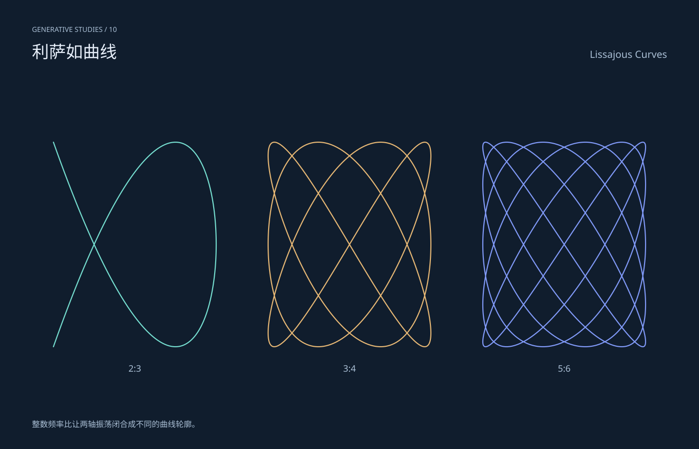

# 利萨如曲线 / Lissajous Curves

分类：[几何与生成艺术](../_about.md)



```
用 SVG 制作“利萨如曲线 / Lissajous Curves”。
- 1400×900画布，深色#101d2d，文字#e7effa、辅助#aabfd5，几何色板#75ddcf/#e7b875/#819af8/#d18eba/#4e8195；标题中英文，主体区域x64..1336、y190..810。
- 整数频率比让两轴振荡闭合成不同的曲线轮廓。
- x=cx+163sin(at+π/2)，y=490+205sin(bt)，t=0..2π共1601点；比值2:3/3:4/5:6。
- 公式与构造细节只写在提示词，不把主画面做成代码教学卡。仅为几何艺术，不是测量数据或物理仿真。
- 生成器 scripts/build-geometry.py 包含完整坐标构造；下列SVG是可复现的几何、色彩和参数参考。
<svg xmlns="http://www.w3.org/2000/svg" width="1400" height="900" viewBox="0 0 1400 900" role="img" aria-labelledby="title desc" font-family="PingFang SC, Microsoft YaHei, sans-serif"><title id="title">利萨如曲线 / Lissajous Curves</title><desc id="desc">整数频率比让两轴振荡闭合成不同的曲线轮廓。；x=cx+163sin(at+π/2)，y=490+205sin(bt)，t=0..2π共1601点；比值2:3/3:4/5:6。</desc><rect x="0" y="0" width="1400" height="900" fill="#101d2d" /><text x="64" y="64" font-size="14" fill="#aabfd5" text-anchor="start">GENERATIVE STUDIES / 10</text><text x="64" y="116" font-size="34" fill="#e7effa" text-anchor="start">利萨如曲线</text><text x="1336" y="116" font-size="20" fill="#aabfd5" text-anchor="end">Lissajous Curves</text><defs><clipPath id="stage"><rect x="64" y="190" width="1272" height="620"/></clipPath><linearGradient id="ink" x1="0" y1="0" x2="1" y2="1"><stop stop-color="#75ddcf"/><stop offset="1" stop-color="#819af8"/></linearGradient></defs><g clip-path="url(#stage)"><path d="M433.000 490.000 L432.995 492.415 L432.980 494.830 L432.955 497.244 L432.920 499.657 L432.874 502.069 L432.819 504.479 L432.754 506.887 L432.678 509.292 L432.593 511.695 L432.498 514.095 L432.392 516.492 L432.277 518.885 L432.151 521.274 L432.016 523.658 L431.870 526.038 L431.715 528.413 L431.549 530.783 L431.374 533.147 L431.188 535.505 L430.993 537.856 L430.788 540.201 L430.573 542.539 L430.348 544.870 L430.113 547.193 L429.868 549.508 L429.613 551.815 L429.349 554.114 L429.074 556.403 L428.790 558.683 L428.496 560.954 L428.193 563.215 L427.879 565.466 L427.556 567.706 L427.223 569.935 L426.880 572.154 L426.528 574.360 L426.166 576.556 L425.794 578.739 L425.413 580.910 L425.022 583.068 L424.622 585.213 L424.212 587.346 L423.792 589.464 L423.364 591.569 L422.925 593.660 L422.477 595.736 L422.020 597.798 L421.554 599.844 L421.078 601.876 L420.592 603.892 L420.098 605.892 L419.594 607.876 L419.081 609.844 L418.559 611.795 L418.027 613.729 L417.487 615.646 L416.937 617.545 L416.378 619.427 L415.811 621.291 L415.234 623.137 L414.648 624.964 L414.054 626.772 L413.450 628.562 L412.838 630.332 L412.217 632.083 L411.587 633.814 L410.948 635.525 L410.301 637.216 L409.645 638.886 L408.980 640.536 L408.307 642.165 L407.625 643.773 L406.935 645.359 L406.237 646.924 L405.530 648.467 L404.814 649.988 L404.090 651.487 L403.358 652.964 L402.618 654.417 L401.870 655.848 L401.113 657.257 L400.349 658.641 L399.576 660.003 L398.795 661.341 L398.007 662.655 L397.210 663.945 L396.406 665.211 L395.594 666.452 L394.774 667.669 L393.946 668.862 L393.111 670.029 L392.268 671.172 L391.418 672.289 L390.560 673.382 L389.695 674.448 L388.822 675.490 L387.942 676.505 L387.055 677.494 L386.160 678.458 L385.258 679.395 L384.350 680.306 L383.434 681.191 L382.511 682.049 L381.581 682.881 L380.645 683.685 L379.701 684.463 L378.751 685.214 L377.794 685.938 L376.830 686.634 L375.860 687.303 L374.883 687.945 L373.900 688.560 L372.911 689.146 L371.915 689.706 L370.912 690.237 L369.904 690.741 L368.889 691.216 L367.868 691.664 L366.842 692.084 L365.809 692.476 L364.770 692.840 L363.726 693.175 L362.676 693.483 L361.620 693.762 L360.558 694.013 L359.491 694.235 L358.418 694.430 L357.340 694.595 L356.256 694.733 L355.167 694.842 L354.073 694.923 L352.974 694.975 L351.869 694.998 L350.760 694.994 L349.645 694.960 L348.526 694.899 L347.402 694.809 L346.273 694.690 L345.139 694.543 L344.000 694.368 L342.858 694.164 L341.710 693.932 L340.558 693.672 L339.402 693.384 L338.242 693.067 L337.077 692.722 L335.908 692.349 L334.735 691.947 L333.558 691.518 L332.377 691.061 L331.193 690.576 L330.004 690.063 L328.812 689.522 L327.616 688.954 L326.417 688.358 L325.214 687.734 L324.008 687.083 L322.799 686.405 L321.586 685.699 L320.370 684.967 L319.151 684.207 L317.929 683.420 L316.704 682.606 L315.476 681.766 L314.245 680.899 L313.011 680.006 L311.775 679.086 L310.536 678.140 L309.295 677.168 L308.052 676.169 L306.806 675.145 L305.557 674.096 L304.307 673.020 L303.054 671.920 L301.800 670.794 L300.543 669.643 L299.285 668.467 L298.024 667.266 L296.762 666.041 L295.499 664.791 L294.234 663.517 L292.967 662.219 L291.699 660.897 L290.429 659.552 L289.159 658.182 L287.887 656.790 L286.614 655.374 L285.340 653.935 L284.065 652.474 L282.789 650.990 L281.512 649.484 L280.235 647.955 L278.957 646.405 L277.678 644.833 L276.399 643.239 L275.120 641.624 L273.840 639.988 L272.560 638.332 L271.280 636.655 L270.000 634.957 L268.720 633.239 L267.440 631.502 L266.160 629.744 L264.880 627.968 L263.601 626.172 L262.322 624.357 L261.043 622.524 L259.765 620.672 L258.488 618.802 L257.211 616.914 L255.935 615.009 L254.660 613.086 L253.386 611.146 L252.113 609.190 L250.841 607.217 L249.571 605.227 L248.301 603.222 L247.033 601.201 L245.766 599.164 L244.501 597.112 L243.238 595.046 L241.976 592.964 L240.715 590.869 L239.457 588.760 L238.200 586.636 L236.946 584.500 L235.693 582.350 L234.443 580.188 L233.194 578.012 L231.948 575.825 L230.705 573.626 L229.464 571.415 L228.225 569.193 L226.989 566.960 L225.755 564.716 L224.524 562.462 L223.296 560.198 L222.071 557.924 L220.849 555.641 L219.630 553.348 L218.414 551.047 L217.201 548.738 L215.992 546.420 L214.786 544.094 L213.583 541.761 L212.384 539.420 L211.188 537.073 L209.996 534.719 L208.807 532.359 L207.623 529.994 L206.442 527.622 L205.265 525.245 L204.092 522.864 L202.923 520.478 L201.758 518.088 L200.598 515.693 L199.442 513.296 L198.290 510.895 L197.142 508.491 L196.000 506.084 L194.861 503.675 L193.727 501.265 L192.598 498.853 L191.474 496.439 L190.355 494.025 L189.240 491.610 L188.131 489.195 L187.026 486.780 L185.927 484.365 L184.833 481.952 L183.744 479.539 L182.660 477.128 L181.582 474.719 L180.509 472.311 L179.442 469.906 L178.380 467.504 L177.324 465.106 L176.274 462.710 L175.230 460.318 L174.191 457.931 L173.158 455.548 L172.132 453.170 L171.111 450.796 L170.096 448.429 L169.088 446.067 L168.085 443.711 L167.089 441.361 L166.100 439.019 L165.117 436.683 L164.140 434.355 L163.170 432.034 L162.206 429.722 L161.249 427.418 L160.299 425.122 L159.355 422.836 L158.419 420.559 L157.489 418.291 L156.566 416.034 L155.650 413.787 L154.742 411.550 L153.840 409.324 L152.945 407.110 L152.058 404.906 L151.178 402.715 L150.305 400.536 L149.440 398.369 L148.582 396.215 L147.732 394.074 L146.889 391.947 L146.054 389.833 L145.226 387.732 L144.406 385.647 L143.594 383.575 L142.790 381.518 L141.993 379.477 L141.205 377.450 L140.424 375.440 L139.651 373.445 L138.887 371.466 L138.130 369.504 L137.382 367.559 L136.642 365.630 L135.910 363.719 L135.186 361.825 L134.470 359.949 L133.763 358.092 L133.065 356.252 L132.375 354.431 L131.693 352.629 L131.020 350.846 L130.355 349.082 L129.699 347.338 L129.052 345.613 L128.413 343.909 L127.783 342.225 L127.162 340.561 L126.550 338.919 L125.946 337.297 L125.352 335.696 L124.766 334.117 L124.189 332.559 L123.622 331.023 L123.063 329.510 L122.513 328.018 L121.973 326.549 L121.441 325.103 L120.919 323.680 L120.406 322.279 L119.902 320.902 L119.408 319.549 L118.922 318.219 L118.446 316.913 L117.980 315.631 L117.523 314.373 L117.075 313.139 L116.636 311.931 L116.208 310.746 L115.788 309.587 L115.378 308.453 L114.978 307.344 L114.587 306.260 L114.206 305.202 L113.834 304.169 L113.472 303.162 L113.120 302.181 L112.777 301.227 L112.444 300.298 L112.121 299.396 L111.807 298.520 L111.504 297.671 L111.210 296.848 L110.926 296.053 L110.651 295.284 L110.387 294.542 L110.132 293.827 L109.887 293.140 L109.652 292.480 L109.427 291.847 L109.212 291.242 L109.007 290.664 L108.812 290.114 L108.626 289.592 L108.451 289.098 L108.285 288.631 L108.130 288.193 L107.984 287.782 L107.849 287.400 L107.723 287.045 L107.608 286.719 L107.502 286.421 L107.407 286.151 L107.322 285.910 L107.246 285.697 L107.181 285.512 L107.126 285.356 L107.080 285.228 L107.045 285.128 L107.020 285.057 L107.005 285.014 L107.000 285.000 L107.005 285.014 L107.020 285.057 L107.045 285.128 L107.080 285.228 L107.126 285.356 L107.181 285.512 L107.246 285.697 L107.322 285.910 L107.407 286.151 L107.502 286.421 L107.608 286.719 L107.723 287.045 L107.849 287.400 L107.984 287.782 L108.130 288.193 L108.285 288.631 L108.451 289.098 L108.626 289.592 L108.812 290.114 L109.007 290.664 L109.212 291.242 L109.427 291.847 L109.652 292.480 L109.887 293.140 L110.132 293.827 L110.387 294.542 L110.651 295.284 L110.926 296.053 L111.210 296.848 L111.504 297.671 L111.807 298.520 L112.121 299.396 L112.444 300.298 L112.777 301.227 L113.120 302.181 L113.472 303.162 L113.834 304.169 L114.206 305.202 L114.587 306.260 L114.978 307.344 L115.378 308.453 L115.788 309.587 L116.208 310.746 L116.636 311.931 L117.075 313.139 L117.523 314.373 L117.980 315.631 L118.446 316.913 L118.922 318.219 L119.408 319.549 L119.902 320.902 L120.406 322.279 L120.919 323.680 L121.441 325.103 L121.973 326.549 L122.513 328.018 L123.063 329.510 L123.622 331.023 L124.189 332.559 L124.766 334.117 L125.352 335.696 L125.946 337.297 L126.550 338.919 L127.162 340.561 L127.783 342.225 L128.413 343.909 L129.052 345.613 L129.699 347.338 L130.355 349.082 L131.020 350.846 L131.693 352.629 L132.375 354.431 L133.065 356.252 L133.763 358.092 L134.470 359.949 L135.186 361.825 L135.910 363.719 L136.642 365.630 L137.382 367.559 L138.130 369.504 L138.887 371.466 L139.651 373.445 L140.424 375.440 L141.205 377.450 L141.993 379.477 L142.790 381.518 L143.594 383.575 L144.406 385.647 L145.226 387.732 L146.054 389.833 L146.889 391.947 L147.732 394.074 L148.582 396.215 L149.440 398.369 L150.305 400.536 L151.178 402.715 L152.058 404.906 L152.945 407.110 L153.840 409.324 L154.742 411.550 L155.650 413.787 L156.566 416.034 L157.489 418.291 L158.419 420.559 L159.355 422.836 L160.299 425.122 L161.249 427.418 L162.206 429.722 L163.170 432.034 L164.140 434.355 L165.117 436.683 L166.100 439.019 L167.089 441.361 L168.085 443.711 L169.088 446.067 L170.096 448.429 L171.111 450.796 L172.132 453.170 L173.158 455.548 L174.191 457.931 L175.230 460.318 L176.274 462.710 L177.324 465.106 L178.380 467.504 L179.442 469.906 L180.509 472.311 L181.582 474.719 L182.660 477.128 L183.744 479.539 L184.833 481.952 L185.927 484.365 L187.026 486.780 L188.131 489.195 L189.240 491.610 L190.355 494.025 L191.474 496.439 L192.598 498.853 L193.727 501.265 L194.861 503.675 L196.000 506.084 L197.142 508.491 L198.290 510.895 L199.442 513.296 L200.598 515.693 L201.758 518.088 L202.923 520.478 L204.092 522.864 L205.265 525.245 L206.442 527.622 L207.623 529.994 L208.807 532.359 L209.996 534.719 L211.188 537.073 L212.384 539.420 L213.583 541.761 L214.786 544.094 L215.992 546.420 L217.201 548.738 L218.414 551.047 L219.630 553.348 L220.849 555.641 L222.071 557.924 L223.296 560.198 L224.524 562.462 L225.755 564.716 L226.989 566.960 L228.225 569.193 L229.464 571.415 L230.705 573.626 L231.948 575.825 L233.194 578.012 L234.443 580.188 L235.693 582.350 L236.946 584.500 L238.200 586.636 L239.457 588.760 L240.715 590.869 L241.976 592.964 L243.238 595.046 L244.501 597.112 L245.766 599.164 L247.033 601.201 L248.301 603.222 L249.571 605.227 L250.841 607.217 L252.113 609.190 L253.386 611.146 L254.660 613.086 L255.935 615.009 L257.211 616.914 L258.488 618.802 L259.765 620.672 L261.043 622.524 L262.322 624.357 L263.601 626.172 L264.880 627.968 L266.160 629.744 L267.440 631.502 L268.720 633.239 L270.000 634.957 L271.280 636.655 L272.560 638.332 L273.840 639.988 L275.120 641.624 L276.399 643.239 L277.678 644.833 L278.957 646.405 L280.235 647.955 L281.512 649.484 L282.789 650.990 L284.065 652.474 L285.340 653.935 L286.614 655.374 L287.887 656.790 L289.159 658.182 L290.429 659.552 L291.699 660.897 L292.967 662.219 L294.234 663.517 L295.499 664.791 L296.762 666.041 L298.024 667.266 L299.285 668.467 L300.543 669.643 L301.800 670.794 L303.054 671.920 L304.307 673.020 L305.557 674.096 L306.806 675.145 L308.052 676.169 L309.295 677.168 L310.536 678.140 L311.775 679.086 L313.011 680.006 L314.245 680.899 L315.476 681.766 L316.704 682.606 L317.929 683.420 L319.151 684.207 L320.370 684.967 L321.586 685.699 L322.799 686.405 L324.008 687.083 L325.214 687.734 L326.417 688.358 L327.616 688.954 L328.812 689.522 L330.004 690.063 L331.193 690.576 L332.377 691.061 L333.558 691.518 L334.735 691.947 L335.908 692.349 L337.077 692.722 L338.242 693.067 L339.402 693.384 L340.558 693.672 L341.710 693.932 L342.858 694.164 L344.000 694.368 L345.139 694.543 L346.273 694.690 L347.402 694.809 L348.526 694.899 L349.645 694.960 L350.760 694.994 L351.869 694.998 L352.974 694.975 L354.073 694.923 L355.167 694.842 L356.256 694.733 L357.340 694.595 L358.418 694.430 L359.491 694.235 L360.558 694.013 L361.620 693.762 L362.676 693.483 L363.726 693.175 L364.770 692.840 L365.809 692.476 L366.842 692.084 L367.868 691.664 L368.889 691.216 L369.904 690.741 L370.912 690.237 L371.915 689.706 L372.911 689.146 L373.900 688.560 L374.883 687.945 L375.860 687.303 L376.830 686.634 L377.794 685.938 L378.751 685.214 L379.701 684.463 L380.645 683.685 L381.581 682.881 L382.511 682.049 L383.434 681.191 L384.350 680.306 L385.258 679.395 L386.160 678.458 L387.055 677.494 L387.942 676.505 L388.822 675.490 L389.695 674.448 L390.560 673.382 L391.418 672.289 L392.268 671.172 L393.111 670.029 L393.946 668.862 L394.774 667.669 L395.594 666.452 L396.406 665.211 L397.210 663.945 L398.007 662.655 L398.795 661.341 L399.576 660.003 L400.349 658.641 L401.113 657.257 L401.870 655.848 L402.618 654.417 L403.358 652.964 L404.090 651.487 L404.814 649.988 L405.530 648.467 L406.237 646.924 L406.935 645.359 L407.625 643.773 L408.307 642.165 L408.980 640.536 L409.645 638.886 L410.301 637.216 L410.948 635.525 L411.587 633.814 L412.217 632.083 L412.838 630.332 L413.450 628.562 L414.054 626.772 L414.648 624.964 L415.234 623.137 L415.811 621.291 L416.378 619.427 L416.937 617.545 L417.487 615.646 L418.027 613.729 L418.559 611.795 L419.081 609.844 L419.594 607.876 L420.098 605.892 L420.592 603.892 L421.078 601.876 L421.554 599.844 L422.020 597.798 L422.477 595.736 L422.925 593.660 L423.364 591.569 L423.792 589.464 L424.212 587.346 L424.622 585.213 L425.022 583.068 L425.413 580.910 L425.794 578.739 L426.166 576.556 L426.528 574.360 L426.880 572.154 L427.223 569.935 L427.556 567.706 L427.879 565.466 L428.193 563.215 L428.496 560.954 L428.790 558.683 L429.074 556.403 L429.349 554.114 L429.613 551.815 L429.868 549.508 L430.113 547.193 L430.348 544.870 L430.573 542.539 L430.788 540.201 L430.993 537.856 L431.188 535.505 L431.374 533.147 L431.549 530.783 L431.715 528.413 L431.870 526.038 L432.016 523.658 L432.151 521.274 L432.277 518.885 L432.392 516.492 L432.498 514.095 L432.593 511.695 L432.678 509.292 L432.754 506.887 L432.819 504.479 L432.874 502.069 L432.920 499.657 L432.955 497.244 L432.980 494.830 L432.995 492.415 L433.000 490.000 L432.995 487.585 L432.980 485.170 L432.955 482.756 L432.920 480.343 L432.874 477.931 L432.819 475.521 L432.754 473.113 L432.678 470.708 L432.593 468.305 L432.498 465.905 L432.392 463.508 L432.277 461.115 L432.151 458.726 L432.016 456.342 L431.870 453.962 L431.715 451.587 L431.549 449.217 L431.374 446.853 L431.188 444.495 L430.993 442.144 L430.788 439.799 L430.573 437.461 L430.348 435.130 L430.113 432.807 L429.868 430.492 L429.613 428.185 L429.349 425.886 L429.074 423.597 L428.790 421.317 L428.496 419.046 L428.193 416.785 L427.879 414.534 L427.556 412.294 L427.223 410.065 L426.880 407.846 L426.528 405.640 L426.166 403.444 L425.794 401.261 L425.413 399.090 L425.022 396.932 L424.622 394.787 L424.212 392.654 L423.792 390.536 L423.364 388.431 L422.925 386.340 L422.477 384.264 L422.020 382.202 L421.554 380.156 L421.078 378.124 L420.592 376.108 L420.098 374.108 L419.594 372.124 L419.081 370.156 L418.559 368.205 L418.027 366.271 L417.487 364.354 L416.937 362.455 L416.378 360.573 L415.811 358.709 L415.234 356.863 L414.648 355.036 L414.054 353.228 L413.450 351.438 L412.838 349.668 L412.217 347.917 L411.587 346.186 L410.948 344.475 L410.301 342.784 L409.645 341.114 L408.980 339.464 L408.307 337.835 L407.625 336.227 L406.935 334.641 L406.237 333.076 L405.530 331.533 L404.814 330.012 L404.090 328.513 L403.358 327.036 L402.618 325.583 L401.870 324.152 L401.113 322.743 L400.349 321.359 L399.576 319.997 L398.795 318.659 L398.007 317.345 L397.210 316.055 L396.406 314.789 L395.594 313.548 L394.774 312.331 L393.946 311.138 L393.111 309.971 L392.268 308.828 L391.418 307.711 L390.560 306.618 L389.695 305.552 L388.822 304.510 L387.942 303.495 L387.055 302.506 L386.160 301.542 L385.258 300.605 L384.350 299.694 L383.434 298.809 L382.511 297.951 L381.581 297.119 L380.645 296.315 L379.701 295.537 L378.751 294.786 L377.794 294.062 L376.830 293.366 L375.860 292.697 L374.883 292.055 L373.900 291.440 L372.911 290.854 L371.915 290.294 L370.912 289.763 L369.904 289.259 L368.889 288.784 L367.868 288.336 L366.842 287.916 L365.809 287.524 L364.770 287.160 L363.726 286.825 L362.676 286.517 L361.620 286.238 L360.558 285.987 L359.491 285.765 L358.418 285.570 L357.340 285.405 L356.256 285.267 L355.167 285.158 L354.073 285.077 L352.974 285.025 L351.869 285.002 L350.760 285.006 L349.645 285.040 L348.526 285.101 L347.402 285.191 L346.273 285.310 L345.139 285.457 L344.000 285.632 L342.858 285.836 L341.710 286.068 L340.558 286.328 L339.402 286.616 L338.242 286.933 L337.077 287.278 L335.908 287.651 L334.735 288.053 L333.558 288.482 L332.377 288.939 L331.193 289.424 L330.004 289.937 L328.812 290.478 L327.616 291.046 L326.417 291.642 L325.214 292.266 L324.008 292.917 L322.799 293.595 L321.586 294.301 L320.370 295.033 L319.151 295.793 L317.929 296.580 L316.704 297.394 L315.476 298.234 L314.245 299.101 L313.011 299.994 L311.775 300.914 L310.536 301.860 L309.295 302.832 L308.052 303.831 L306.806 304.855 L305.557 305.904 L304.307 306.980 L303.054 308.080 L301.800 309.206 L300.543 310.357 L299.285 311.533 L298.024 312.734 L296.762 313.959 L295.499 315.209 L294.234 316.483 L292.967 317.781 L291.699 319.103 L290.429 320.448 L289.159 321.818 L287.887 323.210 L286.614 324.626 L285.340 326.065 L284.065 327.526 L282.789 329.010 L281.512 330.516 L280.235 332.045 L278.957 333.595 L277.678 335.167 L276.399 336.761 L275.120 338.376 L273.840 340.012 L272.560 341.668 L271.280 343.345 L270.000 345.043 L268.720 346.761 L267.440 348.498 L266.160 350.256 L264.880 352.032 L263.601 353.828 L262.322 355.643 L261.043 357.476 L259.765 359.328 L258.488 361.198 L257.211 363.086 L255.935 364.991 L254.660 366.914 L253.386 368.854 L252.113 370.810 L250.841 372.783 L249.571 374.773 L248.301 376.778 L247.033 378.799 L245.766 380.836 L244.501 382.888 L243.238 384.954 L241.976 387.036 L240.715 389.131 L239.457 391.240 L238.200 393.364 L236.946 395.500 L235.693 397.650 L234.443 399.812 L233.194 401.988 L231.948 404.175 L230.705 406.374 L229.464 408.585 L228.225 410.807 L226.989 413.040 L225.755 415.284 L224.524 417.538 L223.296 419.802 L222.071 422.076 L220.849 424.359 L219.630 426.652 L218.414 428.953 L217.201 431.262 L215.992 433.580 L214.786 435.906 L213.583 438.239 L212.384 440.580 L211.188 442.927 L209.996 445.281 L208.807 447.641 L207.623 450.006 L206.442 452.378 L205.265 454.755 L204.092 457.136 L202.923 459.522 L201.758 461.912 L200.598 464.307 L199.442 466.704 L198.290 469.105 L197.142 471.509 L196.000 473.916 L194.861 476.325 L193.727 478.735 L192.598 481.147 L191.474 483.561 L190.355 485.975 L189.240 488.390 L188.131 490.805 L187.026 493.220 L185.927 495.635 L184.833 498.048 L183.744 500.461 L182.660 502.872 L181.582 505.281 L180.509 507.689 L179.442 510.094 L178.380 512.496 L177.324 514.894 L176.274 517.290 L175.230 519.682 L174.191 522.069 L173.158 524.452 L172.132 526.830 L171.111 529.204 L170.096 531.571 L169.088 533.933 L168.085 536.289 L167.089 538.639 L166.100 540.981 L165.117 543.317 L164.140 545.645 L163.170 547.966 L162.206 550.278 L161.249 552.582 L160.299 554.878 L159.355 557.164 L158.419 559.441 L157.489 561.709 L156.566 563.966 L155.650 566.213 L154.742 568.450 L153.840 570.676 L152.945 572.890 L152.058 575.094 L151.178 577.285 L150.305 579.464 L149.440 581.631 L148.582 583.785 L147.732 585.926 L146.889 588.053 L146.054 590.167 L145.226 592.268 L144.406 594.353 L143.594 596.425 L142.790 598.482 L141.993 600.523 L141.205 602.550 L140.424 604.560 L139.651 606.555 L138.887 608.534 L138.130 610.496 L137.382 612.441 L136.642 614.370 L135.910 616.281 L135.186 618.175 L134.470 620.051 L133.763 621.908 L133.065 623.748 L132.375 625.569 L131.693 627.371 L131.020 629.154 L130.355 630.918 L129.699 632.662 L129.052 634.387 L128.413 636.091 L127.783 637.775 L127.162 639.439 L126.550 641.081 L125.946 642.703 L125.352 644.304 L124.766 645.883 L124.189 647.441 L123.622 648.977 L123.063 650.490 L122.513 651.982 L121.973 653.451 L121.441 654.897 L120.919 656.320 L120.406 657.721 L119.902 659.098 L119.408 660.451 L118.922 661.781 L118.446 663.087 L117.980 664.369 L117.523 665.627 L117.075 666.861 L116.636 668.069 L116.208 669.254 L115.788 670.413 L115.378 671.547 L114.978 672.656 L114.587 673.740 L114.206 674.798 L113.834 675.831 L113.472 676.838 L113.120 677.819 L112.777 678.773 L112.444 679.702 L112.121 680.604 L111.807 681.480 L111.504 682.329 L111.210 683.152 L110.926 683.947 L110.651 684.716 L110.387 685.458 L110.132 686.173 L109.887 686.860 L109.652 687.520 L109.427 688.153 L109.212 688.758 L109.007 689.336 L108.812 689.886 L108.626 690.408 L108.451 690.902 L108.285 691.369 L108.130 691.807 L107.984 692.218 L107.849 692.600 L107.723 692.955 L107.608 693.281 L107.502 693.579 L107.407 693.849 L107.322 694.090 L107.246 694.303 L107.181 694.488 L107.126 694.644 L107.080 694.772 L107.045 694.872 L107.020 694.943 L107.005 694.986 L107.000 695.000 L107.005 694.986 L107.020 694.943 L107.045 694.872 L107.080 694.772 L107.126 694.644 L107.181 694.488 L107.246 694.303 L107.322 694.090 L107.407 693.849 L107.502 693.579 L107.608 693.281 L107.723 692.955 L107.849 692.600 L107.984 692.218 L108.130 691.807 L108.285 691.369 L108.451 690.902 L108.626 690.408 L108.812 689.886 L109.007 689.336 L109.212 688.758 L109.427 688.153 L109.652 687.520 L109.887 686.860 L110.132 686.173 L110.387 685.458 L110.651 684.716 L110.926 683.947 L111.210 683.152 L111.504 682.329 L111.807 681.480 L112.121 680.604 L112.444 679.702 L112.777 678.773 L113.120 677.819 L113.472 676.838 L113.834 675.831 L114.206 674.798 L114.587 673.740 L114.978 672.656 L115.378 671.547 L115.788 670.413 L116.208 669.254 L116.636 668.069 L117.075 666.861 L117.523 665.627 L117.980 664.369 L118.446 663.087 L118.922 661.781 L119.408 660.451 L119.902 659.098 L120.406 657.721 L120.919 656.320 L121.441 654.897 L121.973 653.451 L122.513 651.982 L123.063 650.490 L123.622 648.977 L124.189 647.441 L124.766 645.883 L125.352 644.304 L125.946 642.703 L126.550 641.081 L127.162 639.439 L127.783 637.775 L128.413 636.091 L129.052 634.387 L129.699 632.662 L130.355 630.918 L131.020 629.154 L131.693 627.371 L132.375 625.569 L133.065 623.748 L133.763 621.908 L134.470 620.051 L135.186 618.175 L135.910 616.281 L136.642 614.370 L137.382 612.441 L138.130 610.496 L138.887 608.534 L139.651 606.555 L140.424 604.560 L141.205 602.550 L141.993 600.523 L142.790 598.482 L143.594 596.425 L144.406 594.353 L145.226 592.268 L146.054 590.167 L146.889 588.053 L147.732 585.926 L148.582 583.785 L149.440 581.631 L150.305 579.464 L151.178 577.285 L152.058 575.094 L152.945 572.890 L153.840 570.676 L154.742 568.450 L155.650 566.213 L156.566 563.966 L157.489 561.709 L158.419 559.441 L159.355 557.164 L160.299 554.878 L161.249 552.582 L162.206 550.278 L163.170 547.966 L164.140 545.645 L165.117 543.317 L166.100 540.981 L167.089 538.639 L168.085 536.289 L169.088 533.933 L170.096 531.571 L171.111 529.204 L172.132 526.830 L173.158 524.452 L174.191 522.069 L175.230 519.682 L176.274 517.290 L177.324 514.894 L178.380 512.496 L179.442 510.094 L180.509 507.689 L181.582 505.281 L182.660 502.872 L183.744 500.461 L184.833 498.048 L185.927 495.635 L187.026 493.220 L188.131 490.805 L189.240 488.390 L190.355 485.975 L191.474 483.561 L192.598 481.147 L193.727 478.735 L194.861 476.325 L196.000 473.916 L197.142 471.509 L198.290 469.105 L199.442 466.704 L200.598 464.307 L201.758 461.912 L202.923 459.522 L204.092 457.136 L205.265 454.755 L206.442 452.378 L207.623 450.006 L208.807 447.641 L209.996 445.281 L211.188 442.927 L212.384 440.580 L213.583 438.239 L214.786 435.906 L215.992 433.580 L217.201 431.262 L218.414 428.953 L219.630 426.652 L220.849 424.359 L222.071 422.076 L223.296 419.802 L224.524 417.538 L225.755 415.284 L226.989 413.040 L228.225 410.807 L229.464 408.585 L230.705 406.374 L231.948 404.175 L233.194 401.988 L234.443 399.812 L235.693 397.650 L236.946 395.500 L238.200 393.364 L239.457 391.240 L240.715 389.131 L241.976 387.036 L243.238 384.954 L244.501 382.888 L245.766 380.836 L247.033 378.799 L248.301 376.778 L249.571 374.773 L250.841 372.783 L252.113 370.810 L253.386 368.854 L254.660 366.914 L255.935 364.991 L257.211 363.086 L258.488 361.198 L259.765 359.328 L261.043 357.476 L262.322 355.643 L263.601 353.828 L264.880 352.032 L266.160 350.256 L267.440 348.498 L268.720 346.761 L270.000 345.043 L271.280 343.345 L272.560 341.668 L273.840 340.012 L275.120 338.376 L276.399 336.761 L277.678 335.167 L278.957 333.595 L280.235 332.045 L281.512 330.516 L282.789 329.010 L284.065 327.526 L285.340 326.065 L286.614 324.626 L287.887 323.210 L289.159 321.818 L290.429 320.448 L291.699 319.103 L292.967 317.781 L294.234 316.483 L295.499 315.209 L296.762 313.959 L298.024 312.734 L299.285 311.533 L300.543 310.357 L301.800 309.206 L303.054 308.080 L304.307 306.980 L305.557 305.904 L306.806 304.855 L308.052 303.831 L309.295 302.832 L310.536 301.860 L311.775 300.914 L313.011 299.994 L314.245 299.101 L315.476 298.234 L316.704 297.394 L317.929 296.580 L319.151 295.793 L320.370 295.033 L321.586 294.301 L322.799 293.595 L324.008 292.917 L325.214 292.266 L326.417 291.642 L327.616 291.046 L328.812 290.478 L330.004 289.937 L331.193 289.424 L332.377 288.939 L333.558 288.482 L334.735 288.053 L335.908 287.651 L337.077 287.278 L338.242 286.933 L339.402 286.616 L340.558 286.328 L341.710 286.068 L342.858 285.836 L344.000 285.632 L345.139 285.457 L346.273 285.310 L347.402 285.191 L348.526 285.101 L349.645 285.040 L350.760 285.006 L351.869 285.002 L352.974 285.025 L354.073 285.077 L355.167 285.158 L356.256 285.267 L357.340 285.405 L358.418 285.570 L359.491 285.765 L360.558 285.987 L361.620 286.238 L362.676 286.517 L363.726 286.825 L364.770 287.160 L365.809 287.524 L366.842 287.916 L367.868 288.336 L368.889 288.784 L369.904 289.259 L370.912 289.763 L371.915 290.294 L372.911 290.854 L373.900 291.440 L374.883 292.055 L375.860 292.697 L376.830 293.366 L377.794 294.062 L378.751 294.786 L379.701 295.537 L380.645 296.315 L381.581 297.119 L382.511 297.951 L383.434 298.809 L384.350 299.694 L385.258 300.605 L386.160 301.542 L387.055 302.506 L387.942 303.495 L388.822 304.510 L389.695 305.552 L390.560 306.618 L391.418 307.711 L392.268 308.828 L393.111 309.971 L393.946 311.138 L394.774 312.331 L395.594 313.548 L396.406 314.789 L397.210 316.055 L398.007 317.345 L398.795 318.659 L399.576 319.997 L400.349 321.359 L401.113 322.743 L401.870 324.152 L402.618 325.583 L403.358 327.036 L404.090 328.513 L404.814 330.012 L405.530 331.533 L406.237 333.076 L406.935 334.641 L407.625 336.227 L408.307 337.835 L408.980 339.464 L409.645 341.114 L410.301 342.784 L410.948 344.475 L411.587 346.186 L412.217 347.917 L412.838 349.668 L413.450 351.438 L414.054 353.228 L414.648 355.036 L415.234 356.863 L415.811 358.709 L416.378 360.573 L416.937 362.455 L417.487 364.354 L418.027 366.271 L418.559 368.205 L419.081 370.156 L419.594 372.124 L420.098 374.108 L420.592 376.108 L421.078 378.124 L421.554 380.156 L422.020 382.202 L422.477 384.264 L422.925 386.340 L423.364 388.431 L423.792 390.536 L424.212 392.654 L424.622 394.787 L425.022 396.932 L425.413 399.090 L425.794 401.261 L426.166 403.444 L426.528 405.640 L426.880 407.846 L427.223 410.065 L427.556 412.294 L427.879 414.534 L428.193 416.785 L428.496 419.046 L428.790 421.317 L429.074 423.597 L429.349 425.886 L429.613 428.185 L429.868 430.492 L430.113 432.807 L430.348 435.130 L430.573 437.461 L430.788 439.799 L430.993 442.144 L431.188 444.495 L431.374 446.853 L431.549 449.217 L431.715 451.587 L431.870 453.962 L432.016 456.342 L432.151 458.726 L432.277 461.115 L432.392 463.508 L432.498 465.905 L432.593 468.305 L432.678 470.708 L432.754 473.113 L432.819 475.521 L432.874 477.931 L432.920 480.343 L432.955 482.756 L432.980 485.170 L432.995 487.585 L433.000 490.000" fill="none" stroke="#75ddcf" stroke-width="2.2" stroke-linecap="round" stroke-linejoin="round" /><text x="270" y="745" font-size="18" fill="#aabfd5" text-anchor="middle">2:3</text><path d="M863.000 490.000 L862.989 493.220 L862.955 496.439 L862.898 499.657 L862.819 502.872 L862.717 506.084 L862.593 509.292 L862.446 512.496 L862.277 515.693 L862.085 518.885 L861.870 522.069 L861.633 525.245 L861.374 528.413 L861.092 531.571 L860.788 534.719 L860.462 537.856 L860.113 540.981 L859.742 544.094 L859.349 547.193 L858.934 550.278 L858.496 553.348 L858.037 556.403 L857.556 559.441 L857.053 562.462 L856.528 565.466 L855.981 568.450 L855.413 571.415 L854.823 574.360 L854.212 577.285 L853.579 580.188 L852.925 583.068 L852.250 585.926 L851.554 588.760 L850.836 591.569 L850.098 594.353 L849.339 597.112 L848.559 599.844 L847.758 602.550 L846.937 605.227 L846.096 607.876 L845.234 610.496 L844.352 613.086 L843.450 615.646 L842.529 618.175 L841.587 620.672 L840.626 623.137 L839.645 625.569 L838.645 627.968 L837.625 630.332 L836.587 632.662 L835.530 634.957 L834.453 637.216 L833.358 639.439 L832.245 641.624 L831.113 643.773 L829.963 645.883 L828.795 647.955 L827.609 649.988 L826.406 651.982 L825.185 653.935 L823.946 655.848 L822.690 657.721 L821.418 659.552 L820.128 661.341 L818.822 663.087 L817.499 664.791 L816.160 666.452 L814.805 668.069 L813.434 669.643 L812.047 671.172 L810.645 672.656 L809.227 674.096 L807.794 675.490 L806.346 676.838 L804.883 678.140 L803.406 679.395 L801.915 680.604 L800.409 681.766 L798.889 682.881 L797.356 683.947 L795.809 684.967 L794.249 685.938 L792.676 686.860 L791.089 687.734 L789.491 688.560 L787.880 689.336 L786.256 690.063 L784.621 690.741 L782.974 691.369 L781.315 691.947 L779.645 692.476 L777.964 692.955 L776.273 693.384 L774.570 693.762 L772.858 694.090 L771.135 694.368 L769.402 694.595 L767.660 694.772 L765.908 694.899 L764.147 694.975 L762.377 695.000 L760.599 694.975 L758.812 694.899 L757.017 694.772 L755.214 694.595 L753.404 694.368 L751.586 694.090 L749.761 693.762 L747.929 693.384 L746.090 692.955 L744.245 692.476 L742.394 691.947 L740.536 691.369 L738.674 690.741 L736.806 690.063 L734.932 689.336 L733.054 688.560 L731.172 687.734 L729.285 686.860 L727.394 685.938 L725.499 684.967 L723.600 683.947 L721.699 682.881 L719.794 681.766 L717.887 680.604 L715.977 679.395 L714.065 678.140 L712.151 676.838 L710.235 675.490 L708.318 674.096 L706.399 672.656 L704.480 671.172 L702.560 669.643 L700.640 668.069 L698.720 666.452 L696.800 664.791 L694.880 663.087 L692.961 661.341 L691.043 659.552 L689.126 657.721 L687.211 655.848 L685.298 653.935 L683.386 651.982 L681.477 649.988 L679.571 647.955 L677.667 645.883 L675.766 643.773 L673.869 641.624 L671.976 639.439 L670.086 637.216 L668.200 634.957 L666.319 632.662 L664.443 630.332 L662.571 627.968 L660.705 625.569 L658.844 623.137 L656.989 620.672 L655.139 618.175 L653.296 615.646 L651.460 613.086 L649.630 610.496 L647.807 607.876 L645.992 605.227 L644.184 602.550 L642.384 599.844 L640.591 597.112 L638.807 594.353 L637.032 591.569 L635.265 588.760 L633.507 585.926 L631.758 583.068 L630.019 580.188 L628.290 577.285 L626.570 574.360 L624.861 571.415 L623.162 568.450 L621.474 565.466 L619.797 562.462 L618.131 559.441 L616.476 556.403 L614.833 553.348 L613.201 550.278 L611.582 547.193 L609.975 544.094 L608.380 540.981 L606.799 537.856 L605.230 534.719 L603.674 531.571 L602.132 528.413 L600.603 525.245 L599.088 522.069 L597.587 518.885 L596.100 515.693 L594.628 512.496 L593.170 509.292 L591.727 506.084 L590.299 502.872 L588.886 499.657 L587.489 496.439 L586.107 493.220 L584.742 490.000 L583.392 486.780 L582.058 483.561 L580.741 480.343 L579.440 477.128 L578.156 473.916 L576.889 470.708 L575.639 467.504 L574.406 464.307 L573.191 461.115 L571.993 457.931 L570.813 454.755 L569.651 451.587 L568.507 448.429 L567.382 445.281 L566.275 442.144 L565.186 439.019 L564.116 435.906 L563.065 432.807 L562.033 429.722 L561.020 426.652 L560.026 423.597 L559.052 420.559 L558.097 417.538 L557.162 414.534 L556.247 411.550 L555.352 408.585 L554.476 405.640 L553.622 402.715 L552.787 399.812 L551.973 396.932 L551.179 394.074 L550.406 391.240 L549.654 388.431 L548.922 385.647 L548.212 382.888 L547.523 380.156 L546.854 377.450 L546.208 374.773 L545.582 372.124 L544.978 369.504 L544.395 366.914 L543.834 364.354 L543.295 361.825 L542.777 359.328 L542.281 356.863 L541.807 354.431 L541.355 352.032 L540.926 349.668 L540.518 347.338 L540.132 345.043 L539.768 342.784 L539.427 340.561 L539.108 338.376 L538.812 336.227 L538.537 334.117 L538.285 332.045 L538.056 330.012 L537.849 328.018 L537.664 326.065 L537.502 324.152 L537.363 322.279 L537.246 320.448 L537.152 318.659 L537.080 316.913 L537.031 315.209 L537.005 313.548 L537.001 311.931 L537.020 310.357 L537.062 308.828 L537.126 307.344 L537.212 305.904 L537.322 304.510 L537.454 303.162 L537.608 301.860 L537.785 300.605 L537.984 299.396 L538.206 298.234 L538.451 297.119 L538.718 296.053 L539.007 295.033 L539.318 294.062 L539.652 293.140 L540.008 292.266 L540.387 291.440 L540.787 290.664 L541.210 289.937 L541.654 289.259 L542.121 288.631 L542.609 288.053 L543.120 287.524 L543.652 287.045 L544.206 286.616 L544.781 286.238 L545.378 285.910 L545.997 285.632 L546.636 285.405 L547.298 285.228 L547.980 285.101 L548.683 285.025 L549.408 285.000 L550.153 285.025 L550.919 285.101 L551.706 285.228 L552.513 285.405 L553.341 285.632 L554.189 285.910 L555.058 286.238 L555.946 286.616 L556.855 287.045 L557.783 287.524 L558.731 288.053 L559.699 288.631 L560.686 289.259 L561.693 289.937 L562.719 290.664 L563.763 291.440 L564.827 292.266 L565.910 293.140 L567.011 294.062 L568.130 295.033 L569.268 296.053 L570.424 297.119 L571.598 298.234 L572.790 299.396 L573.999 300.605 L575.226 301.860 L576.470 303.162 L577.732 304.510 L579.010 305.904 L580.305 307.344 L581.617 308.828 L582.945 310.357 L584.290 311.931 L585.650 313.548 L587.027 315.209 L588.419 316.913 L589.826 318.659 L591.249 320.448 L592.687 322.279 L594.140 324.152 L595.607 326.065 L597.089 328.018 L598.586 330.012 L600.096 332.045 L601.620 334.117 L603.158 336.227 L604.710 338.376 L606.274 340.561 L607.852 342.784 L609.442 345.043 L611.045 347.338 L612.660 349.668 L614.288 352.032 L615.927 354.431 L617.578 356.863 L619.240 359.328 L620.914 361.825 L622.598 364.354 L624.294 366.914 L626.000 369.504 L627.716 372.124 L629.442 374.773 L631.178 377.450 L632.923 380.156 L634.678 382.888 L636.442 385.647 L638.214 388.431 L639.996 391.240 L641.785 394.074 L643.583 396.932 L645.388 399.812 L647.201 402.715 L649.022 405.640 L650.849 408.585 L652.684 411.550 L654.524 414.534 L656.372 417.538 L658.225 420.559 L660.084 423.597 L661.948 426.652 L663.818 429.722 L665.693 432.807 L667.573 435.906 L669.457 439.019 L671.345 442.144 L673.238 445.281 L675.134 448.429 L677.033 451.587 L678.936 454.755 L680.841 457.931 L682.750 461.115 L684.660 464.307 L686.573 467.504 L688.488 470.708 L690.404 473.916 L692.322 477.128 L694.240 480.343 L696.160 483.561 L698.080 486.780 L700.000 490.000 L701.920 493.220 L703.840 496.439 L705.760 499.657 L707.678 502.872 L709.596 506.084 L711.512 509.292 L713.427 512.496 L715.340 515.693 L717.250 518.885 L719.159 522.069 L721.064 525.245 L722.967 528.413 L724.866 531.571 L726.762 534.719 L728.655 537.856 L730.543 540.981 L732.427 544.094 L734.307 547.193 L736.182 550.278 L738.052 553.348 L739.916 556.403 L741.775 559.441 L743.628 562.462 L745.476 565.466 L747.316 568.450 L749.151 571.415 L750.978 574.360 L752.799 577.285 L754.612 580.188 L756.417 583.068 L758.215 585.926 L760.004 588.760 L761.786 591.569 L763.558 594.353 L765.322 597.112 L767.077 599.844 L768.822 602.550 L770.558 605.227 L772.284 607.876 L774.000 610.496 L775.706 613.086 L777.402 615.646 L779.086 618.175 L780.760 620.672 L782.422 623.137 L784.073 625.569 L785.712 627.968 L787.340 630.332 L788.955 632.662 L790.558 634.957 L792.148 637.216 L793.726 639.439 L795.290 641.624 L796.842 643.773 L798.380 645.883 L799.904 647.955 L801.414 649.988 L802.911 651.982 L804.393 653.935 L805.860 655.848 L807.313 657.721 L808.751 659.552 L810.174 661.341 L811.581 663.087 L812.973 664.791 L814.350 666.452 L815.710 668.069 L817.055 669.643 L818.383 671.172 L819.695 672.656 L820.990 674.096 L822.268 675.490 L823.530 676.838 L824.774 678.140 L826.001 679.395 L827.210 680.604 L828.402 681.766 L829.576 682.881 L830.732 683.947 L831.870 684.967 L832.989 685.938 L834.090 686.860 L835.173 687.734 L836.237 688.560 L837.281 689.336 L838.307 690.063 L839.314 690.741 L840.301 691.369 L841.269 691.947 L842.217 692.476 L843.145 692.955 L844.054 693.384 L844.942 693.762 L845.811 694.090 L846.659 694.368 L847.487 694.595 L848.294 694.772 L849.081 694.899 L849.847 694.975 L850.592 695.000 L851.317 694.975 L852.020 694.899 L852.702 694.772 L853.364 694.595 L854.003 694.368 L854.622 694.090 L855.219 693.762 L855.794 693.384 L856.348 692.955 L856.880 692.476 L857.391 691.947 L857.879 691.369 L858.346 690.741 L858.790 690.063 L859.213 689.336 L859.613 688.560 L859.992 687.734 L860.348 686.860 L860.682 685.938 L860.993 684.967 L861.282 683.947 L861.549 682.881 L861.794 681.766 L862.016 680.604 L862.215 679.395 L862.392 678.140 L862.546 676.838 L862.678 675.490 L862.788 674.096 L862.874 672.656 L862.938 671.172 L862.980 669.643 L862.999 668.069 L862.995 666.452 L862.969 664.791 L862.920 663.087 L862.848 661.341 L862.754 659.552 L862.637 657.721 L862.498 655.848 L862.336 653.935 L862.151 651.982 L861.944 649.988 L861.715 647.955 L861.463 645.883 L861.188 643.773 L860.892 641.624 L860.573 639.439 L860.232 637.216 L859.868 634.957 L859.482 632.662 L859.074 630.332 L858.645 627.968 L858.193 625.569 L857.719 623.137 L857.223 620.672 L856.705 618.175 L856.166 615.646 L855.605 613.086 L855.022 610.496 L854.418 607.876 L853.792 605.227 L853.146 602.550 L852.477 599.844 L851.788 597.112 L851.078 594.353 L850.346 591.569 L849.594 588.760 L848.821 585.926 L848.027 583.068 L847.213 580.188 L846.378 577.285 L845.524 574.360 L844.648 571.415 L843.753 568.450 L842.838 565.466 L841.903 562.462 L840.948 559.441 L839.974 556.403 L838.980 553.348 L837.967 550.278 L836.935 547.193 L835.884 544.094 L834.814 540.981 L833.725 537.856 L832.618 534.719 L831.493 531.571 L830.349 528.413 L829.187 525.245 L828.007 522.069 L826.809 518.885 L825.594 515.693 L824.361 512.496 L823.111 509.292 L821.844 506.084 L820.560 502.872 L819.259 499.657 L817.942 496.439 L816.608 493.220 L815.258 490.000 L813.893 486.780 L812.511 483.561 L811.114 480.343 L809.701 477.128 L808.273 473.916 L806.830 470.708 L805.372 467.504 L803.900 464.307 L802.413 461.115 L800.912 457.931 L799.397 454.755 L797.868 451.587 L796.326 448.429 L794.770 445.281 L793.201 442.144 L791.620 439.019 L790.025 435.906 L788.418 432.807 L786.799 429.722 L785.167 426.652 L783.524 423.597 L781.869 420.559 L780.203 417.538 L778.526 414.534 L776.838 411.550 L775.139 408.585 L773.430 405.640 L771.710 402.715 L769.981 399.812 L768.242 396.932 L766.493 394.074 L764.735 391.240 L762.968 388.431 L761.193 385.647 L759.409 382.888 L757.616 380.156 L755.816 377.450 L754.008 374.773 L752.193 372.124 L750.370 369.504 L748.540 366.914 L746.704 364.354 L744.861 361.825 L743.011 359.328 L741.156 356.863 L739.295 354.431 L737.429 352.032 L735.557 349.668 L733.681 347.338 L731.800 345.043 L729.914 342.784 L728.024 340.561 L726.131 338.376 L724.234 336.227 L722.333 334.117 L720.429 332.045 L718.523 330.012 L716.614 328.018 L714.702 326.065 L712.789 324.152 L710.874 322.279 L708.957 320.448 L707.039 318.659 L705.120 316.913 L703.200 315.209 L701.280 313.548 L699.360 311.931 L697.440 310.357 L695.520 308.828 L693.601 307.344 L691.682 305.904 L689.765 304.510 L687.849 303.162 L685.935 301.860 L684.023 300.605 L682.113 299.396 L680.206 298.234 L678.301 297.119 L676.400 296.053 L674.501 295.033 L672.606 294.062 L670.715 293.140 L668.828 292.266 L666.946 291.440 L665.068 290.664 L663.194 289.937 L661.326 289.259 L659.464 288.631 L657.606 288.053 L655.755 287.524 L653.910 287.045 L652.071 286.616 L650.239 286.238 L648.414 285.910 L646.596 285.632 L644.786 285.405 L642.983 285.228 L641.188 285.101 L639.401 285.025 L637.623 285.000 L635.853 285.025 L634.092 285.101 L632.340 285.228 L630.598 285.405 L628.865 285.632 L627.142 285.910 L625.430 286.238 L623.727 286.616 L622.036 287.045 L620.355 287.524 L618.685 288.053 L617.026 288.631 L615.379 289.259 L613.744 289.937 L612.120 290.664 L610.509 291.440 L608.911 292.266 L607.324 293.140 L605.751 294.062 L604.191 295.033 L602.644 296.053 L601.111 297.119 L599.591 298.234 L598.085 299.396 L596.594 300.605 L595.117 301.860 L593.654 303.162 L592.206 304.510 L590.773 305.904 L589.355 307.344 L587.953 308.828 L586.566 310.357 L585.195 311.931 L583.840 313.548 L582.501 315.209 L581.178 316.913 L579.872 318.659 L578.582 320.448 L577.310 322.279 L576.054 324.152 L574.815 326.065 L573.594 328.018 L572.391 330.012 L571.205 332.045 L570.037 334.117 L568.887 336.227 L567.755 338.376 L566.642 340.561 L565.547 342.784 L564.470 345.043 L563.413 347.338 L562.375 349.668 L561.355 352.032 L560.355 354.431 L559.374 356.863 L558.413 359.328 L557.471 361.825 L556.550 364.354 L555.648 366.914 L554.766 369.504 L553.904 372.124 L553.063 374.773 L552.242 377.450 L551.441 380.156 L550.661 382.888 L549.902 385.647 L549.164 388.431 L548.446 391.240 L547.750 394.074 L547.075 396.932 L546.421 399.812 L545.788 402.715 L545.177 405.640 L544.587 408.585 L544.019 411.550 L543.472 414.534 L542.947 417.538 L542.444 420.559 L541.963 423.597 L541.504 426.652 L541.066 429.722 L540.651 432.807 L540.258 435.906 L539.887 439.019 L539.538 442.144 L539.212 445.281 L538.908 448.429 L538.626 451.587 L538.367 454.755 L538.130 457.931 L537.915 461.115 L537.723 464.307 L537.554 467.504 L537.407 470.708 L537.283 473.916 L537.181 477.128 L537.102 480.343 L537.045 483.561 L537.011 486.780 L537.000 490.000 L537.011 493.220 L537.045 496.439 L537.102 499.657 L537.181 502.872 L537.283 506.084 L537.407 509.292 L537.554 512.496 L537.723 515.693 L537.915 518.885 L538.130 522.069 L538.367 525.245 L538.626 528.413 L538.908 531.571 L539.212 534.719 L539.538 537.856 L539.887 540.981 L540.258 544.094 L540.651 547.193 L541.066 550.278 L541.504 553.348 L541.963 556.403 L542.444 559.441 L542.947 562.462 L543.472 565.466 L544.019 568.450 L544.587 571.415 L545.177 574.360 L545.788 577.285 L546.421 580.188 L547.075 583.068 L547.750 585.926 L548.446 588.760 L549.164 591.569 L549.902 594.353 L550.661 597.112 L551.441 599.844 L552.242 602.550 L553.063 605.227 L553.904 607.876 L554.766 610.496 L555.648 613.086 L556.550 615.646 L557.471 618.175 L558.413 620.672 L559.374 623.137 L560.355 625.569 L561.355 627.968 L562.375 630.332 L563.413 632.662 L564.470 634.957 L565.547 637.216 L566.642 639.439 L567.755 641.624 L568.887 643.773 L570.037 645.883 L571.205 647.955 L572.391 649.988 L573.594 651.982 L574.815 653.935 L576.054 655.848 L577.310 657.721 L578.582 659.552 L579.872 661.341 L581.178 663.087 L582.501 664.791 L583.840 666.452 L585.195 668.069 L586.566 669.643 L587.953 671.172 L589.355 672.656 L590.773 674.096 L592.206 675.490 L593.654 676.838 L595.117 678.140 L596.594 679.395 L598.085 680.604 L599.591 681.766 L601.111 682.881 L602.644 683.947 L604.191 684.967 L605.751 685.938 L607.324 686.860 L608.911 687.734 L610.509 688.560 L612.120 689.336 L613.744 690.063 L615.379 690.741 L617.026 691.369 L618.685 691.947 L620.355 692.476 L622.036 692.955 L623.727 693.384 L625.430 693.762 L627.142 694.090 L628.865 694.368 L630.598 694.595 L632.340 694.772 L634.092 694.899 L635.853 694.975 L637.623 695.000 L639.401 694.975 L641.188 694.899 L642.983 694.772 L644.786 694.595 L646.596 694.368 L648.414 694.090 L650.239 693.762 L652.071 693.384 L653.910 692.955 L655.755 692.476 L657.606 691.947 L659.464 691.369 L661.326 690.741 L663.194 690.063 L665.068 689.336 L666.946 688.560 L668.828 687.734 L670.715 686.860 L672.606 685.938 L674.501 684.967 L676.400 683.947 L678.301 682.881 L680.206 681.766 L682.113 680.604 L684.023 679.395 L685.935 678.140 L687.849 676.838 L689.765 675.490 L691.682 674.096 L693.601 672.656 L695.520 671.172 L697.440 669.643 L699.360 668.069 L701.280 666.452 L703.200 664.791 L705.120 663.087 L707.039 661.341 L708.957 659.552 L710.874 657.721 L712.789 655.848 L714.702 653.935 L716.614 651.982 L718.523 649.988 L720.429 647.955 L722.333 645.883 L724.234 643.773 L726.131 641.624 L728.024 639.439 L729.914 637.216 L731.800 634.957 L733.681 632.662 L735.557 630.332 L737.429 627.968 L739.295 625.569 L741.156 623.137 L743.011 620.672 L744.861 618.175 L746.704 615.646 L748.540 613.086 L750.370 610.496 L752.193 607.876 L754.008 605.227 L755.816 602.550 L757.616 599.844 L759.409 597.112 L761.193 594.353 L762.968 591.569 L764.735 588.760 L766.493 585.926 L768.242 583.068 L769.981 580.188 L771.710 577.285 L773.430 574.360 L775.139 571.415 L776.838 568.450 L778.526 565.466 L780.203 562.462 L781.869 559.441 L783.524 556.403 L785.167 553.348 L786.799 550.278 L788.418 547.193 L790.025 544.094 L791.620 540.981 L793.201 537.856 L794.770 534.719 L796.326 531.571 L797.868 528.413 L799.397 525.245 L800.912 522.069 L802.413 518.885 L803.900 515.693 L805.372 512.496 L806.830 509.292 L808.273 506.084 L809.701 502.872 L811.114 499.657 L812.511 496.439 L813.893 493.220 L815.258 490.000 L816.608 486.780 L817.942 483.561 L819.259 480.343 L820.560 477.128 L821.844 473.916 L823.111 470.708 L824.361 467.504 L825.594 464.307 L826.809 461.115 L828.007 457.931 L829.187 454.755 L830.349 451.587 L831.493 448.429 L832.618 445.281 L833.725 442.144 L834.814 439.019 L835.884 435.906 L836.935 432.807 L837.967 429.722 L838.980 426.652 L839.974 423.597 L840.948 420.559 L841.903 417.538 L842.838 414.534 L843.753 411.550 L844.648 408.585 L845.524 405.640 L846.378 402.715 L847.213 399.812 L848.027 396.932 L848.821 394.074 L849.594 391.240 L850.346 388.431 L851.078 385.647 L851.788 382.888 L852.477 380.156 L853.146 377.450 L853.792 374.773 L854.418 372.124 L855.022 369.504 L855.605 366.914 L856.166 364.354 L856.705 361.825 L857.223 359.328 L857.719 356.863 L858.193 354.431 L858.645 352.032 L859.074 349.668 L859.482 347.338 L859.868 345.043 L860.232 342.784 L860.573 340.561 L860.892 338.376 L861.188 336.227 L861.463 334.117 L861.715 332.045 L861.944 330.012 L862.151 328.018 L862.336 326.065 L862.498 324.152 L862.637 322.279 L862.754 320.448 L862.848 318.659 L862.920 316.913 L862.969 315.209 L862.995 313.548 L862.999 311.931 L862.980 310.357 L862.938 308.828 L862.874 307.344 L862.788 305.904 L862.678 304.510 L862.546 303.162 L862.392 301.860 L862.215 300.605 L862.016 299.396 L861.794 298.234 L861.549 297.119 L861.282 296.053 L860.993 295.033 L860.682 294.062 L860.348 293.140 L859.992 292.266 L859.613 291.440 L859.213 290.664 L858.790 289.937 L858.346 289.259 L857.879 288.631 L857.391 288.053 L856.880 287.524 L856.348 287.045 L855.794 286.616 L855.219 286.238 L854.622 285.910 L854.003 285.632 L853.364 285.405 L852.702 285.228 L852.020 285.101 L851.317 285.025 L850.592 285.000 L849.847 285.025 L849.081 285.101 L848.294 285.228 L847.487 285.405 L846.659 285.632 L845.811 285.910 L844.942 286.238 L844.054 286.616 L843.145 287.045 L842.217 287.524 L841.269 288.053 L840.301 288.631 L839.314 289.259 L838.307 289.937 L837.281 290.664 L836.237 291.440 L835.173 292.266 L834.090 293.140 L832.989 294.062 L831.870 295.033 L830.732 296.053 L829.576 297.119 L828.402 298.234 L827.210 299.396 L826.001 300.605 L824.774 301.860 L823.530 303.162 L822.268 304.510 L820.990 305.904 L819.695 307.344 L818.383 308.828 L817.055 310.357 L815.710 311.931 L814.350 313.548 L812.973 315.209 L811.581 316.913 L810.174 318.659 L808.751 320.448 L807.313 322.279 L805.860 324.152 L804.393 326.065 L802.911 328.018 L801.414 330.012 L799.904 332.045 L798.380 334.117 L796.842 336.227 L795.290 338.376 L793.726 340.561 L792.148 342.784 L790.558 345.043 L788.955 347.338 L787.340 349.668 L785.712 352.032 L784.073 354.431 L782.422 356.863 L780.760 359.328 L779.086 361.825 L777.402 364.354 L775.706 366.914 L774.000 369.504 L772.284 372.124 L770.558 374.773 L768.822 377.450 L767.077 380.156 L765.322 382.888 L763.558 385.647 L761.786 388.431 L760.004 391.240 L758.215 394.074 L756.417 396.932 L754.612 399.812 L752.799 402.715 L750.978 405.640 L749.151 408.585 L747.316 411.550 L745.476 414.534 L743.628 417.538 L741.775 420.559 L739.916 423.597 L738.052 426.652 L736.182 429.722 L734.307 432.807 L732.427 435.906 L730.543 439.019 L728.655 442.144 L726.762 445.281 L724.866 448.429 L722.967 451.587 L721.064 454.755 L719.159 457.931 L717.250 461.115 L715.340 464.307 L713.427 467.504 L711.512 470.708 L709.596 473.916 L707.678 477.128 L705.760 480.343 L703.840 483.561 L701.920 486.780 L700.000 490.000 L698.080 493.220 L696.160 496.439 L694.240 499.657 L692.322 502.872 L690.404 506.084 L688.488 509.292 L686.573 512.496 L684.660 515.693 L682.750 518.885 L680.841 522.069 L678.936 525.245 L677.033 528.413 L675.134 531.571 L673.238 534.719 L671.345 537.856 L669.457 540.981 L667.573 544.094 L665.693 547.193 L663.818 550.278 L661.948 553.348 L660.084 556.403 L658.225 559.441 L656.372 562.462 L654.524 565.466 L652.684 568.450 L650.849 571.415 L649.022 574.360 L647.201 577.285 L645.388 580.188 L643.583 583.068 L641.785 585.926 L639.996 588.760 L638.214 591.569 L636.442 594.353 L634.678 597.112 L632.923 599.844 L631.178 602.550 L629.442 605.227 L627.716 607.876 L626.000 610.496 L624.294 613.086 L622.598 615.646 L620.914 618.175 L619.240 620.672 L617.578 623.137 L615.927 625.569 L614.288 627.968 L612.660 630.332 L611.045 632.662 L609.442 634.957 L607.852 637.216 L606.274 639.439 L604.710 641.624 L603.158 643.773 L601.620 645.883 L600.096 647.955 L598.586 649.988 L597.089 651.982 L595.607 653.935 L594.140 655.848 L592.687 657.721 L591.249 659.552 L589.826 661.341 L588.419 663.087 L587.027 664.791 L585.650 666.452 L584.290 668.069 L582.945 669.643 L581.617 671.172 L580.305 672.656 L579.010 674.096 L577.732 675.490 L576.470 676.838 L575.226 678.140 L573.999 679.395 L572.790 680.604 L571.598 681.766 L570.424 682.881 L569.268 683.947 L568.130 684.967 L567.011 685.938 L565.910 686.860 L564.827 687.734 L563.763 688.560 L562.719 689.336 L561.693 690.063 L560.686 690.741 L559.699 691.369 L558.731 691.947 L557.783 692.476 L556.855 692.955 L555.946 693.384 L555.058 693.762 L554.189 694.090 L553.341 694.368 L552.513 694.595 L551.706 694.772 L550.919 694.899 L550.153 694.975 L549.408 695.000 L548.683 694.975 L547.980 694.899 L547.298 694.772 L546.636 694.595 L545.997 694.368 L545.378 694.090 L544.781 693.762 L544.206 693.384 L543.652 692.955 L543.120 692.476 L542.609 691.947 L542.121 691.369 L541.654 690.741 L541.210 690.063 L540.787 689.336 L540.387 688.560 L540.008 687.734 L539.652 686.860 L539.318 685.938 L539.007 684.967 L538.718 683.947 L538.451 682.881 L538.206 681.766 L537.984 680.604 L537.785 679.395 L537.608 678.140 L537.454 676.838 L537.322 675.490 L537.212 674.096 L537.126 672.656 L537.062 671.172 L537.020 669.643 L537.001 668.069 L537.005 666.452 L537.031 664.791 L537.080 663.087 L537.152 661.341 L537.246 659.552 L537.363 657.721 L537.502 655.848 L537.664 653.935 L537.849 651.982 L538.056 649.988 L538.285 647.955 L538.537 645.883 L538.812 643.773 L539.108 641.624 L539.427 639.439 L539.768 637.216 L540.132 634.957 L540.518 632.662 L540.926 630.332 L541.355 627.968 L541.807 625.569 L542.281 623.137 L542.777 620.672 L543.295 618.175 L543.834 615.646 L544.395 613.086 L544.978 610.496 L545.582 607.876 L546.208 605.227 L546.854 602.550 L547.523 599.844 L548.212 597.112 L548.922 594.353 L549.654 591.569 L550.406 588.760 L551.179 585.926 L551.973 583.068 L552.787 580.188 L553.622 577.285 L554.476 574.360 L555.352 571.415 L556.247 568.450 L557.162 565.466 L558.097 562.462 L559.052 559.441 L560.026 556.403 L561.020 553.348 L562.033 550.278 L563.065 547.193 L564.116 544.094 L565.186 540.981 L566.275 537.856 L567.382 534.719 L568.507 531.571 L569.651 528.413 L570.813 525.245 L571.993 522.069 L573.191 518.885 L574.406 515.693 L575.639 512.496 L576.889 509.292 L578.156 506.084 L579.440 502.872 L580.741 499.657 L582.058 496.439 L583.392 493.220 L584.742 490.000 L586.107 486.780 L587.489 483.561 L588.886 480.343 L590.299 477.128 L591.727 473.916 L593.170 470.708 L594.628 467.504 L596.100 464.307 L597.587 461.115 L599.088 457.931 L600.603 454.755 L602.132 451.587 L603.674 448.429 L605.230 445.281 L606.799 442.144 L608.380 439.019 L609.975 435.906 L611.582 432.807 L613.201 429.722 L614.833 426.652 L616.476 423.597 L618.131 420.559 L619.797 417.538 L621.474 414.534 L623.162 411.550 L624.861 408.585 L626.570 405.640 L628.290 402.715 L630.019 399.812 L631.758 396.932 L633.507 394.074 L635.265 391.240 L637.032 388.431 L638.807 385.647 L640.591 382.888 L642.384 380.156 L644.184 377.450 L645.992 374.773 L647.807 372.124 L649.630 369.504 L651.460 366.914 L653.296 364.354 L655.139 361.825 L656.989 359.328 L658.844 356.863 L660.705 354.431 L662.571 352.032 L664.443 349.668 L666.319 347.338 L668.200 345.043 L670.086 342.784 L671.976 340.561 L673.869 338.376 L675.766 336.227 L677.667 334.117 L679.571 332.045 L681.477 330.012 L683.386 328.018 L685.298 326.065 L687.211 324.152 L689.126 322.279 L691.043 320.448 L692.961 318.659 L694.880 316.913 L696.800 315.209 L698.720 313.548 L700.640 311.931 L702.560 310.357 L704.480 308.828 L706.399 307.344 L708.318 305.904 L710.235 304.510 L712.151 303.162 L714.065 301.860 L715.977 300.605 L717.887 299.396 L719.794 298.234 L721.699 297.119 L723.600 296.053 L725.499 295.033 L727.394 294.062 L729.285 293.140 L731.172 292.266 L733.054 291.440 L734.932 290.664 L736.806 289.937 L738.674 289.259 L740.536 288.631 L742.394 288.053 L744.245 287.524 L746.090 287.045 L747.929 286.616 L749.761 286.238 L751.586 285.910 L753.404 285.632 L755.214 285.405 L757.017 285.228 L758.812 285.101 L760.599 285.025 L762.377 285.000 L764.147 285.025 L765.908 285.101 L767.660 285.228 L769.402 285.405 L771.135 285.632 L772.858 285.910 L774.570 286.238 L776.273 286.616 L777.964 287.045 L779.645 287.524 L781.315 288.053 L782.974 288.631 L784.621 289.259 L786.256 289.937 L787.880 290.664 L789.491 291.440 L791.089 292.266 L792.676 293.140 L794.249 294.062 L795.809 295.033 L797.356 296.053 L798.889 297.119 L800.409 298.234 L801.915 299.396 L803.406 300.605 L804.883 301.860 L806.346 303.162 L807.794 304.510 L809.227 305.904 L810.645 307.344 L812.047 308.828 L813.434 310.357 L814.805 311.931 L816.160 313.548 L817.499 315.209 L818.822 316.913 L820.128 318.659 L821.418 320.448 L822.690 322.279 L823.946 324.152 L825.185 326.065 L826.406 328.018 L827.609 330.012 L828.795 332.045 L829.963 334.117 L831.113 336.227 L832.245 338.376 L833.358 340.561 L834.453 342.784 L835.530 345.043 L836.587 347.338 L837.625 349.668 L838.645 352.032 L839.645 354.431 L840.626 356.863 L841.587 359.328 L842.529 361.825 L843.450 364.354 L844.352 366.914 L845.234 369.504 L846.096 372.124 L846.937 374.773 L847.758 377.450 L848.559 380.156 L849.339 382.888 L850.098 385.647 L850.836 388.431 L851.554 391.240 L852.250 394.074 L852.925 396.932 L853.579 399.812 L854.212 402.715 L854.823 405.640 L855.413 408.585 L855.981 411.550 L856.528 414.534 L857.053 417.538 L857.556 420.559 L858.037 423.597 L858.496 426.652 L858.934 429.722 L859.349 432.807 L859.742 435.906 L860.113 439.019 L860.462 442.144 L860.788 445.281 L861.092 448.429 L861.374 451.587 L861.633 454.755 L861.870 457.931 L862.085 461.115 L862.277 464.307 L862.446 467.504 L862.593 470.708 L862.717 473.916 L862.819 477.128 L862.898 480.343 L862.955 483.561 L862.989 486.780 L863.000 490.000" fill="none" stroke="#e7b875" stroke-width="2.2" stroke-linecap="round" stroke-linejoin="round" /><text x="700" y="745" font-size="18" fill="#aabfd5" text-anchor="middle">3:4</text><path d="M1293.000 490.000 L1292.969 494.830 L1292.874 499.657 L1292.717 504.479 L1292.498 509.292 L1292.215 514.095 L1291.870 518.885 L1291.463 523.658 L1290.993 528.413 L1290.462 533.147 L1289.868 537.856 L1289.213 542.539 L1288.496 547.193 L1287.719 551.815 L1286.880 556.403 L1285.981 560.954 L1285.022 565.466 L1284.003 569.935 L1282.925 574.360 L1281.788 578.739 L1280.592 583.068 L1279.339 587.346 L1278.027 591.569 L1276.659 595.736 L1275.234 599.844 L1273.753 603.892 L1272.217 607.876 L1270.626 611.795 L1268.980 615.646 L1267.281 619.427 L1265.530 623.137 L1263.725 626.772 L1261.870 630.332 L1259.963 633.814 L1258.007 637.216 L1256.001 640.536 L1253.946 643.773 L1251.844 646.924 L1249.695 649.988 L1247.499 652.964 L1245.258 655.848 L1242.973 658.641 L1240.645 661.341 L1238.273 663.945 L1235.860 666.452 L1233.406 668.862 L1230.912 671.172 L1228.380 673.382 L1225.809 675.490 L1223.201 677.494 L1220.558 679.395 L1217.880 681.191 L1215.167 682.881 L1212.422 684.463 L1209.645 685.938 L1206.838 687.303 L1204.000 688.560 L1201.135 689.706 L1198.242 690.741 L1195.322 691.664 L1192.377 692.476 L1189.409 693.175 L1186.417 693.762 L1183.404 694.235 L1180.370 694.595 L1177.316 694.842 L1174.245 694.975 L1171.156 694.994 L1168.052 694.899 L1164.932 694.690 L1161.800 694.368 L1158.655 693.932 L1155.499 693.384 L1152.333 692.722 L1149.159 691.947 L1145.977 691.061 L1142.789 690.063 L1139.596 688.954 L1136.399 687.734 L1133.200 686.405 L1130.000 684.967 L1126.800 683.420 L1123.601 681.766 L1120.404 680.006 L1117.211 678.140 L1114.023 676.169 L1110.841 674.096 L1107.667 671.920 L1104.501 669.643 L1101.345 667.266 L1098.200 664.791 L1095.068 662.219 L1091.948 659.552 L1088.844 656.790 L1085.755 653.935 L1082.684 650.990 L1079.630 647.955 L1076.596 644.833 L1073.583 641.624 L1070.591 638.332 L1067.623 634.957 L1064.678 631.502 L1061.758 627.968 L1058.865 624.357 L1056.000 620.672 L1053.162 616.914 L1050.355 613.086 L1047.578 609.190 L1044.833 605.227 L1042.120 601.201 L1039.442 597.112 L1036.799 592.964 L1034.191 588.760 L1031.620 584.500 L1029.088 580.188 L1026.594 575.825 L1024.140 571.415 L1021.727 566.960 L1019.355 562.462 L1017.027 557.924 L1014.742 553.348 L1012.501 548.738 L1010.305 544.094 L1008.156 539.420 L1006.054 534.719 L1003.999 529.994 L1001.993 525.245 L1000.037 520.478 L998.130 515.693 L996.275 510.895 L994.470 506.084 L992.719 501.265 L991.020 496.439 L989.374 491.610 L987.783 486.780 L986.247 481.952 L984.766 477.128 L983.341 472.311 L981.973 467.504 L980.661 462.710 L979.408 457.931 L978.212 453.170 L977.075 448.429 L975.997 443.711 L974.978 439.019 L974.019 434.355 L973.120 429.722 L972.281 425.122 L971.504 420.559 L970.787 416.034 L970.132 411.550 L969.538 407.110 L969.007 402.715 L968.537 398.369 L968.130 394.074 L967.785 389.833 L967.502 385.647 L967.283 381.518 L967.126 377.450 L967.031 373.445 L967.000 369.504 L967.031 365.630 L967.126 361.825 L967.283 358.092 L967.502 354.431 L967.785 350.846 L968.130 347.338 L968.537 343.909 L969.007 340.561 L969.538 337.297 L970.132 334.117 L970.787 331.023 L971.504 328.018 L972.281 325.103 L973.120 322.279 L974.019 319.549 L974.978 316.913 L975.997 314.373 L977.075 311.931 L978.212 309.587 L979.408 307.344 L980.661 305.202 L981.973 303.162 L983.341 301.227 L984.766 299.396 L986.247 297.671 L987.783 296.053 L989.374 294.542 L991.020 293.140 L992.719 291.847 L994.470 290.664 L996.275 289.592 L998.130 288.631 L1000.037 287.782 L1001.993 287.045 L1003.999 286.421 L1006.054 285.910 L1008.156 285.512 L1010.305 285.228 L1012.501 285.057 L1014.742 285.000 L1017.027 285.057 L1019.355 285.228 L1021.727 285.512 L1024.140 285.910 L1026.594 286.421 L1029.088 287.045 L1031.620 287.782 L1034.191 288.631 L1036.799 289.592 L1039.442 290.664 L1042.120 291.847 L1044.833 293.140 L1047.578 294.542 L1050.355 296.053 L1053.162 297.671 L1056.000 299.396 L1058.865 301.227 L1061.758 303.162 L1064.678 305.202 L1067.623 307.344 L1070.591 309.587 L1073.583 311.931 L1076.596 314.373 L1079.630 316.913 L1082.684 319.549 L1085.755 322.279 L1088.844 325.103 L1091.948 328.018 L1095.068 331.023 L1098.200 334.117 L1101.345 337.297 L1104.501 340.561 L1107.667 343.909 L1110.841 347.338 L1114.023 350.846 L1117.211 354.431 L1120.404 358.092 L1123.601 361.825 L1126.800 365.630 L1130.000 369.504 L1133.200 373.445 L1136.399 377.450 L1139.596 381.518 L1142.789 385.647 L1145.977 389.833 L1149.159 394.074 L1152.333 398.369 L1155.499 402.715 L1158.655 407.110 L1161.800 411.550 L1164.932 416.034 L1168.052 420.559 L1171.156 425.122 L1174.245 429.722 L1177.316 434.355 L1180.370 439.019 L1183.404 443.711 L1186.417 448.429 L1189.409 453.170 L1192.377 457.931 L1195.322 462.710 L1198.242 467.504 L1201.135 472.311 L1204.000 477.128 L1206.838 481.952 L1209.645 486.780 L1212.422 491.610 L1215.167 496.439 L1217.880 501.265 L1220.558 506.084 L1223.201 510.895 L1225.809 515.693 L1228.380 520.478 L1230.912 525.245 L1233.406 529.994 L1235.860 534.719 L1238.273 539.420 L1240.645 544.094 L1242.973 548.738 L1245.258 553.348 L1247.499 557.924 L1249.695 562.462 L1251.844 566.960 L1253.946 571.415 L1256.001 575.825 L1258.007 580.188 L1259.963 584.500 L1261.870 588.760 L1263.725 592.964 L1265.530 597.112 L1267.281 601.201 L1268.980 605.227 L1270.626 609.190 L1272.217 613.086 L1273.753 616.914 L1275.234 620.672 L1276.659 624.357 L1278.027 627.968 L1279.339 631.502 L1280.592 634.957 L1281.788 638.332 L1282.925 641.624 L1284.003 644.833 L1285.022 647.955 L1285.981 650.990 L1286.880 653.935 L1287.719 656.790 L1288.496 659.552 L1289.213 662.219 L1289.868 664.791 L1290.462 667.266 L1290.993 669.643 L1291.463 671.920 L1291.870 674.096 L1292.215 676.169 L1292.498 678.140 L1292.717 680.006 L1292.874 681.766 L1292.969 683.420 L1293.000 684.967 L1292.969 686.405 L1292.874 687.734 L1292.717 688.954 L1292.498 690.063 L1292.215 691.061 L1291.870 691.947 L1291.463 692.722 L1290.993 693.384 L1290.462 693.932 L1289.868 694.368 L1289.213 694.690 L1288.496 694.899 L1287.719 694.994 L1286.880 694.975 L1285.981 694.842 L1285.022 694.595 L1284.003 694.235 L1282.925 693.762 L1281.788 693.175 L1280.592 692.476 L1279.339 691.664 L1278.027 690.741 L1276.659 689.706 L1275.234 688.560 L1273.753 687.303 L1272.217 685.938 L1270.626 684.463 L1268.980 682.881 L1267.281 681.191 L1265.530 679.395 L1263.725 677.494 L1261.870 675.490 L1259.963 673.382 L1258.007 671.172 L1256.001 668.862 L1253.946 666.452 L1251.844 663.945 L1249.695 661.341 L1247.499 658.641 L1245.258 655.848 L1242.973 652.964 L1240.645 649.988 L1238.273 646.924 L1235.860 643.773 L1233.406 640.536 L1230.912 637.216 L1228.380 633.814 L1225.809 630.332 L1223.201 626.772 L1220.558 623.137 L1217.880 619.427 L1215.167 615.646 L1212.422 611.795 L1209.645 607.876 L1206.838 603.892 L1204.000 599.844 L1201.135 595.736 L1198.242 591.569 L1195.322 587.346 L1192.377 583.068 L1189.409 578.739 L1186.417 574.360 L1183.404 569.935 L1180.370 565.466 L1177.316 560.954 L1174.245 556.403 L1171.156 551.815 L1168.052 547.193 L1164.932 542.539 L1161.800 537.856 L1158.655 533.147 L1155.499 528.413 L1152.333 523.658 L1149.159 518.885 L1145.977 514.095 L1142.789 509.292 L1139.596 504.479 L1136.399 499.657 L1133.200 494.830 L1130.000 490.000 L1126.800 485.170 L1123.601 480.343 L1120.404 475.521 L1117.211 470.708 L1114.023 465.905 L1110.841 461.115 L1107.667 456.342 L1104.501 451.587 L1101.345 446.853 L1098.200 442.144 L1095.068 437.461 L1091.948 432.807 L1088.844 428.185 L1085.755 423.597 L1082.684 419.046 L1079.630 414.534 L1076.596 410.065 L1073.583 405.640 L1070.591 401.261 L1067.623 396.932 L1064.678 392.654 L1061.758 388.431 L1058.865 384.264 L1056.000 380.156 L1053.162 376.108 L1050.355 372.124 L1047.578 368.205 L1044.833 364.354 L1042.120 360.573 L1039.442 356.863 L1036.799 353.228 L1034.191 349.668 L1031.620 346.186 L1029.088 342.784 L1026.594 339.464 L1024.140 336.227 L1021.727 333.076 L1019.355 330.012 L1017.027 327.036 L1014.742 324.152 L1012.501 321.359 L1010.305 318.659 L1008.156 316.055 L1006.054 313.548 L1003.999 311.138 L1001.993 308.828 L1000.037 306.618 L998.130 304.510 L996.275 302.506 L994.470 300.605 L992.719 298.809 L991.020 297.119 L989.374 295.537 L987.783 294.062 L986.247 292.697 L984.766 291.440 L983.341 290.294 L981.973 289.259 L980.661 288.336 L979.408 287.524 L978.212 286.825 L977.075 286.238 L975.997 285.765 L974.978 285.405 L974.019 285.158 L973.120 285.025 L972.281 285.006 L971.504 285.101 L970.787 285.310 L970.132 285.632 L969.538 286.068 L969.007 286.616 L968.537 287.278 L968.130 288.053 L967.785 288.939 L967.502 289.937 L967.283 291.046 L967.126 292.266 L967.031 293.595 L967.000 295.033 L967.031 296.580 L967.126 298.234 L967.283 299.994 L967.502 301.860 L967.785 303.831 L968.130 305.904 L968.537 308.080 L969.007 310.357 L969.538 312.734 L970.132 315.209 L970.787 317.781 L971.504 320.448 L972.281 323.210 L973.120 326.065 L974.019 329.010 L974.978 332.045 L975.997 335.167 L977.075 338.376 L978.212 341.668 L979.408 345.043 L980.661 348.498 L981.973 352.032 L983.341 355.643 L984.766 359.328 L986.247 363.086 L987.783 366.914 L989.374 370.810 L991.020 374.773 L992.719 378.799 L994.470 382.888 L996.275 387.036 L998.130 391.240 L1000.037 395.500 L1001.993 399.812 L1003.999 404.175 L1006.054 408.585 L1008.156 413.040 L1010.305 417.538 L1012.501 422.076 L1014.742 426.652 L1017.027 431.262 L1019.355 435.906 L1021.727 440.580 L1024.140 445.281 L1026.594 450.006 L1029.088 454.755 L1031.620 459.522 L1034.191 464.307 L1036.799 469.105 L1039.442 473.916 L1042.120 478.735 L1044.833 483.561 L1047.578 488.390 L1050.355 493.220 L1053.162 498.048 L1056.000 502.872 L1058.865 507.689 L1061.758 512.496 L1064.678 517.290 L1067.623 522.069 L1070.591 526.830 L1073.583 531.571 L1076.596 536.289 L1079.630 540.981 L1082.684 545.645 L1085.755 550.278 L1088.844 554.878 L1091.948 559.441 L1095.068 563.966 L1098.200 568.450 L1101.345 572.890 L1104.501 577.285 L1107.667 581.631 L1110.841 585.926 L1114.023 590.167 L1117.211 594.353 L1120.404 598.482 L1123.601 602.550 L1126.800 606.555 L1130.000 610.496 L1133.200 614.370 L1136.399 618.175 L1139.596 621.908 L1142.789 625.569 L1145.977 629.154 L1149.159 632.662 L1152.333 636.091 L1155.499 639.439 L1158.655 642.703 L1161.800 645.883 L1164.932 648.977 L1168.052 651.982 L1171.156 654.897 L1174.245 657.721 L1177.316 660.451 L1180.370 663.087 L1183.404 665.627 L1186.417 668.069 L1189.409 670.413 L1192.377 672.656 L1195.322 674.798 L1198.242 676.838 L1201.135 678.773 L1204.000 680.604 L1206.838 682.329 L1209.645 683.947 L1212.422 685.458 L1215.167 686.860 L1217.880 688.153 L1220.558 689.336 L1223.201 690.408 L1225.809 691.369 L1228.380 692.218 L1230.912 692.955 L1233.406 693.579 L1235.860 694.090 L1238.273 694.488 L1240.645 694.772 L1242.973 694.943 L1245.258 695.000 L1247.499 694.943 L1249.695 694.772 L1251.844 694.488 L1253.946 694.090 L1256.001 693.579 L1258.007 692.955 L1259.963 692.218 L1261.870 691.369 L1263.725 690.408 L1265.530 689.336 L1267.281 688.153 L1268.980 686.860 L1270.626 685.458 L1272.217 683.947 L1273.753 682.329 L1275.234 680.604 L1276.659 678.773 L1278.027 676.838 L1279.339 674.798 L1280.592 672.656 L1281.788 670.413 L1282.925 668.069 L1284.003 665.627 L1285.022 663.087 L1285.981 660.451 L1286.880 657.721 L1287.719 654.897 L1288.496 651.982 L1289.213 648.977 L1289.868 645.883 L1290.462 642.703 L1290.993 639.439 L1291.463 636.091 L1291.870 632.662 L1292.215 629.154 L1292.498 625.569 L1292.717 621.908 L1292.874 618.175 L1292.969 614.370 L1293.000 610.496 L1292.969 606.555 L1292.874 602.550 L1292.717 598.482 L1292.498 594.353 L1292.215 590.167 L1291.870 585.926 L1291.463 581.631 L1290.993 577.285 L1290.462 572.890 L1289.868 568.450 L1289.213 563.966 L1288.496 559.441 L1287.719 554.878 L1286.880 550.278 L1285.981 545.645 L1285.022 540.981 L1284.003 536.289 L1282.925 531.571 L1281.788 526.830 L1280.592 522.069 L1279.339 517.290 L1278.027 512.496 L1276.659 507.689 L1275.234 502.872 L1273.753 498.048 L1272.217 493.220 L1270.626 488.390 L1268.980 483.561 L1267.281 478.735 L1265.530 473.916 L1263.725 469.105 L1261.870 464.307 L1259.963 459.522 L1258.007 454.755 L1256.001 450.006 L1253.946 445.281 L1251.844 440.580 L1249.695 435.906 L1247.499 431.262 L1245.258 426.652 L1242.973 422.076 L1240.645 417.538 L1238.273 413.040 L1235.860 408.585 L1233.406 404.175 L1230.912 399.812 L1228.380 395.500 L1225.809 391.240 L1223.201 387.036 L1220.558 382.888 L1217.880 378.799 L1215.167 374.773 L1212.422 370.810 L1209.645 366.914 L1206.838 363.086 L1204.000 359.328 L1201.135 355.643 L1198.242 352.032 L1195.322 348.498 L1192.377 345.043 L1189.409 341.668 L1186.417 338.376 L1183.404 335.167 L1180.370 332.045 L1177.316 329.010 L1174.245 326.065 L1171.156 323.210 L1168.052 320.448 L1164.932 317.781 L1161.800 315.209 L1158.655 312.734 L1155.499 310.357 L1152.333 308.080 L1149.159 305.904 L1145.977 303.831 L1142.789 301.860 L1139.596 299.994 L1136.399 298.234 L1133.200 296.580 L1130.000 295.033 L1126.800 293.595 L1123.601 292.266 L1120.404 291.046 L1117.211 289.937 L1114.023 288.939 L1110.841 288.053 L1107.667 287.278 L1104.501 286.616 L1101.345 286.068 L1098.200 285.632 L1095.068 285.310 L1091.948 285.101 L1088.844 285.006 L1085.755 285.025 L1082.684 285.158 L1079.630 285.405 L1076.596 285.765 L1073.583 286.238 L1070.591 286.825 L1067.623 287.524 L1064.678 288.336 L1061.758 289.259 L1058.865 290.294 L1056.000 291.440 L1053.162 292.697 L1050.355 294.062 L1047.578 295.537 L1044.833 297.119 L1042.120 298.809 L1039.442 300.605 L1036.799 302.506 L1034.191 304.510 L1031.620 306.618 L1029.088 308.828 L1026.594 311.138 L1024.140 313.548 L1021.727 316.055 L1019.355 318.659 L1017.027 321.359 L1014.742 324.152 L1012.501 327.036 L1010.305 330.012 L1008.156 333.076 L1006.054 336.227 L1003.999 339.464 L1001.993 342.784 L1000.037 346.186 L998.130 349.668 L996.275 353.228 L994.470 356.863 L992.719 360.573 L991.020 364.354 L989.374 368.205 L987.783 372.124 L986.247 376.108 L984.766 380.156 L983.341 384.264 L981.973 388.431 L980.661 392.654 L979.408 396.932 L978.212 401.261 L977.075 405.640 L975.997 410.065 L974.978 414.534 L974.019 419.046 L973.120 423.597 L972.281 428.185 L971.504 432.807 L970.787 437.461 L970.132 442.144 L969.538 446.853 L969.007 451.587 L968.537 456.342 L968.130 461.115 L967.785 465.905 L967.502 470.708 L967.283 475.521 L967.126 480.343 L967.031 485.170 L967.000 490.000 L967.031 494.830 L967.126 499.657 L967.283 504.479 L967.502 509.292 L967.785 514.095 L968.130 518.885 L968.537 523.658 L969.007 528.413 L969.538 533.147 L970.132 537.856 L970.787 542.539 L971.504 547.193 L972.281 551.815 L973.120 556.403 L974.019 560.954 L974.978 565.466 L975.997 569.935 L977.075 574.360 L978.212 578.739 L979.408 583.068 L980.661 587.346 L981.973 591.569 L983.341 595.736 L984.766 599.844 L986.247 603.892 L987.783 607.876 L989.374 611.795 L991.020 615.646 L992.719 619.427 L994.470 623.137 L996.275 626.772 L998.130 630.332 L1000.037 633.814 L1001.993 637.216 L1003.999 640.536 L1006.054 643.773 L1008.156 646.924 L1010.305 649.988 L1012.501 652.964 L1014.742 655.848 L1017.027 658.641 L1019.355 661.341 L1021.727 663.945 L1024.140 666.452 L1026.594 668.862 L1029.088 671.172 L1031.620 673.382 L1034.191 675.490 L1036.799 677.494 L1039.442 679.395 L1042.120 681.191 L1044.833 682.881 L1047.578 684.463 L1050.355 685.938 L1053.162 687.303 L1056.000 688.560 L1058.865 689.706 L1061.758 690.741 L1064.678 691.664 L1067.623 692.476 L1070.591 693.175 L1073.583 693.762 L1076.596 694.235 L1079.630 694.595 L1082.684 694.842 L1085.755 694.975 L1088.844 694.994 L1091.948 694.899 L1095.068 694.690 L1098.200 694.368 L1101.345 693.932 L1104.501 693.384 L1107.667 692.722 L1110.841 691.947 L1114.023 691.061 L1117.211 690.063 L1120.404 688.954 L1123.601 687.734 L1126.800 686.405 L1130.000 684.967 L1133.200 683.420 L1136.399 681.766 L1139.596 680.006 L1142.789 678.140 L1145.977 676.169 L1149.159 674.096 L1152.333 671.920 L1155.499 669.643 L1158.655 667.266 L1161.800 664.791 L1164.932 662.219 L1168.052 659.552 L1171.156 656.790 L1174.245 653.935 L1177.316 650.990 L1180.370 647.955 L1183.404 644.833 L1186.417 641.624 L1189.409 638.332 L1192.377 634.957 L1195.322 631.502 L1198.242 627.968 L1201.135 624.357 L1204.000 620.672 L1206.838 616.914 L1209.645 613.086 L1212.422 609.190 L1215.167 605.227 L1217.880 601.201 L1220.558 597.112 L1223.201 592.964 L1225.809 588.760 L1228.380 584.500 L1230.912 580.188 L1233.406 575.825 L1235.860 571.415 L1238.273 566.960 L1240.645 562.462 L1242.973 557.924 L1245.258 553.348 L1247.499 548.738 L1249.695 544.094 L1251.844 539.420 L1253.946 534.719 L1256.001 529.994 L1258.007 525.245 L1259.963 520.478 L1261.870 515.693 L1263.725 510.895 L1265.530 506.084 L1267.281 501.265 L1268.980 496.439 L1270.626 491.610 L1272.217 486.780 L1273.753 481.952 L1275.234 477.128 L1276.659 472.311 L1278.027 467.504 L1279.339 462.710 L1280.592 457.931 L1281.788 453.170 L1282.925 448.429 L1284.003 443.711 L1285.022 439.019 L1285.981 434.355 L1286.880 429.722 L1287.719 425.122 L1288.496 420.559 L1289.213 416.034 L1289.868 411.550 L1290.462 407.110 L1290.993 402.715 L1291.463 398.369 L1291.870 394.074 L1292.215 389.833 L1292.498 385.647 L1292.717 381.518 L1292.874 377.450 L1292.969 373.445 L1293.000 369.504 L1292.969 365.630 L1292.874 361.825 L1292.717 358.092 L1292.498 354.431 L1292.215 350.846 L1291.870 347.338 L1291.463 343.909 L1290.993 340.561 L1290.462 337.297 L1289.868 334.117 L1289.213 331.023 L1288.496 328.018 L1287.719 325.103 L1286.880 322.279 L1285.981 319.549 L1285.022 316.913 L1284.003 314.373 L1282.925 311.931 L1281.788 309.587 L1280.592 307.344 L1279.339 305.202 L1278.027 303.162 L1276.659 301.227 L1275.234 299.396 L1273.753 297.671 L1272.217 296.053 L1270.626 294.542 L1268.980 293.140 L1267.281 291.847 L1265.530 290.664 L1263.725 289.592 L1261.870 288.631 L1259.963 287.782 L1258.007 287.045 L1256.001 286.421 L1253.946 285.910 L1251.844 285.512 L1249.695 285.228 L1247.499 285.057 L1245.258 285.000 L1242.973 285.057 L1240.645 285.228 L1238.273 285.512 L1235.860 285.910 L1233.406 286.421 L1230.912 287.045 L1228.380 287.782 L1225.809 288.631 L1223.201 289.592 L1220.558 290.664 L1217.880 291.847 L1215.167 293.140 L1212.422 294.542 L1209.645 296.053 L1206.838 297.671 L1204.000 299.396 L1201.135 301.227 L1198.242 303.162 L1195.322 305.202 L1192.377 307.344 L1189.409 309.587 L1186.417 311.931 L1183.404 314.373 L1180.370 316.913 L1177.316 319.549 L1174.245 322.279 L1171.156 325.103 L1168.052 328.018 L1164.932 331.023 L1161.800 334.117 L1158.655 337.297 L1155.499 340.561 L1152.333 343.909 L1149.159 347.338 L1145.977 350.846 L1142.789 354.431 L1139.596 358.092 L1136.399 361.825 L1133.200 365.630 L1130.000 369.504 L1126.800 373.445 L1123.601 377.450 L1120.404 381.518 L1117.211 385.647 L1114.023 389.833 L1110.841 394.074 L1107.667 398.369 L1104.501 402.715 L1101.345 407.110 L1098.200 411.550 L1095.068 416.034 L1091.948 420.559 L1088.844 425.122 L1085.755 429.722 L1082.684 434.355 L1079.630 439.019 L1076.596 443.711 L1073.583 448.429 L1070.591 453.170 L1067.623 457.931 L1064.678 462.710 L1061.758 467.504 L1058.865 472.311 L1056.000 477.128 L1053.162 481.952 L1050.355 486.780 L1047.578 491.610 L1044.833 496.439 L1042.120 501.265 L1039.442 506.084 L1036.799 510.895 L1034.191 515.693 L1031.620 520.478 L1029.088 525.245 L1026.594 529.994 L1024.140 534.719 L1021.727 539.420 L1019.355 544.094 L1017.027 548.738 L1014.742 553.348 L1012.501 557.924 L1010.305 562.462 L1008.156 566.960 L1006.054 571.415 L1003.999 575.825 L1001.993 580.188 L1000.037 584.500 L998.130 588.760 L996.275 592.964 L994.470 597.112 L992.719 601.201 L991.020 605.227 L989.374 609.190 L987.783 613.086 L986.247 616.914 L984.766 620.672 L983.341 624.357 L981.973 627.968 L980.661 631.502 L979.408 634.957 L978.212 638.332 L977.075 641.624 L975.997 644.833 L974.978 647.955 L974.019 650.990 L973.120 653.935 L972.281 656.790 L971.504 659.552 L970.787 662.219 L970.132 664.791 L969.538 667.266 L969.007 669.643 L968.537 671.920 L968.130 674.096 L967.785 676.169 L967.502 678.140 L967.283 680.006 L967.126 681.766 L967.031 683.420 L967.000 684.967 L967.031 686.405 L967.126 687.734 L967.283 688.954 L967.502 690.063 L967.785 691.061 L968.130 691.947 L968.537 692.722 L969.007 693.384 L969.538 693.932 L970.132 694.368 L970.787 694.690 L971.504 694.899 L972.281 694.994 L973.120 694.975 L974.019 694.842 L974.978 694.595 L975.997 694.235 L977.075 693.762 L978.212 693.175 L979.408 692.476 L980.661 691.664 L981.973 690.741 L983.341 689.706 L984.766 688.560 L986.247 687.303 L987.783 685.938 L989.374 684.463 L991.020 682.881 L992.719 681.191 L994.470 679.395 L996.275 677.494 L998.130 675.490 L1000.037 673.382 L1001.993 671.172 L1003.999 668.862 L1006.054 666.452 L1008.156 663.945 L1010.305 661.341 L1012.501 658.641 L1014.742 655.848 L1017.027 652.964 L1019.355 649.988 L1021.727 646.924 L1024.140 643.773 L1026.594 640.536 L1029.088 637.216 L1031.620 633.814 L1034.191 630.332 L1036.799 626.772 L1039.442 623.137 L1042.120 619.427 L1044.833 615.646 L1047.578 611.795 L1050.355 607.876 L1053.162 603.892 L1056.000 599.844 L1058.865 595.736 L1061.758 591.569 L1064.678 587.346 L1067.623 583.068 L1070.591 578.739 L1073.583 574.360 L1076.596 569.935 L1079.630 565.466 L1082.684 560.954 L1085.755 556.403 L1088.844 551.815 L1091.948 547.193 L1095.068 542.539 L1098.200 537.856 L1101.345 533.147 L1104.501 528.413 L1107.667 523.658 L1110.841 518.885 L1114.023 514.095 L1117.211 509.292 L1120.404 504.479 L1123.601 499.657 L1126.800 494.830 L1130.000 490.000 L1133.200 485.170 L1136.399 480.343 L1139.596 475.521 L1142.789 470.708 L1145.977 465.905 L1149.159 461.115 L1152.333 456.342 L1155.499 451.587 L1158.655 446.853 L1161.800 442.144 L1164.932 437.461 L1168.052 432.807 L1171.156 428.185 L1174.245 423.597 L1177.316 419.046 L1180.370 414.534 L1183.404 410.065 L1186.417 405.640 L1189.409 401.261 L1192.377 396.932 L1195.322 392.654 L1198.242 388.431 L1201.135 384.264 L1204.000 380.156 L1206.838 376.108 L1209.645 372.124 L1212.422 368.205 L1215.167 364.354 L1217.880 360.573 L1220.558 356.863 L1223.201 353.228 L1225.809 349.668 L1228.380 346.186 L1230.912 342.784 L1233.406 339.464 L1235.860 336.227 L1238.273 333.076 L1240.645 330.012 L1242.973 327.036 L1245.258 324.152 L1247.499 321.359 L1249.695 318.659 L1251.844 316.055 L1253.946 313.548 L1256.001 311.138 L1258.007 308.828 L1259.963 306.618 L1261.870 304.510 L1263.725 302.506 L1265.530 300.605 L1267.281 298.809 L1268.980 297.119 L1270.626 295.537 L1272.217 294.062 L1273.753 292.697 L1275.234 291.440 L1276.659 290.294 L1278.027 289.259 L1279.339 288.336 L1280.592 287.524 L1281.788 286.825 L1282.925 286.238 L1284.003 285.765 L1285.022 285.405 L1285.981 285.158 L1286.880 285.025 L1287.719 285.006 L1288.496 285.101 L1289.213 285.310 L1289.868 285.632 L1290.462 286.068 L1290.993 286.616 L1291.463 287.278 L1291.870 288.053 L1292.215 288.939 L1292.498 289.937 L1292.717 291.046 L1292.874 292.266 L1292.969 293.595 L1293.000 295.033 L1292.969 296.580 L1292.874 298.234 L1292.717 299.994 L1292.498 301.860 L1292.215 303.831 L1291.870 305.904 L1291.463 308.080 L1290.993 310.357 L1290.462 312.734 L1289.868 315.209 L1289.213 317.781 L1288.496 320.448 L1287.719 323.210 L1286.880 326.065 L1285.981 329.010 L1285.022 332.045 L1284.003 335.167 L1282.925 338.376 L1281.788 341.668 L1280.592 345.043 L1279.339 348.498 L1278.027 352.032 L1276.659 355.643 L1275.234 359.328 L1273.753 363.086 L1272.217 366.914 L1270.626 370.810 L1268.980 374.773 L1267.281 378.799 L1265.530 382.888 L1263.725 387.036 L1261.870 391.240 L1259.963 395.500 L1258.007 399.812 L1256.001 404.175 L1253.946 408.585 L1251.844 413.040 L1249.695 417.538 L1247.499 422.076 L1245.258 426.652 L1242.973 431.262 L1240.645 435.906 L1238.273 440.580 L1235.860 445.281 L1233.406 450.006 L1230.912 454.755 L1228.380 459.522 L1225.809 464.307 L1223.201 469.105 L1220.558 473.916 L1217.880 478.735 L1215.167 483.561 L1212.422 488.390 L1209.645 493.220 L1206.838 498.048 L1204.000 502.872 L1201.135 507.689 L1198.242 512.496 L1195.322 517.290 L1192.377 522.069 L1189.409 526.830 L1186.417 531.571 L1183.404 536.289 L1180.370 540.981 L1177.316 545.645 L1174.245 550.278 L1171.156 554.878 L1168.052 559.441 L1164.932 563.966 L1161.800 568.450 L1158.655 572.890 L1155.499 577.285 L1152.333 581.631 L1149.159 585.926 L1145.977 590.167 L1142.789 594.353 L1139.596 598.482 L1136.399 602.550 L1133.200 606.555 L1130.000 610.496 L1126.800 614.370 L1123.601 618.175 L1120.404 621.908 L1117.211 625.569 L1114.023 629.154 L1110.841 632.662 L1107.667 636.091 L1104.501 639.439 L1101.345 642.703 L1098.200 645.883 L1095.068 648.977 L1091.948 651.982 L1088.844 654.897 L1085.755 657.721 L1082.684 660.451 L1079.630 663.087 L1076.596 665.627 L1073.583 668.069 L1070.591 670.413 L1067.623 672.656 L1064.678 674.798 L1061.758 676.838 L1058.865 678.773 L1056.000 680.604 L1053.162 682.329 L1050.355 683.947 L1047.578 685.458 L1044.833 686.860 L1042.120 688.153 L1039.442 689.336 L1036.799 690.408 L1034.191 691.369 L1031.620 692.218 L1029.088 692.955 L1026.594 693.579 L1024.140 694.090 L1021.727 694.488 L1019.355 694.772 L1017.027 694.943 L1014.742 695.000 L1012.501 694.943 L1010.305 694.772 L1008.156 694.488 L1006.054 694.090 L1003.999 693.579 L1001.993 692.955 L1000.037 692.218 L998.130 691.369 L996.275 690.408 L994.470 689.336 L992.719 688.153 L991.020 686.860 L989.374 685.458 L987.783 683.947 L986.247 682.329 L984.766 680.604 L983.341 678.773 L981.973 676.838 L980.661 674.798 L979.408 672.656 L978.212 670.413 L977.075 668.069 L975.997 665.627 L974.978 663.087 L974.019 660.451 L973.120 657.721 L972.281 654.897 L971.504 651.982 L970.787 648.977 L970.132 645.883 L969.538 642.703 L969.007 639.439 L968.537 636.091 L968.130 632.662 L967.785 629.154 L967.502 625.569 L967.283 621.908 L967.126 618.175 L967.031 614.370 L967.000 610.496 L967.031 606.555 L967.126 602.550 L967.283 598.482 L967.502 594.353 L967.785 590.167 L968.130 585.926 L968.537 581.631 L969.007 577.285 L969.538 572.890 L970.132 568.450 L970.787 563.966 L971.504 559.441 L972.281 554.878 L973.120 550.278 L974.019 545.645 L974.978 540.981 L975.997 536.289 L977.075 531.571 L978.212 526.830 L979.408 522.069 L980.661 517.290 L981.973 512.496 L983.341 507.689 L984.766 502.872 L986.247 498.048 L987.783 493.220 L989.374 488.390 L991.020 483.561 L992.719 478.735 L994.470 473.916 L996.275 469.105 L998.130 464.307 L1000.037 459.522 L1001.993 454.755 L1003.999 450.006 L1006.054 445.281 L1008.156 440.580 L1010.305 435.906 L1012.501 431.262 L1014.742 426.652 L1017.027 422.076 L1019.355 417.538 L1021.727 413.040 L1024.140 408.585 L1026.594 404.175 L1029.088 399.812 L1031.620 395.500 L1034.191 391.240 L1036.799 387.036 L1039.442 382.888 L1042.120 378.799 L1044.833 374.773 L1047.578 370.810 L1050.355 366.914 L1053.162 363.086 L1056.000 359.328 L1058.865 355.643 L1061.758 352.032 L1064.678 348.498 L1067.623 345.043 L1070.591 341.668 L1073.583 338.376 L1076.596 335.167 L1079.630 332.045 L1082.684 329.010 L1085.755 326.065 L1088.844 323.210 L1091.948 320.448 L1095.068 317.781 L1098.200 315.209 L1101.345 312.734 L1104.501 310.357 L1107.667 308.080 L1110.841 305.904 L1114.023 303.831 L1117.211 301.860 L1120.404 299.994 L1123.601 298.234 L1126.800 296.580 L1130.000 295.033 L1133.200 293.595 L1136.399 292.266 L1139.596 291.046 L1142.789 289.937 L1145.977 288.939 L1149.159 288.053 L1152.333 287.278 L1155.499 286.616 L1158.655 286.068 L1161.800 285.632 L1164.932 285.310 L1168.052 285.101 L1171.156 285.006 L1174.245 285.025 L1177.316 285.158 L1180.370 285.405 L1183.404 285.765 L1186.417 286.238 L1189.409 286.825 L1192.377 287.524 L1195.322 288.336 L1198.242 289.259 L1201.135 290.294 L1204.000 291.440 L1206.838 292.697 L1209.645 294.062 L1212.422 295.537 L1215.167 297.119 L1217.880 298.809 L1220.558 300.605 L1223.201 302.506 L1225.809 304.510 L1228.380 306.618 L1230.912 308.828 L1233.406 311.138 L1235.860 313.548 L1238.273 316.055 L1240.645 318.659 L1242.973 321.359 L1245.258 324.152 L1247.499 327.036 L1249.695 330.012 L1251.844 333.076 L1253.946 336.227 L1256.001 339.464 L1258.007 342.784 L1259.963 346.186 L1261.870 349.668 L1263.725 353.228 L1265.530 356.863 L1267.281 360.573 L1268.980 364.354 L1270.626 368.205 L1272.217 372.124 L1273.753 376.108 L1275.234 380.156 L1276.659 384.264 L1278.027 388.431 L1279.339 392.654 L1280.592 396.932 L1281.788 401.261 L1282.925 405.640 L1284.003 410.065 L1285.022 414.534 L1285.981 419.046 L1286.880 423.597 L1287.719 428.185 L1288.496 432.807 L1289.213 437.461 L1289.868 442.144 L1290.462 446.853 L1290.993 451.587 L1291.463 456.342 L1291.870 461.115 L1292.215 465.905 L1292.498 470.708 L1292.717 475.521 L1292.874 480.343 L1292.969 485.170 L1293.000 490.000" fill="none" stroke="#819af8" stroke-width="2.2" stroke-linecap="round" stroke-linejoin="round" /><text x="1130" y="745" font-size="18" fill="#aabfd5" text-anchor="middle">5:6</text></g><text x="64" y="856" font-size="16" fill="#aabfd5" text-anchor="start">整数频率比让两轴振荡闭合成不同的曲线轮廓。</text><style>.snapshot{display:none}@media(prefers-reduced-motion:reduce){.motion{display:none}.snapshot{display:inline}.grow{animation:none;stroke-dashoffset:0}}@keyframes grow{from{stroke-dashoffset:1}to{stroke-dashoffset:0}}</style></svg>
```
