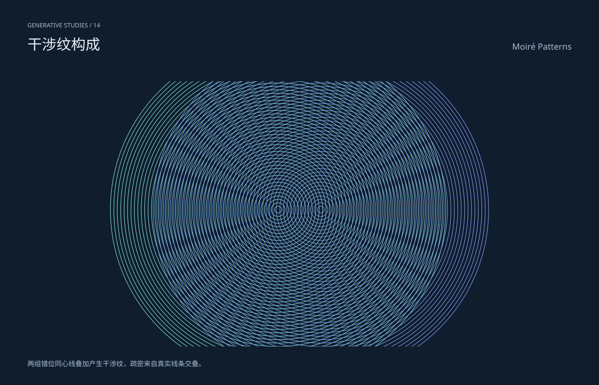

# 干涉纹构成 / Moiré Patterns

分类：[几何与生成艺术](../_about.md)



```
用 SVG 制作“干涉纹构成 / Moiré Patterns”。
- 1400×900画布，深色#101d2d，文字#e7effa、辅助#aabfd5，几何色板#75ddcf/#e7b875/#819af8/#d18eba/#4e8195；标题中英文，主体区域x64..1336、y190..810。
- 两组错位同心线叠加产生干涉纹，疏密来自真实线条交叠。
- 两组中心(650,490)/(750,490)，半径8..392步长8，各49环，线宽1.25；非光学波动模拟，缩略图与设备采样可能改变纹样。
- 公式与构造细节只写在提示词，不把主画面做成代码教学卡。仅为几何艺术，不是测量数据或物理仿真。
- 生成器 scripts/build-geometry.py 包含完整坐标构造；下列SVG是可复现的几何、色彩和参数参考。
<svg xmlns="http://www.w3.org/2000/svg" width="1400" height="900" viewBox="0 0 1400 900" role="img" aria-labelledby="title desc" font-family="PingFang SC, Microsoft YaHei, sans-serif"><title id="title">干涉纹构成 / Moiré Patterns</title><desc id="desc">两组错位同心线叠加产生干涉纹，疏密来自真实线条交叠。；两组中心(650,490)/(750,490)，半径8..392步长8，各49环，线宽1.25；非光学波动模拟，缩略图与设备采样可能改变纹样。</desc><rect x="0" y="0" width="1400" height="900" fill="#101d2d" /><text x="64" y="64" font-size="14" fill="#aabfd5" text-anchor="start">GENERATIVE STUDIES / 14</text><text x="64" y="116" font-size="34" fill="#e7effa" text-anchor="start">干涉纹构成</text><text x="1336" y="116" font-size="20" fill="#aabfd5" text-anchor="end">Moiré Patterns</text><defs><clipPath id="stage"><rect x="64" y="190" width="1272" height="620"/></clipPath><linearGradient id="ink" x1="0" y1="0" x2="1" y2="1"><stop stop-color="#75ddcf"/><stop offset="1" stop-color="#819af8"/></linearGradient></defs><g clip-path="url(#stage)"><circle cx="650.000" cy="490.000" r="8.000" fill="none" stroke="#75ddcf" stroke-width="1.25" /><circle cx="650.000" cy="490.000" r="16.000" fill="none" stroke="#75ddcf" stroke-width="1.25" /><circle cx="650.000" cy="490.000" r="24.000" fill="none" stroke="#75ddcf" stroke-width="1.25" /><circle cx="650.000" cy="490.000" r="32.000" fill="none" stroke="#75ddcf" stroke-width="1.25" /><circle cx="650.000" cy="490.000" r="40.000" fill="none" stroke="#75ddcf" stroke-width="1.25" /><circle cx="650.000" cy="490.000" r="48.000" fill="none" stroke="#75ddcf" stroke-width="1.25" /><circle cx="650.000" cy="490.000" r="56.000" fill="none" stroke="#75ddcf" stroke-width="1.25" /><circle cx="650.000" cy="490.000" r="64.000" fill="none" stroke="#75ddcf" stroke-width="1.25" /><circle cx="650.000" cy="490.000" r="72.000" fill="none" stroke="#75ddcf" stroke-width="1.25" /><circle cx="650.000" cy="490.000" r="80.000" fill="none" stroke="#75ddcf" stroke-width="1.25" /><circle cx="650.000" cy="490.000" r="88.000" fill="none" stroke="#75ddcf" stroke-width="1.25" /><circle cx="650.000" cy="490.000" r="96.000" fill="none" stroke="#75ddcf" stroke-width="1.25" /><circle cx="650.000" cy="490.000" r="104.000" fill="none" stroke="#75ddcf" stroke-width="1.25" /><circle cx="650.000" cy="490.000" r="112.000" fill="none" stroke="#75ddcf" stroke-width="1.25" /><circle cx="650.000" cy="490.000" r="120.000" fill="none" stroke="#75ddcf" stroke-width="1.25" /><circle cx="650.000" cy="490.000" r="128.000" fill="none" stroke="#75ddcf" stroke-width="1.25" /><circle cx="650.000" cy="490.000" r="136.000" fill="none" stroke="#75ddcf" stroke-width="1.25" /><circle cx="650.000" cy="490.000" r="144.000" fill="none" stroke="#75ddcf" stroke-width="1.25" /><circle cx="650.000" cy="490.000" r="152.000" fill="none" stroke="#75ddcf" stroke-width="1.25" /><circle cx="650.000" cy="490.000" r="160.000" fill="none" stroke="#75ddcf" stroke-width="1.25" /><circle cx="650.000" cy="490.000" r="168.000" fill="none" stroke="#75ddcf" stroke-width="1.25" /><circle cx="650.000" cy="490.000" r="176.000" fill="none" stroke="#75ddcf" stroke-width="1.25" /><circle cx="650.000" cy="490.000" r="184.000" fill="none" stroke="#75ddcf" stroke-width="1.25" /><circle cx="650.000" cy="490.000" r="192.000" fill="none" stroke="#75ddcf" stroke-width="1.25" /><circle cx="650.000" cy="490.000" r="200.000" fill="none" stroke="#75ddcf" stroke-width="1.25" /><circle cx="650.000" cy="490.000" r="208.000" fill="none" stroke="#75ddcf" stroke-width="1.25" /><circle cx="650.000" cy="490.000" r="216.000" fill="none" stroke="#75ddcf" stroke-width="1.25" /><circle cx="650.000" cy="490.000" r="224.000" fill="none" stroke="#75ddcf" stroke-width="1.25" /><circle cx="650.000" cy="490.000" r="232.000" fill="none" stroke="#75ddcf" stroke-width="1.25" /><circle cx="650.000" cy="490.000" r="240.000" fill="none" stroke="#75ddcf" stroke-width="1.25" /><circle cx="650.000" cy="490.000" r="248.000" fill="none" stroke="#75ddcf" stroke-width="1.25" /><circle cx="650.000" cy="490.000" r="256.000" fill="none" stroke="#75ddcf" stroke-width="1.25" /><circle cx="650.000" cy="490.000" r="264.000" fill="none" stroke="#75ddcf" stroke-width="1.25" /><circle cx="650.000" cy="490.000" r="272.000" fill="none" stroke="#75ddcf" stroke-width="1.25" /><circle cx="650.000" cy="490.000" r="280.000" fill="none" stroke="#75ddcf" stroke-width="1.25" /><circle cx="650.000" cy="490.000" r="288.000" fill="none" stroke="#75ddcf" stroke-width="1.25" /><circle cx="650.000" cy="490.000" r="296.000" fill="none" stroke="#75ddcf" stroke-width="1.25" /><circle cx="650.000" cy="490.000" r="304.000" fill="none" stroke="#75ddcf" stroke-width="1.25" /><circle cx="650.000" cy="490.000" r="312.000" fill="none" stroke="#75ddcf" stroke-width="1.25" /><circle cx="650.000" cy="490.000" r="320.000" fill="none" stroke="#75ddcf" stroke-width="1.25" /><circle cx="650.000" cy="490.000" r="328.000" fill="none" stroke="#75ddcf" stroke-width="1.25" /><circle cx="650.000" cy="490.000" r="336.000" fill="none" stroke="#75ddcf" stroke-width="1.25" /><circle cx="650.000" cy="490.000" r="344.000" fill="none" stroke="#75ddcf" stroke-width="1.25" /><circle cx="650.000" cy="490.000" r="352.000" fill="none" stroke="#75ddcf" stroke-width="1.25" /><circle cx="650.000" cy="490.000" r="360.000" fill="none" stroke="#75ddcf" stroke-width="1.25" /><circle cx="650.000" cy="490.000" r="368.000" fill="none" stroke="#75ddcf" stroke-width="1.25" /><circle cx="650.000" cy="490.000" r="376.000" fill="none" stroke="#75ddcf" stroke-width="1.25" /><circle cx="650.000" cy="490.000" r="384.000" fill="none" stroke="#75ddcf" stroke-width="1.25" /><circle cx="650.000" cy="490.000" r="392.000" fill="none" stroke="#75ddcf" stroke-width="1.25" /><circle cx="750.000" cy="490.000" r="8.000" fill="none" stroke="#819af8" stroke-width="1.25" /><circle cx="750.000" cy="490.000" r="16.000" fill="none" stroke="#819af8" stroke-width="1.25" /><circle cx="750.000" cy="490.000" r="24.000" fill="none" stroke="#819af8" stroke-width="1.25" /><circle cx="750.000" cy="490.000" r="32.000" fill="none" stroke="#819af8" stroke-width="1.25" /><circle cx="750.000" cy="490.000" r="40.000" fill="none" stroke="#819af8" stroke-width="1.25" /><circle cx="750.000" cy="490.000" r="48.000" fill="none" stroke="#819af8" stroke-width="1.25" /><circle cx="750.000" cy="490.000" r="56.000" fill="none" stroke="#819af8" stroke-width="1.25" /><circle cx="750.000" cy="490.000" r="64.000" fill="none" stroke="#819af8" stroke-width="1.25" /><circle cx="750.000" cy="490.000" r="72.000" fill="none" stroke="#819af8" stroke-width="1.25" /><circle cx="750.000" cy="490.000" r="80.000" fill="none" stroke="#819af8" stroke-width="1.25" /><circle cx="750.000" cy="490.000" r="88.000" fill="none" stroke="#819af8" stroke-width="1.25" /><circle cx="750.000" cy="490.000" r="96.000" fill="none" stroke="#819af8" stroke-width="1.25" /><circle cx="750.000" cy="490.000" r="104.000" fill="none" stroke="#819af8" stroke-width="1.25" /><circle cx="750.000" cy="490.000" r="112.000" fill="none" stroke="#819af8" stroke-width="1.25" /><circle cx="750.000" cy="490.000" r="120.000" fill="none" stroke="#819af8" stroke-width="1.25" /><circle cx="750.000" cy="490.000" r="128.000" fill="none" stroke="#819af8" stroke-width="1.25" /><circle cx="750.000" cy="490.000" r="136.000" fill="none" stroke="#819af8" stroke-width="1.25" /><circle cx="750.000" cy="490.000" r="144.000" fill="none" stroke="#819af8" stroke-width="1.25" /><circle cx="750.000" cy="490.000" r="152.000" fill="none" stroke="#819af8" stroke-width="1.25" /><circle cx="750.000" cy="490.000" r="160.000" fill="none" stroke="#819af8" stroke-width="1.25" /><circle cx="750.000" cy="490.000" r="168.000" fill="none" stroke="#819af8" stroke-width="1.25" /><circle cx="750.000" cy="490.000" r="176.000" fill="none" stroke="#819af8" stroke-width="1.25" /><circle cx="750.000" cy="490.000" r="184.000" fill="none" stroke="#819af8" stroke-width="1.25" /><circle cx="750.000" cy="490.000" r="192.000" fill="none" stroke="#819af8" stroke-width="1.25" /><circle cx="750.000" cy="490.000" r="200.000" fill="none" stroke="#819af8" stroke-width="1.25" /><circle cx="750.000" cy="490.000" r="208.000" fill="none" stroke="#819af8" stroke-width="1.25" /><circle cx="750.000" cy="490.000" r="216.000" fill="none" stroke="#819af8" stroke-width="1.25" /><circle cx="750.000" cy="490.000" r="224.000" fill="none" stroke="#819af8" stroke-width="1.25" /><circle cx="750.000" cy="490.000" r="232.000" fill="none" stroke="#819af8" stroke-width="1.25" /><circle cx="750.000" cy="490.000" r="240.000" fill="none" stroke="#819af8" stroke-width="1.25" /><circle cx="750.000" cy="490.000" r="248.000" fill="none" stroke="#819af8" stroke-width="1.25" /><circle cx="750.000" cy="490.000" r="256.000" fill="none" stroke="#819af8" stroke-width="1.25" /><circle cx="750.000" cy="490.000" r="264.000" fill="none" stroke="#819af8" stroke-width="1.25" /><circle cx="750.000" cy="490.000" r="272.000" fill="none" stroke="#819af8" stroke-width="1.25" /><circle cx="750.000" cy="490.000" r="280.000" fill="none" stroke="#819af8" stroke-width="1.25" /><circle cx="750.000" cy="490.000" r="288.000" fill="none" stroke="#819af8" stroke-width="1.25" /><circle cx="750.000" cy="490.000" r="296.000" fill="none" stroke="#819af8" stroke-width="1.25" /><circle cx="750.000" cy="490.000" r="304.000" fill="none" stroke="#819af8" stroke-width="1.25" /><circle cx="750.000" cy="490.000" r="312.000" fill="none" stroke="#819af8" stroke-width="1.25" /><circle cx="750.000" cy="490.000" r="320.000" fill="none" stroke="#819af8" stroke-width="1.25" /><circle cx="750.000" cy="490.000" r="328.000" fill="none" stroke="#819af8" stroke-width="1.25" /><circle cx="750.000" cy="490.000" r="336.000" fill="none" stroke="#819af8" stroke-width="1.25" /><circle cx="750.000" cy="490.000" r="344.000" fill="none" stroke="#819af8" stroke-width="1.25" /><circle cx="750.000" cy="490.000" r="352.000" fill="none" stroke="#819af8" stroke-width="1.25" /><circle cx="750.000" cy="490.000" r="360.000" fill="none" stroke="#819af8" stroke-width="1.25" /><circle cx="750.000" cy="490.000" r="368.000" fill="none" stroke="#819af8" stroke-width="1.25" /><circle cx="750.000" cy="490.000" r="376.000" fill="none" stroke="#819af8" stroke-width="1.25" /><circle cx="750.000" cy="490.000" r="384.000" fill="none" stroke="#819af8" stroke-width="1.25" /><circle cx="750.000" cy="490.000" r="392.000" fill="none" stroke="#819af8" stroke-width="1.25" /></g><text x="64" y="856" font-size="16" fill="#aabfd5" text-anchor="start">两组错位同心线叠加产生干涉纹，疏密来自真实线条交叠。</text><style>.snapshot{display:none}@media(prefers-reduced-motion:reduce){.motion{display:none}.snapshot{display:inline}.grow{animation:none;stroke-dashoffset:0}}@keyframes grow{from{stroke-dashoffset:1}to{stroke-dashoffset:0}}</style></svg>
```
