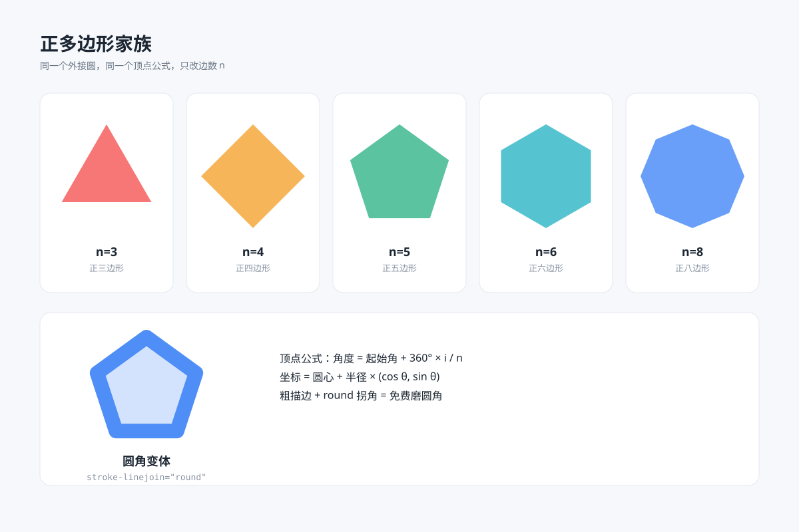

# 正多边形家族 `静态` `2D`

分类：[几何与生成艺术](../_about.md)



```
用 SVG 画一张"正多边形家族"教学图：
- 上排 5 张卡片：正三、四、五、六、八边形，全部相同外接圆半径、顶点朝上，标注边数 n=3 到 n=8，五张卡片依次用红 #f65e5e、橙 #f5a83c、绿 #3fb98f、青 #38b8c9、蓝 #4f8ef7
- 下方宽卡片：圆角变体——正五边形用 22px 粗描边 + stroke-linejoin="round" 磨圆角、内部叠 25% 淡蓝填充，右侧三行顶点公式说明
- 画布 1200×800，浅蓝灰背景 #f6f8fb，白色圆角卡片分格，五边形依次用红橙绿青蓝
```
