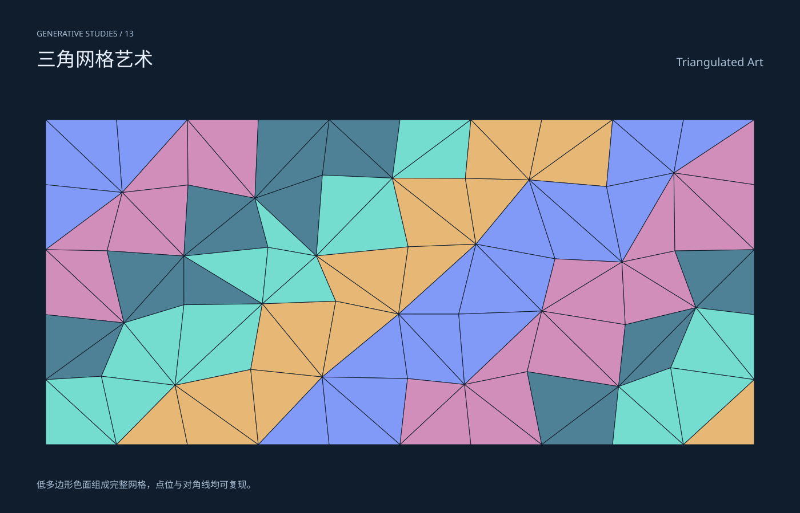

# 三角网格艺术 / Triangulated Art

分类：[几何与生成艺术](../_about.md)



```
用 SVG 制作“三角网格艺术 / Triangulated Art”。
- 1400×900画布，深色#101d2d，文字#e7effa、辅助#aabfd5，几何色板#75ddcf/#e7b875/#819af8/#d18eba/#4e8195；标题中英文，主体区域x64..1336、y190..810。
- 低多边形色面组成完整网格，点位与对角线均可复现。
- 11×6点格，x=80+124col、y=210+114row，内部Random(19)偏移x±28/y±24；50四边单元按行列奇偶交替对角线生成100三角面；不称Delaunay三角剖分。
- 公式与构造细节只写在提示词，不把主画面做成代码教学卡。仅为几何艺术，不是测量数据或物理仿真。
- 生成器 scripts/build-geometry.py 包含完整坐标构造；下列SVG是可复现的几何、色彩和参数参考。
<svg xmlns="http://www.w3.org/2000/svg" width="1400" height="900" viewBox="0 0 1400 900" role="img" aria-labelledby="title desc" font-family="PingFang SC, Microsoft YaHei, sans-serif"><title id="title">三角网格艺术 / Triangulated Art</title><desc id="desc">低多边形色面组成完整网格，点位与对角线均可复现。；11×6点格，x=80+124col、y=210+114row，内部Random(19)偏移x±28/y±24；50四边单元按行列奇偶交替对角线生成100三角面；不称Delaunay三角剖分。</desc><rect x="0" y="0" width="1400" height="900" fill="#101d2d" /><text x="64" y="64" font-size="14" fill="#aabfd5" text-anchor="start">GENERATIVE STUDIES / 13</text><text x="64" y="116" font-size="34" fill="#e7effa" text-anchor="start">三角网格艺术</text><text x="1336" y="116" font-size="20" fill="#aabfd5" text-anchor="end">Triangulated Art</text><defs><clipPath id="stage"><rect x="64" y="190" width="1272" height="620"/></clipPath><linearGradient id="ink" x1="0" y1="0" x2="1" y2="1"><stop stop-color="#75ddcf"/><stop offset="1" stop-color="#819af8"/></linearGradient></defs><g clip-path="url(#stage)"><path d="M80.000 210.000 L204.000 210.000 L213.919 337.676 Z" fill="#819af8" stroke="#101d2d" stroke-width="1" stroke-linecap="round" stroke-linejoin="round" /><path d="M80.000 210.000 L213.919 337.676 L80.000 324.000 Z" fill="#819af8" stroke="#101d2d" stroke-width="1" stroke-linecap="round" stroke-linejoin="round" /><path d="M204.000 210.000 L328.000 210.000 L213.919 337.676 Z" fill="#819af8" stroke="#101d2d" stroke-width="1" stroke-linecap="round" stroke-linejoin="round" /><path d="M328.000 210.000 L329.146 324.552 L213.919 337.676 Z" fill="#d18eba" stroke="#101d2d" stroke-width="1" stroke-linecap="round" stroke-linejoin="round" /><path d="M328.000 210.000 L452.000 210.000 L446.038 347.847 Z" fill="#d18eba" stroke="#101d2d" stroke-width="1" stroke-linecap="round" stroke-linejoin="round" /><path d="M328.000 210.000 L446.038 347.847 L329.146 324.552 Z" fill="#d18eba" stroke="#101d2d" stroke-width="1" stroke-linecap="round" stroke-linejoin="round" /><path d="M452.000 210.000 L576.000 210.000 L446.038 347.847 Z" fill="#4e8195" stroke="#101d2d" stroke-width="1" stroke-linecap="round" stroke-linejoin="round" /><path d="M576.000 210.000 L564.204 307.116 L446.038 347.847 Z" fill="#4e8195" stroke="#101d2d" stroke-width="1" stroke-linecap="round" stroke-linejoin="round" /><path d="M576.000 210.000 L700.000 210.000 L686.620 312.501 Z" fill="#4e8195" stroke="#101d2d" stroke-width="1" stroke-linecap="round" stroke-linejoin="round" /><path d="M576.000 210.000 L686.620 312.501 L564.204 307.116 Z" fill="#4e8195" stroke="#101d2d" stroke-width="1" stroke-linecap="round" stroke-linejoin="round" /><path d="M700.000 210.000 L824.000 210.000 L686.620 312.501 Z" fill="#75ddcf" stroke="#101d2d" stroke-width="1" stroke-linecap="round" stroke-linejoin="round" /><path d="M824.000 210.000 L814.333 312.860 L686.620 312.501 Z" fill="#75ddcf" stroke="#101d2d" stroke-width="1" stroke-linecap="round" stroke-linejoin="round" /><path d="M824.000 210.000 L948.000 210.000 L926.028 315.624 Z" fill="#e7b875" stroke="#101d2d" stroke-width="1" stroke-linecap="round" stroke-linejoin="round" /><path d="M824.000 210.000 L926.028 315.624 L814.333 312.860 Z" fill="#e7b875" stroke="#101d2d" stroke-width="1" stroke-linecap="round" stroke-linejoin="round" /><path d="M948.000 210.000 L1072.000 210.000 L926.028 315.624 Z" fill="#e7b875" stroke="#101d2d" stroke-width="1" stroke-linecap="round" stroke-linejoin="round" /><path d="M1072.000 210.000 L1061.420 327.324 L926.028 315.624 Z" fill="#e7b875" stroke="#101d2d" stroke-width="1" stroke-linecap="round" stroke-linejoin="round" /><path d="M1072.000 210.000 L1196.000 210.000 L1179.291 303.398 Z" fill="#819af8" stroke="#101d2d" stroke-width="1" stroke-linecap="round" stroke-linejoin="round" /><path d="M1072.000 210.000 L1179.291 303.398 L1061.420 327.324 Z" fill="#819af8" stroke="#101d2d" stroke-width="1" stroke-linecap="round" stroke-linejoin="round" /><path d="M1196.000 210.000 L1320.000 210.000 L1179.291 303.398 Z" fill="#819af8" stroke="#101d2d" stroke-width="1" stroke-linecap="round" stroke-linejoin="round" /><path d="M1320.000 210.000 L1320.000 324.000 L1179.291 303.398 Z" fill="#d18eba" stroke="#101d2d" stroke-width="1" stroke-linecap="round" stroke-linejoin="round" /><path d="M80.000 324.000 L213.919 337.676 L80.000 438.000 Z" fill="#819af8" stroke="#101d2d" stroke-width="1" stroke-linecap="round" stroke-linejoin="round" /><path d="M213.919 337.676 L187.343 440.037 L80.000 438.000 Z" fill="#d18eba" stroke="#101d2d" stroke-width="1" stroke-linecap="round" stroke-linejoin="round" /><path d="M213.919 337.676 L329.146 324.552 L321.759 449.207 Z" fill="#d18eba" stroke="#101d2d" stroke-width="1" stroke-linecap="round" stroke-linejoin="round" /><path d="M213.919 337.676 L321.759 449.207 L187.343 440.037 Z" fill="#d18eba" stroke="#101d2d" stroke-width="1" stroke-linecap="round" stroke-linejoin="round" /><path d="M329.146 324.552 L446.038 347.847 L321.759 449.207 Z" fill="#4e8195" stroke="#101d2d" stroke-width="1" stroke-linecap="round" stroke-linejoin="round" /><path d="M446.038 347.847 L468.971 433.893 L321.759 449.207 Z" fill="#4e8195" stroke="#101d2d" stroke-width="1" stroke-linecap="round" stroke-linejoin="round" /><path d="M446.038 347.847 L564.204 307.116 L553.564 448.944 Z" fill="#4e8195" stroke="#101d2d" stroke-width="1" stroke-linecap="round" stroke-linejoin="round" /><path d="M446.038 347.847 L553.564 448.944 L468.971 433.893 Z" fill="#75ddcf" stroke="#101d2d" stroke-width="1" stroke-linecap="round" stroke-linejoin="round" /><path d="M564.204 307.116 L686.620 312.501 L553.564 448.944 Z" fill="#75ddcf" stroke="#101d2d" stroke-width="1" stroke-linecap="round" stroke-linejoin="round" /><path d="M686.620 312.501 L714.317 433.011 L553.564 448.944 Z" fill="#75ddcf" stroke="#101d2d" stroke-width="1" stroke-linecap="round" stroke-linejoin="round" /><path d="M686.620 312.501 L814.333 312.860 L832.864 428.354 Z" fill="#e7b875" stroke="#101d2d" stroke-width="1" stroke-linecap="round" stroke-linejoin="round" /><path d="M686.620 312.501 L832.864 428.354 L714.317 433.011 Z" fill="#e7b875" stroke="#101d2d" stroke-width="1" stroke-linecap="round" stroke-linejoin="round" /><path d="M814.333 312.860 L926.028 315.624 L832.864 428.354 Z" fill="#e7b875" stroke="#101d2d" stroke-width="1" stroke-linecap="round" stroke-linejoin="round" /><path d="M926.028 315.624 L971.234 454.023 L832.864 428.354 Z" fill="#819af8" stroke="#101d2d" stroke-width="1" stroke-linecap="round" stroke-linejoin="round" /><path d="M926.028 315.624 L1061.420 327.324 L1088.350 459.788 Z" fill="#819af8" stroke="#101d2d" stroke-width="1" stroke-linecap="round" stroke-linejoin="round" /><path d="M926.028 315.624 L1088.350 459.788 L971.234 454.023 Z" fill="#819af8" stroke="#101d2d" stroke-width="1" stroke-linecap="round" stroke-linejoin="round" /><path d="M1061.420 327.324 L1179.291 303.398 L1088.350 459.788 Z" fill="#819af8" stroke="#101d2d" stroke-width="1" stroke-linecap="round" stroke-linejoin="round" /><path d="M1179.291 303.398 L1181.039 440.172 L1088.350 459.788 Z" fill="#d18eba" stroke="#101d2d" stroke-width="1" stroke-linecap="round" stroke-linejoin="round" /><path d="M1179.291 303.398 L1320.000 324.000 L1320.000 438.000 Z" fill="#d18eba" stroke="#101d2d" stroke-width="1" stroke-linecap="round" stroke-linejoin="round" /><path d="M1179.291 303.398 L1320.000 438.000 L1181.039 440.172 Z" fill="#d18eba" stroke="#101d2d" stroke-width="1" stroke-linecap="round" stroke-linejoin="round" /><path d="M80.000 438.000 L187.343 440.037 L216.957 566.471 Z" fill="#d18eba" stroke="#101d2d" stroke-width="1" stroke-linecap="round" stroke-linejoin="round" /><path d="M80.000 438.000 L216.957 566.471 L80.000 552.000 Z" fill="#d18eba" stroke="#101d2d" stroke-width="1" stroke-linecap="round" stroke-linejoin="round" /><path d="M187.343 440.037 L321.759 449.207 L216.957 566.471 Z" fill="#4e8195" stroke="#101d2d" stroke-width="1" stroke-linecap="round" stroke-linejoin="round" /><path d="M321.759 449.207 L321.856 534.650 L216.957 566.471 Z" fill="#4e8195" stroke="#101d2d" stroke-width="1" stroke-linecap="round" stroke-linejoin="round" /><path d="M321.759 449.207 L468.971 433.893 L459.074 533.023 Z" fill="#75ddcf" stroke="#101d2d" stroke-width="1" stroke-linecap="round" stroke-linejoin="round" /><path d="M321.759 449.207 L459.074 533.023 L321.856 534.650 Z" fill="#4e8195" stroke="#101d2d" stroke-width="1" stroke-linecap="round" stroke-linejoin="round" /><path d="M468.971 433.893 L553.564 448.944 L459.074 533.023 Z" fill="#75ddcf" stroke="#101d2d" stroke-width="1" stroke-linecap="round" stroke-linejoin="round" /><path d="M553.564 448.944 L587.500 528.334 L459.074 533.023 Z" fill="#75ddcf" stroke="#101d2d" stroke-width="1" stroke-linecap="round" stroke-linejoin="round" /><path d="M553.564 448.944 L714.317 433.011 L697.452 551.028 Z" fill="#e7b875" stroke="#101d2d" stroke-width="1" stroke-linecap="round" stroke-linejoin="round" /><path d="M553.564 448.944 L697.452 551.028 L587.500 528.334 Z" fill="#e7b875" stroke="#101d2d" stroke-width="1" stroke-linecap="round" stroke-linejoin="round" /><path d="M714.317 433.011 L832.864 428.354 L697.452 551.028 Z" fill="#e7b875" stroke="#101d2d" stroke-width="1" stroke-linecap="round" stroke-linejoin="round" /><path d="M832.864 428.354 L802.709 551.049 L697.452 551.028 Z" fill="#819af8" stroke="#101d2d" stroke-width="1" stroke-linecap="round" stroke-linejoin="round" /><path d="M832.864 428.354 L971.234 454.023 L948.004 545.715 Z" fill="#819af8" stroke="#101d2d" stroke-width="1" stroke-linecap="round" stroke-linejoin="round" /><path d="M832.864 428.354 L948.004 545.715 L802.709 551.049 Z" fill="#819af8" stroke="#101d2d" stroke-width="1" stroke-linecap="round" stroke-linejoin="round" /><path d="M971.234 454.023 L1088.350 459.788 L948.004 545.715 Z" fill="#d18eba" stroke="#101d2d" stroke-width="1" stroke-linecap="round" stroke-linejoin="round" /><path d="M1088.350 459.788 L1094.191 569.571 L948.004 545.715 Z" fill="#d18eba" stroke="#101d2d" stroke-width="1" stroke-linecap="round" stroke-linejoin="round" /><path d="M1088.350 459.788 L1181.039 440.172 L1217.870 539.754 Z" fill="#d18eba" stroke="#101d2d" stroke-width="1" stroke-linecap="round" stroke-linejoin="round" /><path d="M1088.350 459.788 L1217.870 539.754 L1094.191 569.571 Z" fill="#d18eba" stroke="#101d2d" stroke-width="1" stroke-linecap="round" stroke-linejoin="round" /><path d="M1181.039 440.172 L1320.000 438.000 L1217.870 539.754 Z" fill="#4e8195" stroke="#101d2d" stroke-width="1" stroke-linecap="round" stroke-linejoin="round" /><path d="M1320.000 438.000 L1320.000 552.000 L1217.870 539.754 Z" fill="#4e8195" stroke="#101d2d" stroke-width="1" stroke-linecap="round" stroke-linejoin="round" /><path d="M80.000 552.000 L216.957 566.471 L80.000 666.000 Z" fill="#4e8195" stroke="#101d2d" stroke-width="1" stroke-linecap="round" stroke-linejoin="round" /><path d="M216.957 566.471 L177.449 660.077 L80.000 666.000 Z" fill="#4e8195" stroke="#101d2d" stroke-width="1" stroke-linecap="round" stroke-linejoin="round" /><path d="M216.957 566.471 L321.856 534.650 L306.365 675.851 Z" fill="#75ddcf" stroke="#101d2d" stroke-width="1" stroke-linecap="round" stroke-linejoin="round" /><path d="M216.957 566.471 L306.365 675.851 L177.449 660.077 Z" fill="#75ddcf" stroke="#101d2d" stroke-width="1" stroke-linecap="round" stroke-linejoin="round" /><path d="M321.856 534.650 L459.074 533.023 L306.365 675.851 Z" fill="#75ddcf" stroke="#101d2d" stroke-width="1" stroke-linecap="round" stroke-linejoin="round" /><path d="M459.074 533.023 L438.725 648.162 L306.365 675.851 Z" fill="#75ddcf" stroke="#101d2d" stroke-width="1" stroke-linecap="round" stroke-linejoin="round" /><path d="M459.074 533.023 L587.500 528.334 L563.888 661.364 Z" fill="#e7b875" stroke="#101d2d" stroke-width="1" stroke-linecap="round" stroke-linejoin="round" /><path d="M459.074 533.023 L563.888 661.364 L438.725 648.162 Z" fill="#e7b875" stroke="#101d2d" stroke-width="1" stroke-linecap="round" stroke-linejoin="round" /><path d="M587.500 528.334 L697.452 551.028 L563.888 661.364 Z" fill="#e7b875" stroke="#101d2d" stroke-width="1" stroke-linecap="round" stroke-linejoin="round" /><path d="M697.452 551.028 L713.182 664.130 L563.888 661.364 Z" fill="#819af8" stroke="#101d2d" stroke-width="1" stroke-linecap="round" stroke-linejoin="round" /><path d="M697.452 551.028 L802.709 551.049 L812.866 674.514 Z" fill="#819af8" stroke="#101d2d" stroke-width="1" stroke-linecap="round" stroke-linejoin="round" /><path d="M697.452 551.028 L812.866 674.514 L713.182 664.130 Z" fill="#819af8" stroke="#101d2d" stroke-width="1" stroke-linecap="round" stroke-linejoin="round" /><path d="M802.709 551.049 L948.004 545.715 L812.866 674.514 Z" fill="#819af8" stroke="#101d2d" stroke-width="1" stroke-linecap="round" stroke-linejoin="round" /><path d="M948.004 545.715 L922.538 652.042 L812.866 674.514 Z" fill="#d18eba" stroke="#101d2d" stroke-width="1" stroke-linecap="round" stroke-linejoin="round" /><path d="M948.004 545.715 L1094.191 569.571 L1082.498 678.098 Z" fill="#d18eba" stroke="#101d2d" stroke-width="1" stroke-linecap="round" stroke-linejoin="round" /><path d="M948.004 545.715 L1082.498 678.098 L922.538 652.042 Z" fill="#d18eba" stroke="#101d2d" stroke-width="1" stroke-linecap="round" stroke-linejoin="round" /><path d="M1094.191 569.571 L1217.870 539.754 L1082.498 678.098 Z" fill="#4e8195" stroke="#101d2d" stroke-width="1" stroke-linecap="round" stroke-linejoin="round" /><path d="M1217.870 539.754 L1173.673 645.190 L1082.498 678.098 Z" fill="#4e8195" stroke="#101d2d" stroke-width="1" stroke-linecap="round" stroke-linejoin="round" /><path d="M1217.870 539.754 L1320.000 552.000 L1320.000 666.000 Z" fill="#75ddcf" stroke="#101d2d" stroke-width="1" stroke-linecap="round" stroke-linejoin="round" /><path d="M1217.870 539.754 L1320.000 666.000 L1173.673 645.190 Z" fill="#75ddcf" stroke="#101d2d" stroke-width="1" stroke-linecap="round" stroke-linejoin="round" /><path d="M80.000 666.000 L177.449 660.077 L204.000 780.000 Z" fill="#75ddcf" stroke="#101d2d" stroke-width="1" stroke-linecap="round" stroke-linejoin="round" /><path d="M80.000 666.000 L204.000 780.000 L80.000 780.000 Z" fill="#75ddcf" stroke="#101d2d" stroke-width="1" stroke-linecap="round" stroke-linejoin="round" /><path d="M177.449 660.077 L306.365 675.851 L204.000 780.000 Z" fill="#75ddcf" stroke="#101d2d" stroke-width="1" stroke-linecap="round" stroke-linejoin="round" /><path d="M306.365 675.851 L328.000 780.000 L204.000 780.000 Z" fill="#e7b875" stroke="#101d2d" stroke-width="1" stroke-linecap="round" stroke-linejoin="round" /><path d="M306.365 675.851 L438.725 648.162 L452.000 780.000 Z" fill="#e7b875" stroke="#101d2d" stroke-width="1" stroke-linecap="round" stroke-linejoin="round" /><path d="M306.365 675.851 L452.000 780.000 L328.000 780.000 Z" fill="#e7b875" stroke="#101d2d" stroke-width="1" stroke-linecap="round" stroke-linejoin="round" /><path d="M438.725 648.162 L563.888 661.364 L452.000 780.000 Z" fill="#e7b875" stroke="#101d2d" stroke-width="1" stroke-linecap="round" stroke-linejoin="round" /><path d="M563.888 661.364 L576.000 780.000 L452.000 780.000 Z" fill="#819af8" stroke="#101d2d" stroke-width="1" stroke-linecap="round" stroke-linejoin="round" /><path d="M563.888 661.364 L713.182 664.130 L700.000 780.000 Z" fill="#819af8" stroke="#101d2d" stroke-width="1" stroke-linecap="round" stroke-linejoin="round" /><path d="M563.888 661.364 L700.000 780.000 L576.000 780.000 Z" fill="#819af8" stroke="#101d2d" stroke-width="1" stroke-linecap="round" stroke-linejoin="round" /><path d="M713.182 664.130 L812.866 674.514 L700.000 780.000 Z" fill="#d18eba" stroke="#101d2d" stroke-width="1" stroke-linecap="round" stroke-linejoin="round" /><path d="M812.866 674.514 L824.000 780.000 L700.000 780.000 Z" fill="#d18eba" stroke="#101d2d" stroke-width="1" stroke-linecap="round" stroke-linejoin="round" /><path d="M812.866 674.514 L922.538 652.042 L948.000 780.000 Z" fill="#d18eba" stroke="#101d2d" stroke-width="1" stroke-linecap="round" stroke-linejoin="round" /><path d="M812.866 674.514 L948.000 780.000 L824.000 780.000 Z" fill="#d18eba" stroke="#101d2d" stroke-width="1" stroke-linecap="round" stroke-linejoin="round" /><path d="M922.538 652.042 L1082.498 678.098 L948.000 780.000 Z" fill="#4e8195" stroke="#101d2d" stroke-width="1" stroke-linecap="round" stroke-linejoin="round" /><path d="M1082.498 678.098 L1072.000 780.000 L948.000 780.000 Z" fill="#4e8195" stroke="#101d2d" stroke-width="1" stroke-linecap="round" stroke-linejoin="round" /><path d="M1082.498 678.098 L1173.673 645.190 L1196.000 780.000 Z" fill="#75ddcf" stroke="#101d2d" stroke-width="1" stroke-linecap="round" stroke-linejoin="round" /><path d="M1082.498 678.098 L1196.000 780.000 L1072.000 780.000 Z" fill="#75ddcf" stroke="#101d2d" stroke-width="1" stroke-linecap="round" stroke-linejoin="round" /><path d="M1173.673 645.190 L1320.000 666.000 L1196.000 780.000 Z" fill="#75ddcf" stroke="#101d2d" stroke-width="1" stroke-linecap="round" stroke-linejoin="round" /><path d="M1320.000 666.000 L1320.000 780.000 L1196.000 780.000 Z" fill="#e7b875" stroke="#101d2d" stroke-width="1" stroke-linecap="round" stroke-linejoin="round" /></g><text x="64" y="856" font-size="16" fill="#aabfd5" text-anchor="start">低多边形色面组成完整网格，点位与对角线均可复现。</text><style>.snapshot{display:none}@media(prefers-reduced-motion:reduce){.motion{display:none}.snapshot{display:inline}.grow{animation:none;stroke-dashoffset:0}}@keyframes grow{from{stroke-dashoffset:1}to{stroke-dashoffset:0}}</style></svg>
```
