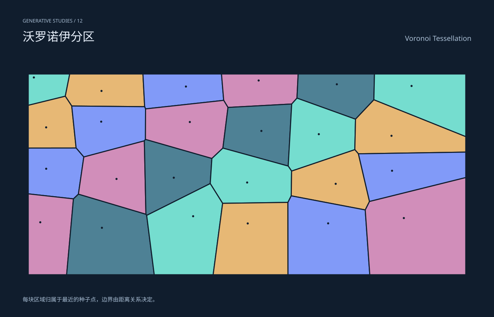

# 沃罗诺伊分区 / Voronoi Tessellation

分类：[几何与生成艺术](../_about.md)



```
用 SVG 制作“沃罗诺伊分区 / Voronoi Tessellation”。
- 1400×900画布，深色#101d2d，文字#e7effa、辅助#aabfd5，几何色板#75ddcf/#e7b875/#819af8/#d18eba/#4e8195；标题中英文，主体区域x64..1336、y190..810。
- 每块区域归属于最近的种子点，边界由距离关系决定。
- 24种子，Random(41)，6×4网格加固定随机偏移；每个单元与所有两点垂直平分线半平面相交，裁切边界80..1320/210..780，非随手画的多边形。
- 公式与构造细节只写在提示词，不把主画面做成代码教学卡。仅为几何艺术，不是测量数据或物理仿真。
- 生成器 scripts/build-geometry.py 包含完整坐标构造；下列SVG是可复现的几何、色彩和参数参考。
<svg xmlns="http://www.w3.org/2000/svg" width="1400" height="900" viewBox="0 0 1400 900" role="img" aria-labelledby="title desc" font-family="PingFang SC, Microsoft YaHei, sans-serif"><title id="title">沃罗诺伊分区 / Voronoi Tessellation</title><desc id="desc">每块区域归属于最近的种子点，边界由距离关系决定。；24种子，Random(41)，6×4网格加固定随机偏移；每个单元与所有两点垂直平分线半平面相交，裁切边界80..1320/210..780，非随手画的多边形。</desc><rect x="0" y="0" width="1400" height="900" fill="#101d2d" /><text x="64" y="64" font-size="14" fill="#aabfd5" text-anchor="start">GENERATIVE STUDIES / 12</text><text x="64" y="116" font-size="34" fill="#e7effa" text-anchor="start">沃罗诺伊分区</text><text x="1336" y="116" font-size="20" fill="#aabfd5" text-anchor="end">Voronoi Tessellation</text><defs><clipPath id="stage"><rect x="64" y="190" width="1272" height="620"/></clipPath><linearGradient id="ink" x1="0" y1="0" x2="1" y2="1"><stop stop-color="#75ddcf"/><stop offset="1" stop-color="#819af8"/></linearGradient></defs><g clip-path="url(#stage)"><path d="M80.000 210.000 L197.586 210.000 L184.979 273.161 L80.000 298.967 Z" fill="#75ddcf" stroke="#101d2d" stroke-width="3" stroke-linecap="round" stroke-linejoin="round" /><path d="M197.586 210.000 L405.077 210.000 L409.943 302.958 L203.326 300.980 L184.979 273.161 Z" fill="#e7b875" stroke="#101d2d" stroke-width="3" stroke-linecap="round" stroke-linejoin="round" /><path d="M405.077 210.000 L627.724 210.000 L633.962 284.890 L412.517 309.154 L409.943 302.958 Z" fill="#819af8" stroke="#101d2d" stroke-width="3" stroke-linecap="round" stroke-linejoin="round" /><path d="M627.724 210.000 L844.982 210.000 L841.639 278.572 L826.699 295.281 L646.124 305.012 L633.962 284.890 Z" fill="#d18eba" stroke="#101d2d" stroke-width="3" stroke-linecap="round" stroke-linejoin="round" /><path d="M844.982 210.000 L1061.201 210.000 L1059.550 283.295 L1007.522 338.396 L841.639 278.572 Z" fill="#4e8195" stroke="#101d2d" stroke-width="3" stroke-linecap="round" stroke-linejoin="round" /><path d="M1061.201 210.000 L1320.000 210.000 L1320.000 387.961 L1059.550 283.295 Z" fill="#75ddcf" stroke="#101d2d" stroke-width="3" stroke-linecap="round" stroke-linejoin="round" /><path d="M80.000 420.405 L80.000 298.967 L184.979 273.161 L203.326 300.980 L215.724 420.252 Z" fill="#e7b875" stroke="#101d2d" stroke-width="3" stroke-linecap="round" stroke-linejoin="round" /><path d="M215.724 420.252 L203.326 300.980 L409.943 302.958 L412.517 309.154 L412.176 395.823 L409.057 399.855 L237.509 445.648 Z" fill="#819af8" stroke="#101d2d" stroke-width="3" stroke-linecap="round" stroke-linejoin="round" /><path d="M412.176 395.823 L412.517 309.154 L633.962 284.890 L646.124 305.012 L631.675 420.446 L600.475 449.955 Z" fill="#d18eba" stroke="#101d2d" stroke-width="3" stroke-linecap="round" stroke-linejoin="round" /><path d="M631.675 420.446 L646.124 305.012 L826.699 295.281 L816.785 471.470 Z" fill="#4e8195" stroke="#101d2d" stroke-width="3" stroke-linecap="round" stroke-linejoin="round" /><path d="M816.785 471.470 L826.699 295.281 L841.639 278.572 L1007.522 338.396 L1005.580 424.885 L826.391 485.688 Z" fill="#75ddcf" stroke="#101d2d" stroke-width="3" stroke-linecap="round" stroke-linejoin="round" /><path d="M1320.000 387.961 L1320.000 431.876 L1015.728 436.657 L1005.580 424.885 L1007.522 338.396 L1059.550 283.295 Z" fill="#e7b875" stroke="#101d2d" stroke-width="3" stroke-linecap="round" stroke-linejoin="round" /><path d="M80.000 550.372 L80.000 420.405 L215.724 420.252 L237.509 445.648 L222.172 551.321 L208.137 564.543 Z" fill="#819af8" stroke="#101d2d" stroke-width="3" stroke-linecap="round" stroke-linejoin="round" /><path d="M222.172 551.321 L237.509 445.648 L409.057 399.855 L413.545 608.380 Z" fill="#d18eba" stroke="#101d2d" stroke-width="3" stroke-linecap="round" stroke-linejoin="round" /><path d="M415.694 611.458 L413.545 608.380 L409.057 399.855 L412.176 395.823 L600.475 449.955 L595.810 521.145 Z" fill="#4e8195" stroke="#101d2d" stroke-width="3" stroke-linecap="round" stroke-linejoin="round" /><path d="M630.922 577.283 L595.810 521.145 L600.475 449.955 L631.675 420.446 L816.785 471.470 L826.391 485.688 L825.343 556.028 L815.954 574.604 Z" fill="#75ddcf" stroke="#101d2d" stroke-width="3" stroke-linecap="round" stroke-linejoin="round" /><path d="M825.343 556.028 L826.391 485.688 L1005.580 424.885 L1015.728 436.657 L1047.156 572.014 L1035.072 596.017 Z" fill="#e7b875" stroke="#101d2d" stroke-width="3" stroke-linecap="round" stroke-linejoin="round" /><path d="M1320.000 431.876 L1320.000 504.125 L1047.156 572.014 L1015.728 436.657 Z" fill="#819af8" stroke="#101d2d" stroke-width="3" stroke-linecap="round" stroke-linejoin="round" /><path d="M188.831 780.000 L80.000 780.000 L80.000 550.372 L208.137 564.543 Z" fill="#d18eba" stroke="#101d2d" stroke-width="3" stroke-linecap="round" stroke-linejoin="round" /><path d="M437.104 780.000 L188.831 780.000 L208.137 564.543 L222.172 551.321 L413.545 608.380 L415.694 611.458 Z" fill="#4e8195" stroke="#101d2d" stroke-width="3" stroke-linecap="round" stroke-linejoin="round" /><path d="M604.055 780.000 L437.104 780.000 L415.694 611.458 L595.810 521.145 L630.922 577.283 Z" fill="#75ddcf" stroke="#101d2d" stroke-width="3" stroke-linecap="round" stroke-linejoin="round" /><path d="M816.172 780.000 L604.055 780.000 L630.922 577.283 L815.954 574.604 Z" fill="#e7b875" stroke="#101d2d" stroke-width="3" stroke-linecap="round" stroke-linejoin="round" /><path d="M1047.967 780.000 L816.172 780.000 L815.954 574.604 L825.343 556.028 L1035.072 596.017 Z" fill="#819af8" stroke="#101d2d" stroke-width="3" stroke-linecap="round" stroke-linejoin="round" /><path d="M1320.000 504.125 L1320.000 780.000 L1047.967 780.000 L1035.072 596.017 L1047.156 572.014 Z" fill="#d18eba" stroke="#101d2d" stroke-width="3" stroke-linecap="round" stroke-linejoin="round" /><circle cx="95.958" cy="219.920" r="3.000" fill="#101d2d" stroke="none" stroke-width="2" /><circle cx="287.619" cy="258.175" r="3.000" fill="#101d2d" stroke="none" stroke-width="2" /><circle cx="526.923" cy="245.647" r="3.000" fill="#101d2d" stroke="none" stroke-width="2" /><circle cx="733.033" cy="228.478" r="3.000" fill="#101d2d" stroke="none" stroke-width="2" /><circle cx="954.603" cy="239.280" r="3.000" fill="#101d2d" stroke="none" stroke-width="2" /><circle cx="1166.372" cy="244.049" r="3.000" fill="#101d2d" stroke="none" stroke-width="2" /><circle cx="130.787" cy="361.606" r="3.000" fill="#101d2d" stroke="none" stroke-width="2" /><circle cx="286.784" cy="345.391" r="3.000" fill="#101d2d" stroke="none" stroke-width="2" /><circle cx="537.961" cy="346.381" r="3.000" fill="#101d2d" stroke="none" stroke-width="2" /><circle cx="740.754" cy="371.763" r="3.000" fill="#101d2d" stroke="none" stroke-width="2" /><circle cx="903.522" cy="380.922" r="3.000" fill="#101d2d" stroke="none" stroke-width="2" /><circle cx="1109.508" cy="385.546" r="3.000" fill="#101d2d" stroke="none" stroke-width="2" /><circle cx="130.919" cy="479.089" r="3.000" fill="#101d2d" stroke="none" stroke-width="2" /><circle cx="330.194" cy="508.011" r="3.000" fill="#101d2d" stroke="none" stroke-width="2" /><circle cx="492.500" cy="504.517" r="3.000" fill="#101d2d" stroke="none" stroke-width="2" /><circle cx="700.406" cy="518.140" r="3.000" fill="#101d2d" stroke="none" stroke-width="2" /><circle cx="951.353" cy="521.880" r="3.000" fill="#101d2d" stroke="none" stroke-width="2" /><circle cx="1111.068" cy="484.797" r="3.000" fill="#101d2d" stroke="none" stroke-width="2" /><circle cx="114.112" cy="631.060" r="3.000" fill="#101d2d" stroke="none" stroke-width="2" /><circle cx="288.839" cy="646.716" r="3.000" fill="#101d2d" stroke="none" stroke-width="2" /><circle cx="547.336" cy="613.879" r="3.000" fill="#101d2d" stroke="none" stroke-width="2" /><circle cx="702.089" cy="634.389" r="3.000" fill="#101d2d" stroke="none" stroke-width="2" /><circle cx="929.947" cy="634.147" r="3.000" fill="#101d2d" stroke="none" stroke-width="2" /><circle cx="1144.488" cy="619.110" r="3.000" fill="#101d2d" stroke="none" stroke-width="2" /></g><text x="64" y="856" font-size="16" fill="#aabfd5" text-anchor="start">每块区域归属于最近的种子点，边界由距离关系决定。</text><style>.snapshot{display:none}@media(prefers-reduced-motion:reduce){.motion{display:none}.snapshot{display:inline}.grow{animation:none;stroke-dashoffset:0}}@keyframes grow{from{stroke-dashoffset:1}to{stroke-dashoffset:0}}</style></svg>
```
