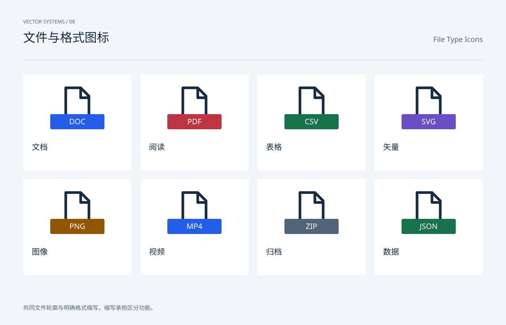

# 文件与格式图标 / File Type Icons

分类：[图标与符号](../_about.md)



```
用 SVG 制作“文件与格式图标 / File Type Icons”。
- 画布1400×900，背景#f2f5f9，正文#172b42，辅助文字#516478，强调色#245ee8；顶部中英文名称，主体y206..786，页脚y858。
- 图标使用24×24局部坐标，默认1.6单位描边、圆端点与圆拐角；symbol/use复用轮廓，颜色由currentColor继承。
- 共同文件轮廓与明确格式缩写，缩写承担区分功能。
- 八种格式DOC/PDF/CSV/SVG/PNG/MP4/ZIP/JSON；折角与文字牌共享位置，色彩只作辅助。
- 可见文字：["VECTOR SYSTEMS / 08", "文件与格式图标", "File Type Icons", "DOC", "文档", "PDF", "阅读", "CSV", "表格", "SVG", "矢量", "PNG", "图像", "MP4", "视频", "ZIP", "归档", "JSON", "数据", "共同文件轮廓与明确格式缩写，缩写承担区分功能。"]
逐一复现以下本页使用的符号路径（24×24 viewBox）：
- file: M5 2h9l5 5v15H5Z M14 2v6h5
```
