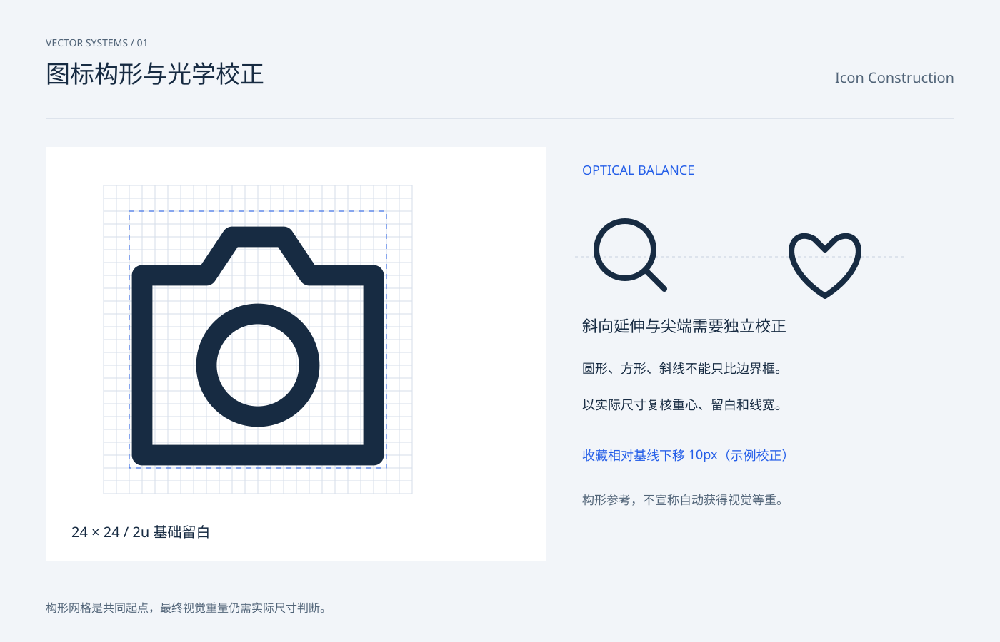

# 图标构形与光学校正 / Icon Construction

分类：[图标与符号](../_about.md)



```
用 SVG 制作“图标构形与光学校正 / Icon Construction”。
- 画布1400×900，背景#f2f5f9，正文#172b42，辅助文字#516478，强调色#245ee8；顶部中英文名称，主体y206..786，页脚y858。
- 图标使用24×24局部坐标，默认1.6单位描边、圆端点与圆拐角；symbol/use复用轮廓，颜色由currentColor继承。
- 构形网格是共同起点，最终视觉重量仍需实际尺寸判断。
- 左侧相机24单位网格放大18倍；2..22为基础安全区，底边可按轮廓校正。右侧搜索y300、收藏y310，120px显示尺寸，收藏相对几何位置下移10px；虚线y360为共同几何中线，示例校正仍需用户测试。
- 可见文字：["VECTOR SYSTEMS / 01", "图标构形与光学校正", "Icon Construction", "24 × 24 / 2u 基础留白", "OPTICAL BALANCE", "斜向延伸与尖端需要独立校正", "圆形、方形、斜线不能只比边界框。", "以实际尺寸复核重心、留白和线宽。", "收藏相对基线下移 10px（示例校正）", "构形参考，不宣称自动获得视觉等重。", "构形网格是共同起点，最终视觉重量仍需实际尺寸判断。"]
逐一复现以下本页使用的符号路径（24×24 viewBox）：
- search: M16 16l5 5 M18 10a8 8 0 1 1-16 0 8 8 0 0 1 16 0
- heart: M12 21C-2 12 2 1 9 5l3 3 3-3c7-4 11 7-3 16Z
- camera: M3 7h5l2-3h4l2 3h5v14H3Z M16 14a4 4 0 1 1-8 0 4 4 0 0 1 8 0
```
