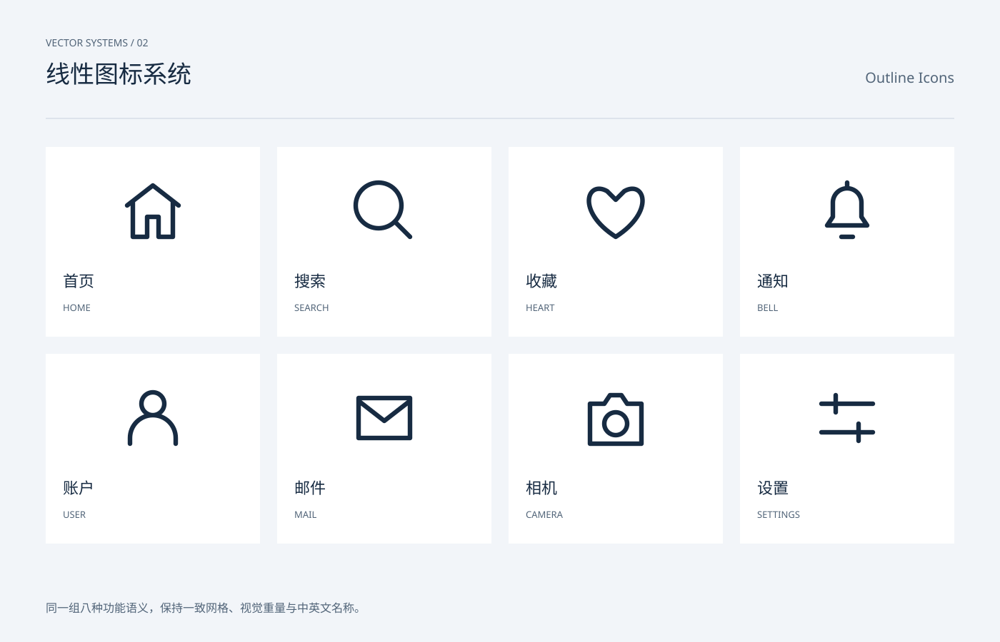

# 单色图标系统 `静态` `2D`

分类：[图标与符号](../_about.md)



```
用 SVG 画一张"线性图标系统"展示图：
- 8 个线性图标按 2 行 × 4 列排布：首页（房子）、搜索（放大镜）、收藏（心形）、通知（铃铛）、设置（滑杆：双横线+滑块圆点）、我的（人形）、邮件（信封+折线）、相机（机身+镜头圆）
- 全部笔画统一：2px 网格笔触放大 2 倍显示、圆头端点、圆角拐角，画在 24px 网格上
- 每个图标下标注英文名
- 底部一行说明：统一网格 / 圆头笔触 / currentColor 可换色
- 画布 1200×800 浅蓝灰背景，白色圆角卡片，线条色 #1c2733
```
