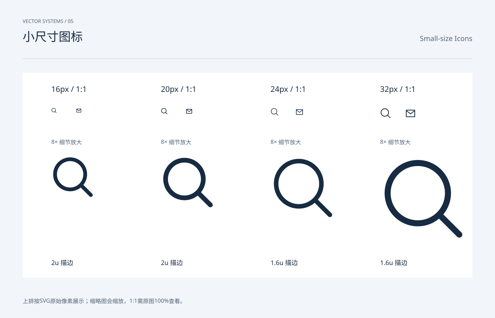

# 小尺寸图标 / Small-size Icons

分类：[图标与符号](../_about.md)



```
用 SVG 制作“小尺寸图标 / Small-size Icons”。
- 画布1400×900，背景#f2f5f9，正文#172b42，辅助文字#516478，强调色#245ee8；顶部中英文名称，主体y206..786，页脚y858。
- 图标使用24×24局部坐标，默认1.6单位描边、圆端点与圆拐角；symbol/use复用轮廓，颜色由currentColor继承。
- 上排按SVG原始像素展示；缩略图会缩放，1:1需原图100%查看。
- 16/20px使用2单位笔画；24/32px使用1.6单位；同一搜索与信封形状比较，底部8倍放大。
- 可见文字：["VECTOR SYSTEMS / 05", "小尺寸图标", "Small-size Icons", "16px / 1:1", "8× 细节放大", "2u 描边", "20px / 1:1", "8× 细节放大", "2u 描边", "24px / 1:1", "8× 细节放大", "1.6u 描边", "32px / 1:1", "8× 细节放大", "1.6u 描边", "上排按SVG原始像素展示；缩略图会缩放，1:1需原图100%查看。"]
逐一复现以下本页使用的符号路径（24×24 viewBox）：
- search: M16 16l5 5 M18 10a8 8 0 1 1-16 0 8 8 0 0 1 16 0
- mail: M3 5h18v14H3Z M3 6l9 7 9-7
```
