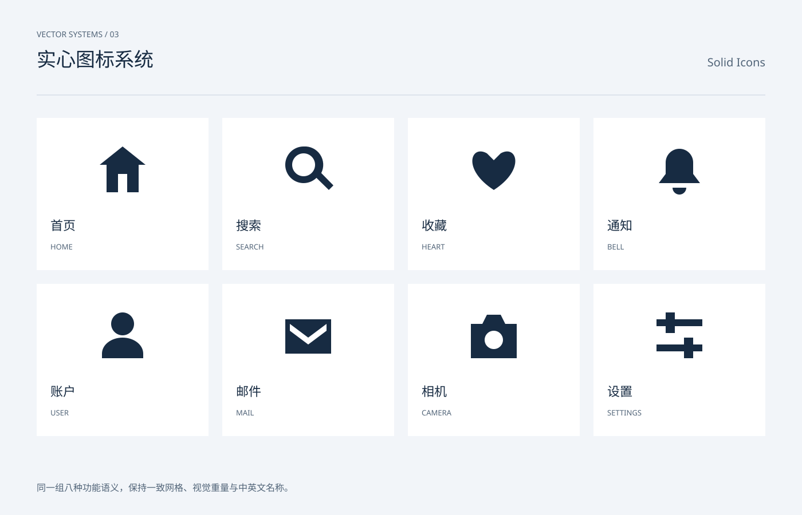

# 实心图标系统 / Solid Icons

分类：[图标与符号](../_about.md)



```
用 SVG 制作“实心图标系统 / Solid Icons”。
- 画布1400×900，背景#f2f5f9，正文#172b42，辅助文字#516478，强调色#245ee8；顶部中英文名称，主体y206..786，页脚y858。
- 图标使用24×24局部坐标，默认1.6单位描边、圆端点与圆拐角；symbol/use复用轮廓，颜色由currentColor继承。
- 同一组八种功能语义，保持一致网格、视觉重量与中英文名称。
- 线性版1.6单位描边；实心版使用独立闭合轮廓与evenodd内孔；双色版淡蓝底形加蓝色前景，不依赖颜色区分功能。
- 可见文字：["VECTOR SYSTEMS / 03", "实心图标系统", "Solid Icons", "首页", "HOME", "搜索", "SEARCH", "收藏", "HEART", "通知", "BELL", "账户", "USER", "邮件", "MAIL", "相机", "CAMERA", "设置", "SETTINGS", "同一组八种功能语义，保持一致网格、视觉重量与中英文名称。"]
逐一复现以下本页使用的符号路径（24×24 viewBox）：
- home: M3 10 12 3 21 10 M5 9v12h5v-7h4v7h5V9
- search: M16 16l5 5 M18 10a8 8 0 1 1-16 0 8 8 0 0 1 16 0
- heart: M12 21C-2 12 2 1 9 5l3 3 3-3c7-4 11 7-3 16Z
- bell: M5 17h14l-2-3V9a5 5 0 0 0-10 0v5Z M10 21h4 M12 2v2
- user: M16 7a4 4 0 1 1-8 0 4 4 0 0 1 8 0 M4 21v-2a8 8 0 0 1 16 0v2
- mail: M3 5h18v14H3Z M3 6l9 7 9-7
- camera: M3 7h5l2-3h4l2 3h5v14H3Z M16 14a4 4 0 1 1-8 0 4 4 0 0 1 8 0
- settings: M3 7h18 M3 17h18 M8 4v6 M16 14v6
- 实心home: M2 10 12 2 22 10h-3v12h-5v-8h-4v8H5V10Z（evenodd填充）
- 实心search: M10 2a8 8 0 1 0 5.6 13.7L21 21l2-2-5.3-5.4A8 8 0 0 0 10 2Z M10 5a5 5 0 1 1 0 10 5 5 0 0 1 0-10Z（evenodd填充）
- 实心heart: M12 21C-2 12 2 1 9 5l3 3 3-3c7-4 11 7-3 16Z（evenodd填充）
- 实心bell: M12 3a6 6 0 0 0-6 6v5l-3 4h18l-3-4V9a6 6 0 0 0-6-6Z M9 20a3 3 0 0 0 6 0Z（evenodd填充）
- 实心user: M12 2a5 5 0 1 0 0 10 5 5 0 0 0 0-10 M3 22v-2a9 7 0 0 1 18 0v2Z（evenodd填充）
- 实心mail: M2 5h20v15H2Z M4 7l8 6 8-6v3l-8 6-8-6Z（evenodd填充）
- 实心camera: M2 7h5l2-4h6l2 4h5v15H2Z M12 10a4 4 0 1 0 0 8 4 4 0 0 0 0-8Z（evenodd填充）
- 实心settings: M2 5H6V2h4v3h12v3H10v3H6V8H2Z M2 16h12v-3h4v3h4v3h-4v3h-4v-3H2Z（evenodd填充）
```
