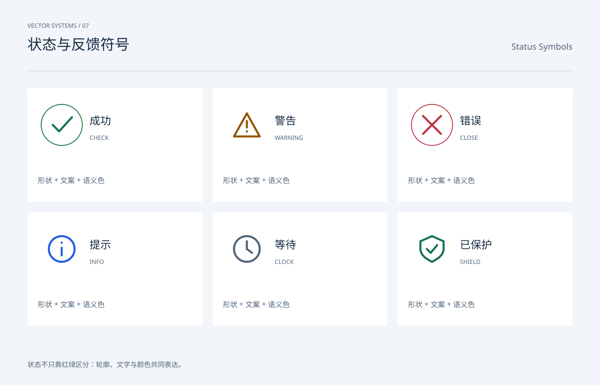

# 状态与反馈符号 / Status Symbols

分类：[图标与符号](../_about.md)



```
用 SVG 制作“状态与反馈符号 / Status Symbols”。
- 画布1400×900，背景#f2f5f9，正文#172b42，辅助文字#516478，强调色#245ee8；顶部中英文名称，主体y206..786，页脚y858。
- 图标使用24×24局部坐标，默认1.6单位描边、圆端点与圆拐角；symbol/use复用轮廓，颜色由currentColor继承。
- 状态不只靠红绿区分：轮廓、文字与颜色共同表达。
- 成功/错误圆形容器，警告三角、提示圆圈、等待钟表、防护盾牌；等待为静态符号，不假装实时进度。
- 可见文字：["VECTOR SYSTEMS / 07", "状态与反馈符号", "Status Symbols", "成功", "CHECK", "形状 + 文案 + 语义色", "警告", "WARNING", "形状 + 文案 + 语义色", "错误", "CLOSE", "形状 + 文案 + 语义色", "提示", "INFO", "形状 + 文案 + 语义色", "等待", "CLOCK", "形状 + 文案 + 语义色", "已保护", "SHIELD", "形状 + 文案 + 语义色", "状态不只靠红绿区分：轮廓、文字与颜色共同表达。"]
逐一复现以下本页使用的符号路径（24×24 viewBox）：
- check: M5 12l5 5L20 6
- close: M5 5l14 14 M19 5 5 19
- warning: M12 3 22 21H2Z M12 9v5 M12 17v.2
- info: M22 12a10 10 0 1 1-20 0 10 10 0 0 1 20 0 M12 11v6 M12 7v.2
- clock: M22 12a10 10 0 1 1-20 0 10 10 0 0 1 20 0 M12 6v6l4 3
- shield: M12 2 21 6v6c0 5-5 8-9 10-4-2-9-5-9-10V6Z M8 12l3 3 5-6
```
