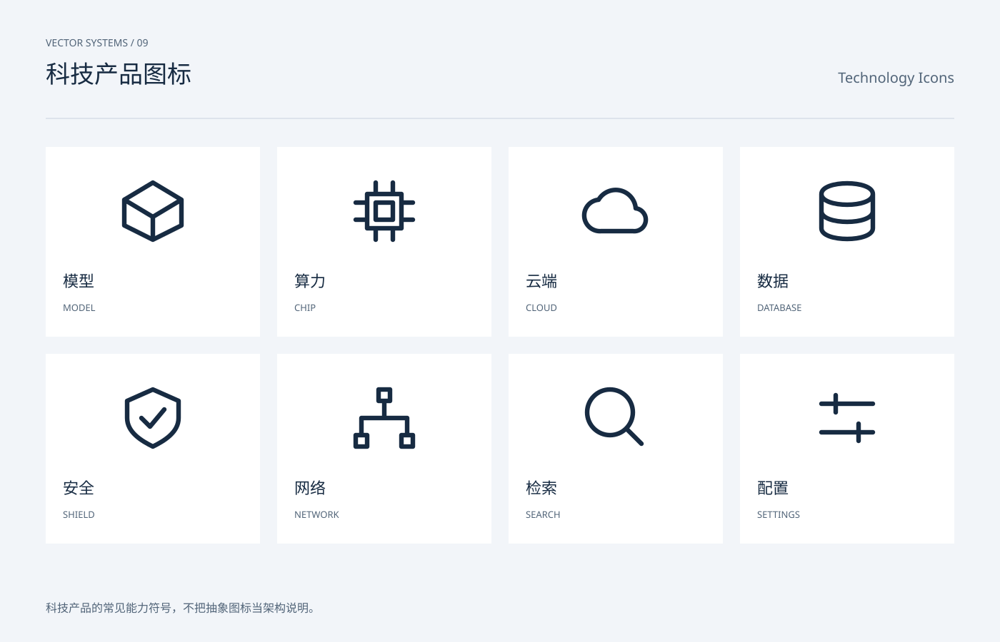

# 科技产品图标 / Technology Icons

分类：[图标与符号](../_about.md)



```
用 SVG 制作“科技产品图标 / Technology Icons”。
- 画布1400×900，背景#f2f5f9，正文#172b42，辅助文字#516478，强调色#245ee8；顶部中英文名称，主体y206..786，页脚y858。
- 图标使用24×24局部坐标，默认1.6单位描边、圆端点与圆拐角；symbol/use复用轮廓，颜色由currentColor继承。
- 科技产品的常见能力符号，不把抽象图标当架构说明。
- 立方体表示模型、芯片表示算力、圆柱表示数据；八项使用共同笔触与留白。
- 可见文字：["VECTOR SYSTEMS / 09", "科技产品图标", "Technology Icons", "模型", "MODEL", "算力", "CHIP", "云端", "CLOUD", "数据", "DATABASE", "安全", "SHIELD", "网络", "NETWORK", "检索", "SEARCH", "配置", "SETTINGS", "科技产品的常见能力符号，不把抽象图标当架构说明。"]
逐一复现以下本页使用的符号路径（24×24 viewBox）：
- search: M16 16l5 5 M18 10a8 8 0 1 1-16 0 8 8 0 0 1 16 0
- settings: M3 7h18 M3 17h18 M8 4v6 M16 14v6
- cloud: M7 19h11a4 4 0 0 0 1-8 7 7 0 0 0-13-3 5.5 5.5 0 0 0 1 11Z
- chip: M6 6h12v12H6Z M9 9h6v6H9Z M9 2v4 M15 2v4 M9 18v4 M15 18v4 M2 9h4 M2 15h4 M18 9h4 M18 15h4
- database: M3 6C3 1 21 1 21 6S3 11 3 6v12c0 5 18 5 18 0V6 M3 12c0 5 18 5 18 0
- shield: M12 2 21 6v6c0 5-5 8-9 10-4-2-9-5-9-10V6Z M8 12l3 3 5-6
- model: M12 2 22 8v9l-10 5-10-5V8Z M2 8l10 6 10-6 M12 14v8
- network: M10 2h4v4h-4Z M2 18h4v4H2Z M18 18h4v4h-4Z M12 6v6 M4 18v-6h16v6
```
