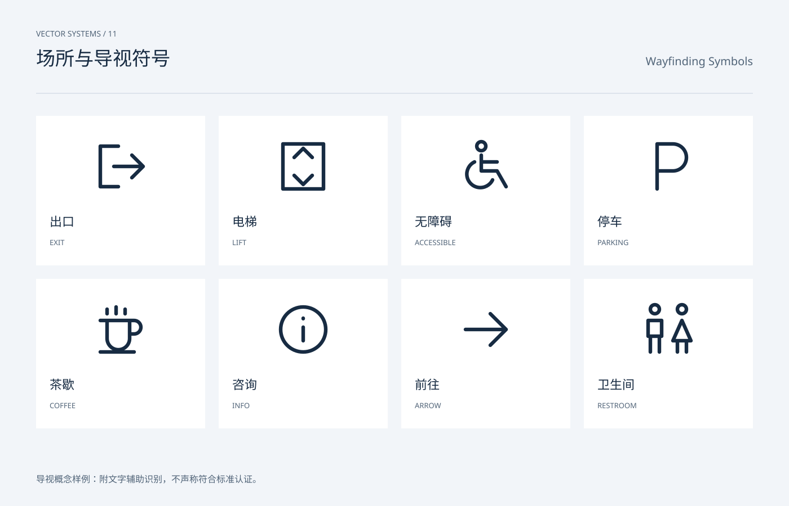

# 场所与导视符号 / Wayfinding Symbols

分类：[图标与符号](../_about.md)



```
用 SVG 制作“场所与导视符号 / Wayfinding Symbols”。
- 画布1400×900，背景#f2f5f9，正文#172b42，辅助文字#516478，强调色#245ee8；顶部中英文名称，主体y206..786，页脚y858。
- 图标使用24×24局部坐标，默认1.6单位描边、圆端点与圆拐角；symbol/use复用轮廓，颜色由currentColor继承。
- 导视概念样例：附文字辅助识别，不声称符合标准认证。
- 出口、电梯、无障碍、停车、茶歇、咨询、方向、卫生间，统一笔触；公共场所应用需另核验当地规范和可读距离。
- 可见文字：["VECTOR SYSTEMS / 11", "场所与导视符号", "Wayfinding Symbols", "出口", "EXIT", "电梯", "LIFT", "无障碍", "ACCESSIBLE", "停车", "PARKING", "茶歇", "COFFEE", "咨询", "INFO", "前往", "ARROW", "卫生间", "RESTROOM", "导视概念样例：附文字辅助识别，不声称符合标准认证。"]
逐一复现以下本页使用的符号路径（24×24 viewBox）：
- info: M22 12a10 10 0 1 1-20 0 10 10 0 0 1 20 0 M12 11v6 M12 7v.2
- arrow: M3 12h18 M14 5l7 7-7 7
- coffee: M3 8h13v8a5 5 0 0 1-10 0V8 M16 8h2a3 3 0 0 1 0 6h-2 M6 3v2 M10 2v3 M14 3v2 M3 22h15
- lift: M3 2h18v20H3Z M8 8l4-4 4 4 M8 16l4 4 4-4
- exit: M11 3H3v18h8 M9 12h13 M17 7l5 5-5 5
- accessible: M10 5a2 2 0 1 1 0-4 2 2 0 0 1 0 4 M10 7v7h7l4 7 M10 10h7 M7 10a6 6 0 1 0 8 8
- parking: M7 22V2h7a6 6 0 0 1 0 12H7
- restroom: M6 5a2 2 0 1 1 0-4 2 2 0 0 1 0 4 M3 8h6v7H3Z M4 15v7 M8 15v7 M18 5a2 2 0 1 1 0-4 2 2 0 0 1 0 4 M18 8l-4 9h8Z M16 17v5 M20 17v5
```
