# 云端计算 / Cloud Computing

分类：[插画与场景](../_about.md)



```
用SVG绘制“云端计算 / Cloud Computing”。
- 1400×900画布，背景#edf2f5，正文#19344c，强调色#245ee8；中英文标题，主体裁切在x64..1336、y190..810圆角区域。
- 云端资源与地面计算节点形成稳定的上下层次。
- 白色云体在上，三组机架在下，以竖直连接线组织构图；并非部署架构。
- 本作品为概念插画，不是科学仿真、地图或可操作界面。
- 动效只改变装饰层，不隐藏主体；CSS失效时静态画面完整；prefers-reduced-motion禁用动画。
- 以下为可复现的完整SVG几何与色彩参考，可直接保存查看，也可据此改写构图：
<svg xmlns="http://www.w3.org/2000/svg" width="1400" height="900" viewBox="0 0 1400 900" role="img" aria-labelledby="title desc" font-family="PingFang SC, Microsoft YaHei, sans-serif"><title id="title">云端计算 / Cloud Computing</title><desc id="desc">云端资源与地面计算节点形成稳定的上下层次。；白色云体在上，三组机架在下，以竖直连接线组织构图；并非部署架构。</desc><rect x="0" y="0" width="1400" height="900" rx="0" fill="#edf2f5" /><text x="64" y="65" fill="#19344c" font-size="14" text-anchor="start">VECTOR STORIES / 03</text><text x="64" y="117" fill="#19344c" font-size="34" text-anchor="start">云端计算</text><text x="1336" y="117" fill="#19344c" font-size="20" text-anchor="end">Cloud Computing</text><defs><radialGradient id="halo"><stop stop-color="#70dddf" stop-opacity=".45"/><stop offset="1" stop-color="#70dddf" stop-opacity="0"/></radialGradient><linearGradient id="sky" x2="0" y2="1"><stop stop-color="#b7d2eb"/><stop offset="1" stop-color="#f4d8b4"/></linearGradient><clipPath id="stage"><rect x="64" y="190" width="1272" height="620" rx="20"/></clipPath></defs><g clip-path="url(#stage)"><ellipse cx="700" cy="735" rx="390" ry="32" fill="#d3e0e9" /><path d="M470 440C350 440 340 300 460 295C485 175 690 180 710 290C830 205 985 295 945 385C1070 420 995 495 900 495H490Z" fill="#fff" stroke="#8da7c3" stroke-width="4" stroke-linecap="round" stroke-linejoin="round" /><rect x="400" y="570" width="190" height="135" rx="12" fill="#19344c" /><rect x="415" y="585" width="160" height="25" rx="4" fill="#41658a" /><circle cx="555" cy="598" r="4" fill="#70dddf" /><rect x="415" y="620" width="160" height="25" rx="4" fill="#41658a" /><circle cx="555" cy="633" r="4" fill="#70dddf" /><rect x="415" y="655" width="160" height="25" rx="4" fill="#41658a" /><circle cx="555" cy="668" r="4" fill="#70dddf" /><path d="M495 505L495 558" fill="none" stroke="#245ee8" stroke-width="3" stroke-linecap="round" stroke-linejoin="round" /><rect x="645" y="570" width="190" height="135" rx="12" fill="#19344c" /><rect x="660" y="585" width="160" height="25" rx="4" fill="#41658a" /><circle cx="800" cy="598" r="4" fill="#70dddf" /><rect x="660" y="620" width="160" height="25" rx="4" fill="#41658a" /><circle cx="800" cy="633" r="4" fill="#70dddf" /><rect x="660" y="655" width="160" height="25" rx="4" fill="#41658a" /><circle cx="800" cy="668" r="4" fill="#70dddf" /><path d="M740 505L740 558" fill="none" stroke="#245ee8" stroke-width="3" stroke-linecap="round" stroke-linejoin="round" /><rect x="890" y="570" width="190" height="135" rx="12" fill="#19344c" /><rect x="905" y="585" width="160" height="25" rx="4" fill="#41658a" /><circle cx="1045" cy="598" r="4" fill="#70dddf" /><rect x="905" y="620" width="160" height="25" rx="4" fill="#41658a" /><circle cx="1045" cy="633" r="4" fill="#70dddf" /><rect x="905" y="655" width="160" height="25" rx="4" fill="#41658a" /><circle cx="1045" cy="668" r="4" fill="#70dddf" /><path d="M985 505L985 558" fill="none" stroke="#245ee8" stroke-width="3" stroke-linecap="round" stroke-linejoin="round" /></g><text x="64" y="857" fill="#526778" font-size="16" text-anchor="start">云端资源与地面计算节点形成稳定的上下层次。</text><style>@keyframes breathe{50%{opacity:.6}}.pulse{animation:breathe 6s ease-in-out infinite}@keyframes drift{50%{transform:translateY(6px)}}.drift{animation:drift 8s ease-in-out infinite}@media(prefers-reduced-motion:reduce){.pulse,.drift{animation:none}}</style></svg>
```
