# 创意工作室 / Creative Workspace

分类：[插画与场景](../_about.md)



```
用SVG绘制“创意工作室 / Creative Workspace”。
- 1400×900画布，背景#edf2f5，正文#19344c，强调色#245ee8；中英文标题，主体裁切在x64..1336、y190..810圆角区域。
- 创意工作的桌面叙事：图形、色彩与资料共同参与创作。
- 墙上几何海报、中央设计屏、桌边书页和台灯；以大色块而非细碎界面吸引视线。
- 本作品为概念插画，不是科学仿真、地图或可操作界面。
- 动效只改变装饰层，不隐藏主体；CSS失效时静态画面完整；prefers-reduced-motion禁用动画。
- 以下为可复现的完整SVG几何与色彩参考，可直接保存查看，也可据此改写构图：
<svg xmlns="http://www.w3.org/2000/svg" width="1400" height="900" viewBox="0 0 1400 900" role="img" aria-labelledby="title desc" font-family="PingFang SC, Microsoft YaHei, sans-serif"><title id="title">创意工作室 / Creative Workspace</title><desc id="desc">创意工作的桌面叙事：图形、色彩与资料共同参与创作。；墙上几何海报、中央设计屏、桌边书页和台灯；以大色块而非细碎界面吸引视线。</desc><rect x="0" y="0" width="1400" height="900" rx="0" fill="#edf2f5" /><text x="64" y="65" fill="#19344c" font-size="14" text-anchor="start">VECTOR STORIES / 05</text><text x="64" y="117" fill="#19344c" font-size="34" text-anchor="start">创意工作室</text><text x="1336" y="117" fill="#19344c" font-size="20" text-anchor="end">Creative Workspace</text><defs><radialGradient id="halo"><stop stop-color="#70dddf" stop-opacity=".45"/><stop offset="1" stop-color="#70dddf" stop-opacity="0"/></radialGradient><linearGradient id="sky" x2="0" y2="1"><stop stop-color="#b7d2eb"/><stop offset="1" stop-color="#f4d8b4"/></linearGradient><clipPath id="stage"><rect x="64" y="190" width="1272" height="620" rx="20"/></clipPath></defs><g clip-path="url(#stage)"><rect x="185" y="240" width="1030" height="470" rx="20" fill="#e0e8ef" /><rect x="255" y="280" width="240" height="245" rx="8" fill="#fff" /><circle cx="330" cy="355" r="36" fill="#efa76e" /><path d="M270 500L372 387 464 500Z" fill="#3d8c79" stroke="none" stroke-width="2" stroke-linecap="round" stroke-linejoin="round" /><rect x="545" y="335" width="350" height="230" rx="16" fill="#19344c" /><rect x="557" y="347" width="326" height="200" rx="8" fill="#dce8fa" /><path d="M720.0 565L720.0 595" fill="none" stroke="#19344c" stroke-width="3" stroke-linecap="round" stroke-linejoin="round" /><path d="M650.0 595L790.0 595" fill="none" stroke="#19344c" stroke-width="3" stroke-linecap="round" stroke-linejoin="round" /><rect x="580" y="375" width="65" height="145" rx="8" fill="#245ee8" /><rect x="665" y="375" width="65" height="145" rx="8" fill="#70b5ae" /><rect x="750" y="375" width="65" height="145" rx="8" fill="#efa76e" /><rect x="210" y="620" width="995" height="24" rx="0" fill="#19344c" /><rect x="250" y="644" width="18" height="150" rx="0" fill="#8da7c3" /><rect x="1150" y="644" width="18" height="150" rx="0" fill="#8da7c3" /><path d="M465 590q48.75 -24 97.5 0q48.75 -24 97.5 0v100q-48.75 -24 -97.5 0q-48.75 -24 -97.5 0Z" fill="#fff" stroke="#19344c" stroke-width="3" stroke-linecap="round" stroke-linejoin="round" /><path d="M562.5 590L562.5 690" fill="none" stroke="#19344c" stroke-width="2" stroke-linecap="round" stroke-linejoin="round" /><rect x="1000" y="535" width="65" height="80" rx="8" fill="#fff" /><path d="M1070 350L1120 535" fill="none" stroke="#19344c" stroke-width="8" stroke-linecap="round" stroke-linejoin="round" /><path d="M1020 350h110l-30-65h-50Z" fill="#245ee8" stroke="none" stroke-width="2" stroke-linecap="round" stroke-linejoin="round" /></g><text x="64" y="857" fill="#526778" font-size="16" text-anchor="start">创意工作的桌面叙事：图形、色彩与资料共同参与创作。</text><style>@keyframes breathe{50%{opacity:.6}}.pulse{animation:breathe 6s ease-in-out infinite}@keyframes drift{50%{transform:translateY(6px)}}.drift{animation:drift 8s ease-in-out infinite}@media(prefers-reduced-motion:reduce){.pulse,.drift{animation:none}}</style></svg>
```
