# 数据安全 / Data Security

分类：[插画与场景](../_about.md)



```
用SVG绘制“数据安全 / Data Security”。
- 1400×900画布，背景#edf2f5，正文#19344c，强调色#245ee8；中英文标题，主体裁切在x64..1336、y190..810圆角区域。
- 盾牌、锁与资料块表达保护概念，不暗示具体安全认证。
- 中心蓝盾牌与白锁，外围三份文档，轮廓清晰且不用警报闪烁。
- 本作品为概念插画，不是科学仿真、地图或可操作界面。
- 动效只改变装饰层，不隐藏主体；CSS失效时静态画面完整；prefers-reduced-motion禁用动画。
- 以下为可复现的完整SVG几何与色彩参考，可直接保存查看，也可据此改写构图：
<svg xmlns="http://www.w3.org/2000/svg" width="1400" height="900" viewBox="0 0 1400 900" role="img" aria-labelledby="title desc" font-family="PingFang SC, Microsoft YaHei, sans-serif"><title id="title">数据安全 / Data Security</title><desc id="desc">盾牌、锁与资料块表达保护概念，不暗示具体安全认证。；中心蓝盾牌与白锁，外围三份文档，轮廓清晰且不用警报闪烁。</desc><rect x="0" y="0" width="1400" height="900" rx="0" fill="#edf2f5" /><text x="64" y="65" fill="#19344c" font-size="14" text-anchor="start">VECTOR STORIES / 04</text><text x="64" y="117" fill="#19344c" font-size="34" text-anchor="start">数据安全</text><text x="1336" y="117" fill="#19344c" font-size="20" text-anchor="end">Data Security</text><defs><radialGradient id="halo"><stop stop-color="#70dddf" stop-opacity=".45"/><stop offset="1" stop-color="#70dddf" stop-opacity="0"/></radialGradient><linearGradient id="sky" x2="0" y2="1"><stop stop-color="#b7d2eb"/><stop offset="1" stop-color="#f4d8b4"/></linearGradient><clipPath id="stage"><rect x="64" y="190" width="1272" height="620" rx="20"/></clipPath></defs><g clip-path="url(#stage)"><circle cx="700" cy="470" r="270" fill="#dce8fa" /><path d="M700 260L900 340V485Q900 650 700 740Q500 650 500 485V340Z" fill="#245ee8" stroke="none" stroke-width="2" stroke-linecap="round" stroke-linejoin="round" /><rect x="625" y="445" width="150" height="130" rx="14" fill="#fff" /><path d="M654 445V399a46 46 0 0 1 92 0v46" fill="none" stroke="#fff" stroke-width="17" stroke-linecap="round" stroke-linejoin="round" /><circle cx="700" cy="490" r="13" fill="#19344c" /><path d="M700 502L700 531" fill="none" stroke="#19344c" stroke-width="9" stroke-linecap="round" stroke-linejoin="round" /><rect x="330" y="370" width="95" height="115" rx="8" fill="#fff" /><path d="M348 403L406 403" fill="none" stroke="#8da7c3" stroke-width="4" stroke-linecap="round" stroke-linejoin="round" /><path d="M348 427L395 427" fill="none" stroke="#8da7c3" stroke-width="4" stroke-linecap="round" stroke-linejoin="round" /><rect x="1035" y="350" width="95" height="115" rx="8" fill="#fff" /><path d="M1053 383L1111 383" fill="none" stroke="#8da7c3" stroke-width="4" stroke-linecap="round" stroke-linejoin="round" /><path d="M1053 407L1100 407" fill="none" stroke="#8da7c3" stroke-width="4" stroke-linecap="round" stroke-linejoin="round" /><rect x="1010" y="650" width="95" height="115" rx="8" fill="#fff" /><path d="M1028 683L1086 683" fill="none" stroke="#8da7c3" stroke-width="4" stroke-linecap="round" stroke-linejoin="round" /><path d="M1028 707L1075 707" fill="none" stroke="#8da7c3" stroke-width="4" stroke-linecap="round" stroke-linejoin="round" /></g><text x="64" y="857" fill="#526778" font-size="16" text-anchor="start">盾牌、锁与资料块表达保护概念，不暗示具体安全认证。</text><style>@keyframes breathe{50%{opacity:.6}}.pulse{animation:breathe 6s ease-in-out infinite}@keyframes drift{50%{transform:translateY(6px)}}.drift{animation:drift 8s ease-in-out infinite}@media(prefers-reduced-motion:reduce){.pulse,.drift{animation:none}}</style></svg>
```
