# 人机协作 / Human–AI Collaboration

分类：[插画与场景](../_about.md)



```
用SVG绘制“人机协作 / Human–AI Collaboration”。
- 1400×900画布，背景#edf2f5，正文#19344c，强调色#245ee8；中英文标题，主体裁切在x64..1336、y190..810圆角区域。
- 人负责目标与判断，助手参与整理资料；桌面与共享文档成为画面中心。
- 左侧人物、右侧机器人、中央资料屏幕与开放书页；蓝色虚线是协作隐喻，不表示系统数据流。
- 本作品为概念插画，不是科学仿真、地图或可操作界面。
- 动效只改变装饰层，不隐藏主体；CSS失效时静态画面完整；prefers-reduced-motion禁用动画。
- 以下为可复现的完整SVG几何与色彩参考，可直接保存查看，也可据此改写构图：
<svg xmlns="http://www.w3.org/2000/svg" width="1400" height="900" viewBox="0 0 1400 900" role="img" aria-labelledby="title desc" font-family="PingFang SC, Microsoft YaHei, sans-serif"><title id="title">人机协作 / Human–AI Collaboration</title><desc id="desc">人负责目标与判断，助手参与整理资料；桌面与共享文档成为画面中心。；左侧人物、右侧机器人、中央资料屏幕与开放书页；蓝色虚线是协作隐喻，不表示系统数据流。</desc><rect x="0" y="0" width="1400" height="900" rx="0" fill="#edf2f5" /><text x="64" y="65" fill="#19344c" font-size="14" text-anchor="start">VECTOR STORIES / 01</text><text x="64" y="117" fill="#19344c" font-size="34" text-anchor="start">人机协作</text><text x="1336" y="117" fill="#19344c" font-size="20" text-anchor="end">Human–AI Collaboration</text><defs><radialGradient id="halo"><stop stop-color="#70dddf" stop-opacity=".45"/><stop offset="1" stop-color="#70dddf" stop-opacity="0"/></radialGradient><linearGradient id="sky" x2="0" y2="1"><stop stop-color="#b7d2eb"/><stop offset="1" stop-color="#f4d8b4"/></linearGradient><clipPath id="stage"><rect x="64" y="190" width="1272" height="620" rx="20"/></clipPath></defs><g clip-path="url(#stage)"><ellipse cx="700" cy="745" rx="430" ry="35" fill="#d3e0e9" /><circle cx="735" cy="415" r="240" fill="#dce8fa" /><rect x="530" y="355" width="280" height="190" rx="16" fill="#19344c" /><rect x="542" y="367" width="256" height="160" rx="8" fill="#dce8fa" /><path d="M670.0 545L670.0 575" fill="none" stroke="#19344c" stroke-width="3" stroke-linecap="round" stroke-linejoin="round" /><path d="M614.0 575L726.0 575" fill="none" stroke="#19344c" stroke-width="3" stroke-linecap="round" stroke-linejoin="round" /><path d="M570 375q30.0 -24 60.0 0q30.0 -24 60.0 0v100q-30.0 -24 -60.0 0q-30.0 -24 -60.0 0Z" fill="#fff" stroke="#19344c" stroke-width="3" stroke-linecap="round" stroke-linejoin="round" /><path d="M630.0 375L630.0 475" fill="none" stroke="#19344c" stroke-width="2" stroke-linecap="round" stroke-linejoin="round" /><rect x="430" y="600" width="540" height="20" rx="0" fill="#19344c" /><rect x="475" y="620" width="16" height="125" rx="0" fill="#8da7c3" /><rect x="911" y="620" width="16" height="125" rx="0" fill="#8da7c3" /><g transform="translate(375 430) scale(1.15)"><circle cx="0" cy="0" r="28" fill="#d4a47e" /><path d="M-27-6Q-32-42 8-33Q34-32 28-4L11-12-2-17Z" fill="#19344c" stroke="none" stroke-width="2" stroke-linecap="round" stroke-linejoin="round" /><path d="M-30 44Q0 25 30 44L44 146H-50Z" fill="#245ee8" stroke="none" stroke-width="2" stroke-linecap="round" stroke-linejoin="round" /><path d="M-31 60L-66 112 30 125" fill="none" stroke="#d4a47e" stroke-width="20" stroke-linecap="round" stroke-linejoin="round" /><path d="M-30 146L-44 230H-6L8 146M10 146L25 230H60L36 146" fill="#19344c" stroke="none" stroke-width="2" stroke-linecap="round" stroke-linejoin="round" /></g><g transform="translate(980 473) scale(1.15)"><path d="M0 -70L0 -43" fill="none" stroke="#245ee8" stroke-width="4" stroke-linecap="round" stroke-linejoin="round" /><circle cx="0" cy="-73" r="7" fill="#ef9e58" /><rect x="-58" y="-43" width="116" height="87" rx="24" fill="#c8d9ea" /><rect x="-43" y="-23" width="86" height="40" rx="15" fill="#19344c" /><circle cx="-20" cy="-3" r="6" fill="#70dddf" /><circle cx="20" cy="-3" r="6" fill="#70dddf" /><path d="M-22 27h44" fill="none" stroke="#19344c" stroke-width="3" stroke-linecap="round" stroke-linejoin="round" /><rect x="-45" y="55" width="90" height="100" rx="20" fill="#fff" /><circle cx="0" cy="99" r="18" fill="#245ee8" /><path d="M-45 80L-80 125M45 80L83 56" fill="none" stroke="#8caac4" stroke-width="17" stroke-linecap="round" stroke-linejoin="round" /><path d="M-24 155L-24 192" fill="none" stroke="#19344c" stroke-width="14" stroke-linecap="round" stroke-linejoin="round" /><path d="M24 155L24 192" fill="none" stroke="#19344c" stroke-width="14" stroke-linecap="round" stroke-linejoin="round" /></g><path d="M814 445Q930 340 996 414" fill="none" stroke="#245ee8" stroke-width="3" stroke-linecap="round" stroke-linejoin="round" stroke-dasharray="7 9"/></g><text x="64" y="857" fill="#526778" font-size="16" text-anchor="start">人负责目标与判断，助手参与整理资料；桌面与共享文档成为画面中心。</text><style>@keyframes breathe{50%{opacity:.6}}.pulse{animation:breathe 6s ease-in-out infinite}@keyframes drift{50%{transform:translateY(6px)}}.drift{animation:drift 8s ease-in-out infinite}@media(prefers-reduced-motion:reduce){.pulse,.drift{animation:none}}</style></svg>
```
