# 知识探索 / Knowledge Discovery

分类：[插画与场景](../_about.md)



```
用SVG绘制“知识探索 / Knowledge Discovery”。
- 1400×900画布，背景#edf2f5，正文#19344c，强调色#245ee8；中英文标题，主体裁切在x64..1336、y190..810圆角区域。
- 从分散资料到新的理解，用书页、资料卡与放大镜表达探索。
- 展开的书居下，三个不同色资料卡悬于上方，右前景放大镜；不绘制假装真实的研究数据。
- 本作品为概念插画，不是科学仿真、地图或可操作界面。
- 动效只改变装饰层，不隐藏主体；CSS失效时静态画面完整；prefers-reduced-motion禁用动画。
- 以下为可复现的完整SVG几何与色彩参考，可直接保存查看，也可据此改写构图：
<svg xmlns="http://www.w3.org/2000/svg" width="1400" height="900" viewBox="0 0 1400 900" role="img" aria-labelledby="title desc" font-family="PingFang SC, Microsoft YaHei, sans-serif"><title id="title">知识探索 / Knowledge Discovery</title><desc id="desc">从分散资料到新的理解，用书页、资料卡与放大镜表达探索。；展开的书居下，三个不同色资料卡悬于上方，右前景放大镜；不绘制假装真实的研究数据。</desc><rect x="0" y="0" width="1400" height="900" rx="0" fill="#edf2f5" /><text x="64" y="65" fill="#19344c" font-size="14" text-anchor="start">VECTOR STORIES / 02</text><text x="64" y="117" fill="#19344c" font-size="34" text-anchor="start">知识探索</text><text x="1336" y="117" fill="#19344c" font-size="20" text-anchor="end">Knowledge Discovery</text><defs><radialGradient id="halo"><stop stop-color="#70dddf" stop-opacity=".45"/><stop offset="1" stop-color="#70dddf" stop-opacity="0"/></radialGradient><linearGradient id="sky" x2="0" y2="1"><stop stop-color="#b7d2eb"/><stop offset="1" stop-color="#f4d8b4"/></linearGradient><clipPath id="stage"><rect x="64" y="190" width="1272" height="620" rx="20"/></clipPath></defs><g clip-path="url(#stage)"><circle cx="700" cy="486" r="270" fill="#dce8fa" /><path d="M400 540q135.0 -24 270.0 0q135.0 -24 270.0 0v100q-135.0 -24 -270.0 0q-135.0 -24 -270.0 0Z" fill="#fff" stroke="#19344c" stroke-width="3" stroke-linecap="round" stroke-linejoin="round" /><path d="M670.0 540L670.0 640" fill="none" stroke="#19344c" stroke-width="2" stroke-linecap="round" stroke-linejoin="round" /><rect x="445" y="340" width="125" height="155" rx="10" fill="#d6a16e" /><path d="M465 385L540 385" fill="none" stroke="#fff" stroke-width="3" stroke-linecap="round" stroke-linejoin="round" /><path d="M465 408L540 408" fill="none" stroke="#fff" stroke-width="3" stroke-linecap="round" stroke-linejoin="round" /><path d="M465 431L540 431" fill="none" stroke="#fff" stroke-width="3" stroke-linecap="round" stroke-linejoin="round" /><rect x="670" y="270" width="125" height="155" rx="10" fill="#245ee8" /><path d="M690 315L765 315" fill="none" stroke="#fff" stroke-width="3" stroke-linecap="round" stroke-linejoin="round" /><path d="M690 338L765 338" fill="none" stroke="#fff" stroke-width="3" stroke-linecap="round" stroke-linejoin="round" /><path d="M690 361L765 361" fill="none" stroke="#fff" stroke-width="3" stroke-linecap="round" stroke-linejoin="round" /><rect x="930" y="360" width="125" height="155" rx="10" fill="#3d8c79" /><path d="M950 405L1025 405" fill="none" stroke="#fff" stroke-width="3" stroke-linecap="round" stroke-linejoin="round" /><path d="M950 428L1025 428" fill="none" stroke="#fff" stroke-width="3" stroke-linecap="round" stroke-linejoin="round" /><path d="M950 451L1025 451" fill="none" stroke="#fff" stroke-width="3" stroke-linecap="round" stroke-linejoin="round" /><circle cx="900" cy="535" r="85" fill="#fff" stroke="#19344c" stroke-width="12"/><path d="M960 595L1025 660" fill="none" stroke="#19344c" stroke-width="22" stroke-linecap="round" stroke-linejoin="round" /></g><text x="64" y="857" fill="#526778" font-size="16" text-anchor="start">从分散资料到新的理解，用书页、资料卡与放大镜表达探索。</text><style>@keyframes breathe{50%{opacity:.6}}.pulse{animation:breathe 6s ease-in-out infinite}@keyframes drift{50%{transform:translateY(6px)}}.drift{animation:drift 8s ease-in-out infinite}@media(prefers-reduced-motion:reduce){.pulse,.drift{animation:none}}</style></svg>
```
