# 机器人助手 / Robot Assistant

分类：[插画与场景](../_about.md)



```
用SVG绘制“机器人助手 / Robot Assistant”。
- 1400×900画布，背景#edf2f5，正文#19344c，强调色#245ee8；中英文标题，主体裁切在x64..1336、y190..810圆角区域。
- 机器人助手以温和的姿态和完成反馈表达协助。
- 主角面部为深色屏和青色眼睛，抬手指向勾选气泡；静态完成画面无拟真能力宣称。
- 本作品为概念插画，不是科学仿真、地图或可操作界面。
- 动效只改变装饰层，不隐藏主体；CSS失效时静态画面完整；prefers-reduced-motion禁用动画。
- 以下为可复现的完整SVG几何与色彩参考，可直接保存查看，也可据此改写构图：
<svg xmlns="http://www.w3.org/2000/svg" width="1400" height="900" viewBox="0 0 1400 900" role="img" aria-labelledby="title desc" font-family="PingFang SC, Microsoft YaHei, sans-serif"><title id="title">机器人助手 / Robot Assistant</title><desc id="desc">机器人助手以温和的姿态和完成反馈表达协助。；主角面部为深色屏和青色眼睛，抬手指向勾选气泡；静态完成画面无拟真能力宣称。</desc><rect x="0" y="0" width="1400" height="900" rx="0" fill="#edf2f5" /><text x="64" y="65" fill="#19344c" font-size="14" text-anchor="start">VECTOR STORIES / 06</text><text x="64" y="117" fill="#19344c" font-size="34" text-anchor="start">机器人助手</text><text x="1336" y="117" fill="#19344c" font-size="20" text-anchor="end">Robot Assistant</text><defs><radialGradient id="halo"><stop stop-color="#70dddf" stop-opacity=".45"/><stop offset="1" stop-color="#70dddf" stop-opacity="0"/></radialGradient><linearGradient id="sky" x2="0" y2="1"><stop stop-color="#b7d2eb"/><stop offset="1" stop-color="#f4d8b4"/></linearGradient><clipPath id="stage"><rect x="64" y="190" width="1272" height="620" rx="20"/></clipPath></defs><g clip-path="url(#stage)"><circle cx="660" cy="468" r="270" fill="#dce8fa" /><ellipse cx="660" cy="745" rx="260" ry="32" fill="#d3e0e9" /><g transform="translate(660 435) scale(1.55)"><path d="M0 -70L0 -43" fill="none" stroke="#245ee8" stroke-width="4" stroke-linecap="round" stroke-linejoin="round" /><circle cx="0" cy="-73" r="7" fill="#ef9e58" /><rect x="-58" y="-43" width="116" height="87" rx="24" fill="#c8d9ea" /><rect x="-43" y="-23" width="86" height="40" rx="15" fill="#19344c" /><circle cx="-20" cy="-3" r="6" fill="#70dddf" /><circle cx="20" cy="-3" r="6" fill="#70dddf" /><path d="M-22 27h44" fill="none" stroke="#19344c" stroke-width="3" stroke-linecap="round" stroke-linejoin="round" /><rect x="-45" y="55" width="90" height="100" rx="20" fill="#fff" /><circle cx="0" cy="99" r="18" fill="#245ee8" /><path d="M-45 80L-80 125M45 80L83 56" fill="none" stroke="#8caac4" stroke-width="17" stroke-linecap="round" stroke-linejoin="round" /><path d="M-24 155L-24 192" fill="none" stroke="#19344c" stroke-width="14" stroke-linecap="round" stroke-linejoin="round" /><path d="M24 155L24 192" fill="none" stroke="#19344c" stroke-width="14" stroke-linecap="round" stroke-linejoin="round" /></g><rect x="930" y="320" width="215" height="150" rx="24" fill="#fff" /><path d="M945 470l-20 34 64-34" fill="#fff" stroke="none" stroke-width="2" stroke-linecap="round" stroke-linejoin="round" /><path d="M970 395l30 30 69-70" fill="none" stroke="#3d8c79" stroke-width="9" stroke-linecap="round" stroke-linejoin="round" /></g><text x="64" y="857" fill="#526778" font-size="16" text-anchor="start">机器人助手以温和的姿态和完成反馈表达协助。</text><style>@keyframes breathe{50%{opacity:.6}}.pulse{animation:breathe 6s ease-in-out infinite}@keyframes drift{50%{transform:translateY(6px)}}.drift{animation:drift 8s ease-in-out infinite}@media(prefers-reduced-motion:reduce){.pulse,.drift{animation:none}}</style></svg>
```
