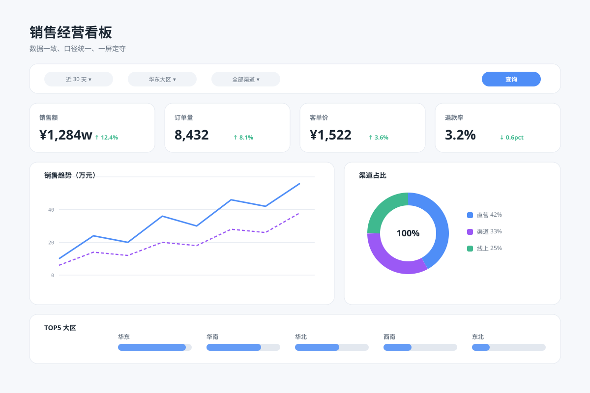

# 浅色 BI 经营盘 `静态` `2D`



```
用 SVG 画一张"浅色 BI 经营仪表盘"（SaaS 风）：
- 顶部标题"销售经营看板"+ 筛选栏（时间 / 大区 / 渠道三个下拉胶囊 + 查询按钮）
- KPI 行四张卡：销售额 ¥1,284w / 订单 8,432 / 客单价 ¥1,522 / 退款率 3.2%
- 主区左侧大面积折线图（销售趋势双序列），右侧环形图（渠道占比）
- 底部排行表：TOP5 大区横条
- 画布 1200×800 浅蓝灰背景，白色圆角卡片
```
