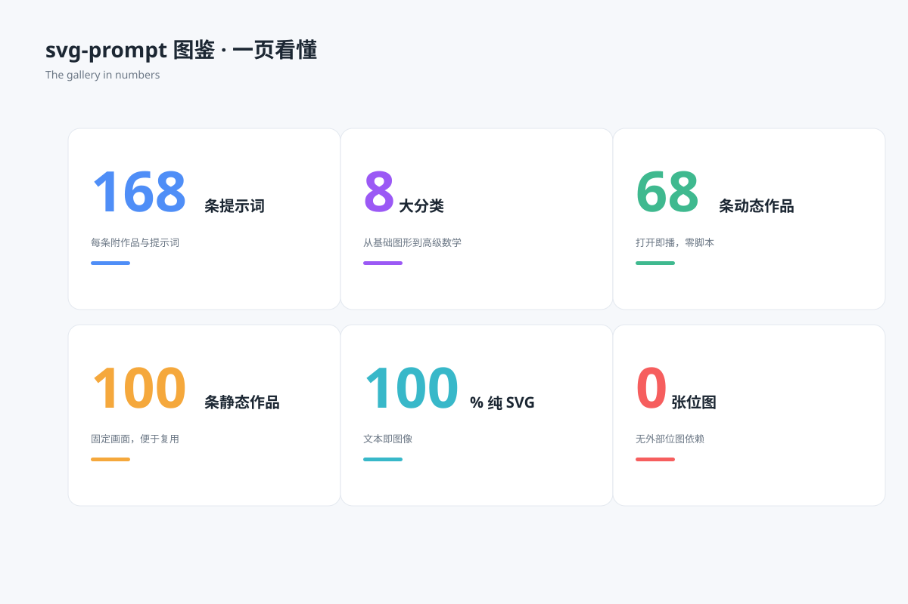

# 数字统计图 `静态` `2D`



```
用 SVG 画一张"数字统计信息图"（杂志式排版）：
- 2×3 六组统计：168 条提示词 / 8 大分类 / 68 条动态作品 / 100 条静态作品 / 100% 纯 SVG / 0 张位图
- 每组：超大数字 + 单位上标 + 指标名 + 一句说明，数字用品牌蓝紫交替
- 顶部大标题"svg-prompt 图鉴 · 一页看懂"
- 画布 1200×800 浅蓝灰背景，白色圆角卡片
```
