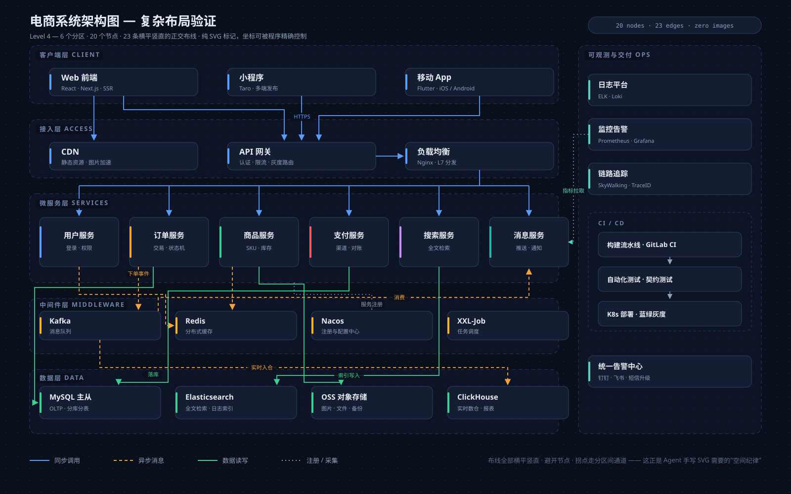

# 复杂系统架构图 `静态` `2D`



```
用 SVG 画一张六层系统架构图（约 20 个节点）：
- 分区自上而下：客户端层 / 接入层 / 微服务层 SERVICES / 中间件层 / 数据层 / 可观测与交付 OPS，每层一块浅色圆角底板 + 层名
- 每层 2–6 个节点（按层 160–330 × 56–100 圆角矩形，写服务名），同层水平等距
- 连线全部正交折线（只走水平/垂直段），marker 箭头指向目标；主要链路中点出入，允许总线扇出与水平侧接
- 画布 1600×1000，分区留白均匀
动笔前先输出完整的节点坐标清单，再按清单绘制。
```
