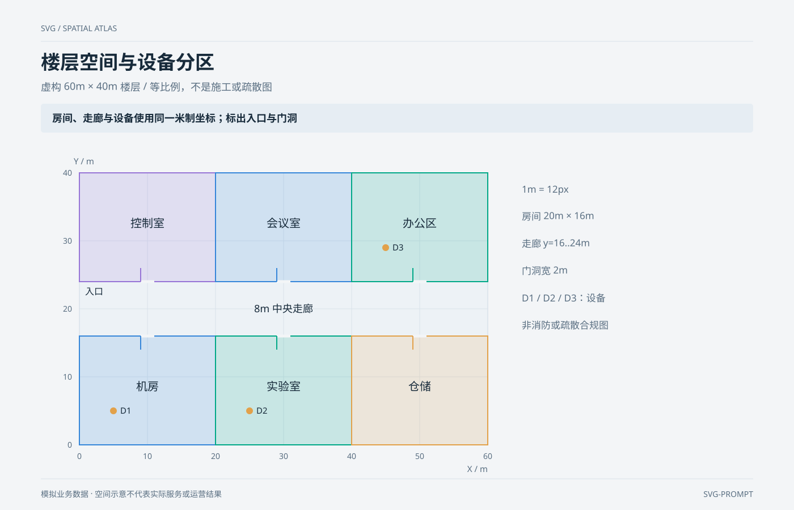

# 楼层空间与设备分区 `静态` `2D`

分类：[地图与空间](../_about.md)



```
用 SVG 制作“楼层空间与设备分区”：虚构 60m × 40m 楼层 / 等比例，不是施工或疏散图。
- 画布1400×900，背景#f3f5f7；标题34px、正文17–18px、刻度14–15px。重点结论：“房间、走廊与设备使用同一米制坐标；标出入口与门洞”。
- 虚构楼层X=0–60m、Y=0–40m，绘图区720×480px，X/Y同为12px/m；北向上；走廊y=16–24m贯穿。
- 六房间数据(ID,功能,x,y,w,h,color)：[["R1", "机房", 0, 0, 20, 16, "#3686d9"], ["R2", "实验室", 20, 0, 20, 16, "#00a887"], ["R3", "仓储", 40, 0, 20, 16, "#e2a14a"], ["R4", "控制室", 0, 24, 20, 16, "#9774d6"], ["R5", "会议室", 20, 24, 20, 16, "#3686d9"], ["R6", "办公区", 40, 24, 20, 16, "#00a887"]]；各房间门洞在走廊侧，宽2m；西侧走廊为入口。
- 设备D1(5,5)、D2(25,5)、D3(45,29)须在房间内部；平面仅为空间信息示意，不是测绘、施工或安全认证图。
- 页脚明确：“模拟业务数据 · 空间示意不代表实际服务或运营结果”。
```
