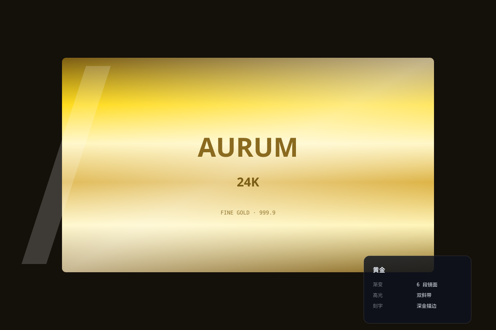

# 黄金质感 `静态` `2D`



```
用 SVG 画"黄金质感"满版材质：
- 底色深暖棕 #14100a 衬托
- 中央大块金板：多段垂直金色渐变（#7a5c14 → #ffd700 → #fff3b0 → #d4a017 → #8a6a1f，镜面感）
- 两条白色斜高光带（一宽一窄）
- "AURUM 24K" 刻字（深金描边 + 浅金填充，刻入感）
- 画布 1200×800 深底
```
