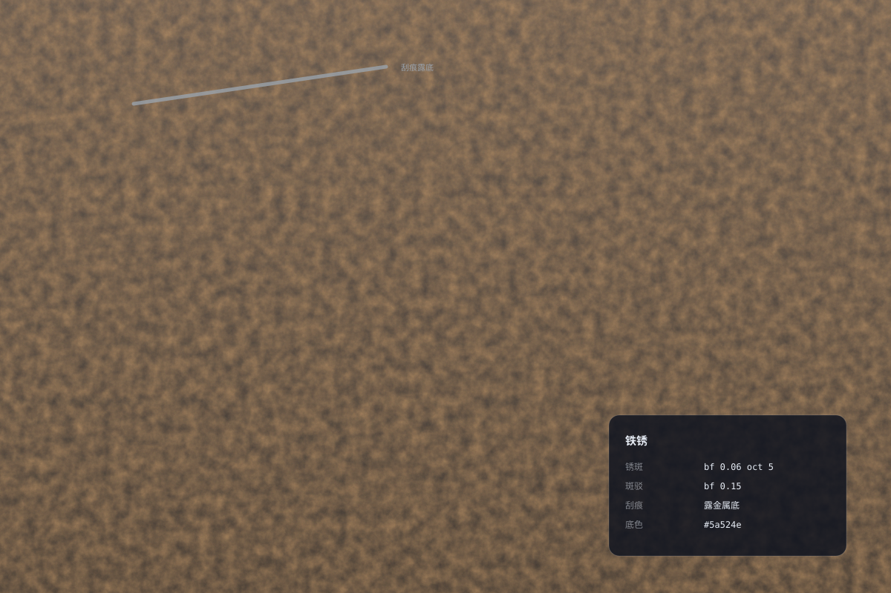

# 铁锈 `静态` `2D`



```
用 SVG 画"铁锈金属"满版材质：
- 底色深铁灰 #4a4240，叠三层：铁底渐变（暗→深）、橙棕锈斑（feTurbulence bf 0.06 octaves 5 映射橙棕 opacity 0.75）、暗斑驳（bf 0.15 opacity 0.3）
- 锈蚀边缘：四边橙棕不规则叠色
- 一道刮痕露出金属亮底（浅灰斜线）
- 右下参数卡：铁底 / 锈斑频率 / 斑驳 / 刮痕
- 画布 1200×800
```
