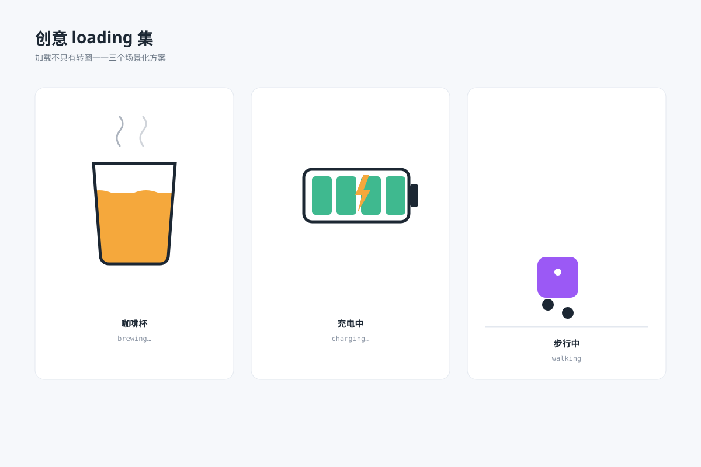

# 创意 loading 集 `SMIL 动效` `2D`



```
用 SVG 做"创意 loading 三连"：
- 咖啡杯：杯内液面循环升降晃动（wave path），杯口热气袅袅上升循环
- 电池：电量格逐格点亮到满格循环 + 闪电符号闪烁
- 步行方块：圆角方块左右两脚交替迈步走过画面（translate 循环 + 脚步点）
- 三卡并排，各标注场景名
- 画布 1200×800 浅蓝灰背景，白色圆角图表卡
```
